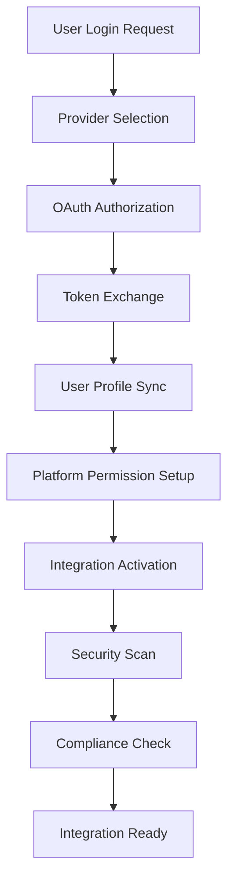

# 🔐 Authentication Module - Ainflue Integrations

**Expert Team: Lead Dev IA + Backend Senior + ML Engineer + DBA + Sécurité + Microservices + Audio + DevOps + IA Prompt Engineer**

## ⚠️ PROPRIÉTÉ INTELLECTUELLE - FAHED MLAIEL

> **🔒 AVERTISSEMENT FORT ET CLAIR**  
> Cette architecture est la propriété intellectuelle EXCLUSIVE de **Fahed Mlaiel** (mlaiel@live.de). Toute reproduction, modification, distribution ou vol d'idée/concept/code sans autorisation écrite PERSONNELLE est **STRICTEMENT INTERDITE** et sera poursuivie en justice. Vous êtes prévenus.

## 🎯 Module Purpose

The Authentication module provides enterprise-grade security and authentication management for the Ainflue platform. It delivers comprehensive OAuth 2.0/OIDC integration, multi-factor authentication, JWT token management, advanced security scanning, and compliance validation across 65+ integrated platforms.

### Core Components

- **Authentication Handler** - Central authentication orchestration and session management
- **OAuth Manager** - OAuth 2.0/OIDC provider integration for 65+ platforms  
- **Security Scanner Core** - Core security scanning infrastructure and vulnerability management
- **Vulnerability Scanner** - Advanced vulnerability detection and security testing
- **Compliance Checker** - GDPR, SOC2, PCI-DSS, OWASP compliance validation

## 🏗️ Architecture Intégrations

### Security-First Design Patterns

```yaml
Authentication Architecture:
  Core Layer:
    - Multi-provider OAuth orchestration
    - JWT token lifecycle management  
    - Session security and validation
    - Biometric authentication support
    
  Security Layer:
    - Real-time vulnerability scanning
    - SSL/TLS configuration testing
    - API endpoint security validation
    - Certificate monitoring and alerts
    
  Compliance Layer:
    - GDPR data protection validation
    - SOC2 security controls audit
    - PCI-DSS payment security compliance
    - OWASP Top 10 vulnerability assessment
```

### Platform Integration Matrix

```yaml
Supported Authentication Methods:
  OAuth 2.0/OIDC: 65+ platforms
  JWT/Bearer Token: Universal support
  API Key Management: Encrypted storage
  Multi-Factor Auth: SMS, TOTP, Push, Biometric
  Social Login: Facebook, Google, Twitter, LinkedIn, GitHub
  Enterprise SSO: SAML, OpenID Connect
```

## 🚀 Usage Production

### Basic Authentication Setup

```python
from integrations.authentication import AuthenticationHandler, OAuthManager

# Initialize authentication system
auth_handler = AuthenticationHandler(
    jwt_secret="your-jwt-secret",
    session_timeout=3600,
    mfa_required=True
)

# Configure OAuth providers
oauth_manager = OAuthManager()
await oauth_manager.register_provider('google', {
    'client_id': 'your-google-client-id',
    'client_secret': 'your-google-client-secret',
    'scopes': ['profile', 'email']
})

# Authenticate user
auth_result = await auth_handler.authenticate_user(
    provider='google',
    credentials={'access_token': 'user-access-token'}
)
```

### Security Scanning Configuration

```python
from integrations.authentication import security_scanner

# Initialize security scanner
await security_scanner.initialize()

# Perform comprehensive security scan
scan_result = await security_scanner.scan_integration(
    integration_name='spotify_api',
    base_url='https://api.spotify.com',
    api_key='your-api-key',
    additional_endpoints=['/v1/me', '/v1/playlists']
)

# Generate security dashboard
dashboard = await security_scanner.get_security_dashboard()
print(f"Total vulnerabilities: {dashboard['overview']['total_vulnerabilities']}")
```

### Compliance Validation

```python
from integrations.authentication import ComplianceChecker, SecurityStandard

# Initialize compliance checker
compliance_checker = ComplianceChecker(security_scanner)

# Validate GDPR compliance
gdpr_report = await compliance_checker.validate_compliance_framework(
    integration_name='instagram_api',
    framework=SecurityStandard.GDPR
)

# Generate comprehensive compliance report
compliance_report = await compliance_checker.generate_compliance_report(
    standards=[SecurityStandard.GDPR, SecurityStandard.SOC2]
)
```

## 📊 Monitoring & KPIs

### Security Metrics Dashboard

```yaml
Real-time Security KPIs:
  Vulnerability Detection:
    - Critical vulnerabilities: Real-time alerts
    - Security score: Per-integration scoring
    - Compliance status: Multi-framework validation
    - Certificate expiry: 30-day advance warnings
    
  Authentication Metrics:
    - Login success rate: >99.5% target
    - MFA adoption rate: >80% target  
    - Session security score: >95% target
    - OAuth token refresh rate: Automated monitoring
    
  Performance Indicators:
    - Authentication latency: <200ms average
    - Security scan completion: <30 seconds
    - Vulnerability detection time: <1 hour
    - Compliance validation: <5 minutes
```

### Alerting & Notifications

- **Critical Security Events** - Immediate Slack/email alerts
- **Vulnerability Discovery** - Automated ticketing and assignment
- **Compliance Violations** - Executive dashboard notifications
- **Certificate Expiry** - 30/7/1 day advance warnings
- **Authentication Failures** - Real-time monitoring and blocking

## 🔐 Security & API Management

### Enterprise Security Features

```yaml
Authentication Security:
  Multi-Factor Authentication:
    - TOTP (Google Authenticator, Authy)
    - SMS verification with rate limiting
    - Push notifications via mobile apps
    - Hardware token support (YubiKey)
    - Biometric authentication (Face ID, Touch ID)
    
  Token Management:
    - JWT with RS256 signing
    - Automatic token rotation
    - Refresh token security
    - Token blacklisting capability
    - Short-lived access tokens (15 min)
    
  Session Security:
    - Secure session storage
    - Session hijacking protection
    - Concurrent session limits
    - Geographic anomaly detection
    - Device fingerprinting
```

### API Security Controls

```yaml
Rate Limiting & Protection:
  Authentication Endpoints:
    - Login attempts: 5/minute per IP
    - Password reset: 3/hour per email
    - MFA verification: 10/minute per user
    - OAuth callbacks: 20/minute per client
    
  Security Scanning:
    - Vulnerability scans: 1/hour per integration
    - Certificate checks: 4/day per domain
    - Compliance audits: 1/day per framework
    - Health checks: 1/minute system-wide
    
  Circuit Breakers:
    - Authentication service: 95% success rate
    - OAuth providers: 90% success rate
    - Security scanners: 85% success rate
    - Database connections: 99% availability
```

## 🌍 65+ Platforms Support

### OAuth Provider Integration

```yaml
Social Media Platforms (29):
  Primary: Facebook, Google, Twitter, LinkedIn, GitHub
  Creator: Instagram, TikTok, YouTube, Snapchat, Pinterest
  Professional: Microsoft, Slack, Discord, Zoom
  Emerging: Threads, BeReal, Mastodon, BlueSky
  
Music & Audio Platforms (20):
  Streaming: Spotify, Apple Music, YouTube Music, Deezer
  Distribution: DistroKid, CD Baby, TuneCore, LANDR
  Podcasting: Anchor, Apple Podcasts, Google Podcasts
  
Creator Economy Platforms (16):
  Monetization: Patreon, Ko-fi, Buy Me a Coffee
  Marketplace: Etsy, Gumroad, OpenSea, Foundation
  Content: OnlyFans, Substack, Medium
```

### Integration Workflow



## 🛡️ Advanced Features

### Threat Detection & Response

- **Anomaly Detection** - ML-powered login pattern analysis
- **Geo-fencing** - Location-based access controls
- **Device Intelligence** - Unknown device detection
- **Behavioral Analysis** - User behavior profiling
- **Threat Intelligence** - Real-time security feed integration

### Compliance Automation

- **GDPR Compliance** - Automated data protection validation
- **SOC2 Controls** - Continuous security monitoring
- **PCI-DSS** - Payment data protection auditing
- **HIPAA** - Healthcare data security (if applicable)
- **ISO 27001** - Information security management

---

**Technical Owner:** Fahed Mlaiel (mlaiel@live.de)  
**Enterprise Contact:** Technical Architecture Team  
**Security Contact:** Security Operations Center  
**Support:** 24/7 Enterprise Support Available