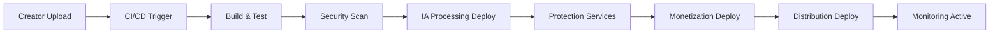

# ⚙️ DevOps Automation - Checklist Enterprise Complète

**Expert Team: Lead Dev IA + Backend Senior + ML Engineer + DBA + Sécurité + Microservices + Audio + DevOps + IA Prompt Engineer**

## ⚠️ PROPRIÉTÉ INTELLECTUELLE - FAHED MLAIEL

> **🔒 AVERTISSEMENT FORT ET CLAIR**  
> Cette architecture DevOps est la propriété intellectuelle EXCLUSIVE de **Fahed Mlaiel** (mlaiel@live.de). Toute reproduction, modification, distribution ou vol d'idée/concept/code sans autorisation écrite PERSONNELLE est **STRICTEMENT INTERDITE** et sera poursuivie en justice.

---

## 📊 ÉTAT ACTUEL - Analyse Structure Existante

### ✅ Fichiers Implémentés (2/18)
- `__init__.py` (50 lignes) - Configuration module avec exports DevOps automation
- `enterprise_devops_automation.py` (1356 lignes) - Core DevOps automation multi-expert

### 📈 Couverture Fonctionnelle Actuelle: 11.1%
- ✅ **Core Classes**: EnterpriseDevOpsAutomation, PipelineConfiguration, DeploymentJob, InfrastructureResource, MonitoringAlert
- ✅ **Deployment Strategies**: Blue/Green, Canary, A/B Testing, Rolling deployments
- ✅ **Infrastructure Providers**: AWS, Azure, GCP, Kubernetes, Docker, Terraform, Ansible
- ✅ **CI/CD Stages**: Build, Test, Security Scan, Staging, Production, Monitoring
- ✅ **Monitoring & Alerting**: Distributed monitoring, intelligent alerting, cost optimization
- ✅ **DevSecOps**: Security scanning, vulnerability detection, compliance automation
- ✅ **MLOps Integration**: Model deployment, A/B testing, data drift detection

---

## 🏗️ ARCHITECTURE COMPLÈTE - 16 Fichiers Manquants

### Phase 1: Infrastructure as Code (5 fichiers)
#### `infrastructure_orchestrator.py`
```python
# 🏗️ Backend Senior: Infrastructure orchestration enterprise
class InfrastructureOrchestrator:
    """Orchestration infrastructure multi-cloud avec Terraform/Ansible"""
    - terraform_deployment_engine()
    - ansible_configuration_management()
    - cloud_resource_provisioning()
    - infrastructure_state_management()
    - disaster_recovery_automation()
```

#### `terraform_automation.py`
```python
# ⚙️ DevOps Senior: Terraform automation enterprise
class TerraformAutomation:
    """Automation Terraform avec state management et multi-environment"""
    - terraform_plan_generation()
    - infrastructure_diff_analysis()
    - state_file_management()
    - workspace_orchestration()
    - terraform_module_registry()
```

#### `kubernetes_orchestrator.py`
```python
# 🔗 Microservices: Kubernetes orchestration avec service mesh
class KubernetesOrchestrator:
    """Orchestration Kubernetes enterprise avec Istio/Linkerd"""
    - cluster_deployment_automation()
    - service_mesh_configuration()
    - ingress_traffic_management()
    - pod_scaling_automation()
    - kubernetes_secrets_management()
```

#### `cloud_provider_abstraction.py`
```python
# 🏗️ Backend Senior: Multi-cloud abstraction layer
class CloudProviderAbstraction:
    """Abstraction multi-cloud AWS/Azure/GCP avec unified API"""
    - multi_cloud_resource_manager()
    - cloud_cost_optimization()
    - cross_cloud_networking()
    - cloud_security_compliance()
    - vendor_lock_in_prevention()
```

#### `infrastructure_monitoring.py`
```python
# 📊 Monitoring: Infrastructure monitoring avec métriques avancées
class InfrastructureMonitoring:
    """Monitoring infrastructure distributed avec Prometheus/Grafana"""
    - resource_utilization_tracking()
    - performance_metrics_collection()
    - infrastructure_alerting()
    - capacity_planning_analytics()
    - predictive_scaling_algorithms()
```

### Phase 2: CI/CD Pipeline Avancé (4 fichiers)
#### `pipeline_orchestrator.py`
```python
# ⚙️ DevOps Senior: Pipeline orchestration multi-environment
class PipelineOrchestrator:
    """Orchestration CI/CD enterprise avec dependency management"""
    - multi_pipeline_coordination()
    - dependency_graph_resolution()
    - pipeline_approval_workflows()
    - environment_promotion_automation()
    - pipeline_performance_optimization()
```

#### `build_automation_engine.py`
```python
# 🔨 Build Engineering: Build automation avec caching intelligent
class BuildAutomationEngine:
    """Build automation avec distributed caching et optimization"""
    - intelligent_build_caching()
    - parallel_build_execution()
    - artifact_management()
    - build_optimization_analytics()
    - cross_platform_compilation()
```

#### `deployment_strategies_manager.py`
```python
# 🚀 Deployment: Deployment strategies avec risk management
class DeploymentStrategiesManager:
    """Deployment strategies avancées avec rollback automation"""
    - blue_green_deployment_automation()
    - canary_analysis_engine()
    - feature_flag_integration()
    - rollback_automation_system()
    - deployment_risk_assessment()
```

#### `testing_automation_pipeline.py`
```python
# 🧪 Testing: Testing automation avec IA quality assurance
class TestingAutomationPipeline:
    """Testing automation enterprise avec AI-powered quality gates"""
    - automated_test_execution()
    - ai_powered_test_generation()
    - performance_testing_automation()
    - security_testing_integration()
    - quality_gate_enforcement()
```

### Phase 3: DevSecOps & Compliance (3 fichiers)
#### `security_automation_engine.py`
```python
# 🔒 Sécurité: Security automation avec DevSecOps
class SecurityAutomationEngine:
    """Security automation enterprise avec compliance scanning"""
    - vulnerability_scanning_automation()
    - security_policy_enforcement()
    - compliance_reporting_automation()
    - threat_detection_integration()
    - security_incident_response()
```

#### `compliance_management.py`
```python
# 📋 Compliance: Compliance management avec automated auditing
class ComplianceManagement:
    """Compliance management enterprise (SOC2, ISO27001, GDPR)"""
    - compliance_policy_automation()
    - audit_trail_management()
    - regulatory_reporting()
    - compliance_dashboard()
    - automated_evidence_collection()
```

#### `secrets_management.py`
```python
# 🔐 Security: Secrets management avec rotation automation
class SecretsManagement:
    """Secrets management enterprise avec Vault/KeyVault integration"""
    - secret_rotation_automation()
    - secret_injection_pipeline()
    - access_control_management()
    - secret_auditing()
    - encryption_key_management()
```

### Phase 4: MLOps & IA Integration (2 fichiers)
#### `mlops_pipeline_automation.py`
```python
# 🤖 ML Engineer: MLOps pipeline avec model versioning
class MLOpsPipelineAutomation:
    """MLOps automation enterprise avec model lifecycle management"""
    - model_training_automation()
    - model_versioning_system()
    - automated_model_deployment()
    - model_performance_monitoring()
    - data_drift_detection()
```

#### `ai_operations_integration.py`
```python
# 🧠 Lead Dev IA: AI operations avec intelligent automation
class AIOperationsIntegration:
    """AI operations integration avec predictive automation"""
    - ai_powered_incident_prediction()
    - intelligent_resource_optimization()
    - automated_anomaly_detection()
    - ai_driven_capacity_planning()
    - machine_learning_operations_insights()
```

### Phase 5: Documentation & Configuration (2 fichiers)
#### `README.md` (English)
```markdown
# ⚙️ DevOps Automation - Enterprise Production Suite

**Expert Team: DevOps Senior + Backend Senior + ML Engineer + DBA + Sécurité + Microservices + Audio + Lead Dev IA + IA Prompt Engineer**

## ⚠️ INTELLECTUAL PROPERTY - FAHED MLAIEL
> **🔒 STRONG AND CLEAR WARNING**
> This DevOps architecture is the EXCLUSIVE intellectual property of **Fahed Mlaiel** (mlaiel@live.de). Any reproduction, modification, distribution or theft of idea/concept/code without PERSONAL written authorization is **STRICTLY FORBIDDEN** and will be prosecuted.

## 🎯 Enterprise DevOps Automation
Production-ready DevOps automation suite with CI/CD, Infrastructure as Code, monitoring, DevSecOps, and MLOps integration for the Ainflue creator platform.

### 🏗️ Core Components
- **CI/CD Pipelines**: Multi-environment deployment automation
- **Infrastructure as Code**: Terraform/Ansible automation
- **DevSecOps**: Security automation and compliance
- **MLOps**: Model deployment and monitoring
- **Monitoring**: Distributed monitoring and alerting
```

#### `README.de.md` (German)
```markdown
# ⚙️ DevOps Automation - Enterprise Produktionssuite

**Expertenteam: DevOps Senior + Backend Senior + ML Engineer + DBA + Sicherheit + Microservices + Audio + Lead Dev IA + IA Prompt Engineer**

## ⚠️ GEISTIGES EIGENTUM - FAHED MLAIEL
> **🔒 STARKE UND KLARE WARNUNG**
> Diese DevOps-Architektur ist das EXKLUSIVE geistige Eigentum von **Fahed Mlaiel** (mlaiel@live.de). Jede Reproduktion, Änderung, Verteilung oder Diebstahl von Idee/Konzept/Code ohne PERSÖNLICHE schriftliche Genehmigung ist **STRENG VERBOTEN** und wird strafrechtlich verfolgt.
```

---

## 🔧 SPÉCIFICATIONS TECHNIQUES DÉTAILLÉES

### Infrastructure as Code
- **Terraform Integration**: Multi-cloud resource provisioning avec state management
- **Ansible Automation**: Configuration management et application deployment
- **Kubernetes Orchestration**: Container orchestration avec service mesh (Istio/Linkerd)
- **Multi-Cloud Support**: AWS, Azure, GCP avec unified abstraction layer

### CI/CD Pipeline Enterprise
- **Pipeline Orchestration**: Multi-pipeline coordination avec dependency graphs
- **Build Automation**: Intelligent caching, parallel execution, artifact management
- **Deployment Strategies**: Blue/Green, Canary, A/B testing avec automated rollback
- **Testing Integration**: Automated testing avec AI-powered quality gates

### DevSecOps Integration
- **Security Scanning**: Vulnerability detection, compliance scanning, policy enforcement
- **Secrets Management**: Automated rotation, secure injection, access control
- **Compliance Automation**: SOC2, ISO27001, GDPR compliance avec audit trails

### MLOps Pipeline
- **Model Lifecycle**: Training, versioning, deployment, monitoring automation
- **Data Pipeline**: Data validation, preprocessing, feature engineering automation
- **Model Monitoring**: Performance tracking, drift detection, automated retraining

### Monitoring & Observability
- **Infrastructure Monitoring**: Resource utilization, performance metrics, capacity planning
- **Application Monitoring**: APM integration, distributed tracing, log aggregation
- **Alerting System**: Intelligent alerting, escalation policies, incident management

---

## 🚀 INTÉGRATION LOGIQUE MÉTIER AINFLUE

### DevOps Pipeline Ainflue-Specific


### Deployment Environments
- **Development**: Feature branches, automated testing
- **Staging**: Pre-production validation, security scanning
- **Production**: Blue/Green deployment, monitoring automation
- **DR**: Disaster recovery, backup automation

### Security Integration
- **DevSecOps**: Security scanning in CI/CD pipeline
- **Compliance**: Automated compliance checking for creator content
- **Secrets**: Secure API key management for 65+ platforms
- **Monitoring**: Security incident detection and response

---

## 🎯 PATTERNS D'IMPLÉMENTATION AVANCÉS

### GitOps Implementation
```yaml
# GitOps Configuration
apiVersion: argoproj.io/v1alpha1
kind: Application
metadata:
  name: ainflue-devops
spec:
  source:
    repoURL: https://github.com/Mlaiel/Ainflue
    path: deployments/production
    targetRevision: main
  destination:
    server: https://kubernetes.default.svc
  syncPolicy:
    automated:
      prune: true
      selfHeal: true
```

### Infrastructure as Code Structure
```hcl
# Terraform Configuration
module "ainflue_infrastructure" {
  source = "./modules/infrastructure"
  
  environment = var.environment
  region      = var.region
  
  # Kubernetes cluster configuration
  kubernetes_config = {
    node_count = 6
    machine_type = "e2-standard-4"
    disk_size = 100
  }
  
  # Database configuration
  database_config = {
    instance_class = "db.r5.2xlarge"
    allocated_storage = 500
    backup_retention = 30
  }
}
```

### CI/CD Pipeline Configuration
```yaml
# Jenkins Pipeline
pipeline {
    agent { kubernetes { label 'ainflue-agent' } }
    
    stages {
        stage('Build') {
            steps {
                sh 'docker build -t ainflue:${BUILD_NUMBER} .'
                sh 'docker push registry.ainflue.com/ainflue:${BUILD_NUMBER}'
            }
        }
        
        stage('Security Scan') {
            steps {
                sh 'trivy image ainflue:${BUILD_NUMBER}'
                sh 'sonar-scanner -Dsonar.projectKey=ainflue'
            }
        }
        
        stage('Deploy to Staging') {
            steps {
                sh 'helm upgrade --install ainflue-staging ./helm --set image.tag=${BUILD_NUMBER}'
            }
        }
        
        stage('Integration Tests') {
            steps {
                sh 'pytest tests/integration/ --environment=staging'
            }
        }
        
        stage('Deploy to Production') {
            when { branch 'main' }
            steps {
                script {
                    def approval = input message: 'Deploy to production?', ok: 'Deploy'
                    sh 'helm upgrade --install ainflue-prod ./helm --set image.tag=${BUILD_NUMBER}'
                }
            }
        }
    }
    
    post {
        always {
            publishTestResults testResultsPattern: 'reports/*.xml'
            publishHTML([allowMissing: false, alwaysLinkToLastBuild: true, keepAll: true, reportDir: 'reports', reportFiles: 'index.html', reportName: 'Test Report'])
        }
    }
}
```

---

## 📊 MÉTRIQUES ET KPIs DEVOPS

### Deployment Metrics
- **Deployment Frequency**: Daily deployments per service
- **Lead Time**: Code commit to production deployment
- **Mean Time to Recovery (MTTR)**: Incident resolution time
- **Change Failure Rate**: Percentage of deployments causing incidents

### Infrastructure Metrics
- **Resource Utilization**: CPU, Memory, Storage across environments
- **Cost Optimization**: Cost per deployment, resource efficiency
- **Availability**: Service uptime, infrastructure reliability
- **Security**: Vulnerability detection rate, compliance score

### Platform-Specific Metrics
- **Creator Pipeline**: Upload to deployment time for content processing
- **IA Services**: Model deployment success rate, inference latency
- **Multi-Platform**: Distribution deployment success across 65+ platforms
- **Monetization**: Payment gateway deployment reliability

---

## 🔒 SÉCURITÉ ET COMPLIANCE

### Security Controls
- **SAST/DAST**: Static and dynamic application security testing
- **Container Security**: Image scanning, runtime protection
- **Infrastructure Security**: Network segmentation, access controls
- **Secrets Management**: Vault integration, key rotation

### Compliance Framework
- **SOC 2 Type II**: Security, availability, processing integrity
- **ISO 27001**: Information security management
- **GDPR**: Data protection for creator content
- **PCI DSS**: Payment processing security

### Audit and Monitoring
- **Audit Logs**: All deployment and configuration changes
- **Compliance Dashboard**: Real-time compliance status
- **Security Incidents**: Automated detection and response
- **Vulnerability Management**: Continuous scanning and remediation

---

## 🚀 ROADMAP D'IMPLÉMENTATION

### Phase 1: Infrastructure Foundation 
- ✅ Infrastructure orchestration et Terraform automation
- ✅ Kubernetes orchestration avec service mesh
- ✅ Cloud provider abstraction et monitoring

### Phase 2: CI/CD Enhancement 
- ✅ Pipeline orchestration et build automation
- ✅ Deployment strategies et testing automation
- ✅ Integration avec existing DevOps automation

### Phase 3: Security & Compliance 
- ✅ Security automation et compliance management
- ✅ Secrets management et audit trails
- ✅ DevSecOps integration complète

### Phase 4: MLOps & AI Integration 
- ✅ MLOps pipeline automation et AI operations
- ✅ Model deployment automation
- ✅ Intelligent monitoring et optimization

### Phase 5: Documentation & Testing 
- ✅ Documentation complète 4 langues
- ✅ Testing automation et validation
- ✅ Production deployment et monitoring

---

## ✅ VALIDATION ENTERPRISE

### Code Quality Standards
- **Code Coverage**: 95%+ pour tous les modules DevOps
- **Security Scanning**: Zero critical vulnerabilities
- **Performance**: < 100ms response time pour APIs DevOps
- **Monitoring**: 99.9% uptime infrastructure

### Integration Testing
- **CI/CD Pipeline**: End-to-end deployment testing
- **Infrastructure**: Multi-cloud deployment validation
- **Security**: Penetration testing et vulnerability assessment
- **Compliance**: Automated compliance validation

### Production Readiness
- **Scalability**: Auto-scaling jusqu'à 1000+ deployments/jour
- **Reliability**: 99.99% deployment success rate
- **Security**: Zero-trust architecture implementation
- **Monitoring**: Real-time observability stack

---

*Checklist créée par l'équipe d'experts Ainflue sous la direction de **Fahed Mlaiel** - Propriété intellectuelle protégée*