# 📡 Distribution - Checklist Enterprise Complète

**Expert Team: Lead Dev IA + Backend Senior + ML Engineer + DBA + Sécurité + Microservices + Audio + DevOps + IA Prompt Engineer**

## ⚠️ PROPRIÉTÉ INTELLECTUELLE - FAHED MLAIEL

> **🔒 AVERTISSEMENT FORT ET CLAIR**  
> Cette architecture de distribution est la propriété intellectuelle EXCLUSIVE de **Fahed Mlaiel** (mlaiel@live.de). Toute reproduction, modification, distribution ou vol d'idée/concept/code sans autorisation écrite PERSONNELLE est **STRICTEMENT INTERDITE** et sera poursuivie en justice.

---

## 📊 ÉTAT ACTUEL - Analyse Structure Existante

### ✅ Fichiers Implémentés (4/18)
- `__init__.py` (33 lignes) - Configuration module avec exports distribution
- `index.py` (48 lignes) - Point d'entrée avec factory pattern et configuration
- `multi_platform_distributor.py` (673 lignes) - Core distribution 65+ plateformes
- `README.md` (312 lignes) - Documentation partielle existante

### 📈 Couverture Fonctionnelle Actuelle: 22.2%
- ✅ **Core Distribution**: MultiPlatformDistributor avec 65+ plateformes (Social Media: 29, Music: 20, Creator Economy: 16)
- ✅ **Platform Categories**: SOCIAL_MEDIA, MUSIC_STREAMING, VIDEO_STREAMING, CREATOR_ECONOMY, E_COMMERCE
- ✅ **Content Formats**: VIDEO, AUDIO, IMAGE, TEXT, DOCUMENT, LIVE_STREAM
- ✅ **Deployment Strategies**: Simultaneous, Sequential, Intelligent Sequential
- ✅ **Platform Configs**: Rate limits, optimal timing, metadata requirements, monetization features
- ✅ **Job Management**: DistributionJob avec status tracking et platform results

---

## 🏗️ ARCHITECTURE COMPLÈTE - 14 Fichiers Manquants

### Phase 1: Scheduling & Optimization IA (4 fichiers)
#### `intelligent_scheduler.py`
```python
# 🤖 Lead Dev IA: Scheduling IA avec ML-powered optimal timing
class IntelligentScheduler:
    """Scheduling intelligent avec algorithmes ML pour timing optimal"""
    - ml_powered_timing_prediction()
    - audience_overlap_analysis()
    - platform_algorithm_adaptation()
    - timezone_optimization_global()
    - seasonal_trend_analysis()
    - competitor_timing_avoidance()
```

#### `content_optimization_distributor.py`
```python
# 🎯 Content Optimization: Optimization contenu par plateforme
class ContentOptimizationDistributor:
    """Optimization contenu automatique avec format adaptation IA"""
    - automatic_format_conversion()
    - metadata_optimization_ai()
    - thumbnail_generation_ai()
    - platform_specific_feature_utilization()
    - content_A_B_testing_automation()
    - viral_potential_scoring()
```

#### `performance_optimizer.py`
```python
# ⚡ Performance: Optimization performance avec caching intelligent
class PerformanceOptimizer:
    """Optimization performance distribution avec caching et CDN"""
    - intelligent_content_caching()
    - cdn_optimization_routing()
    - bandwidth_optimization()
    - concurrent_upload_management()
    - network_latency_optimization()
    - resource_pooling_management()
```

#### `synchronization_manager.py`
```python
# 🔄 Synchronization: Sync multi-plateformes avec conflict resolution
class SynchronizationManager:
    """Synchronization enterprise entre plateformes avec state management"""
    - cross_platform_state_synchronization()
    - conflict_resolution_automation()
    - distributed_lock_management()
    - eventual_consistency_handling()
    - synchronization_health_monitoring()
    - data_integrity_validation()
```

### Phase 2: Analytics & Intelligence (3 fichiers)
#### `distribution_analytics.py`
```python
# 📊 Analytics: Analytics cross-platform avec ML insights
class DistributionAnalytics:
    """Analytics distribution enterprise avec unified dashboard"""
    - unified_performance_dashboard()
    - attribution_tracking_multiplatform()
    - audience_flow_analysis()
    - revenue_correlation_tracking()
    - viral_content_pattern_detection()
    - platform_performance_benchmarking()
```

#### `audience_intelligence_engine.py`
```python
# 👥 Audience Intelligence: Intelligence audience avec behavioral analysis
class AudienceIntelligenceEngine:
    """Intelligence audience enterprise avec predictive analytics"""
    - audience_behavior_analysis()
    - demographic_optimization()
    - engagement_pattern_prediction()
    - cross_platform_audience_mapping()
    - lookalike_audience_generation()
    - sentiment_analysis_integration()
```

#### `viral_prediction_engine.py`
```python
# 🚀 Viral Prediction: Prediction viral avec ML algorithms
class ViralPredictionEngine:
    """Prediction viral enterprise avec machine learning"""
    - viral_potential_scoring_ml()
    - trending_topic_integration()
    - viral_timing_optimization()
    - hashtag_optimization_ai()
    - influencer_collaboration_scoring()
    - viral_content_amplification()
```

### Phase 3: Platform Specialists (4 fichiers)
#### `automated_distribution_pipeline.py`
```python
# 🔄 Pipeline: Pipeline distribution automatisé avec orchestration
class AutomatedDistributionPipeline:
    """Pipeline distribution enterprise avec workflow automation"""
    - workflow_orchestration_engine()
    - conditional_distribution_logic()
    - pipeline_monitoring_system()
    - error_handling_automation()
    - pipeline_performance_optimization()
    - custom_workflow_builder()
```

#### `regional_distribution_manager.py`
```python
# 🌍 Regional: Distribution régionale avec geo-targeting
class RegionalDistributionManager:
    """Distribution régionale enterprise avec geo-targeting intelligent"""
    - geo_targeting_optimization()
    - regional_compliance_management()
    - cultural_content_adaptation()
    - timezone_aware_scheduling()
    - regional_platform_prioritization()
    - localization_automation()
```

#### `mobile_distribution_optimizer.py`
```python
# 📱 Mobile: Optimization distribution mobile avec app integration
class MobileDistributionOptimizer:
    """Optimization distribution mobile avec native app integration"""
    - mobile_format_optimization()
    - app_deep_linking()
    - mobile_bandwidth_optimization()
    - push_notification_coordination()
    - mobile_analytics_integration()
    - offline_sync_capabilities()
```

#### `creator_monetization_distributor.py`
```python
# 💰 Monetization: Distribution monetization avec revenue optimization
class CreatorMonetizationDistributor:
    """Distribution monetization enterprise avec revenue optimization"""
    - revenue_stream_optimization()
    - platform_monetization_integration()
    - subscription_tier_management()
    - affiliate_link_optimization()
    - merchandise_integration()
    - fan_funding_coordination()
```

### Phase 4: Documentation Multilingue (3 fichiers)
#### `README.de.md` (German)
```markdown
# 📡 Distribution - Enterprise Produktionssuite

**Expertenteam: Lead Dev IA + Backend Senior + ML Engineer + DBA + Sicherheit + Microservices + Audio + DevOps + IA Prompt Engineer**

## ⚠️ GEISTIGES EIGENTUM - FAHED MLAIEL
> **🔒 STARKE UND KLARE WARNUNG**
> Diese Distributionsarchitektur ist das EXKLUSIVE geistige Eigentum von **Fahed Mlaiel** (mlaiel@live.de). Jede Reproduktion, Änderung, Verteilung oder Diebstahl von Idee/Konzept/Code ohne PERSÖNLICHE schriftliche Genehmigung ist **STRENG VERBOTEN** und wird strafrechtlich verfolgt.

## 🎯 Enterprise Distribution Automatisierung
Produktionsreife Distribution für 65+ Plattformen mit IA-Scheduling, Content-Optimierung und Cross-Platform-Analytics.
```

#### `README.fr.md` (French)
```markdown
# 📡 Distribution - Suite Enterprise Production

**Équipe Expert: Lead Dev IA + Backend Senior + ML Engineer + DBA + Sécurité + Microservices + Audio + DevOps + IA Prompt Engineer**

## ⚠️ PROPRIÉTÉ INTELLECTUELLE - FAHED MLAIEL
> **🔒 AVERTISSEMENT FORT ET CLAIR**
> Cette architecture de distribution est la propriété intellectuelle EXCLUSIVE de **Fahed Mlaiel** (mlaiel@live.de). Toute reproduction, modification, distribution ou vol d'idée/concept/code sans autorisation écrite PERSONNELLE est **STRICTEMENT INTERDITE** et sera poursuivie en justice.
```

#### `README.ar.md` (Arabic)
```markdown
# 📡 التوزيع - مجموعة المؤسسة الإنتاجية

**فريق الخبراء: Lead Dev IA + Backend Senior + ML Engineer + DBA + الأمان + Microservices + الصوت + DevOps + IA Prompt Engineer**

## ⚠️ الملكية الفكرية - فاهد مليل
> **🔒 تحذير قوي وواضح**
> هذه الهندسة المعمارية للتوزيع هي الملكية الفكرية الحصرية لـ **فاهد مليل** (mlaiel@live.de). أي إعادة إنتاج أو تعديل أو توزيع أو سرقة للفكرة/المفهوم/الكود بدون إذن كتابي شخصي محظور تماماً وسيتم مقاضاته قانونياً.
```

---

## 🔧 SPÉCIFICATIONS TECHNIQUES DÉTAILLÉES

### Distribution 65+ Plateformes
- **Social Media (29)**: Instagram, TikTok, YouTube, Facebook, Twitter, LinkedIn, Snapchat, Pinterest, Threads, BeReal, Mastodon, BlueSky, Discord, Reddit, Clubhouse, Twitch, Kick, Vimeo, DailyMotion, Rumble, Weibo, Line, KakaoTalk, VK, QQ, WeChat, Telegram, WhatsApp Business, Nostr
- **Music Streaming (20)**: Spotify, Apple Music, YouTube Music, Amazon Music, Deezer, Tidal, Pandora, iHeart Radio, SoundCloud, Bandcamp, Audiomack, MixCloud, Spotify Podcasts, Apple Podcasts, Google Podcasts, Anchor, DistroKid, CD Baby, TuneCore, LANDR
- **Creator Economy (16)**: OnlyFans, Patreon, Ko-fi, Buy Me Coffee, Gumroad, Etsy, OpenSea, Foundation, SuperRare, Async Art, Known Origin, OnlyFans Live, Cam4, Chaturbate, Fiverr, Upwork

### Intelligent Scheduling IA
- **ML-Powered Timing**: Algorithmes prédictifs pour timing optimal par plateforme
- **Audience Overlap Analysis**: Évitement conflicts audience entre plateformes
- **Platform Algorithm Adaptation**: Adaptation algorithmes natifs plateformes
- **Global Timezone Optimization**: Optimisation fuseaux horaires mondiale
- **Seasonal Trend Integration**: Intégration tendances saisonnières et événements

### Content Optimization IA
- **Format Conversion**: Conversion automatique formats par plateforme
- **Metadata Optimization**: Optimisation IA metadata (titres, descriptions, hashtags)
- **Thumbnail Generation**: Génération IA thumbnails optimisés par plateforme
- **A/B Testing Automation**: Tests A/B automatisés pour performance optimization
- **Viral Potential Scoring**: Scoring ML potentiel viral contenu

### Cross-Platform Analytics
- **Unified Dashboard**: Dashboard unifié performance cross-platform
- **Attribution Tracking**: Tracking attribution multi-platform avec funnel analysis
- **Audience Flow Analysis**: Analyse flux audience entre plateformes
- **Revenue Correlation**: Corrélation revenus cross-platform
- **Competitive Intelligence**: Intelligence compétitive et benchmarking

---

## 🚀 INTÉGRATION LOGIQUE MÉTIER AINFLUE

### Pipeline Distribution Ainflue-Specific

```mermaid
graph LR
    A[Creator Upload] --> B[IA Processing Complete]
    B --> C[Content Protection Applied]
    C --> D[SEO Optimization]
    D --> E[Monetization Setup]
    E --> F[Distribution Scheduling]
    F --> G[65+ Platforms Deploy]
    G --> H[Analytics Tracking]
    H --> I[Revenue Optimization]
```


### Creator Journey Integration
- **Upload Multi-Format**: Support tous formats créateurs (video, audio, image, text)
- **IA Protection**: Integration protection droits automatique
- **SEO Professional**: Optimization SEO cross-platform automatique
- **Collaboration Matching**: Integration matching collaborateurs
- **Gamification Integration**: Points, badges, leaderboards cross-platform
- **Revenue Optimization**: Optimization revenus multi-stream

### Platform-Specific Features
- **Music Creators**: Distribution automatique streaming platforms + metadata ISRC
- **Video Creators**: Upload simultané YouTube, TikTok, Instagram avec optimization formats
- **Photography**: Distribution automatique Instagram, Pinterest, Etsy avec watermarking
- **Bloggers**: Cross-posting LinkedIn, Medium, platforms blogs avec SEO optimization
- **Influencers**: Collaboration tools integration + sponsorship tracking

---

## 🎯 PATTERNS D'IMPLÉMENTATION AVANCÉS

### Intelligent Scheduling Implementation
```python
# ML-Powered Scheduling
class IntelligentScheduler:
    def __init__(self):
        self.ml_model = load_pretrained_model('timing_optimization_v2.pkl')
        self.audience_analyzer = AudienceAnalyzer()
        self.platform_algorithms = PlatformAlgorithmTracker()
    
    async def predict_optimal_timing(
        self, 
        content_type: ContentFormat,
        target_platforms: List[str],
        audience_data: Dict[str, Any]
    ) -> Dict[str, datetime]:
        """Predict optimal posting times using ML"""
        
        features = self._extract_timing_features(
            content_type, target_platforms, audience_data
        )
        
        predictions = self.ml_model.predict(features)
        
        # Avoid audience overlap
        optimized_schedule = await self._optimize_audience_overlap(
            predictions, target_platforms
        )
        
        return optimized_schedule
    
    def _extract_timing_features(self, content_type, platforms, audience):
        """Extract features for ML model"""
        return {
            'content_type_encoded': self._encode_content_type(content_type),
            'platform_features': self._encode_platforms(platforms),
            'audience_timezone_distribution': audience.get('timezone_dist', {}),
            'historical_engagement': audience.get('engagement_patterns', {}),
            'seasonal_factors': self._get_seasonal_features(),
            'competitor_activity': self._get_competitor_activity(platforms)
        }
```

### Content Optimization Engine
```python
# AI Content Optimization
class ContentOptimizationDistributor:
    def __init__(self):
        self.format_converter = FormatConverter()
        self.metadata_optimizer = MetadataOptimizerAI()
        self.thumbnail_generator = ThumbnailGeneratorAI()
        self.viral_scorer = ViralPotentialScorer()
    
    async def optimize_content_for_platforms(
        self,
        content_package: ContentPackage,
        target_platforms: List[str]
    ) -> Dict[str, ContentPackage]:
        """Optimize content for each platform"""
        
        optimized_content = {}
        
        for platform in target_platforms:
            platform_config = self.get_platform_config(platform)
            
            # Format optimization
            optimized_format = await self.format_converter.convert_for_platform(
                content_package.content_file,
                platform_config.optimal_format
            )
            
            # Metadata optimization
            optimized_metadata = await self.metadata_optimizer.optimize_for_platform(
                content_package.metadata,
                platform_config
            )
            
            # Thumbnail generation if needed
            thumbnail = None
            if platform_config.requires_thumbnail:
                thumbnail = await self.thumbnail_generator.generate_thumbnail(
                    optimized_format,
                    platform_config.thumbnail_specs
                )
            
            # Viral potential scoring
            viral_score = await self.viral_scorer.score_content(
                optimized_format,
                optimized_metadata,
                platform
            )
            
            optimized_content[platform] = ContentPackage(
                content_file=optimized_format,
                metadata=optimized_metadata,
                thumbnail=thumbnail,
                viral_score=viral_score
            )
        
        return optimized_content
```

### Cross-Platform Analytics Integration
```python
# Unified Analytics Dashboard
class DistributionAnalytics:
    def __init__(self):
        self.data_warehouse = AnalyticsDataWarehouse()
        self.ml_insights = MLInsightsEngine()
        self.real_time_tracker = RealTimeTracker()
    
    async def generate_unified_report(
        self,
        creator_id: str,
        time_range: DateRange
    ) -> UnifiedAnalyticsReport:
        """Generate comprehensive cross-platform report"""
        
        # Collect data from all platforms
        platform_data = await self._collect_platform_data(creator_id, time_range)
        
        # ML-powered insights
        insights = await self.ml_insights.analyze_performance(platform_data)
        
        # Revenue correlation
        revenue_analysis = await self._analyze_revenue_correlation(platform_data)
        
        # Audience flow mapping
        audience_flow = await self._map_audience_flow(platform_data)
        
        # Optimization recommendations
        recommendations = await self._generate_optimization_recommendations(
            platform_data, insights
        )
        
        return UnifiedAnalyticsReport(
            performance_summary=self._summarize_performance(platform_data),
            platform_breakdown=platform_data,
            ml_insights=insights,
            revenue_analysis=revenue_analysis,
            audience_flow=audience_flow,
            recommendations=recommendations,
            viral_content_analysis=await self._analyze_viral_content(platform_data)
        )
```

---

## 📊 MÉTRIQUES ET KPIs DISTRIBUTION

### Performance Metrics
- **Reach Total**: Portée agrégée cross-platform
- **Engagement Rate**: Taux engagement moyen pondéré
- **Conversion Rate**: Taux conversion multi-funnel
- **Revenue Attribution**: Attribution revenus par plateforme
- **Viral Coefficient**: Coefficient viral cross-platform

### Platform-Specific KPIs
- **Social Media**: Likes, Shares, Comments, Followers Growth
- **Music Streaming**: Streams, Playlist Adds, Monthly Listeners
- **Creator Economy**: Subscribers, Revenue per User, Retention Rate
- **E-Commerce**: Sales, Conversion Rate, Average Order Value

### Distribution Efficiency
- **Upload Success Rate**: 99.5%+ réussite uploads
- **Scheduling Accuracy**: <5min écart scheduling prévu
- **Format Optimization**: 100% formats optimisés par plateforme
- **Metadata Compliance**: 100% compliance requirements plateformes

### Revenue Optimization
- **Revenue per Platform**: Revenus moyens par plateforme
- **Cross-Platform Synergy**: Effet synergie entre plateformes
- **Monetization Rate**: Taux monétisation par type contenu
- **LTV Optimization**: Optimisation lifetime value créateurs

---

## 🔒 SÉCURITÉ ET COMPLIANCE

### Platform Security
- **API Key Management**: Gestion sécurisée clés API 65+ plateformes
- **OAuth2 Integration**: Authentication sécurisée multi-platform
- **Rate Limit Management**: Respect limites API et prévention bans
- **Content Encryption**: Chiffrement contenu pendant transfer

### Compliance Framework
- **GDPR Compliance**: Protection données utilisateurs EU
- **CCPA Compliance**: Conformité réglementation Californie
- **Platform ToS Compliance**: Respect conditions utilisation plateformes
- **Copyright Protection**: Protection droits auteur cross-platform

### Content Security
- **Watermarking**: Tatouage numérique automatique
- **DRM Integration**: Gestion droits numériques
- **Content Fingerprinting**: Empreinte contenu pour protection
- **Piracy Detection**: Détection piratage cross-platform

---

## 🚀 ROADMAP D'IMPLÉMENTATION

### Phase 1: Scheduling & Optimization 
- ✅ Intelligent scheduler avec ML timing prediction
- ✅ Content optimization distributor avec IA format conversion
- ✅ Performance optimizer avec caching intelligent
- ✅ Synchronization manager avec conflict resolution

### Phase 2: Analytics & Intelligence 
- ✅ Distribution analytics avec unified dashboard
- ✅ Audience intelligence engine avec behavioral analysis
- ✅ Viral prediction engine avec ML algorithms
- ✅ Integration analytics avec existing modules

### Phase 3: Platform Specialists 
- ✅ Automated distribution pipeline avec workflow orchestration
- ✅ Regional distribution manager avec geo-targeting
- ✅ Mobile distribution optimizer avec app integration
- ✅ Creator monetization distributor avec revenue optimization

### Phase 4: Documentation & Testing 
- ✅ Documentation complète 4 langues (EN, DE, FR, AR)
- ✅ Testing automation et validation cross-platform
- ✅ Performance optimization et scaling
- ✅ Production deployment et monitoring

---

## ✅ VALIDATION ENTERPRISE

### Code Quality Standards
- **Code Coverage**: 95%+ pour tous les modules distribution
- **API Response Time**: <500ms pour operations distribution
- **Upload Success Rate**: 99.5%+ réussite uploads multi-platform
- **Scheduling Accuracy**: <5min écart timing optimal

### Integration Testing
- **Platform Integration**: Tests end-to-end 65+ plateformes
- **Format Conversion**: Validation conversion tous formats
- **Metadata Optimization**: Tests optimization par plateforme
- **Analytics Accuracy**: Validation précision analytics cross-platform

### Production Readiness
- **Scalability**: Support 10,000+ creators simultanés
- **Reliability**: 99.9% uptime distribution services
- **Security**: Zero-trust architecture multi-platform
- **Monitoring**: Real-time observability 65+ plateformes

---

*Checklist créée par l'équipe d'experts Ainflue sous la direction de **Fahed Mlaiel** - Propriété intellectuelle protégée*