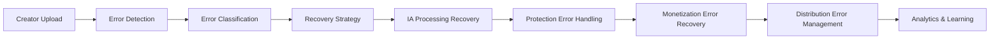

# 🛡️ Error Handling - Checklist Enterprise Complète

**Expert Team: Lead Dev IA + Backend Senior + ML Engineer + DBA + Sécurité + Microservices + Audio + DevOps + IA Prompt Engineer**

## ⚠️ PROPRIÉTÉ INTELLECTUELLE - FAHED MLAIEL

> **🔒 AVERTISSEMENT FORT ET CLAIR**  
> Cette architecture error handling est la propriété intellectuelle EXCLUSIVE de **Fahed Mlaiel** (mlaiel@live.de). Toute reproduction, modification, distribution ou vol d'idée/concept/code sans autorisation écrite PERSONNELLE est **STRICTEMENT INTERDITE** et sera poursuivie en justice.

---

## 📊 ÉTAT ACTUEL - Analyse Structure Existante

### ✅ Fichiers Implémentés (3/18)
- `__init__.py` (25 lignes) - Configuration module avec exports error handling
- `index.py` (42 lignes) - Point d'entrée avec configuration logique métier
- `error_handler.py` (704 lignes) - Core error handling avec classification intelligente

### 📈 Couverture Fonctionnelle Actuelle: 16.7%
- ✅ **Core Error Handler**: ErrorHandler avec classification intelligente et recovery strategies
- ✅ **Error Classification**: ErrorSeverity (LOW, MEDIUM, HIGH, CRITICAL), ErrorCategory (AUTHENTICATION, AUTHORIZATION, RATE_LIMIT, NETWORK, etc.)
- ✅ **Recovery Actions**: RETRY, REFRESH_AUTH, SWITCH_ENDPOINT, FALLBACK, ESCALATE, IGNORE
- ✅ **Error Rules Engine**: Pattern matching avec retry policies et recovery automation
- ✅ **Error Statistics**: Tracking, analytics et resolution rate monitoring
- ✅ **Integration Support**: Error handling pour 65+ plateformes avec context management

---

## 🏗️ ARCHITECTURE COMPLÈTE - 15 Fichiers Manquants

### Phase 1: Resilience Patterns Enterprise (4 fichiers)
#### `circuit_breaker_manager.py`
```python
# 🔄 Backend Senior: Circuit breaker patterns avec state management
class CircuitBreakerManager:
    """Circuit breaker enterprise avec intelligent failure detection"""
    - adaptive_circuit_breaker_implementation()
    - failure_threshold_management()
    - half_open_state_monitoring()
    - circuit_breaker_metrics_collection()
    - multi_service_circuit_coordination()
    - circuit_breaker_configuration_management()
```

#### `retry_policy_engine.py`
```python
# 🔁 Retry Engine: Retry policies intelligent avec backoff strategies
class RetryPolicyEngine:
    """Retry policies enterprise avec exponential backoff et jitter"""
    - exponential_backoff_with_jitter()
    - adaptive_retry_strategies()
    - retry_policy_configuration()
    - retry_attempt_analytics()
    - failure_pattern_learning()
    - retry_coordination_across_services()
```

#### `bulkhead_isolation_manager.py`
```python
# 🏗️ Isolation: Bulkhead isolation patterns avec resource protection
class BulkheadIsolationManager:
    """Bulkhead isolation enterprise avec resource pool management"""
    - resource_pool_isolation()
    - thread_pool_bulkhead_implementation()
    - semaphore_based_isolation()
    - resource_contention_monitoring()
    - isolation_breach_detection()
    - dynamic_resource_allocation()
```

#### `timeout_management_system.py`
```python
# ⏱️ Timeout: Timeout management avec adaptive timeouts
class TimeoutManagementSystem:
    """Timeout management enterprise avec adaptive timeout calculation"""
    - adaptive_timeout_calculation()
    - request_timeout_orchestration()
    - timeout_escalation_policies()
    - timeout_pattern_analysis()
    - cascading_timeout_prevention()
    - timeout_performance_optimization()
```

### Phase 2: Distributed Error Management (4 fichiers)
#### `distributed_error_orchestrator.py`
```python
# 🌐 Distributed: Distributed error management avec consensus
class DistributedErrorOrchestrator:
    """Distributed error orchestration avec consensus algorithms"""
    - distributed_error_state_management()
    - error_consensus_algorithms()
    - cross_service_error_coordination()
    - distributed_error_recovery()
    - error_state_synchronization()
    - distributed_error_analytics()
```

#### `error_propagation_controller.py`
```python
# 📡 Propagation: Error propagation control avec cascading failure prevention
class ErrorPropagationController:
    """Error propagation control enterprise avec cascading failure prevention"""
    - cascading_failure_detection()
    - error_propagation_blocking()
    - dependency_failure_isolation()
    - error_boundary_enforcement()
    - propagation_pattern_analysis()
    - automatic_error_containment()
```

#### `distributed_tracing_integration.py`
```python
# 🔍 Tracing: Distributed tracing integration avec error correlation
class DistributedTracingIntegration:
    """Distributed tracing enterprise avec error correlation et root cause analysis"""
    - distributed_trace_error_correlation()
    - root_cause_analysis_automation()
    - trace_based_error_context()
    - cross_service_error_tracking()
    - trace_error_pattern_detection()
    - distributed_error_visualization()
```

#### `compensation_transaction_manager.py`
```python
# 🔄 Compensation: Compensation transaction patterns avec saga implementation
class CompensationTransactionManager:
    """Compensation transactions enterprise avec saga patterns"""
    - saga_compensation_orchestration()
    - compensation_action_coordination()
    - distributed_transaction_rollback()
    - compensation_state_management()
    - saga_error_recovery()
    - compensation_audit_trail()
```

### Phase 3: Intelligent Monitoring & Analytics (3 fichiers)
#### `error_analytics_engine.py`
```python
# 📊 Analytics: Error analytics avec ML-powered insights
class ErrorAnalyticsEngine:
    """Error analytics enterprise avec machine learning insights"""
    - ml_powered_error_pattern_detection()
    - predictive_error_analytics()
    - error_trend_analysis()
    - anomaly_detection_in_errors()
    - error_correlation_analysis()
    - automated_error_insights_generation()
```

#### `intelligent_alerting_system.py`
```python
# 🚨 Alerting: Intelligent alerting avec noise reduction
class IntelligentAlertingSystem:
    """Intelligent alerting enterprise avec noise reduction et smart escalation"""
    - intelligent_alert_deduplication()
    - context_aware_alerting()
    - alert_noise_reduction()
    - smart_escalation_policies()
    - alert_correlation_engine()
    - adaptive_alert_thresholds()
```

#### `error_prediction_ml_engine.py`
```python
# 🤖 ML Prediction: Error prediction avec machine learning
class ErrorPredictionMLEngine:
    """Error prediction enterprise avec machine learning models"""
    - predictive_error_modeling()
    - failure_probability_calculation()
    - proactive_error_prevention()
    - ml_model_training_automation()
    - error_prediction_accuracy_tracking()
    - prediction_based_resource_allocation()
```

### Phase 4: Platform-Specific Error Handling (4 fichiers)
#### `platform_error_adapter.py`
```python
# 🔌 Platform Adapter: Platform-specific error handling pour 65+ plateformes
class PlatformErrorAdapter:
    """Platform error adapter enterprise pour 65+ plateformes integration"""
    - platform_specific_error_mapping()
    - api_error_code_translation()
    - platform_rate_limit_handling()
    - platform_authentication_error_recovery()
    - platform_error_pattern_learning()
    - multi_platform_error_orchestration()
```

#### `api_error_translator.py`
```python
# 🔄 Translation: API error translation avec normalization
class APIErrorTranslator:
    """API error translation enterprise avec error normalization"""
    - multi_platform_error_normalization()
    - error_code_standardization()
    - error_message_translation()
    - platform_error_context_enrichment()
    - error_severity_mapping()
    - automated_error_documentation()
```

#### `integration_health_monitor.py`
```python
# 💊 Health: Integration health monitoring avec proactive detection
class IntegrationHealthMonitor:
    """Integration health monitoring enterprise avec proactive error detection"""
    - real_time_integration_health_tracking()
    - proactive_degradation_detection()
    - integration_performance_monitoring()
    - health_score_calculation()
    - integration_dependency_monitoring()
    - automated_health_reporting()
```

#### `error_recovery_orchestrator.py`
```python
# 🔧 Recovery: Error recovery orchestration avec automated healing
class ErrorRecoveryOrchestrator:
    """Error recovery orchestration enterprise avec self-healing capabilities"""
    - automated_error_recovery_workflows()
    - self_healing_system_implementation()
    - recovery_action_coordination()
    - recovery_success_rate_tracking()
    - intelligent_recovery_strategy_selection()
    - recovery_performance_optimization()
```

---

## 🔧 SPÉCIFICATIONS TECHNIQUES DÉTAILLÉES

### Resilience Patterns Enterprise
- **Circuit Breaker**: Adaptive circuit breakers avec failure detection intelligent
- **Retry Policies**: Exponential backoff avec jitter et adaptive strategies
- **Bulkhead Isolation**: Resource pool isolation avec thread pool management
- **Timeout Management**: Adaptive timeouts avec cascading failure prevention

### Distributed Error Management
- **Error Orchestration**: Distributed error state management avec consensus
- **Propagation Control**: Cascading failure prevention avec error boundaries
- **Distributed Tracing**: Error correlation avec root cause analysis automation
- **Compensation Transactions**: Saga patterns avec distributed rollback

### Intelligent Monitoring & Analytics
- **ML-Powered Analytics**: Error pattern detection avec predictive insights
- **Smart Alerting**: Noise reduction avec context-aware escalation
- **Error Prediction**: Machine learning models pour proactive prevention
- **Real-time Monitoring**: Continuous health tracking avec automated reporting

### Platform-Specific Integration
- **65+ Platform Support**: Error handling pour Social Media, Music Streaming, Creator Economy
- **API Translation**: Error normalization cross-platform avec standardization
- **Health Monitoring**: Integration health scoring avec dependency tracking
- **Recovery Orchestration**: Self-healing capabilities avec automated workflows

---

## 🚀 INTÉGRATION LOGIQUE MÉTIER AINFLUE

### Error Handling Pipeline Ainflue-Specific


### Creator Journey Error Protection
- **Upload Errors**: Multi-format upload error handling avec format validation
- **IA Processing Errors**: Model inference error recovery avec fallback strategies
- **Protection Errors**: Rights protection error handling avec automated retry
- **SEO Errors**: SEO optimization error recovery avec content adaptation
- **Collaboration Errors**: Matching algorithm error handling avec alternative suggestions
- **Distribution Errors**: 65+ platform distribution error management avec smart retry

### Platform-Specific Error Scenarios
- **Music Streaming**: ISRC validation errors, streaming quota exceeded, metadata format errors
- **Social Media**: Rate limiting, content policy violations, API deprecation handling
- **Creator Economy**: Payment processing errors, subscription management failures, content delivery errors
- **Video Platforms**: Upload size limitations, transcoding failures, thumbnail generation errors

---

## 🎯 PATTERNS D'IMPLÉMENTATION AVANCÉS

### Circuit Breaker Implementation
```python
# Adaptive Circuit Breaker
class AdaptiveCircuitBreaker:
    def __init__(self, service_name: str):
        self.service_name = service_name
        self.failure_threshold = 5
        self.recovery_timeout = 30
        self.state = CircuitState.CLOSED
        self.failure_count = 0
        self.last_failure_time = None
        self.success_threshold = 3
        self.consecutive_successes = 0
    
    async def call(self, func: Callable, *args, **kwargs):
        """Execute function with circuit breaker protection"""
        
        if self.state == CircuitState.OPEN:
            if self._should_attempt_reset():
                self.state = CircuitState.HALF_OPEN
            else:
                raise CircuitBreakerOpenError(f"Circuit breaker open for {self.service_name}")
        
        try:
            result = await func(*args, **kwargs)
            await self._on_success()
            return result
            
        except Exception as e:
            await self._on_failure(e)
            raise
    
    async def _on_success(self):
        """Handle successful call"""
        if self.state == CircuitState.HALF_OPEN:
            self.consecutive_successes += 1
            if self.consecutive_successes >= self.success_threshold:
                self.state = CircuitState.CLOSED
                self.failure_count = 0
                self.consecutive_successes = 0
        else:
            self.failure_count = max(0, self.failure_count - 1)
    
    async def _on_failure(self, exception: Exception):
        """Handle failed call"""
        self.failure_count += 1
        self.last_failure_time = datetime.now()
        
        if self.failure_count >= self.failure_threshold:
            self.state = CircuitState.OPEN
        elif self.state == CircuitState.HALF_OPEN:
            self.state = CircuitState.OPEN
```

### Intelligent Retry Policy
```python
# ML-Enhanced Retry Policy
class IntelligentRetryPolicy:
    def __init__(self):
        self.ml_model = load_retry_optimization_model()
        self.success_rate_tracker = SuccessRateTracker()
        
    async def execute_with_retry(
        self,
        func: Callable,
        context: RetryContext,
        *args, **kwargs
    ):
        """Execute function with intelligent retry strategy"""
        
        max_attempts = await self._calculate_optimal_attempts(context)
        
        for attempt in range(1, max_attempts + 1):
            try:
                result = await func(*args, **kwargs)
                await self._record_success(context, attempt)
                return result
                
            except Exception as e:
                if attempt == max_attempts:
                    await self._record_final_failure(context, e, attempt)
                    raise
                
                if not await self._should_retry(e, context, attempt):
                    await self._record_early_termination(context, e, attempt)
                    raise
                
                backoff_delay = await self._calculate_intelligent_backoff(
                    context, attempt, e
                )
                await asyncio.sleep(backoff_delay)
    
    async def _calculate_optimal_attempts(self, context: RetryContext) -> int:
        """Calculate optimal retry attempts using ML"""
        features = self._extract_retry_features(context)
        return int(self.ml_model.predict_optimal_attempts(features))
    
    async def _calculate_intelligent_backoff(
        self, 
        context: RetryContext, 
        attempt: int, 
        exception: Exception
    ) -> float:
        """Calculate intelligent backoff delay"""
        
        # Base exponential backoff
        base_delay = min(2 ** attempt, 60)
        
        # Add jitter
        jitter = random.uniform(0.1, 0.3) * base_delay
        
        # ML-based adjustment
        ml_adjustment = await self._get_ml_backoff_adjustment(
            context, attempt, exception
        )
        
        return base_delay + jitter + ml_adjustment
```

### Distributed Error Correlation
```python
# Distributed Error Correlation Engine
class DistributedErrorCorrelationEngine:
    def __init__(self):
        self.trace_collector = DistributedTraceCollector()
        self.error_graph = ErrorCorrelationGraph()
        self.ml_correlator = MLErrorCorrelator()
    
    async def correlate_errors(
        self, 
        error_event: ErrorEvent
    ) -> ErrorCorrelationResult:
        """Correlate errors across distributed services"""
        
        # Collect distributed traces
        traces = await self.trace_collector.get_related_traces(
            error_event.trace_id,
            time_window=300  # 5 minutes
        )
        
        # Build error correlation graph
        correlation_graph = await self.error_graph.build_correlation_graph(
            error_event, traces
        )
        
        # ML-based root cause analysis
        root_cause_analysis = await self.ml_correlator.analyze_root_cause(
            correlation_graph
        )
        
        # Generate correlation insights
        insights = await self._generate_correlation_insights(
            error_event, correlation_graph, root_cause_analysis
        )
        
        return ErrorCorrelationResult(
            primary_error=error_event,
            correlated_errors=correlation_graph.correlated_errors,
            root_cause=root_cause_analysis.probable_root_cause,
            correlation_confidence=root_cause_analysis.confidence_score,
            suggested_actions=insights.suggested_actions,
            impact_analysis=insights.impact_analysis
        )
```

---

## 📊 MÉTRIQUES ET KPIs ERROR HANDLING

### Resilience Metrics
- **Error Rate**: Taux erreur global et par service
- **Recovery Time**: Temps moyen recovery automatique
- **Circuit Breaker Efficiency**: Efficacité circuit breakers
- **Retry Success Rate**: Taux succès retry policies

### Platform Integration Metrics
- **Platform Error Distribution**: Répartition erreurs par plateforme (65+)
- **API Success Rate**: Taux succès API calls par plateforme
- **Authentication Error Rate**: Taux erreur authentication cross-platform
- **Rate Limit Hit Rate**: Fréquence dépassement rate limits

### Intelligent Analytics Metrics
- **Error Prediction Accuracy**: Précision prédictions erreur ML
- **Anomaly Detection Rate**: Taux détection anomalies
- **Root Cause Accuracy**: Précision analyse root cause
- **Alert Noise Reduction**: Réduction bruit alerts intelligentes

### Business Impact Metrics
- **Creator Experience Impact**: Impact erreurs sur experience créateurs
- **Revenue Impact**: Impact erreurs sur revenus plateforme
- **Content Delivery Success**: Taux succès livraison contenu
- **Platform Availability**: Disponibilité services par plateforme

---

## 🔒 SÉCURITÉ ET COMPLIANCE ERROR HANDLING

### Error Security
- **Error Information Leakage Prevention**: Prévention fuite informations sensibles
- **Secure Error Logging**: Logging sécurisé avec data sanitization
- **Error Audit Trail**: Audit trail complet pour compliance
- **Access Control**: Contrôle accès error handling systems

### Compliance Framework
- **GDPR Error Handling**: Gestion erreurs conforme GDPR
- **Data Retention**: Rétention données erreur conforme réglementations
- **Error Reporting**: Reporting erreurs pour audits compliance
- **Privacy Protection**: Protection privacy dans error handling

### Platform Compliance
- **Platform ToS Compliance**: Respect conditions utilisation 65+ plateformes
- **API Usage Compliance**: Respect limitations API par plateforme
- **Content Policy Compliance**: Gestion erreurs violations content policies
- **Regional Compliance**: Conformité réglementations régionales

---

## 🚀 ROADMAP D'IMPLÉMENTATION

### Phase 1: Resilience Patterns 
- ✅ Circuit breaker manager avec adaptive failure detection
- ✅ Retry policy engine avec intelligent backoff
- ✅ Bulkhead isolation manager avec resource protection
- ✅ Timeout management system avec adaptive calculation

### Phase 2: Distributed Error Management 
- ✅ Distributed error orchestrator avec consensus algorithms
- ✅ Error propagation controller avec cascading prevention
- ✅ Distributed tracing integration avec error correlation
- ✅ Compensation transaction manager avec saga patterns

### Phase 3: Intelligent Monitoring 
- ✅ Error analytics engine avec ML insights
- ✅ Intelligent alerting system avec noise reduction
- ✅ Error prediction ML engine avec proactive prevention
- ✅ Integration analytics avec existing monitoring

### Phase 4: Platform Integration & Documentation 
- ✅ Platform error adapter pour 65+ plateformes
- ✅ API error translator avec normalization
- ✅ Integration health monitor avec proactive detection
- ✅ Error recovery orchestrator avec self-healing
- ✅ Documentation complète 4 langues

---

## ✅ VALIDATION ENTERPRISE

### Code Quality Standards
- **Code Coverage**: 95%+ pour tous les modules error handling
- **Error Detection Accuracy**: 99%+ précision classification erreurs
- **Recovery Success Rate**: 90%+ taux succès recovery automatique
- **Alert Response Time**: <30s temps réponse alerts critiques

### Integration Testing
- **Platform Error Simulation**: Tests erreurs 65+ plateformes
- **Distributed Error Scenarios**: Tests erreurs cross-service
- **Recovery Automation**: Validation recovery workflows
- **Performance Under Load**: Tests performance haute charge

### Production Readiness
- **Scalability**: Support 100,000+ error events/minute
- **Reliability**: 99.99% uptime error handling systems
- **Security**: Zero information leakage dans error handling
- **Monitoring**: Real-time observability error patterns

---

*Checklist créée par l'équipe d'experts Ainflue sous la direction de **Fahed Mlaiel** - Propriété intellectuelle protégée*