# 🛡️ Fingerprinting - Checklist Enterprise Complète

**Expert Team: Lead Dev IA + Backend Senior + ML Engineer + DBA + Sécurité + Microservices + Audio + DevOps + IA Prompt Engineer**

## ⚠️ PROPRIÉTÉ INTELLECTUELLE - FAHED MLAIEL

> **🔒 AVERTISSEMENT FORT ET CLAIR**  
> Cette architecture fingerprinting est la propriété intellectuelle EXCLUSIVE de **Fahed Mlaiel** (mlaiel@live.de). Toute reproduction, modification, distribution ou vol d'idée/concept/code sans autorisation écrite PERSONNELLE est **STRICTEMENT INTERDITE** et sera poursuivie en justice.

---

## 📊 ÉTAT ACTUEL - Analyse Structure Existante

### ✅ Fichiers Implémentés (4/18)
- `__init__.py` (40 lignes) - Configuration module avec exports fingerprinting complets
- `index.py` (58 lignes) - Point d'entrée avec factory pattern et configuration métier
- `audio_fingerprinting.py` (553 lignes) - Core audio fingerprinting avec algorithmes avancés
- `README.md` (253 lignes) - Documentation partielle fingerprinting multi-format

### 📈 Couverture Fonctionnelle Actuelle: 22.2%
- ✅ **Audio Fingerprinting Core**: AudioFingerprinting avec algorithmes Chromaprint, spectral hash, MFCC
- ✅ **Audio Algorithms**: Support MP3, WAV, FLAC, AAC, M4A avec spectral/temporal analysis
- ✅ **Match Detection**: Similarity scoring, confidence calculation, segment matching
- ✅ **Configuration**: Multi-algorithm support avec threshold management
- ✅ **Exports Declaration**: 9 modules déclarés (audio, video, image, text, blockchain, watermarking, plagiarism, DMCA, rights)

---

## 🏗️ ARCHITECTURE COMPLÈTE - 14 Fichiers Manquants

### Phase 1: Multi-Modal Fingerprinting (4 fichiers)
#### `video_fingerprinting.py`
```python
# 🎬 Video Fingerprinting: Video fingerprinting avec frame analysis et motion vectors
class VideoFingerprinting:
    """Video fingerprinting enterprise avec temporal signatures et scene detection"""
    - frame_based_fingerprinting()
    - motion_vector_analysis()
    - temporal_signature_extraction()
    - scene_change_detection()
    - video_similarity_scoring()
    - compressed_video_resilience()
```

#### `image_fingerprinting.py`
```python
# 🖼️ Image Fingerprinting: Image fingerprinting avec perceptual hashing
class ImageFingerprinting:
    """Image fingerprinting enterprise avec feature extraction et similarity detection"""
    - perceptual_hash_generation()
    - feature_point_extraction()
    - image_similarity_matching()
    - rotation_scaling_invariance()
    - compression_resilient_fingerprints()
    - batch_image_processing()
```

#### `text_fingerprinting.py`
```python
# 📝 Text Fingerprinting: Text fingerprinting avec semantic analysis
class TextFingerprinting:
    """Text fingerprinting enterprise avec n-gram analysis et semantic fingerprints"""
    - semantic_fingerprint_generation()
    - n_gram_analysis()
    - text_similarity_detection()
    - plagiarism_pattern_recognition()
    - multilingual_text_fingerprinting()
    - document_structure_analysis()
```

#### `blockchain_fingerprinting.py`
```python
# ⛓️ Blockchain: Blockchain fingerprinting avec NFT integration
class BlockchainFingerprinting:
    """Blockchain fingerprinting enterprise avec immutable timestamp et ownership proofs"""
    - nft_based_ownership_certificates()
    - immutable_timestamp_proofs()
    - smart_contract_royalty_management()
    - multi_chain_fingerprint_storage()
    - blockchain_verification_system()
    - decentralized_rights_registry()
```

### Phase 2: Advanced Protection Systems (4 fichiers)
#### `watermarking_engine.py`
```python
# 🎭 Watermarking: Watermarking engine avec invisible/visible embedding
class WatermarkingEngine:
    """Watermarking engine enterprise avec steganographic embedding et robustness"""
    - invisible_watermark_embedding()
    - steganographic_payload_insertion()
    - compression_resistant_watermarks()
    - multi_format_watermark_support()
    - batch_watermarking_processing()
    - watermark_extraction_verification()
```

#### `plagiarism_detection.py`
```python
# 🔍 Plagiarism: Plagiarism detection avec ML-powered analysis
class PlagiarismDetection:
    """Plagiarism detection enterprise avec cross-format similarity detection"""
    - multi_format_plagiarism_detection()
    - ml_powered_similarity_analysis()
    - cross_platform_content_scanning()
    - plagiarism_confidence_scoring()
    - automated_infringement_reporting()
    - similarity_threshold_optimization()
```

#### `dmca_automation.py`
```python
# ⚖️ DMCA: DMCA automation avec legal compliance
class DMCAAutomation:
    """DMCA automation enterprise avec platform integration et legal compliance"""
    - automated_takedown_notice_generation()
    - platform_api_integration()
    - legal_compliance_tracking()
    - multi_jurisdiction_support()
    - dmca_response_automation()
    - infringement_case_management()
```

#### `rights_management.py`
```python
# 👑 Rights: Rights management avec global protection orchestration
class RightsManagement:
    """Rights management enterprise avec ownership tracking et global protection"""
    - ownership_certificate_management()
    - global_rights_protection_orchestration()
    - creator_rights_portfolio_tracking()
    - rights_violation_monitoring()
    - automated_protection_workflows()
    - rights_monetization_optimization()
```

### Phase 3: Advanced Analytics & Intelligence (3 fichiers)
#### `fingerprint_analytics_engine.py`
```python
# 📊 Analytics: Fingerprint analytics avec ML insights
class FingerprintAnalyticsEngine:
    """Fingerprint analytics enterprise avec pattern detection et threat intelligence"""
    - fingerprint_pattern_analysis()
    - infringement_trend_detection()
    - threat_intelligence_integration()
    - protection_effectiveness_analytics()
    - creator_protection_insights()
    - automated_analytics_reporting()
```

#### `content_authenticity_verifier.py`
```python
# ✅ Authenticity: Content authenticity verification avec provenance tracking
class ContentAuthenticityVerifier:
    """Content authenticity verification enterprise avec provenance chain et integrity validation"""
    - content_provenance_tracking()
    - authenticity_certificate_generation()
    - integrity_validation_algorithms()
    - tamper_detection_analysis()
    - authenticity_score_calculation()
    - verified_creator_badge_system()
```

#### `infringement_intelligence_system.py`
```python
# 🕵️ Intelligence: Infringement intelligence avec proactive monitoring
class InfringementIntelligenceSystem:
    """Infringement intelligence enterprise avec proactive monitoring et prediction"""
    - proactive_infringement_monitoring()
    - infringement_prediction_algorithms()
    - automated_threat_assessment()
    - infringement_pattern_learning()
    - real_time_violation_detection()
    - intelligent_protection_recommendations()
```

### Phase 4: Documentation Multilingue (3 fichiers)
#### `README.de.md` (German)
```markdown
# 🛡️ Fingerprinting - Enterprise Schutzarchitektur

**Expertenteam: Lead Dev IA + Backend Senior + ML Engineer + DBA + Sicherheit + Microservices + Audio + DevOps + IA Prompt Engineer**

## ⚠️ GEISTIGES EIGENTUM - FAHED MLAIEL
> **🔒 STARKE UND KLARE WARNUNG**
> Diese Fingerprinting-Architektur ist das EXKLUSIVE geistige Eigentum von **Fahed Mlaiel** (mlaiel@live.de). Jede Reproduktion, Änderung, Verteilung oder Diebstahl von Idee/Konzept/Code ohne PERSÖNLICHE schriftliche Genehmigung ist **STRENG VERBOTEN** und wird strafrechtlich verfolgt.

## 🎯 Enterprise Fingerprinting-Schutz
Produktionsreife Rechteschutz-Suite mit Multi-Format-Fingerprinting, Blockchain-Integration und DMCA-Automatisierung.
```

#### `README.fr.md` (French)
```markdown
# 🛡️ Fingerprinting - Architecture Protection Enterprise

**Équipe Expert: Lead Dev IA + Backend Senior + ML Engineer + DBA + Sécurité + Microservices + Audio + DevOps + IA Prompt Engineer**

## ⚠️ PROPRIÉTÉ INTELLECTUELLE - FAHED MLAIEL
> **🔒 AVERTISSEMENT FORT ET CLAIR**
> Cette architecture fingerprinting est la propriété intellectuelle EXCLUSIVE de **Fahed Mlaiel** (mlaiel@live.de). Toute reproduction, modification, distribution ou vol d'idée/concept/code sans autorisation écrite PERSONNELLE est **STRICTEMENT INTERDITE** et sera poursuivie en justice.
```

#### `README.ar.md` (Arabic)
```markdown
# 🛡️ البصمات - هندسة الحماية المؤسسية

**فريق الخبراء: Lead Dev IA + Backend Senior + ML Engineer + DBA + الأمان + Microservices + الصوت + DevOps + IA Prompt Engineer**

## ⚠️ الملكية الفكرية - فاهد مليل
> **🔒 تحذير قوي وواضح**
> هذه الهندسة المعمارية للبصمات هي الملكية الفكرية الحصرية لـ **فاهد مليل** (mlaiel@live.de). أي إعادة إنتاج أو تعديل أو توزيع أو سرقة للفكرة/المفهوم/الكود بدون إذن كتابي شخصي محظور تماماً وسيتم مقاضاته قانونياً.
```

---

## 🔧 SPÉCIFICATIONS TECHNIQUES DÉTAILLÉES

### Multi-Modal Fingerprinting
- **Audio Fingerprinting**: Chromaprint, spectral analysis, MFCC, perceptual hashing avec support MP3, WAV, FLAC, AAC, M4A
- **Video Fingerprinting**: Frame analysis, motion vectors, temporal signatures, scene detection avec support MP4, MOV, AVI, MKV, WebM
- **Image Fingerprinting**: Perceptual hashing, feature extraction, similarity detection avec support JPG, PNG, TIFF, BMP, WebP
- **Text Fingerprinting**: Semantic analysis, n-gram fingerprints, plagiarism detection avec support TXT, MD, DOC, PDF, HTML

### Blockchain Integration
- **NFT Ownership**: Certificates d'ownership avec smart contracts sur Ethereum, Polygon, BSC, Solana
- **Immutable Timestamping**: Proof of creation avec blockchain verification
- **Smart Royalties**: Automated royalty distribution via smart contracts
- **Decentralized Registry**: Global rights registry avec multi-chain support

### Advanced Protection
- **Invisible Watermarking**: Steganographic embedding résistant compression/conversion
- **Plagiarism Detection**: ML-powered similarity analysis cross-platform
- **DMCA Automation**: Automated takedown notices avec platform API integration
- **Rights Management**: Global protection orchestration avec ownership tracking

### Platform Integration
- **65+ Platform Support**: Protection across Social Media, Music Streaming, Creator Economy platforms
- **API Integration**: YouTube, Instagram, TikTok, Spotify DMCA APIs
- **Legal Compliance**: Multi-jurisdiction support (US, EU, UK, CA, AU)
- **Real-time Monitoring**: Continuous infringement detection et automated response

---

## 🚀 INTÉGRATION LOGIQUE MÉTIER AINFLUE

### Digital Rights Protection Pipeline

```mermaid
graph LR
    A[Creator Upload] --> B[Content Fingerprinting]
    B --> C[Blockchain Registration]
    C --> D[Watermark Embedding]
    D --> E[IA Processing Protection]
    E --> F[Global Monitoring]
    F --> G[Infringement Detection]
    G --> H[DMCA Automation]
    H --> I[Rights Enforcement]
```


### Creator Journey Protection
- **Upload Protection**: Immediate fingerprinting upon content upload
- **IA Processing Security**: Rights protection during AI model inference
- **SEO Protection**: Copyright protection during SEO optimization
- **Collaboration Security**: Rights validation during creator matching
- **Distribution Protection**: Watermarking during multi-platform distribution
- **Monetization Security**: Rights enforcement during revenue generation

### Platform-Specific Protection
- **Music Creators**: Audio fingerprinting + ISRC registration + streaming platform monitoring
- **Video Creators**: Video fingerprinting + YouTube Content ID + cross-platform detection
- **Photography**: Image fingerprinting + stock photo monitoring + reverse image search
- **Bloggers**: Text fingerprinting + plagiarism detection + content syndication protection
- **Influencers**: Multi-format protection + brand collaboration rights + sponsored content protection

---

## 🎯 PATTERNS D'IMPLÉMENTATION AVANCÉS

### Multi-Modal Fingerprinting Engine
```python
# Universal Fingerprinting System
class UniversalFingerprintingEngine:
    def __init__(self):
        self.audio_engine = AudioFingerprinting()
        self.video_engine = VideoFingerprinting()
        self.image_engine = ImageFingerprinting()
        self.text_engine = TextFingerprinting()
        self.blockchain_engine = BlockchainFingerprinting()
    
    async def create_universal_fingerprint(
        self,
        content: ContentPackage
    ) -> UniversalFingerprint:
        """Create comprehensive fingerprint for multi-format content"""
        
        fingerprints = {}
        
        # Audio fingerprinting
        if content.has_audio():
            fingerprints['audio'] = await self.audio_engine.create_fingerprint(
                content.audio_stream
            )
        
        # Video fingerprinting
        if content.has_video():
            fingerprints['video'] = await self.video_engine.create_fingerprint(
                content.video_stream
            )
        
        # Image fingerprinting
        if content.has_images():
            fingerprints['image'] = await self.image_engine.create_fingerprint(
                content.image_data
            )
        
        # Text fingerprinting
        if content.has_text():
            fingerprints['text'] = await self.text_engine.create_fingerprint(
                content.text_content
            )
        
        # Blockchain registration
        blockchain_proof = await self.blockchain_engine.register_content(
            content, fingerprints
        )
        
        return UniversalFingerprint(
            content_id=content.id,
            fingerprints=fingerprints,
            blockchain_proof=blockchain_proof,
            creation_timestamp=datetime.utcnow(),
            creator_id=content.creator_id
        )
```

### Intelligent Watermarking System
```python
# Adaptive Watermarking Engine
class AdaptiveWatermarkingEngine:
    def __init__(self):
        self.ml_optimizer = WatermarkOptimizer()
        self.steganography_engine = SteganographyEngine()
        self.robustness_analyzer = RobustnessAnalyzer()
    
    async def embed_intelligent_watermark(
        self,
        content: ContentPackage,
        creator_info: CreatorInfo
    ) -> WatermarkedContent:
        """Embed intelligent watermark optimized for content type"""
        
        # Analyze content characteristics
        content_analysis = await self._analyze_content_characteristics(content)
        
        # Optimize watermark parameters
        watermark_params = await self.ml_optimizer.optimize_parameters(
            content_analysis,
            creator_info.protection_level
        )
        
        # Generate creator-specific watermark
        watermark_payload = await self._generate_creator_watermark(
            creator_info,
            content.metadata
        )
        
        # Embed watermark with steganography
        watermarked_content = await self.steganography_engine.embed_watermark(
            content,
            watermark_payload,
            watermark_params
        )
        
        # Verify watermark robustness
        robustness_score = await self.robustness_analyzer.test_robustness(
            watermarked_content,
            watermark_payload
        )
        
        return WatermarkedContent(
            original_content=content,
            watermarked_data=watermarked_content,
            watermark_payload=watermark_payload,
            embedding_parameters=watermark_params,
            robustness_score=robustness_score,
            extraction_key=await self._generate_extraction_key(creator_info)
        )
```

### Automated DMCA Enforcement
```python
# DMCA Automation System
class DMCAAutomationSystem:
    def __init__(self):
        self.platform_apis = PlatformAPIManager()
        self.legal_template_engine = LegalTemplateEngine()
        self.infringement_tracker = InfringementTracker()
        self.ml_classifier = InfringementClassifier()
    
    async def process_infringement_detection(
        self,
        infringement: InfringementDetection
    ) -> DMCAResponse:
        """Process detected infringement with automated DMCA workflow"""
        
        # Classify infringement severity
        classification = await self.ml_classifier.classify_infringement(
            infringement
        )
        
        if classification.confidence < 0.8:
            # Manual review required
            return await self._escalate_for_manual_review(infringement)
        
        # Generate DMCA notice
        dmca_notice = await self.legal_template_engine.generate_dmca_notice(
            infringement,
            classification
        )
        
        # Submit to platform
        platform_response = await self.platform_apis.submit_dmca_notice(
            infringement.platform,
            dmca_notice
        )
        
        # Track case
        case_id = await self.infringement_tracker.create_case(
            infringement,
            dmca_notice,
            platform_response
        )
        
        # Schedule follow-up
        await self._schedule_follow_up_monitoring(case_id, infringement)
        
        return DMCAResponse(
            case_id=case_id,
            dmca_notice=dmca_notice,
            platform_response=platform_response,
            estimated_resolution_time=classification.estimated_resolution,
            automated_actions=await self._get_automated_actions(classification)
        )
```

---

## 📊 MÉTRIQUES ET KPIs FINGERPRINTING

### Protection Effectiveness
- **Fingerprint Accuracy**: 99.5%+ précision détection similarité
- **False Positive Rate**: <0.1% taux faux positifs
- **Detection Speed**: <500ms temps traitement fingerprint
- **Watermark Robustness**: 95%+ résistance compression/conversion

### Multi-Format Coverage
- **Audio Fingerprinting**: Support 5+ formats avec algorithmes avancés
- **Video Fingerprinting**: Frame analysis temps réel avec motion detection
- **Image Fingerprinting**: Perceptual hashing résistant transformations
- **Text Fingerprinting**: Semantic analysis multilingue avec plagiarism detection

### Blockchain Integration
- **NFT Registration**: Automated ownership certificates sur 4+ blockchains
- **Timestamp Accuracy**: Immutable proofs avec consensus validation
- **Smart Contract Execution**: Automated royalty distribution
- **Decentralized Verification**: Global rights registry avec multi-chain support

### DMCA Automation
- **Takedown Success Rate**: 90%+ succès automated DMCA notices
- **Response Time**: <24h temps réponse platform takedowns
- **Legal Compliance**: 100% conformité multi-jurisdiction requirements
- **Case Resolution**: Automated tracking et follow-up workflows

---

## 🔒 SÉCURITÉ ET COMPLIANCE FINGERPRINTING

### Digital Rights Security
- **Fingerprint Storage**: Encrypted storage avec access control
- **Watermark Security**: Tamper-resistant embedding techniques
- **Blockchain Security**: Multi-signature validation et consensus verification
- **API Security**: Secure platform integration avec OAuth2/JWT

### Legal Compliance Framework
- **Copyright Law Compliance**: DMCA, EU Copyright Directive, international treaties
- **Data Protection**: GDPR compliant fingerprint processing
- **Platform ToS Compliance**: Respect conditions utilisation 65+ plateformes
- **Jurisdiction Support**: Multi-country legal framework integration

### Creator Privacy Protection
- **Anonymous Fingerprinting**: Privacy-preserving fingerprint generation
- **Selective Disclosure**: Granular control over fingerprint sharing
- **Data Retention**: Configurable retention policies per jurisdiction
- **Creator Consent**: Explicit consent workflows pour rights management

---

## 🚀 ROADMAP D'IMPLÉMENTATION

### Phase 1: Multi-Modal Fingerprinting 
- ✅ Video fingerprinting avec frame analysis et motion vectors
- ✅ Image fingerprinting avec perceptual hashing et feature extraction
- ✅ Text fingerprinting avec semantic analysis et n-gram detection
- ✅ Blockchain fingerprinting avec NFT integration multi-chain

### Phase 2: Advanced Protection 
- ✅ Watermarking engine avec invisible/visible embedding
- ✅ Plagiarism detection avec ML-powered similarity analysis
- ✅ DMCA automation avec platform API integration
- ✅ Rights management avec global protection orchestration

### Phase 3: Analytics & Intelligence 
- ✅ Fingerprint analytics engine avec pattern detection
- ✅ Content authenticity verifier avec provenance tracking
- ✅ Infringement intelligence système avec proactive monitoring

### Phase 4: Documentation & Testing 
- ✅ Documentation complète 4 langues (EN, DE, FR, AR)
- ✅ Testing automation cross-format validation
- ✅ Performance optimization et blockchain integration
- ✅ Production deployment avec monitoring

---

## ✅ VALIDATION ENTERPRISE

### Code Quality Standards
- **Code Coverage**: 95%+ pour tous les modules fingerprinting
- **Fingerprint Accuracy**: 99.5%+ précision détection similarité
- **Processing Speed**: <500ms fingerprint generation temps réel
- **Watermark Robustness**: 95%+ résistance attacks

### Integration Testing
- **Multi-Format Testing**: Validation fingerprinting audio, video, image, text
- **Blockchain Integration**: Tests NFT registration et smart contracts
- **Platform API Testing**: DMCA automation validation 65+ plateformes
- **Performance Testing**: Load testing avec high-volume content processing

### Production Readiness
- **Scalability**: Support 1M+ fingerprints simultanés
- **Reliability**: 99.99% uptime protection services
- **Security**: Zero-knowledge fingerprinting avec encrypted storage
- **Legal Compliance**: 100% conformité multi-jurisdiction requirements

---

*Checklist créée par l'équipe d'experts Ainflue sous la direction de **Fahed Mlaiel** - Propriété intellectuelle protégée*