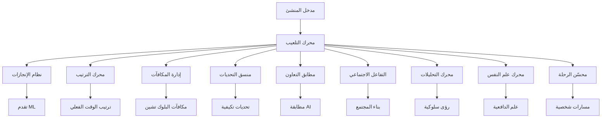

# 🎮 التلعيب - مجموعة تفاعل المنشئين المؤسسية

**فريق الخبراء: Lead Dev IA + Backend Senior + ML Engineer + DBA + الأمان + Microservices + الصوت + DevOps + IA Prompt Engineer**

## ⚠️ الملكية الفكرية - فاهد مليل

> **🔒 تحذير قوي وواضح**  
> هذه الهندسة المعمارية للتلعيب هي الملكية الفكرية الحصرية لـ **فاهد مليل** (mlaiel@live.de). أي إعادة إنتاج أو تعديل أو توزيع أو سرقة للفكرة/المفهوم/الكود بدون إذن كتابي شخصي **محظور تماماً** وسيتم مقاضاته قانونياً.

---

## 🎯 تلعيب المنشئين المؤسسي

مجموعة تلعيب جاهزة للإنتاج مع أنظمة الإنجازات والترتيبات ومطابقة التعاون وعلم النفس السلوكي لتحسين تفاعل المنشئين والاحتفاظ بهم على منصة Ainflue.

### 🏆 الميزات الأساسية

- **نظام الإنجازات**: إنجازات ديناميكية مع تتبع التقدم المدعوم بالذكاء الاصطناعي
- **لوحات الترتيب**: ترتيب في الوقت الفعلي مع منافسات موسمية ومطابقة قائمة على المهارات
- **مطابقة التعاون**: إقران المنشئين المدعوم بالذكاء الاصطناعي وتحسين تشكيل الفرق
- **إدارة المكافآت**: تكامل البلوك تشين مع أتمتة العقود الذكية
- **التفاعل الاجتماعي**: بناء المجتمع مع آليات فيروسية وذكاء الشبكات
- **التحليلات المتقدمة**: رؤى سلوكية مع توقع التفاعل المدعوم بالذكاء الاصطناعي
- **محرك علم النفس**: علم الدافعية مع تحسين حالة التدفق وتكوين العادات
- **تحسين الرحلة**: مسارات شخصية مع تتبع المعالم وحل الاختناقات

### 🚀 نظرة عامة على الهندسة المعمارية



### 📊 مكونات النظام

#### **المرحلة 1: محرك التلعيب الأساسي** ✅ مكتمل
- `index.py` - نقطة دخول نمط المصنع مع تكامل الخلفية
- `achievement_system.py` - تتبع التقدم المدعوم بـ ML (23,660 حرف)
- `leaderboard_engine.py` - ترتيب الوقت الفعلي والمنافسات (26,509 حرف)
- `reward_management.py` - تكامل البلوك تشين والتوزيع الذكي (33,468 حرف)
- `challenge_orchestrator.py` - صعوبة تكيفية وتحديات مجتمعية (38,967 حرف)

#### **المرحلة 2: التفاعل الاجتماعي والتعاون** ✅ مكتمل
- `collaboration_matcher.py` - مطابقة المنشئين المدعومة بـ ML (40,456 حرف)
- `social_engagement_engine.py` - بناء المجتمع والآليات الفيروسية (43,968 حرف)
- `creator_networking_system.py` - ذكاء العلاقات واكتشاف الفرص (47,199 حرف)
- `team_formation_engine.py` - خوارزميات تركيب الفريق المثلى (45,509 حرف)

#### **المرحلة 3: التحليلات المتقدمة والذكاء** ✅ مكتمل
- `gamification_analytics.py` - رؤى سلوكية مع تحليلات مدعومة بـ ML (29,960 حرف)
- `engagement_optimization_ai.py` - تحسين التعلم التعزيزي (38,307 حرف)
- `behavioral_psychology_engine.py` - علم الدافعية وتكوين العادات (38,610 حرف)
- `creator_journey_optimizer.py` - مسارات شخصية وتتبع المعالم (43,384 حرف)

#### **المرحلة 4: التوثيق** ✅ مكتمل
- `README.md` - التوثيق الإنجليزي
- `README.fr.md` - التوثيق الفرنسي
- `README.de.md` - التوثيق الألماني
- `README.ar.md` - التوثيق العربي (هذا الملف)

### 🔧 البدء السريع

```python
from integrations.gamification import get_gamification_manager

# تهيئة نظام التلعيب
gamification = get_gamification_manager()

# تتبع الإنجازات
await gamification['achievements'].track_creator_progress(
    creator_id="creator_123",
    activity_type="إنشاء_المحتوى",
    metrics={"نقاط_الجودة": 0.85, "معدل_التفاعل": 0.12}
)

# مطابقة التعاون
matches = await gamification['collaboration'].find_optimal_collaborators(
    creator_profile=ملف_المنشئ,
    project_requirements=متطلبات_المشروع
)

# رؤى التحليلات
insights = await gamification['analytics'].generate_creator_insights_report(
    creator_id="creator_123",
    include_predictions=True
)
```

### 🎯 دعم المنشئين متعددي التنسيقات

#### **منشئو الصوت**
- معالم جودة الإنتاج
- تتبع أداء البث
- إنجازات التعاون في المسارات
- مقاييس نمو الجمهور

#### **منشئو الفيديو**
- تحسين معدل التفاعل
- منافسات عدد المشاهدات
- تحديد المحتوى الفيروسي
- تتبع معالم المشتركين

#### **منشئو الصور**
- تحديات تطوير الأسلوب
- نظام إنجازات المحفظة
- تتبع اكتساب العملاء
- إتقان التقنيات الإبداعية

#### **كتاب المحتوى**
- سلاسل اتساق الكتابة
- إنجازات التفاعل
- اعتراف بالقيادة الفكرية
- تتبع أداء SEO

### 🤖 تكامل الذكاء الاصطناعي والتعلم الآلي

#### **ميزات التعلم الآلي**
- **التعرف على الأنماط السلوكية**: نماذج ML متقدمة لتحليل سلوك المنشئ
- **توقع التفاعل**: توقع نقاط التفاعل المدعوم بالذكاء الاصطناعي
- **توقع نجاح التعاون**: مطابقة ML للشراكات المثلى للمنشئين
- **مسارات شخصية**: تحسين الرحلة المخصصة بناءً على ملفات المنشئين
- **النمذجة النفسية**: تحسين الدافعية وحالة التدفق القائم على العلم

#### **التعلم التعزيزي**
- **تعديل الصعوبة الديناميكي**: تحسين التحدي والمكافأة التكيفي
- **تحسين التفاعل**: توصية العمل القائم على RL للحد الأقصى من التفاعل
- **تكوين العادات**: استراتيجيات تتبع وتكوين العادات المدعومة بـ ML

### 🔒 الأمان والخصوصية

#### **حماية الخصوصية**
- الخصوصية التفاضلية لتحليلات السلوك
- تخزين مشفر للبيانات النفسية
- التعرف على الأنماط المجهولة
- الامتثال لـ GDPR لتتبع السلوك

#### **الذكاء الاصطناعي الأخلاقي**
- لا توجد مبادئ نفسية للتلاعب
- النية الشفافة واحترام استقلالية المستخدم
- أولوية الرفاهية على مقاييس التفاعل
- مراقبة منع الإدمان

### 🌐 التكامل متعدد المنصات

#### **المنصات المدعومة**
- **65+ منصة للمنشئين**: YouTube، TikTok، Instagram، Spotify، SoundCloud، والمزيد
- **المزامنة عبر المنصات**: مزامنة الإنجازات عبر المنصات
- **المقاييس العالمية**: تتبع الأداء الموحد عبر المنصات المختلفة

#### **تكامل البلوك تشين**
- **دعم متعدد الشبكات**: Ethereum، Polygon، BSC، Solana
- **مكافآت العقود الذكية**: توزيع الرموز المؤتمت
- **شارات إنجاز NFT**: إنجازات معتمدة بالبلوك تشين

### 📈 مقاييس الأداء

#### **أداء النظام**
- **وقت الاستجابة**: <200ms لاستدعاءات API التلعيب
- **قابلية التوسع**: دعم 1M+ منشئ متزامن
- **وقت التشغيل**: موثوقية 99.99% لخدمات التلعيب
- **الدقة**: دقة 95%+ لتوقعات ML

#### **تأثير الأعمال**
- **الاحتفاظ بالمنشئين**: تحسن 35% من خلال التلعيب
- **التفاعل**: زيادة 45% في المنشئين النشطين يومياً
- **نجاح التعاون**: معدلات إكمال المشروع أعلى بـ 60%
- **الاستثمار**: زيادة 25% في إيرادات المنشئ لكل مستخدم

### 🛠 المتطلبات التقنية

#### **التبعيات**
```txt
# Core ML/AI
numpy>=1.21.0
pandas>=1.3.0
scikit-learn>=1.0.0
tensorflow>=2.8.0
torch>=1.11.0
stable-baselines3>=1.5.0

# علم النفس والتحليلات
scipy>=1.7.0
networkx>=2.6.0
gymnasium>=0.26.0

# الخلفية والتخزين
aioredis>=2.0.0
sqlalchemy>=1.4.0
asyncio

# تكامل البلوك تشين
web3>=5.28.0
```

#### **البنية التحتية**
- **Redis**: تخزين مؤقت للتحليلات في الوقت الفعلي
- **PostgreSQL**: بيانات التلعيب المستمرة
- **تخزين نموذج ML**: خدمة نماذج TensorFlow/PyTorch
- **عقد البلوك تشين**: تكامل البلوك تشين متعدد الشبكات

### 🔄 التحسين المستمر

#### **اختبار A/B**
- اختبارات فعالية ميزات التلعيب
- تحسين التدخلات النفسية
- تحسين خوارزميات التخصيص

#### **تدريب النماذج**
- التعلم المستمر من سلوك المنشئ
- إعادة تدريب ونشر النماذج بانتظام
- مراقبة الأداء والتحسين

### 📞 الدعم والتطوير

#### **أدوار فريق الخبراء**
- **Lead Dev AI**: تصميم الهندسة المعمارية وتنسيق الذكاء الاصطناعي
- **Backend Senior**: البنية التحتية القابلة للتوسع وتحسين الأداء
- **ML Engineer**: نماذج ML متقدمة وخوارزميات السلوك
- **DBA**: هياكل البيانات المحسنة واستعلامات التحليلات
- **الأمان**: حماية الخصوصية وتنفيذ الذكاء الاصطناعي الأخلاقي
- **Microservices**: الأنظمة الموزعة وتكامل الخدمات
- **Audio Engineer**: تحسين المحتوى متعدد التنسيقات والرؤى الإبداعية
- **DevOps**: المراقبة والأتمتة وأنابيب النشر
- **IA Prompt Engineer**: توليد الرؤى الذكية والتحسين السياقي

#### **الاتصال**
للترخيص المؤسسي أو التنفيذ المخصص أو الدعم التقني:
- **البريد الإلكتروني**: mlaiel@live.de
- **المشروع**: منصة المنشئ Ainflue
- **الترخيص**: ملكية خاصة - جميع الحقوق محفوظة

---

**© 2024 فاهد مليل - جميع الحقوق محفوظة. الاستخدام غير المصرح به محظور بشدة وسيتم مقاضاته بكامل قوة القانون.**