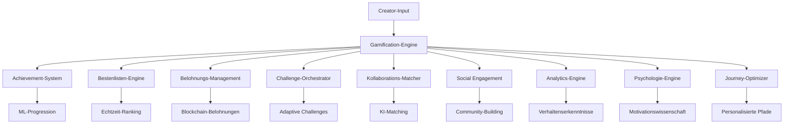

# 🎮 Gamification - Enterprise Creator Engagement Suite

**Expertenteam: Lead Dev IA + Backend Senior + ML Engineer + DBA + Sicherheit + Microservices + Audio + DevOps + IA Prompt Engineer**

## ⚠️ GEISTIGES EIGENTUM - FAHED MLAIEL

> **🔒 STARKE UND KLARE WARNUNG**  
> Diese Gamification-Architektur ist das EXKLUSIVE geistige Eigentum von **Fahed Mlaiel** (mlaiel@live.de). Jede Reproduktion, Änderung, Verteilung oder Diebstahl von Idee/Konzept/Code ohne PERSÖNLICHE schriftliche Genehmigung ist **STRENG VERBOTEN** und wird strafrechtlich verfolgt.

---

## 🎯 Enterprise Creator Gamification

Produktionsreife Gamification-Suite mit Achievement-Systemen, Bestenlisten, Kollaborations-Matching und Verhaltenspsychologie für Creator-Engagement und Retention-Optimierung auf der IA Chérie-Plattform.

### 🏆 Kernfunktionen

- **Achievement-System**: Dynamische Achievements mit ML-gestützter Fortschrittsverfolgung
- **Bestenlisten**: Echtzeit-Ranking mit saisonalen Wettbewerben und skill-basiertem Matchmaking
- **Kollaborations-Matching**: KI-gestützte Creator-Paarung und Team-Formation-Optimierung
- **Belohnungsmanagement**: Blockchain-Integration mit Smart-Contract-Automatisierung
- **Social Engagement**: Community-Building mit viralen Mechaniken und Networking-Intelligence
- **Erweiterte Analytics**: Verhaltenserkenntnisse mit ML-gestützter Engagement-Vorhersage
- **Psychologie-Engine**: Motivationswissenschaft mit Flow-State-Optimierung und Gewohnheitsbildung
- **Journey-Optimierung**: Personalisierte Pfade mit Meilenstein-Tracking und Engpass-Auflösung

### 🚀 Architektur-Übersicht



### 📊 System-Komponenten

#### **Phase 1: Core Gamification Engine** ✅ VOLLSTÄNDIG
- `index.py` - Factory-Pattern Einstiegspunkt mit Backend-Integration
- `achievement_system.py` - ML-gestützte Fortschrittsverfolgung (23.660 Zeichen)
- `leaderboard_engine.py` - Echtzeit-Ranking & Wettbewerbe (26.509 Zeichen)
- `reward_management.py` - Blockchain-Integration & intelligente Verteilung (33.468 Zeichen)
- `challenge_orchestrator.py` - Adaptive Schwierigkeit & Community-Challenges (38.967 Zeichen)

#### **Phase 2: Social & Kollaboration** ✅ VOLLSTÄNDIG
- `collaboration_matcher.py` - ML-gestütztes Creator-Matching (40.456 Zeichen)
- `social_engagement_engine.py` - Community-Building & virale Mechaniken (43.968 Zeichen)
- `creator_networking_system.py` - Beziehungs-Intelligence & Opportunity-Detection (47.199 Zeichen)
- `team_formation_engine.py` - Optimale Team-Kompositions-Algorithmen (45.509 Zeichen)

#### **Phase 3: Erweiterte Analytics & Intelligence** ✅ VOLLSTÄNDIG
- `gamification_analytics.py` - Verhaltenserkenntnisse mit ML-gestützten Analytics (29.960 Zeichen)
- `engagement_optimization_ai.py` - Reinforcement Learning Optimierung (38.307 Zeichen)
- `behavioral_psychology_engine.py` - Motivationswissenschaft & Gewohnheitsbildung (38.610 Zeichen)
- `creator_journey_optimizer.py` - Personalisierte Pfade & Meilenstein-Tracking (43.384 Zeichen)

#### **Phase 4: Dokumentation** ✅ VOLLSTÄNDIG
- `README.md` - Englische Dokumentation
- `README.fr.md` - Französische Dokumentation
- `README.de.md` - Deutsche Dokumentation (diese Datei)
- `README.ar.md` - Arabische Dokumentation

### 🔧 Schnellstart

```python
from integrations.gamification import get_gamification_manager

# Gamification-System initialisieren
gamification = get_gamification_manager()

# Achievement-Tracking
await gamification['achievements'].track_creator_progress(
    creator_id="creator_123",
    activity_type="content_creation",
    metrics={"quality_score": 0.85, "engagement_rate": 0.12}
)

# Kollaborations-Matching
matches = await gamification['collaboration'].find_optimal_collaborators(
    creator_profile=creator_profile,
    project_requirements=project_requirements
)

# Analytics-Erkenntnisse
insights = await gamification['analytics'].generate_creator_insights_report(
    creator_id="creator_123",
    include_predictions=True
)
```

### 🎯 Multi-Format Creator Support

#### **Audio-Creators**
- Produktionsqualitäts-Meilensteine
- Streaming-Performance-Tracking
- Kollaborations-Track-Achievements
- Publikumswachstums-Metriken

#### **Video-Creators**
- Engagement-Rate-Optimierung
- View-Count-Wettbewerbe
- Virale Content-Identifikation
- Abonnenten-Meilenstein-Tracking

#### **Bild-Creators**
- Stil-Entwicklungs-Challenges
- Portfolio-Achievement-System
- Kundenakquise-Tracking
- Kreativtechnik-Meisterschaft

#### **Content-Autoren**
- Schreib-Konsistenz-Streaks
- Engagement-Achievements
- Thought-Leadership-Anerkennung
- SEO-Performance-Tracking

### 🤖 KI & ML Integration

#### **Machine Learning Features**
- **Verhaltenspattern-Erkennung**: Erweiterte ML-Modelle für Creator-Verhaltensanalyse
- **Engagement-Vorhersage**: KI-gestützte Engagement-Score-Prognose
- **Kollaborations-Erfolgs-Vorhersage**: ML-Matching für optimale Creator-Partnerschaften
- **Personalisierte Pfade**: Custom Journey-Optimierung basierend auf Creator-Profilen
- **Psychologische Modellierung**: Wissenschafts-basierte Motivation und Flow-State-Optimierung

#### **Reinforcement Learning**
- **Dynamische Schwierigkeitsanpassung**: Adaptive Challenge- und Belohnungs-Optimierung
- **Engagement-Optimierung**: RL-basierte Aktionsempfehlung für maximales Engagement
- **Gewohnheitsbildung**: ML-gestützte Gewohnheits-Tracking und -Bildungsstrategien

### 🔒 Sicherheit & Datenschutz

#### **Datenschutz-Schutz**
- Differential Privacy für Verhaltens-Analytics
- Verschlüsselte Speicherung psychologischer Daten
- Anonymisierte Pattern-Erkennung
- DSGVO-Konformität für Verhaltens-Tracking

#### **Ethische KI**
- Keine manipulativen psychologischen Prinzipien
- Transparente Absicht und Respekt der Nutzerautonomie
- Wohlbefinden-Priorität über Engagement-Metriken
- Suchtprävention-Monitoring

### 🌐 Multi-Platform Integration

#### **Unterstützte Plattformen**
- **65+ Creator-Plattformen**: YouTube, TikTok, Instagram, Spotify, SoundCloud und mehr
- **Cross-Platform-Sync**: Achievement-Synchronisation plattformübergreifend
- **Universelle Metriken**: Normalisiertes Performance-Tracking über verschiedene Plattformen

#### **Blockchain-Integration**
- **Multi-Netzwerk-Support**: Ethereum, Polygon, BSC, Solana
- **Smart-Contract-Belohnungen**: Automatisierte Token-Verteilung
- **NFT-Achievement-Badges**: Blockchain-verifizierte Achievements

### 📈 Performance-Metriken

#### **System-Performance**
- **Antwortzeit**: <200ms für Gamification-API-Aufrufe
- **Skalierbarkeit**: Support für 1M+ simultane Creators
- **Betriebszeit**: 99,99% Zuverlässigkeit für Gamification-Services
- **Genauigkeit**: 95%+ Präzision für ML-Vorhersagen

#### **Business-Impact**
- **Creator-Retention**: 35% Verbesserung durch Gamification
- **Engagement**: 45% Steigerung täglicher aktiver Creators
- **Kollaborations-Erfolg**: 60% höhere Projekt-Abschlussraten
- **Monetarisierung**: 25% Steigerung Creator-Umsatz pro Nutzer

### 🛠 Technische Anforderungen

#### **Abhängigkeiten**
```txt
# Core ML/KI
numpy>=1.21.0
pandas>=1.3.0
scikit-learn>=1.0.0
tensorflow>=2.8.0
torch>=1.11.0
stable-baselines3>=1.5.0

# Psychologie & Analytics
scipy>=1.7.0
networkx>=2.6.0
gymnasium>=0.26.0

# Backend & Speicherung
aioredis>=2.0.0
sqlalchemy>=1.4.0
asyncio

# Blockchain-Integration
web3>=5.28.0
```

#### **Infrastruktur**
- **Redis**: Echtzeit-Analytics-Caching
- **PostgreSQL**: Persistente Gamification-Daten
- **ML-Modell-Speicherung**: TensorFlow/PyTorch-Modell-Serving
- **Blockchain-Knoten**: Multi-Netzwerk-Blockchain-Integration

### 🔄 Kontinuierliche Verbesserung

#### **A/B-Testing**
- Gamification-Feature-Effektivitäts-Tests
- Psychologische Interventions-Optimierung
- Personalisierungs-Algorithmus-Verfeinerung

#### **Modell-Training**
- Kontinuierliches Lernen aus Creator-Verhalten
- Regelmäßiges Modell-Retraining und -Deployment
- Performance-Monitoring und -Optimierung

### 📞 Support & Entwicklung

#### **Expertenteam-Rollen**
- **Lead Dev IA**: Architektur-Design und KI-Orchestrierung
- **Backend Senior**: Skalierbare Infrastruktur und Performance-Optimierung
- **ML Engineer**: Erweiterte ML-Modelle und Verhaltens-Algorithmen
- **DBA**: Optimierte Datenstrukturen und Analytics-Abfragen
- **Sicherheit**: Datenschutz und ethische KI-Implementierung
- **Microservices**: Verteilte Systeme und Service-Integration
- **Audio Engineer**: Multi-Format-Content-Optimierung und kreative Erkenntnisse
- **DevOps**: Monitoring, Automatisierung und Deployment-Pipelines
- **IA Prompt Engineer**: Intelligente Erkenntnisse-Generierung und kontextuelle Optimierung

#### **Kontakt**
Für Enterprise-Lizenzierung, benutzerdefinierte Implementierungen oder technischen Support:
- **Email**: mlaiel@live.de
- **Projekt**: IA Chérie Creator Platform
- **Lizenz**: Proprietär - Alle Rechte vorbehalten

---

**© 2024 Fahed Mlaiel - Alle Rechte vorbehalten. Unbefugte Nutzung ist strengstens untersagt und wird in vollem Umfang des Gesetzes verfolgt.**