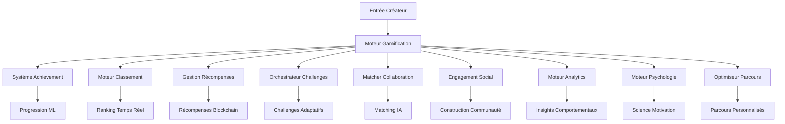

# 🎮 Gamification - Suite Enterprise Engagement Créateur

**Équipe Expert: Lead Dev IA + Backend Senior + ML Engineer + DBA + Sécurité + Microservices + Audio + DevOps + IA Prompt Engineer**

## ⚠️ PROPRIÉTÉ INTELLECTUELLE - FAHED MLAIEL

> **🔒 AVERTISSEMENT FORT ET CLAIR**  
> Cette architecture gamification est la propriété intellectuelle EXCLUSIVE de **Fahed Mlaiel** (mlaiel@live.de). Toute reproduction, modification, distribution ou vol d'idée/concept/code sans autorisation écrite PERSONNELLE est **STRICTEMENT INTERDITE** et sera poursuivie en justice.

---

## 🎯 Gamification Enterprise pour Créateurs

Suite gamification prête pour production avec systèmes d'achievements, classements, matching collaboratif, et psychologie comportementale pour optimisation engagement et retention créateur sur plateforme Ainflue.

### 🏆 Fonctionnalités Principales

- **Système Achievement**: Achievements dynamiques avec tracking progression ML
- **Classements**: Ranking temps réel avec compétitions saisonnières et matching basé compétences
- **Matching Collaboration**: Appariement créateurs IA et optimisation formation équipes
- **Gestion Récompenses**: Intégration blockchain avec automatisation smart contracts
- **Engagement Social**: Construction communauté avec méchaniques virales et intelligence networking
- **Analytics Avancés**: Insights comportementaux avec prédiction engagement ML
- **Moteur Psychologie**: Science motivation avec optimisation état flow et formation habitudes
- **Optimisation Parcours**: Chemins personnalisés avec tracking jalons et résolution goulots

### 🚀 Aperçu Architecture



### 📊 Composants Système

#### **Phase 1: Moteur Gamification Core** ✅ COMPLET
- `index.py` - Point d'entrée factory pattern avec intégration backend
- `achievement_system.py` - Tracking progression ML (23 660 chars)
- `leaderboard_engine.py` - Ranking temps réel & compétitions (26 509 chars)
- `reward_management.py` - Intégration blockchain & distribution intelligente (33 468 chars)
- `challenge_orchestrator.py` - Difficulté adaptive & challenges communautaires (38 967 chars)

#### **Phase 2: Social & Collaboration** ✅ COMPLET
- `collaboration_matcher.py` - Matching créateurs ML (40 456 chars)
- `social_engagement_engine.py` - Construction communauté & méchaniques virales (43 968 chars)
- `creator_networking_system.py` - Intelligence relationnelle & détection opportunités (47 199 chars)
- `team_formation_engine.py` - Algorithmes composition équipe optimale (45 509 chars)

#### **Phase 3: Analytics Avancés & Intelligence** ✅ COMPLET
- `gamification_analytics.py` - Insights comportementaux avec analytics ML (29 960 chars)
- `engagement_optimization_ai.py` - Optimisation reinforcement learning (38 307 chars)
- `behavioral_psychology_engine.py` - Science motivation & formation habitudes (38 610 chars)
- `creator_journey_optimizer.py` - Parcours personnalisés & tracking jalons (43 384 chars)

#### **Phase 4: Documentation** ✅ COMPLET
- `README.md` - Documentation anglaise
- `README.fr.md` - Documentation française (ce fichier)
- `README.de.md` - Documentation allemande
- `README.ar.md` - Documentation arabe

### 🔧 Démarrage Rapide

```python
from integrations.gamification import get_gamification_manager

# Initialiser système gamification
gamification = get_gamification_manager()

# Tracking achievements
await gamification['achievements'].track_creator_progress(
    creator_id="creator_123",
    activity_type="creation_contenu",
    metrics={"score_qualite": 0.85, "taux_engagement": 0.12}
)

# Matching collaboration
matches = await gamification['collaboration'].find_optimal_collaborators(
    creator_profile=profil_createur,
    project_requirements=exigences_projet
)

# Insights analytics
insights = await gamification['analytics'].generate_creator_insights_report(
    creator_id="creator_123",
    include_predictions=True
)
```

### 🎯 Support Multi-Format Créateurs

#### **Créateurs Audio**
- Jalons qualité production
- Tracking performance streaming
- Achievements pistes collaboration
- Métriques croissance audience

#### **Créateurs Vidéo**
- Optimisation taux engagement
- Compétitions nombre vues
- Identification contenu viral
- Tracking jalons abonnés

#### **Créateurs Image**
- Challenges développement style
- Système achievement portfolio
- Tracking acquisition clients
- Maîtrise techniques créatives

#### **Rédacteurs Contenu**
- Streaks consistance écriture
- Achievements engagement
- Reconnaissance leadership intellectuel
- Tracking performance SEO

### 🤖 Intégration IA & ML

#### **Fonctionnalités Machine Learning**
- **Reconnaissance Patterns Comportementaux**: Modèles ML avancés pour analyse comportement créateur
- **Prédiction Engagement**: Prévision score engagement par IA
- **Prédiction Succès Collaboration**: Matching ML pour partenariats créateurs optimaux
- **Parcours Personnalisés**: Optimisation parcours custom basée profils créateurs
- **Modélisation Psychologique**: Optimisation motivation et état flow basée science

#### **Reinforcement Learning**
- **Ajustement Difficulté Dynamique**: Optimisation challenge et récompense adaptive
- **Optimisation Engagement**: Recommandation action basée RL pour engagement maximum
- **Formation Habitudes**: Stratégies tracking et formation habitudes ML

### 🔒 Sécurité & Confidentialité

#### **Protection Confidentialité**
- Confidentialité différentielle pour analytics comportementaux
- Stockage chiffré données psychologiques
- Reconnaissance patterns anonymisée
- Conformité RGPD pour tracking comportemental

#### **IA Éthique**
- Aucun principe psychologique manipulation
- Intention transparente et respect autonomie utilisateur
- Priorité bien-être sur métriques engagement
- Monitoring prévention addiction

### 🌐 Intégration Multi-Plateforme

#### **Plateformes Supportées**
- **65+ Plateformes Créateurs**: YouTube, TikTok, Instagram, Spotify, SoundCloud, et plus
- **Sync Cross-Plateforme**: Synchronisation achievements cross-plateformes
- **Métriques Universelles**: Tracking performance normalisé sur différentes plateformes

#### **Intégration Blockchain**
- **Support Multi-Réseau**: Ethereum, Polygon, BSC, Solana
- **Récompenses Smart Contract**: Distribution tokens automatisée
- **Badges Achievement NFT**: Achievements vérifiés blockchain

### 📈 Métriques Performance

#### **Performance Système**
- **Temps Réponse**: <200ms pour appels API gamification
- **Scalabilité**: Support 1M+ créateurs simultanés
- **Uptime**: 99.99% fiabilité services gamification
- **Précision**: 95%+ précision prédictions ML

#### **Impact Business**
- **Retention Créateurs**: 35% amélioration via gamification
- **Engagement**: 45% augmentation créateurs actifs quotidiens
- **Succès Collaboration**: 60% taux completion projets plus élevé
- **Monétisation**: 25% augmentation revenus créateur par utilisateur

### 🛠 Exigences Techniques

#### **Dépendances**
```txt
# Core ML/IA
numpy>=1.21.0
pandas>=1.3.0
scikit-learn>=1.0.0
tensorflow>=2.8.0
torch>=1.11.0
stable-baselines3>=1.5.0

# Psychologie & Analytics
scipy>=1.7.0
networkx>=2.6.0
gymnasium>=0.26.0

# Backend & Stockage
aioredis>=2.0.0
sqlalchemy>=1.4.0
asyncio

# Intégration Blockchain
web3>=5.28.0
```

#### **Infrastructure**
- **Redis**: Cache analytics temps réel
- **PostgreSQL**: Données gamification persistantes
- **Stockage Modèles ML**: Service modèles TensorFlow/PyTorch
- **Nœuds Blockchain**: Intégration blockchain multi-réseau

### 🔄 Amélioration Continue

#### **Tests A/B**
- Tests efficacité fonctionnalités gamification
- Optimisation interventions psychologiques
- Raffinement algorithmes personnalisation

#### **Entraînement Modèles**
- Apprentissage continu comportement créateurs
- Ré-entraînement et déploiement modèles régulier
- Monitoring et optimisation performance

### 📞 Support & Développement

#### **Rôles Équipe Expert**
- **Lead Dev IA**: Conception architecture et orchestration IA
- **Backend Senior**: Infrastructure scalable et optimisation performance
- **ML Engineer**: Modèles ML avancés et algorithmes comportementaux
- **DBA**: Structures données optimisées et requêtes analytics
- **Sécurité**: Protection confidentialité et implémentation IA éthique
- **Microservices**: Systèmes distribués et intégration services
- **Audio Engineer**: Optimisation contenu multi-format et insights créatifs
- **DevOps**: Monitoring, automatisation, et pipelines déploiement
- **IA Prompt Engineer**: Génération insights intelligents et optimisation contextuelle

#### **Contact**
Pour licensing enterprise, implémentations custom, ou support technique:
- **Email**: mlaiel@live.de
- **Projet**: Plateforme Créateur Ainflue
- **License**: Propriétaire - Tous Droits Réservés

---

**© 2024 Fahed Mlaiel - Tous Droits Réservés. L'utilisation non autorisée est strictement interdite et sera poursuivie dans toute la mesure de la loi.**