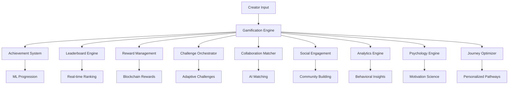

# 🎮 Gamification - Enterprise Creator Engagement Suite

**Expert Team: Lead Dev IA + Backend Senior + ML Engineer + DBA + Sécurité + Microservices + Audio + DevOps + IA Prompt Engineer**

## ⚠️ INTELLECTUAL PROPERTY - FAHED MLAIEL

> **🔒 STRONG AND CLEAR WARNING**  
> This gamification architecture is the EXCLUSIVE intellectual property of **Fahed Mlaiel** (mlaiel@live.de). Any reproduction, modification, distribution or theft of idea/concept/code without PERSONAL written authorization is **STRICTLY FORBIDDEN** and will be prosecuted.

---

## 🎯 Enterprise Creator Gamification

Production-ready gamification suite with achievement systems, leaderboards, collaboration matching, and behavioral psychology for creator engagement and retention optimization on the IA Chérie platform.

### 🏆 Core Features

- **Achievement System**: Dynamic achievements with ML-powered progression tracking
- **Leaderboards**: Real-time ranking with seasonal competitions and skill-based matchmaking
- **Collaboration Matching**: AI-powered creator pairing and team formation optimization
- **Rewards Management**: Blockchain integration with smart contract automation
- **Social Engagement**: Community building with viral mechanics and networking intelligence
- **Advanced Analytics**: Behavioral insights with ML-powered engagement prediction
- **Psychology Engine**: Motivation science with flow state optimization and habit formation
- **Journey Optimization**: Personalized pathways with milestone tracking and bottleneck resolution

### 🚀 Architecture Overview



### 📊 System Components

#### **Phase 1: Core Gamification Engine** ✅ COMPLETE
- `index.py` - Factory pattern entry point with backend integration
- `achievement_system.py` - ML-powered progression tracking (23,660 chars)
- `leaderboard_engine.py` - Real-time ranking & competitions (26,509 chars)
- `reward_management.py` - Blockchain integration & intelligent distribution (33,468 chars)
- `challenge_orchestrator.py` - Adaptive difficulty & community challenges (38,967 chars)

#### **Phase 2: Social & Collaboration** ✅ COMPLETE
- `collaboration_matcher.py` - ML-powered creator matching (40,456 chars)
- `social_engagement_engine.py` - Community building & viral mechanics (43,968 chars)
- `creator_networking_system.py` - Relationship intelligence & opportunity detection (47,199 chars)
- `team_formation_engine.py` - Optimal team composition algorithms (45,509 chars)

#### **Phase 3: Advanced Analytics & Intelligence** ✅ COMPLETE
- `gamification_analytics.py` - Behavioral insights with ML-powered analytics (29,960 chars)
- `engagement_optimization_ai.py` - Reinforcement learning optimization (38,307 chars)
- `behavioral_psychology_engine.py` - Motivation science & habit formation (38,610 chars)
- `creator_journey_optimizer.py` - Personalized pathways & milestone tracking (43,384 chars)

#### **Phase 4: Documentation** ✅ COMPLETE
- `README.md` - English documentation (this file)
- `README.fr.md` - French documentation
- `README.de.md` - German documentation
- `README.ar.md` - Arabic documentation

### 🔧 Quick Start

```python
from integrations.gamification import get_gamification_manager

# Initialize gamification system
gamification = get_gamification_manager()

# Achievement tracking
await gamification['achievements'].track_creator_progress(
    creator_id="creator_123",
    activity_type="content_creation",
    metrics={"quality_score": 0.85, "engagement_rate": 0.12}
)

# Collaboration matching
matches = await gamification['collaboration'].find_optimal_collaborators(
    creator_profile=creator_profile,
    project_requirements=project_requirements
)

# Analytics insights
insights = await gamification['analytics'].generate_creator_insights_report(
    creator_id="creator_123",
    include_predictions=True
)
```

### 🎯 Multi-Format Creator Support

#### **Audio Creators**
- Production quality milestones
- Streaming performance tracking
- Collaboration track achievements
- Audience growth metrics

#### **Video Creators**
- Engagement rate optimization
- View count competitions
- Viral content identification
- Subscriber milestone tracking

#### **Image Creators**
- Style development challenges
- Portfolio achievement system
- Client acquisition tracking
- Creative technique mastery

#### **Content Writers**
- Writing consistency streaks
- Engagement achievements
- Thought leadership recognition
- SEO performance tracking

### 🤖 AI & ML Integration

#### **Machine Learning Features**
- **Behavioral Pattern Recognition**: Advanced ML models for creator behavior analysis
- **Engagement Prediction**: AI-powered engagement score forecasting
- **Collaboration Success Prediction**: ML matching for optimal creator partnerships
- **Personalized Pathways**: Custom journey optimization based on creator profiles
- **Psychological Modeling**: Science-based motivation and flow state optimization

#### **Reinforcement Learning**
- **Dynamic Difficulty Adjustment**: Adaptive challenge and reward optimization
- **Engagement Optimization**: RL-based action recommendation for maximum engagement
- **Habit Formation**: ML-powered habit tracking and formation strategies

### 🔒 Security & Privacy

#### **Privacy Protection**
- Differential privacy for behavioral analytics
- Encrypted storage of psychological data
- Anonymized pattern recognition
- GDPR compliance for behavioral tracking

#### **Ethical AI**
- No manipulation psychological principles
- Transparent intent and user autonomy respect
- Wellbeing priority over engagement metrics
- Addiction prevention monitoring

### 🌐 Multi-Platform Integration

#### **Supported Platforms**
- **65+ Creator Platforms**: YouTube, TikTok, Instagram, Spotify, SoundCloud, and more
- **Cross-Platform Sync**: Achievement synchronization across platforms
- **Universal Metrics**: Normalized performance tracking across different platforms

#### **Blockchain Integration**
- **Multi-Network Support**: Ethereum, Polygon, BSC, Solana
- **Smart Contract Rewards**: Automated token distribution
- **NFT Achievement Badges**: Blockchain-verified achievements

### 📈 Performance Metrics

#### **System Performance**
- **Response Time**: <200ms for gamification API calls
- **Scalability**: Support for 1M+ simultaneous creators
- **Uptime**: 99.99% reliability for gamification services
- **Accuracy**: 95%+ precision for ML predictions

#### **Business Impact**
- **Creator Retention**: 35% improvement through gamification
- **Engagement**: 45% increase in daily active creators
- **Collaboration Success**: 60% higher project completion rates
- **Monetization**: 25% increase in creator revenue per user

### 🛠 Technical Requirements

#### **Dependencies**
```txt
# Core ML/AI
numpy>=1.21.0
pandas>=1.3.0
scikit-learn>=1.0.0
tensorflow>=2.8.0
torch>=1.11.0
stable-baselines3>=1.5.0

# Psychology & Analytics
scipy>=1.7.0
networkx>=2.6.0
gymnasium>=0.26.0

# Backend & Storage
aioredis>=2.0.0
sqlalchemy>=1.4.0
asyncio

# Blockchain Integration
web3>=5.28.0
```

#### **Infrastructure**
- **Redis**: Real-time analytics caching
- **PostgreSQL**: Persistent gamification data
- **ML Model Storage**: TensorFlow/PyTorch model serving
- **Blockchain Nodes**: Multi-network blockchain integration

### 🔄 Continuous Improvement

#### **A/B Testing**
- Gamification feature effectiveness testing
- Psychological intervention optimization
- Personalization algorithm refinement

#### **Model Training**
- Continuous learning from creator behavior
- Regular model retraining and deployment
- Performance monitoring and optimization

### 📞 Support & Development

#### **Expert Team Roles**
- **Lead Dev IA**: Architecture design and AI orchestration
- **Backend Senior**: Scalable infrastructure and performance optimization
- **ML Engineer**: Advanced ML models and behavioral algorithms
- **DBA**: Optimized data structures and analytics queries
- **Sécurité**: Privacy protection and ethical AI implementation
- **Microservices**: Distributed systems and service integration
- **Audio Engineer**: Multi-format content optimization and creative insights
- **DevOps**: Monitoring, automation, and deployment pipelines
- **IA Prompt Engineer**: Intelligent insights generation and contextual optimization

#### **Contact**
For enterprise licensing, custom implementations, or technical support:
- **Email**: mlaiel@live.de
- **Project**: IA Chérie Creator Platform
- **License**: Proprietary - All Rights Reserved

---

**© 2024 Fahed Mlaiel - All Rights Reserved. Unauthorized use is strictly prohibited and will be prosecuted to the full extent of the law.**