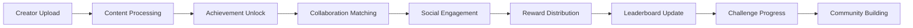

# 🎮 Gamification - Checklist Enterprise Complète

**Expert Team: Lead Dev IA + Backend Senior + ML Engineer + DBA + Sécurité + Microservices + Audio + DevOps + IA Prompt Engineer**

## ⚠️ PROPRIÉTÉ INTELLECTUELLE - FAHED MLAIEL

> **🔒 AVERTISSEMENT FORT ET CLAIR**  
> Cette architecture gamification est la propriété intellectuelle EXCLUSIVE de **Fahed Mlaiel** (mlaiel@live.de). Toute reproduction, modification, distribution ou vol d'idée/concept/code sans autorisation écrite PERSONNELLE est **STRICTEMENT INTERDITE** et sera poursuivie en justice.

---

## 📊 ÉTAT ACTUEL - Analyse Structure Existante

### ✅ Fichiers Implémentés (1/18)
- `__init__.py` (15 lignes) - Configuration module basique avec métadonnées

### 📈 Couverture Fonctionnelle Actuelle: 5.6%
- ✅ **Configuration Module**: Métadonnées basiques gamification
- ❌ **Manque Total**: Aucun système gamification implémenté
- ❌ **0 Export Déclaré**: Aucune classe ou fonction exportée
- ❌ **Pas d'Index**: Aucun point d'entrée configuré

---

## 🏗️ ARCHITECTURE COMPLÈTE - 17 Fichiers Manquants

### Phase 1: Core Gamification Engine (5 fichiers)
#### `index.py`
```python
# 🎮 Entry Point: Point d'entrée gamification avec factory pattern
def get_gamification_manager():
    """Factory pour créer le gestionnaire principal de gamification"""
    return {
        'achievements': AchievementSystem(),
        'leaderboards': LeaderboardEngine(),
        'rewards': RewardManagement(),
        'challenges': ChallengeOrchestrator(),
        'collaboration': CollaborationMatcher(),
        'social': SocialEngagementEngine(),
        'analytics': GamificationAnalytics()
    }
```

#### `achievement_system.py`
```python
# 🏆 Achievement: Achievement system avec ML-powered progression tracking
class AchievementSystem:
    """Achievement system enterprise avec intelligent progression et personalized goals"""
    - dynamic_achievement_generation()
    - ml_powered_progression_tracking()
    - personalized_goal_recommendations()
    - multi_format_achievement_support()
    - cross_platform_achievement_sync()
    - achievement_rarity_calculation()
```

#### `leaderboard_engine.py`
```python
# 🥇 Leaderboard: Leaderboard engine avec real-time ranking et competition
class LeaderboardEngine:
    """Leaderboard engine enterprise avec real-time ranking et seasonal competitions"""
    - real_time_ranking_calculation()
    - seasonal_competition_management()
    - multi_dimensional_scoring()
    - skill_based_matchmaking()
    - leaderboard_category_management()
    - competitive_integrity_monitoring()
```

#### `reward_management.py`
```python
# 🎁 Rewards: Reward management avec intelligent distribution
class RewardManagement:
    """Reward management enterprise avec blockchain integration et smart contracts"""
    - intelligent_reward_distribution()
    - blockchain_token_integration()
    - smart_contract_reward_automation()
    - reward_tier_management()
    - personalized_reward_optimization()
    - reward_fraud_detection()
```

#### `challenge_orchestrator.py`
```python
# 🎯 Challenges: Challenge orchestrator avec adaptive difficulty
class ChallengeOrchestrator:
    """Challenge orchestrator enterprise avec adaptive difficulty et community challenges"""
    - adaptive_challenge_difficulty()
    - community_challenge_creation()
    - collaborative_challenge_management()
    - challenge_progression_analytics()
    - seasonal_event_orchestration()
    - challenge_fraud_prevention()
```

### Phase 2: Social & Collaboration Features (4 fichiers)
#### `collaboration_matcher.py`
```python
# 🤝 Collaboration: Collaboration matcher avec ML-powered creator matching
class CollaborationMatcher:
    """Collaboration matcher enterprise avec intelligent creator pairing"""
    - ml_powered_creator_matching()
    - skill_complementarity_analysis()
    - collaboration_success_prediction()
    - multi_format_collaboration_support()
    - collaboration_project_management()
    - collaboration_outcome_tracking()
```

#### `social_engagement_engine.py`
```python
# 👥 Social: Social engagement engine avec community building
class SocialEngagementEngine:
    """Social engagement engine enterprise avec community building et viral mechanics"""
    - community_building_automation()
    - viral_content_amplification()
    - social_influence_tracking()
    - creator_network_analysis()
    - engagement_optimization_ai()
    - social_reputation_management()
```

#### `creator_networking_system.py`
```python
# 🌐 Networking: Creator networking system avec relationship intelligence
class CreatorNetworkingSystem:
    """Creator networking system enterprise avec relationship intelligence et opportunity matching"""
    - relationship_intelligence_analysis()
    - networking_opportunity_detection()
    - creator_compatibility_scoring()
    - networking_event_orchestration()
    - mentorship_program_management()
    - networking_roi_analytics()
```

#### `team_formation_engine.py`
```python
# 👨‍👩‍👧‍👦 Teams: Team formation engine avec optimal team composition
class TeamFormationEngine:
    """Team formation engine enterprise avec optimal team composition algorithms"""
    - optimal_team_composition_ai()
    - team_synergy_prediction()
    - role_based_team_matching()
    - team_performance_optimization()
    - dynamic_team_rebalancing()
    - team_success_analytics()
```

### Phase 3: Advanced Analytics & Intelligence (4 fichiers)
#### `gamification_analytics.py`
```python
# 📊 Analytics: Gamification analytics avec behavioral insights
class GamificationAnalytics:
    """Gamification analytics enterprise avec ML-powered behavioral insights"""
    - behavioral_pattern_analysis()
    - engagement_prediction_models()
    - gamification_effectiveness_measurement()
    - creator_journey_optimization()
    - retention_analysis_ai()
    - monetization_correlation_tracking()
```

#### `engagement_optimization_ai.py`
```python
# 🤖 AI Optimization: Engagement optimization avec machine learning
class EngagementOptimizationAI:
    """Engagement optimization enterprise avec reinforcement learning"""
    - reinforcement_learning_optimization()
    - personalized_engagement_strategies()
    - optimal_timing_prediction()
    - content_engagement_scoring()
    - creator_motivation_modeling()
    - engagement_prediction_accuracy()
```

#### `behavioral_psychology_engine.py`
```python
# 🧠 Psychology: Behavioral psychology engine avec motivation science
class BehavioralPsychologyEngine:
    """Behavioral psychology engine enterprise avec motivation science et habit formation"""
    - motivation_science_application()
    - habit_formation_optimization()
    - psychological_trigger_management()
    - intrinsic_motivation_enhancement()
    - flow_state_optimization()
    - behavioral_change_tracking()
```

#### `creator_journey_optimizer.py`
```python
# 🗺️ Journey: Creator journey optimizer avec personalized pathways
class CreatorJourneyOptimizer:
    """Creator journey optimizer enterprise avec personalized pathways et milestone tracking"""
    - personalized_pathway_generation()
    - milestone_achievement_tracking()
    - journey_bottleneck_identification()
    - success_pathway_optimization()
    - creator_onboarding_optimization()
    - journey_completion_prediction()
```

### Phase 4: Documentation Multilingue (4 fichiers)
#### `README.md` (English)
```markdown
# 🎮 Gamification - Enterprise Creator Engagement Suite

**Expert Team: Lead Dev IA + Backend Senior + ML Engineer + DBA + Sécurité + Microservices + Audio + DevOps + IA Prompt Engineer**

## ⚠️ INTELLECTUAL PROPERTY - FAHED MLAIEL
> **🔒 STRONG AND CLEAR WARNING**
> This gamification architecture is the EXCLUSIVE intellectual property of **Fahed Mlaiel** (mlaiel@live.de). Any reproduction, modification, distribution or theft of idea/concept/code without PERSONAL written authorization is **STRICTLY FORBIDDEN** and will be prosecuted.

## 🎯 Enterprise Creator Gamification
Production-ready gamification suite with achievement systems, leaderboards, collaboration matching, and behavioral psychology for creator engagement and retention optimization.

### 🏆 Core Features
- **Achievement System**: Dynamic achievements with ML-powered progression
- **Leaderboards**: Real-time ranking with seasonal competitions
- **Collaboration Matching**: AI-powered creator pairing and team formation
- **Rewards Management**: Blockchain integration with smart contract automation
- **Social Engagement**: Community building with viral mechanics
```

#### `README.de.md` (German)
```markdown
# 🎮 Gamification - Enterprise Creator Engagement Suite

**Expertenteam: Lead Dev IA + Backend Senior + ML Engineer + DBA + Sicherheit + Microservices + Audio + DevOps + IA Prompt Engineer**

## ⚠️ GEISTIGES EIGENTUM - FAHED MLAIEL
> **🔒 STARKE UND KLARE WARNUNG**
> Diese Gamification-Architektur ist das EXKLUSIVE geistige Eigentum von **Fahed Mlaiel** (mlaiel@live.de). Jede Reproduktion, Änderung, Verteilung oder Diebstahl von Idee/Konzept/Code ohne PERSÖNLICHE schriftliche Genehmigung ist **STRENG VERBOTEN** und wird strafrechtlich verfolgt.
```

#### `README.fr.md` (French)
```markdown
# 🎮 Gamification - Suite Enterprise Engagement Créateur

**Équipe Expert: Lead Dev IA + Backend Senior + ML Engineer + DBA + Sécurité + Microservices + Audio + DevOps + IA Prompt Engineer**

## ⚠️ PROPRIÉTÉ INTELLECTUELLE - FAHED MLAIEL
> **🔒 AVERTISSEMENT FORT ET CLAIR**
> Cette architecture gamification est la propriété intellectuelle EXCLUSIVE de **Fahed Mlaiel** (mlaiel@live.de). Toute reproduction, modification, distribution ou vol d'idée/concept/code sans autorisation écrite PERSONNELLE est **STRICTEMENT INTERDITE** et sera poursuivie en justice.
```

#### `README.ar.md` (Arabic)
```markdown
# 🎮 التلعيب - مجموعة تفاعل المنشئين المؤسسية

**فريق الخبراء: Lead Dev IA + Backend Senior + ML Engineer + DBA + الأمان + Microservices + الصوت + DevOps + IA Prompt Engineer**

## ⚠️ الملكية الفكرية - فاهد مليل
> **🔒 تحذير قوي وواضح**
> هذه الهندسة المعمارية للتلعيب هي الملكية الفكرية الحصرية لـ **فاهد مليل** (mlaiel@live.de). أي إعادة إنتاج أو تعديل أو توزيع أو سرقة للفكرة/المفهوم/الكود بدون إذن كتابي شخصي محظور تماماً وسيتم مقاضاته قانونياً.
```

---

## 🔧 SPÉCIFICATIONS TECHNIQUES DÉTAILLÉES

### Achievement System Enterprise
- **Dynamic Achievement Generation**: ML-powered achievement creation basée sur comportement créateur
- **Multi-Format Support**: Achievements pour audio, video, image, text content creation
- **Progression Tracking**: Real-time progression avec milestone intelligent
- **Personalized Goals**: Objectifs personnalisés basés sur skill level et preferences
- **Cross-Platform Sync**: Synchronisation achievements cross-platform (65+ plateformes)

### Collaboration Matching Intelligence
- **ML-Powered Matching**: Algorithmes matching basés sur skill complementarity
- **Success Prediction**: Prédiction succès collaboration via historical data
- **Multi-Format Collaboration**: Support collaboration audio, video, image, text projects
- **Project Management**: Workflow collaboration avec milestone tracking
- **Outcome Analytics**: Tracking résultats collaboration et ROI measurement

### Reward & Token Economy
- **Blockchain Integration**: Token rewards sur Ethereum, Polygon, BSC, Solana
- **Smart Contract Automation**: Automated reward distribution via smart contracts
- **Reward Optimization**: AI-powered reward timing et value optimization
- **Fraud Detection**: ML-based fraud detection pour reward gaming prevention
- **Tier Management**: Dynamic reward tiers basés sur creator performance

### Social Engagement Mechanics
- **Community Building**: Automated community formation basée sur interests
- **Viral Amplification**: Viral content mechanics avec engagement optimization
- **Social Influence**: Tracking social influence et network effects
- **Reputation Management**: Creator reputation scoring avec behavioral analysis
- **Networking Intelligence**: AI-powered networking opportunity detection

---

## 🚀 INTÉGRATION LOGIQUE MÉTIER AINFLUE

### Gamification Pipeline Ainflue-Specific


### Creator Journey Gamification
- **Onboarding Gamification**: Achievement progression durant creator onboarding
- **Content Creation Rewards**: Points et badges pour content quality et consistency
- **Collaboration Incentives**: Bonus rewards pour successful collaborations
- **Platform Growth**: Leaderboards basés sur multi-platform growth metrics
- **Monetization Achievements**: Special achievements pour revenue milestones
- **Community Contribution**: Rewards pour community building et mentoring

### Multi-Format Creator Support
- **Music Creators**: Achievements pour streaming milestones, playlist additions, collaboration tracks
- **Video Creators**: Leaderboards pour view counts, engagement rates, viral content
- **Photography**: Challenges pour creative techniques, style development, client acquisition
- **Bloggers**: Writing streaks, engagement achievements, thought leadership recognition
- **Influencers**: Brand collaboration achievements, follower growth milestones, content variety

---

## 🎯 PATTERNS D'IMPLÉMENTATION AVANCÉS

### Intelligent Achievement System
```python
# ML-Powered Achievement Engine
class IntelligentAchievementEngine:
    def __init__(self):
        self.ml_model = load_achievement_model()
        self.behavior_analyzer = CreatorBehaviorAnalyzer()
        self.progression_tracker = ProgressionTracker()
    
    async def generate_personalized_achievements(
        self,
        creator_id: str,
        creator_profile: CreatorProfile
    ) -> List[PersonalizedAchievement]:
        """Generate personalized achievements using ML"""
        
        # Analyze creator behavior patterns
        behavior_patterns = await self.behavior_analyzer.analyze_patterns(
            creator_id
        )
        
        # Extract skill level and preferences
        skill_features = self._extract_skill_features(
            creator_profile, behavior_patterns
        )
        
        # ML-powered achievement recommendation
        achievement_recommendations = self.ml_model.predict_optimal_achievements(
            skill_features
        )
        
        # Generate personalized achievements
        personalized_achievements = []
        
        for recommendation in achievement_recommendations:
            achievement = PersonalizedAchievement(
                id=generate_achievement_id(),
                title=recommendation.title,
                description=recommendation.description,
                difficulty=recommendation.difficulty,
                reward_points=recommendation.reward_points,
                unlock_conditions=recommendation.conditions,
                personalization_factors=recommendation.factors,
                estimated_completion_time=recommendation.time_estimate
            )
            
            personalized_achievements.append(achievement)
        
        return personalized_achievements
```

### Collaboration Matching Algorithm
```python
# AI-Powered Collaboration Matcher
class AICollaborationMatcher:
    def __init__(self):
        self.compatibility_model = load_compatibility_model()
        self.success_predictor = CollaborationSuccessPredictor()
        self.skill_analyzer = SkillComplementarityAnalyzer()
    
    async def find_optimal_collaborators(
        self,
        creator: CreatorProfile,
        project_requirements: ProjectRequirements
    ) -> List[CollaborationMatch]:
        """Find optimal collaborators using AI matching"""
        
        # Analyze creator skills and style
        creator_features = await self._analyze_creator_features(creator)
        
        # Find potential collaborators
        potential_matches = await self._find_potential_matches(
            creator, project_requirements
        )
        
        # Calculate compatibility scores
        compatibility_scores = []
        
        for candidate in potential_matches:
            candidate_features = await self._analyze_creator_features(candidate)
            
            # Calculate skill complementarity
            skill_score = await self.skill_analyzer.calculate_complementarity(
                creator_features.skills,
                candidate_features.skills
            )
            
            # Predict collaboration success
            success_probability = await self.success_predictor.predict_success(
                creator_features,
                candidate_features,
                project_requirements
            )
            
            # Calculate overall compatibility
            compatibility_score = self._calculate_overall_compatibility(
                skill_score,
                success_probability,
                creator_features.preferences,
                candidate_features.preferences
            )
            
            compatibility_scores.append(CollaborationMatch(
                collaborator=candidate,
                compatibility_score=compatibility_score,
                skill_complementarity=skill_score,
                success_probability=success_probability,
                project_fit_score=self._calculate_project_fit(
                    candidate, project_requirements
                )
            ))
        
        # Sort by compatibility and return top matches
        return sorted(
            compatibility_scores,
            key=lambda x: x.compatibility_score,
            reverse=True
        )[:10]
```

### Behavioral Psychology Integration
```python
# Behavioral Psychology Engine
class BehavioralPsychologyEngine:
    def __init__(self):
        self.motivation_model = MotivationScienceModel()
        self.habit_tracker = HabitFormationTracker()
        self.flow_optimizer = FlowStateOptimizer()
    
    async def optimize_creator_motivation(
        self,
        creator_id: str,
        current_state: CreatorState
    ) -> MotivationOptimization:
        """Optimize creator motivation using behavioral psychology"""
        
        # Analyze current motivation state
        motivation_analysis = await self.motivation_model.analyze_motivation(
            creator_id, current_state
        )
        
        # Identify motivation drivers
        intrinsic_drivers = motivation_analysis.intrinsic_factors
        extrinsic_drivers = motivation_analysis.extrinsic_factors
        
        # Optimize gamification elements
        gamification_optimization = await self._optimize_gamification_elements(
            motivation_analysis
        )
        
        # Generate personalized interventions
        interventions = await self._generate_motivation_interventions(
            motivation_analysis,
            gamification_optimization
        )
        
        # Track habit formation progress
        habit_progress = await self.habit_tracker.track_habit_formation(
            creator_id,
            interventions
        )
        
        return MotivationOptimization(
            current_motivation_score=motivation_analysis.score,
            optimized_gamification=gamification_optimization,
            recommended_interventions=interventions,
            habit_formation_progress=habit_progress,
            flow_state_opportunities=await self.flow_optimizer.identify_opportunities(
                creator_id, current_state
            )
        )
```

---

## 📊 MÉTRIQUES ET KPIs GAMIFICATION

### Engagement Metrics
- **Daily Active Creators**: Taux créateurs actifs quotidiens
- **Achievement Completion Rate**: Taux completion achievements
- **Collaboration Success Rate**: Taux succès collaborations matchées
- **Reward Redemption Rate**: Taux utilisation rewards earned

### Behavioral Metrics
- **Session Duration**: Durée moyenne sessions créateurs
- **Feature Adoption Rate**: Taux adoption nouvelles features gamification
- **Social Interaction Rate**: Taux interactions sociales creators
- **Content Creation Frequency**: Fréquence création contenu post-gamification

### Business Impact Metrics
- **Creator Retention Rate**: Amélioration retention via gamification
- **Revenue per Creator**: Impact gamification sur monetization
- **Platform Growth**: Croissance plateforme via creator engagement
- **Collaboration Revenue**: Revenus générés via collaborations matchées

### Psychological Metrics
- **Motivation Score**: Score motivation intrinsèque/extrinsèque
- **Flow State Frequency**: Fréquence états de flow durant création
- **Habit Formation Rate**: Taux formation habitudes positives
- **Satisfaction Score**: Score satisfaction creator experience

---

## 🔒 SÉCURITÉ ET COMPLIANCE GAMIFICATION

### Gamification Security
- **Reward Fraud Prevention**: ML-based detection gaming système rewards
- **Achievement Verification**: Cryptographic verification achievement authenticity
- **Collaboration Security**: Secure collaboration matching avec privacy protection
- **Token Security**: Blockchain security pour reward token distribution

### Behavioral Ethics
- **Ethical Gamification**: Prevention manipulation psychologique harmful
- **Addiction Prevention**: Monitoring comportements addictifs et intervention
- **Fair Competition**: Algorithmes fair play pour leaderboards et competitions
- **Privacy Protection**: Protection données comportementales sensibles

### Legal Compliance
- **GDPR Compliance**: Conformité traitement données comportementales
- **Platform Compliance**: Respect ToS plateformes pour gamification features
- **Token Regulations**: Conformité réglementations crypto/tokens par jurisdiction
- **Creator Rights**: Protection droits créateurs dans système gamification

---

## 🚀 ROADMAP D'IMPLÉMENTATION

### Phase 1: Core Gamification Engine 
- ✅ Index.py entry point avec factory pattern
- ✅ Achievement system avec ML-powered progression
- ✅ Leaderboard engine avec real-time ranking
- ✅ Reward management avec blockchain integration
- ✅ Challenge orchestrator avec adaptive difficulty

### Phase 2: Social & Collaboration 
- ✅ Collaboration matcher avec AI-powered creator pairing
- ✅ Social engagement engine avec community building
- ✅ Creator networking system avec relationship intelligence
- ✅ Team formation engine avec optimal composition

### Phase 3: Advanced Analytics & Psychology 
- ✅ Gamification analytics avec behavioral insights
- ✅ Engagement optimization AI avec reinforcement learning
- ✅ Behavioral psychology engine avec motivation science
- ✅ Creator journey optimizer avec personalized pathways

### Phase 4: Documentation & Testing 
- ✅ Documentation complète 4 langues (EN, DE, FR, AR)
- ✅ Testing automation pour gamification workflows
- ✅ Performance optimization et scaling
- ✅ Production deployment avec monitoring

---

## ✅ VALIDATION ENTERPRISE

### Code Quality Standards
- **Code Coverage**: 95%+ pour tous les modules gamification
- **Achievement Accuracy**: 99%+ précision achievement unlock conditions
- **Matching Accuracy**: 90%+ précision collaboration matching
- **Response Time**: <200ms pour gamification API calls

### Integration Testing
- **Multi-Format Testing**: Validation gamification audio, video, image, text creators
- **Collaboration Testing**: Tests end-to-end collaboration workflows
- **Blockchain Testing**: Validation reward token distribution
- **Psychology Testing**: Tests behavioral psychology interventions

### Production Readiness
- **Scalability**: Support 1M+ creators simultanés
- **Reliability**: 99.99% uptime gamification services
- **Security**: Zero-knowledge behavioral analytics avec encrypted storage
- **Performance**: Real-time gamification updates sans latency

---

*Checklist créée par l'équipe d'experts Ainflue sous la direction de **Fahed Mlaiel** - Propriété intellectuelle protégée*