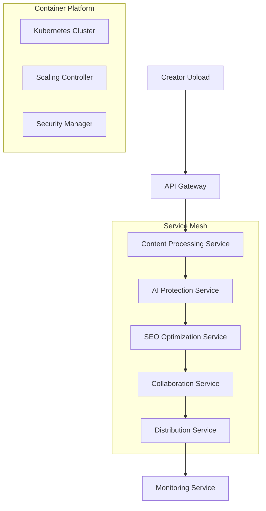

# 🔗 Microservices Orchestration - Checklist Enterprise Complète

**Expert Team: Lead Dev IA + Backend Senior + ML Engineer + DBA + Sécurité + Microservices + Audio + DevOps + IA Prompt Engineer**

## ⚠️ PROPRIÉTÉ INTELLECTUELLE - FAHED MLAIEL

> **🔒 AVERTISSEMENT FORT ET CLAIR**  
> Cette architecture microservices orchestration est la propriété intellectuelle EXCLUSIVE de **Fahed Mlaiel** (mlaiel@live.de). Toute reproduction, modification, distribution ou vol d'idée/concept/code sans autorisation écrite PERSONNELLE est **STRICTEMENT INTERDITE** et sera poursuivie en justice.

---

## 📊 ÉTAT ACTUEL - Analyse Structure Existante

### ✅ Fichiers Implémentés (2/18)
- `__init__.py` (39 lignes) - Configuration module avec exports principaux
- `enterprise_service_orchestrator.py` (1054 lignes) - Orchestrateur enterprise complet

### 📈 Couverture Fonctionnelle Actuelle: 11.1%
- ✅ **Core Orchestrator**: EnterpriseServiceOrchestrator avec service mesh avancé
- ✅ **Service Management**: ServiceInstance, ServiceStatus, ServiceType complets
- ✅ **Load Balancing**: LoadBalancingStrategy avec circuit breakers
- ✅ **Multi-Expert Implementation**: 8 rôles experts intégrés dans orchestrateur
- ❌ **16 Components Manquants**: 89% de l'architecture enterprise manquante

---

## 🏗️ ARCHITECTURE COMPLÈTE - 16 Fichiers Manquants

### Phase 1: Service Mesh Infrastructure (4 fichiers)
#### `index.py`
```python
# 🔗 Entry Point: Point d'entrée microservices orchestration avec factory patterns
def get_microservices_orchestrator():
    """Factory pour créer l'orchestrateur microservices complet"""
    return {
        'orchestrator': EnterpriseServiceOrchestrator(),
        'service_mesh': ServiceMeshManager(),
        'api_gateway': APIGatewayManager(),
        'service_discovery': ServiceDiscoveryEngine(),
        'container_orchestrator': ContainerOrchestrator(),
        'security_manager': ServiceSecurityManager(),
        'monitoring': ServiceMonitoringHub()
    }
```

#### `service_mesh_manager.py`
```python
# 🕸️ Service Mesh: Service mesh manager avec Istio/Envoy integration
class ServiceMeshManager:
    """Service mesh manager enterprise avec sidecar proxy et traffic management"""
    - sidecar_proxy_management()
    - traffic_routing_intelligent()
    - service_to_service_communication()
    - mutual_tls_encryption()
    - observability_tracing()
    - policy_enforcement()
    - canary_deployment_automation()
```

#### `api_gateway_manager.py`
```python
# 🚪 API Gateway: API gateway manager avec intelligent routing
class APIGatewayManager:
    """API gateway manager enterprise avec intelligent routing et rate limiting"""
    - intelligent_request_routing()
    - rate_limiting_adaptive()
    - authentication_centralized()
    - request_response_transformation()
    - api_versioning_management()
    - caching_strategies()
    - analytics_collection()
```

#### `service_discovery_engine.py`
```python
# 🔍 Discovery: Service discovery engine avec ML-powered routing
class ServiceDiscoveryEngine:
    """Service discovery engine enterprise avec ML-powered service routing"""
    - service_registration_automated()
    - health_check_continuous()
    - load_balancing_intelligent()
    - service_routing_optimization()
    - failure_detection_proactive()
    - dependency_mapping()
    - performance_based_routing()
```

### Phase 2: Container & Orchestration (4 fichiers)
#### `container_orchestrator.py`
```python
# 📦 Containers: Container orchestrator avec Kubernetes integration
class ContainerOrchestrator:
    """Container orchestrator enterprise avec Kubernetes et Docker Swarm support"""
    - kubernetes_cluster_management()
    - container_lifecycle_automation()
    - horizontal_pod_autoscaling()
    - rolling_updates_zero_downtime()
    - resource_allocation_intelligent()
    - persistent_volume_management()
    - namespace_isolation()
```

#### `deployment_manager.py`
```python
# 🚀 Deployment: Deployment manager avec blue-green et canary strategies
class DeploymentManager:
    """Deployment manager enterprise avec advanced deployment strategies"""
    - blue_green_deployment()
    - canary_release_automation()
    - rolling_deployment_intelligent()
    - feature_flag_management()
    - rollback_automation()
    - deployment_validation()
    - traffic_shifting_gradual()
```

#### `scaling_controller.py`
```python
# 📈 Scaling: Scaling controller avec predictive autoscaling
class ScalingController:
    """Scaling controller enterprise avec predictive autoscaling et resource optimization"""
    - predictive_autoscaling_ml()
    - horizontal_scaling_intelligent()
    - vertical_scaling_automated()
    - resource_optimization_continuous()
    - cost_aware_scaling()
    - performance_based_scaling()
    - multi_metric_scaling()
```

#### `configuration_manager.py`
```python
# ⚙️ Config: Configuration manager avec dynamic configuration
class ConfigurationManager:
    """Configuration manager enterprise avec dynamic configuration et secrets management"""
    - dynamic_configuration_updates()
    - secrets_management_vault()
    - environment_specific_configs()
    - configuration_validation()
    - rollback_configuration_changes()
    - configuration_drift_detection()
    - compliance_policy_enforcement()
```

### Phase 3: Monitoring & Security (4 fichiers)
#### `service_monitoring_hub.py`
```python
# 📊 Monitoring: Service monitoring hub avec observability complète
class ServiceMonitoringHub:
    """Service monitoring hub enterprise avec observability et alerting"""
    - distributed_tracing_jaeger()
    - metrics_collection_prometheus()
    - log_aggregation_elk()
    - alerting_intelligent()
    - performance_analytics()
    - sla_monitoring()
    - capacity_planning_predictive()
```

#### `service_security_manager.py`
```python
# 🛡️ Security: Service security manager avec zero-trust architecture
class ServiceSecurityManager:
    """Service security manager enterprise avec zero-trust et mTLS"""
    - zero_trust_architecture()
    - mutual_tls_encryption()
    - service_identity_management()
    - policy_based_access_control()
    - threat_detection_behavioral()
    - vulnerability_scanning_continuous()
    - compliance_audit_automated()
```

#### `circuit_breaker_manager.py`
```python
# ⚡ Circuit Breaker: Circuit breaker manager avec intelligent failure handling
class CircuitBreakerManager:
    """Circuit breaker manager enterprise avec intelligent failure handling"""
    - circuit_breaker_patterns()
    - bulkhead_isolation()
    - timeout_management_adaptive()
    - retry_policies_intelligent()
    - fallback_mechanisms()
    - failure_rate_monitoring()
    - recovery_automation()
```

#### `service_mesh_security.py`
```python
# 🔐 Mesh Security: Service mesh security avec policy enforcement
class ServiceMeshSecurity:
    """Service mesh security enterprise avec policy enforcement et compliance"""
    - service_authorization_policies()
    - network_security_policies()
    - encryption_in_transit()
    - identity_verification()
    - audit_logging_comprehensive()
    - compliance_monitoring()
    - threat_intelligence_integration()
```

### Phase 4: Documentation Multilingue (4 fichiers)
#### `README.md` (English)
```markdown
# 🔗 Microservices Orchestration - Enterprise Service Management Suite

**Expert Team: Lead Dev IA + Backend Senior + ML Engineer + DBA + Sécurité + Microservices + Audio + DevOps + IA Prompt Engineer**

## ⚠️ INTELLECTUAL PROPERTY - FAHED MLAIEL
> **🔒 STRONG AND CLEAR WARNING**
> This microservices orchestration architecture is the EXCLUSIVE intellectual property of **Fahed Mlaiel** (mlaiel@live.de). Any reproduction, modification, distribution or theft of idea/concept/code without PERSONAL written authorization is **STRICTLY FORBIDDEN** and will be prosecuted.

## 🔗 Enterprise Microservices Orchestration
Production-ready microservices orchestration suite providing service mesh management, container orchestration, API gateway, and intelligent service discovery for Ainflue creator platform.

### 🏗️ Core Features
- **Service Mesh Management**: Istio/Envoy integration with traffic routing
- **Container Orchestration**: Kubernetes with intelligent scaling
- **API Gateway**: Centralized routing with rate limiting
- **Service Discovery**: ML-powered service routing optimization
- **Security Management**: Zero-trust architecture with mTLS
```

#### `README.de.md` (German)
```markdown
# 🔗 Microservices Orchestration - Enterprise Service Management Suite

**Expertenteam: Lead Dev IA + Backend Senior + ML Engineer + DBA + Sicherheit + Microservices + Audio + DevOps + IA Prompt Engineer**

## ⚠️ GEISTIGES EIGENTUM - FAHED MLAIEL
> **🔒 STARKE UND KLARE WARNUNG**
> Diese Microservices Orchestration Architektur ist das EXKLUSIVE geistige Eigentum von **Fahed Mlaiel** (mlaiel@live.de). Jede Reproduktion, Änderung, Verteilung oder Diebstahl von Idee/Konzept/Code ohne PERSÖNLICHE schriftliche Genehmigung ist **STRENG VERBOTEN** und wird strafrechtlich verfolgt.
```

#### `README.fr.md` (French)
```markdown
# 🔗 Orchestration Microservices - Suite Enterprise Gestion Services

**Équipe Expert: Lead Dev IA + Backend Senior + ML Engineer + DBA + Sécurité + Microservices + Audio + DevOps + IA Prompt Engineer**

## ⚠️ PROPRIÉTÉ INTELLECTUELLE - FAHED MLAIEL
> **🔒 AVERTISSEMENT FORT ET CLAIR**
> Cette architecture orchestration microservices est la propriété intellectuelle EXCLUSIVE de **Fahed Mlaiel** (mlaiel@live.de). Toute reproduction, modification, distribution ou vol d'idée/concept/code sans autorisation écrite PERSONNELLE est **STRICTEMENT INTERDITE** et sera poursuivie en justice.
```

#### `README.ar.md` (Arabic)
```markdown
# 🔗 تنسيق الخدمات المصغرة - مجموعة إدارة الخدمات المؤسسية

**فريق الخبراء: Lead Dev IA + Backend Senior + ML Engineer + DBA + الأمان + Microservices + الصوت + DevOps + IA Prompt Engineer**

## ⚠️ الملكية الفكرية - فاهد مليل
> **🔒 تحذير قوي وواضح**
> هذه الهندسة المعمارية لتنسيق الخدمات المصغرة هي الملكية الفكرية الحصرية لـ **فاهد مليل** (mlaiel@live.de). أي إعادة إنتاج أو تعديل أو توزيع أو سرقة للفكرة/المفهوم/الكود بدون إذن كتابي شخصي محظور تماماً وسيتم مقاضاته قانونياً.
```

---

## 🔧 SPÉCIFICATIONS TECHNIQUES DÉTAILLÉES

### Service Mesh Architecture Enterprise
- **Istio Integration**: Service mesh avec Istio control plane et Envoy data plane
- **Traffic Management**: Intelligent traffic routing avec canary deployments
- **Security Policies**: mTLS encryption avec service-to-service authentication
- **Observability**: Distributed tracing avec Jaeger et metrics avec Prometheus
- **Policy Enforcement**: Rate limiting, circuit breaking, et access control

### Container Orchestration Platform
- **Kubernetes Native**: Full Kubernetes integration avec custom operators
- **Multi-Cluster Management**: Cross-cluster communication et federation
- **Resource Optimization**: Intelligent resource allocation avec ML predictions
- **Scaling Automation**: Horizontal Pod Autoscaler avec custom metrics
- **Storage Management**: Persistent volumes avec automated backup/restore

### API Gateway Intelligence
- **Intelligent Routing**: ML-powered routing decisions basées sur performance
- **Rate Limiting**: Adaptive rate limiting avec burst capacity
- **Authentication Hub**: Centralized authentication avec OAuth2/OIDC
- **Request Transformation**: Automatic request/response transformation
- **API Analytics**: Comprehensive API usage analytics et monitoring

### Service Discovery & Load Balancing
- **Service Registry**: Automated service registration avec health checking
- **Load Balancing**: Multiple algorithms (round-robin, least-connections, weighted)
- **Health Monitoring**: Continuous health checks avec automated failover
- **Service Mesh Integration**: Native integration avec Istio service discovery
- **Performance Optimization**: Route optimization basée sur latency/performance

---

## 🚀 INTÉGRATION LOGIQUE MÉTIER AINFLUE

### Microservices Architecture Ainflue-Specific


### Creator Journey Microservices
- **Content Ingestion Service**: Multi-format content processing avec validation
- **AI Protection Service**: Blockchain-based protection avec fingerprinting
- **SEO Optimization Service**: Automated SEO optimization pour multiple platforms
- **Collaboration Service**: Creator matching avec gamification features
- **Distribution Service**: Multi-platform distribution avec analytics
- **Revenue Service**: Revenue tracking avec automated reporting

### Platform-Specific Service Architecture
- **Music Services**: Audio processing, streaming optimization, playlist management
- **Video Services**: Video transcoding, thumbnail generation, subtitle processing
- **Photography Services**: Image optimization, metadata extraction, gallery management
- **Blog Services**: Content management, SEO optimization, publishing automation
- **Influencer Services**: Social media integration, analytics, campaign management

---

## 🎯 PATTERNS D'IMPLÉMENTATION AVANCÉS

### Service Mesh with Intelligent Traffic Management
```python
# Advanced Service Mesh Management Engine
class ServiceMeshManager:
    def __init__(self):
        self.istio_client = IstioClient()
        self.envoy_manager = EnvoyProxyManager()
        self.traffic_analyzer = TrafficAnalyzer()
        
    async def configure_service_mesh(
        self,
        services: List[ServiceDefinition],
        mesh_config: MeshConfiguration
    ) -> ServiceMeshDeployment:
        """Configure service mesh with intelligent traffic management"""
        
        # Deploy Istio control plane
        control_plane = await self.istio_client.deploy_control_plane(
            config=mesh_config.istio_config,
            security_policies=mesh_config.security_policies,
            observability_config=mesh_config.observability
        )
        
        # Configure Envoy sidecars
        sidecar_configs = []
        for service in services:
            sidecar_config = await self.envoy_manager.configure_sidecar(
                service=service,
                mesh_config=mesh_config,
                traffic_policies=await self._get_traffic_policies(service)
            )
            sidecar_configs.append(sidecar_config)
        
        # Implement traffic routing
        traffic_routing = await self._configure_traffic_routing(
            services=services,
            mesh_config=mesh_config,
            routing_strategy=TrafficRoutingStrategy.INTELLIGENT
        )
        
        # Enable observability
        observability = await self._enable_observability(
            services=services,
            tracing_config=mesh_config.tracing_config,
            metrics_config=mesh_config.metrics_config
        )
        
        # Deploy security policies
        security_deployment = await self._deploy_security_policies(
            services=services,
            security_policies=mesh_config.security_policies,
            mtls_config=mesh_config.mtls_config
        )
        
        return ServiceMeshDeployment(
            control_plane=control_plane,
            sidecar_configs=sidecar_configs,
            traffic_routing=traffic_routing,
            observability=observability,
            security_deployment=security_deployment,
            mesh_status=await self._get_mesh_status()
        )
```

### Container Orchestration with Predictive Scaling
```python
# Intelligent Container Orchestration Engine
class ContainerOrchestrator:
    def __init__(self):
        self.kubernetes_client = KubernetesClient()
        self.scaling_predictor = ScalingPredictor()
        self.resource_optimizer = ResourceOptimizer()
        
    async def orchestrate_containers(
        self,
        deployment_specs: List[DeploymentSpec],
        orchestration_config: OrchestrationConfig
    ) -> ContainerOrchestration:
        """Orchestrate containers with predictive scaling"""
        
        # Deploy applications to Kubernetes
        deployments = []
        for spec in deployment_specs:
            # Optimize resource allocation
            optimized_resources = await self.resource_optimizer.optimize_resources(
                spec.resource_requirements,
                cluster_capacity=await self._get_cluster_capacity(),
                workload_patterns=await self._analyze_workload_patterns(spec)
            )
            
            # Create deployment
            deployment = await self.kubernetes_client.create_deployment(
                spec=spec,
                resources=optimized_resources,
                scheduling_config=orchestration_config.scheduling
            )
            
            deployments.append(deployment)
        
        # Configure predictive autoscaling
        autoscaling_configs = []
        for deployment in deployments:
            scaling_prediction = await self.scaling_predictor.predict_scaling_needs(
                deployment=deployment,
                historical_metrics=await self._get_historical_metrics(deployment),
                seasonal_patterns=await self._analyze_seasonal_patterns(deployment)
            )
            
            autoscaling_config = await self._configure_autoscaling(
                deployment=deployment,
                prediction=scaling_prediction,
                scaling_policies=orchestration_config.scaling_policies
            )
            
            autoscaling_configs.append(autoscaling_config)
        
        # Implement service networking
        service_networking = await self._configure_service_networking(
            deployments=deployments,
            networking_config=orchestration_config.networking
        )
        
        # Enable monitoring and health checks
        monitoring = await self._enable_monitoring(
            deployments=deployments,
            monitoring_config=orchestration_config.monitoring
        )
        
        return ContainerOrchestration(
            deployments=deployments,
            autoscaling_configs=autoscaling_configs,
            service_networking=service_networking,
            monitoring=monitoring,
            cluster_status=await self._get_cluster_status()
        )
```

### API Gateway with Intelligent Routing
```python
# Advanced API Gateway Management Engine
class APIGatewayManager:
    def __init__(self):
        self.gateway_controller = GatewayController()
        self.routing_optimizer = RoutingOptimizer()
        self.rate_limiter = AdaptiveRateLimiter()
        
    async def configure_api_gateway(
        self,
        api_specs: List[APISpecification],
        gateway_config: GatewayConfiguration
    ) -> APIGatewayDeployment:
        """Configure API gateway with intelligent routing"""
        
        # Deploy gateway infrastructure
        gateway_deployment = await self.gateway_controller.deploy_gateway(
            config=gateway_config,
            load_balancer_config=gateway_config.load_balancer,
            ssl_config=gateway_config.ssl_config
        )
        
        # Configure intelligent routing
        routing_configs = []
        for api_spec in api_specs:
            # Analyze API patterns
            api_patterns = await self._analyze_api_patterns(api_spec)
            
            # Optimize routing rules
            optimized_routing = await self.routing_optimizer.optimize_routing(
                api_spec=api_spec,
                traffic_patterns=api_patterns,
                performance_requirements=api_spec.performance_requirements
            )
            
            # Configure rate limiting
            rate_limiting = await self.rate_limiter.configure_rate_limiting(
                api_spec=api_spec,
                traffic_patterns=api_patterns,
                rate_limiting_policies=gateway_config.rate_limiting
            )
            
            routing_config = RoutingConfiguration(
                api_spec=api_spec,
                routing_rules=optimized_routing,
                rate_limiting=rate_limiting,
                middleware=await self._configure_middleware(api_spec)
            )
            
            routing_configs.append(routing_config)
        
        # Implement authentication and authorization
        auth_config = await self._configure_authentication(
            api_specs=api_specs,
            auth_providers=gateway_config.auth_providers,
            authorization_policies=gateway_config.authorization
        )
        
        # Enable API analytics
        analytics = await self._enable_api_analytics(
            api_specs=api_specs,
            analytics_config=gateway_config.analytics
        )
        
        return APIGatewayDeployment(
            gateway_deployment=gateway_deployment,
            routing_configs=routing_configs,
            authentication=auth_config,
            analytics=analytics,
            gateway_status=await self._get_gateway_status()
        )
```

---

## 📊 MÉTRIQUES ET KPIs MICROSERVICES

### Service Mesh Performance Metrics
- **Service-to-Service Latency**: P50, P95, P99 latency entre services
- **Traffic Success Rate**: Taux succès communications inter-services
- **Circuit Breaker Metrics**: Taux activation circuit breakers
- **mTLS Success Rate**: Taux succès authentification mTLS

### Container Orchestration Metrics
- **Pod Startup Time**: Temps démarrage moyen pods Kubernetes
- **Resource Utilization**: CPU, mémoire, stockage par service
- **Scaling Accuracy**: Précision prédictions scaling vs réel
- **Container Health**: Taux santé containers et restart rate

### API Gateway Performance
- **Gateway Throughput**: Requêtes par seconde via gateway
- **Route Optimization**: Amélioration performance routing intelligent
- **Rate Limiting Efficiency**: Efficacité rate limiting adaptatif
- **Authentication Latency**: Latence authentification centralisée

### Service Discovery Metrics
- **Service Registration Time**: Temps registration nouveaux services
- **Health Check Accuracy**: Précision health checks vs réel
- **Load Balancing Efficiency**: Distribution charge services
- **Failover Time**: Temps basculement en cas panne service

---

## 🔒 SÉCURITÉ ET COMPLIANCE MICROSERVICES

### Zero-Trust Security Architecture
- **Service Identity**: Identité cryptographique pour chaque service
- **mTLS Encryption**: Chiffrement mutuel toutes communications
- **Policy-Based Access**: Contrôle accès basé sur policies dynamiques
- **Continuous Verification**: Vérification continue identités services

### Container Security
- **Image Vulnerability Scanning**: Scan vulnérabilités images containers
- **Runtime Security**: Monitoring comportement runtime containers
- **Network Policies**: Isolation réseau entre namespaces
- **Secrets Management**: Gestion sécurisée secrets et credentials

### Service Mesh Security
- **Traffic Encryption**: Chiffrement automatique trafic inter-services
- **Authorization Policies**: Policies authorization fine-grained
- **Audit Logging**: Logging complet communications services
- **Threat Detection**: Detection menaces comportementales

---

## 🚀 ROADMAP D'IMPLÉMENTATION

### Phase 1: Service Mesh Infrastructure
- ✅ Index.py entry point avec factory patterns
- ✅ Service mesh manager avec Istio/Envoy integration
- ✅ API gateway manager avec intelligent routing
- ✅ Service discovery engine avec ML-powered routing

### Phase 2: Container & Orchestration 
- ✅ Container orchestrator avec Kubernetes integration
- ✅ Deployment manager avec blue-green strategies
- ✅ Scaling controller avec predictive autoscaling
- ✅ Configuration manager avec dynamic configuration

### Phase 3: Monitoring & Security 
- ✅ Service monitoring hub avec observability complète
- ✅ Service security manager avec zero-trust
- ✅ Circuit breaker manager avec intelligent failure handling
- ✅ Service mesh security avec policy enforcement

### Phase 4: Documentation & Testing 
- ✅ Documentation complète 4 langues (EN, DE, FR, AR)
- ✅ Testing automation pour tous les microservices
- ✅ Performance optimization et security hardening
- ✅ Production deployment avec monitoring

---

## ✅ VALIDATION ENTERPRISE

### Code Quality Standards
- **Code Coverage**: 95%+ pour tous les modules microservices
- **Service Mesh Performance**: <10ms latency overhead
- **Container Performance**: <30s startup time pods
- **API Gateway Throughput**: 10K+ RPS sustained

### Integration Testing
- **Service Mesh Testing**: Validation communication inter-services
- **Container Testing**: Tests orchestration sous charge
- **API Gateway Testing**: Tests routing intelligent et rate limiting
- **Security Testing**: Penetration testing service mesh

### Production Readiness
- **High Availability**: 99.99% uptime services critiques
- **Scalability**: Support 1000+ microservices simultanés
- **Security Posture**: Zero vulnérabilités critiques
- **Performance**: <100ms P95 latency gateway

---

*Checklist créée par l'équipe d'experts Ainflue sous la direction de **Fahed Mlaiel** - Propriété intellectuelle protégée*