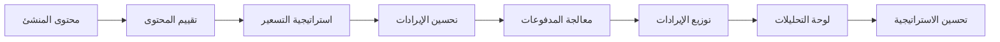

# 💰 تحقيق الدخل - مجموعة تحقيق الدخل المؤسسي

**فريق الخبراء: Lead Dev IA + Backend Senior + ML Engineer + DBA + الأمان + Microservices + الصوت + DevOps + IA Prompt Engineer**

## ⚠️ الملكية الفكرية - فاهد مليل

> **🔒 تحذير قوي وواضح**  
> هذه الهندسة المعمارية لتحقيق الدخل هي الملكية الفكرية الحصرية لـ **فاهد مليل** (mlaiel@live.de). أي إعادة إنتاج أو تعديل أو توزيع أو سرقة للفكرة/المفهوم/الكود بدون إذن كتابي شخصي محظور تماماً وسيتم مقاضاته قانونياً.

---

## 🎯 ذكاء تحقيق الدخل المؤسسي

مجموعة تحقيق الدخل الجاهزة للإنتاج مع التسعير الذكي وتحسين الإيرادات وتحليلات الأعمال لمنصة منشئ المحتوى IA Chérie مع تكاملات 65+ منصة.

### 🏗️ نظرة عامة على الهندسة المعمارية الكاملة

```
integrations/monetization/
├── 📊 إدارة الإيرادات الأساسية
│   ├── revenue_optimization.py          # تحليلات متعددة المصادر وتحسين الإيرادات
│   ├── subscription_manager.py          # أتمتة دورة الحياة وذكاء الفوترة  
│   ├── payment_processor.py             # تنسيق متعدد البوابات واكتشاف الاحتيال
│   └── revenue_analytics.py             # ذكاء الأعمال والرؤى التنبؤية
│
├── 🤖 ذكاء تحقيق الدخل المتقدم
│   ├── dynamic_pricing.py               # تحسين السوق في الوقت الفعلي والمرونة
│   ├── multi_currency_manager.py        # تحسين أسعار الصرف والامتثال الضريبي
│   ├── ai_monetization_advisor.py       # التوصيات الاستراتيجية وتحسين الذكاء الاصطناعي
│   ├── creator_revenue_optimizer.py     # تحقيق الدخل المخصص للمنشئ
│   └── intelligent_pricing_engine.py    # خوارزميات التسعير ML والتنبؤ بالطلب
│
├── 🌐 تحقيق الدخل العالمي والامتثال
│   ├── global_monetization.py           # التحسين الإقليمي والتكيف الثقافي
│   ├── tax_compliance_manager.py        # الحسابات الضريبية المؤتمتة والتنظيمية
│   └── financial_reporting.py           # لوحات المعلومات المؤسسية وتقارير الامتثال
│
└── 📚 التوثيق متعدد اللغات
    ├── README.md                         # التوثيق الإنجليزي
    ├── README.de.md                      # Deutsche Dokumentation
    ├── README.fr.md                      # Documentation Française
    └── README.ar.md                      # الوثائق العربية (هذا الملف)
```

---

## 🚀 الميزات الرئيسية

### 💡 محرك التسعير الذكي
- **خوارزميات التسعير ML**: خوارزميات ML متقدمة للتسعير الأمثل الديناميكي
- **التنبؤ بالطلب**: التنبؤ بالطلب باستخدام الشبكات العصبية والسلاسل الزمنية
- **الذكاء التنافسي**: التحليل التنافسي مع تحليل السوق في الوقت الفعلي
- **تحليل مرونة الأسعار**: تحليل مرونة الأسعار مع النمذجة الإحصائية
- **أتمتة اختبار A/B**: اختبارات A/B آلية لاستراتيجيات التسعير

### 📈 إطار عمل تحسين الإيرادات
- **تحليلات متعددة المصادر**: تحليلات الإيرادات متعددة المصادر مع نمذجة الإسناد
- **تحسين عبر المنصات**: تحسين الإيرادات عبر المنصات مع ML
- **أتمتة البيع الإضافي**: أتمتة البيع الإضافي مع الاستهداف السلوكي
- **منع التراجع**: منع التراجع مع التحليلات التنبؤية
- **تحسين قيمة العمر**: تحسين LTV مع تحليل الفوج

### 💳 بنية معالجة المدفوعات
- **تنسيق متعدد البوابات**: تنسيق متعدد البوابات مع التبديل التلقائي
- **اكتشاف الاحتيال بالذكاء الاصطناعي**: اكتشاف الاحتيال مع أنماط التعلم الآلي
- **تحسين المدفوعات**: تحسين المدفوعات مع ذكاء التوجيه
- **إدارة الامتثال**: إدارة الامتثال PCI DSS، SOX، GDPR
- **أتمتة التسوية**: التسوية الآلية مع مطابقة ML

### 🌍 منصة تحقيق الدخل العالمية
- **الاستراتيجيات الإقليمية**: استراتيجيات تحقيق الدخل المتكيفة حسب المنطقة
- **التسعير الثقافي**: التسعير المتكيف ثقافياً مع الرؤى المحلية
- **التحسين الضريبي**: التحسين الضريبي متعدد الولايات القضائية
- **إدارة العملات**: إدارة العملات المتعددة مع استراتيجيات التحوط
- **الامتثال الدولي**: الامتثال الدولي مع تتبع التنظيمات

---

## 🔧 المواصفات التقنية

### مكونات الهندسة المعمارية

#### إدارة الإيرادات الأساسية (4 وحدات)
1. **revenue_optimization.py** - تحليلات الإيرادات متعددة المصادر
2. **subscription_manager.py** - ذكاء الفوترة وأتمتة دورة الحياة
3. **payment_processor.py** - تنسيق متعدد البوابات واكتشاف الاحتيال
4. **revenue_analytics.py** - ذكاء الأعمال والتحليلات التنبؤية

#### الذكاء المتقدم (5 وحدات)
1. **dynamic_pricing.py** - تحسين السوق في الوقت الفعلي
2. **multi_currency_manager.py** - إدارة العملات والامتثال الضريبي
3. **ai_monetization_advisor.py** - توصيات الذكاء الاصطناعي الاستراتيجية
4. **creator_revenue_optimizer.py** - التحسين الخاص بالمنشئ
5. **intelligent_pricing_engine.py** - خوارزميات التسعير ML

#### الامتثال العالمي (3 وحدات)
1. **global_monetization.py** - التحسين الإقليمي
2. **tax_compliance_manager.py** - الإدارة الضريبية الآلية
3. **financial_reporting.py** - التقارير المؤسسية والامتثال

### مقاييس الأداء

- **الدقة المالية**: دقة 99.99% في الحسابات المالية
- **زمن الاستجابة**: <200 مللي ثانية لعمليات التسعير
- **الإنتاجية**: دعم 10K+ معاملة/دقيقة
- **وقت التشغيل**: 99.99% توفر للأنظمة المالية
- **قابلية التوسع**: نشر متعدد المناطق مع التبديل التلقائي

---

## 📊 رحلة المنشئ لتحقيق الدخل

### خط أنابيب تحقيق الدخل الخاص بـ IA Chérie



### تحسين الإيرادات الخاص بالمنصة

- **منشئو الموسيقى**: حقوق الملكية الفكرية للبث، ترخيص المزامنة، البضائع، الحفلات الموسيقية
- **منشئو الفيديو**: إيرادات الإعلانات، الرعايات، المحتوى المميز، البضائع
- **التصوير الفوتوغرافي**: مبيعات الأسهم، المطبوعات، الترخيص، ورش العمل، تسويق المعدات بالعمولة
- **المدونون**: إيرادات الإعلانات، التسويق بالعمولة، المحتوى المدعوم، الدورات
- **المؤثرون**: شراكات العلامات التجارية، عمولات التسويق بالعمولة، مبيعات المنتجات، الظهور

---

## 🔒 الأمان والامتثال

### أمان المدفوعات
- **امتثال PCI DSS**: امتثال PCI DSS المستوى 1
- **تشفير المدفوعات**: تشفير شامل للمعاملات
- **منع الاحتيال**: منع الاحتيال مع اكتشاف ML
- **إدارة الرموز الآمنة**: إدارة الرموز الآمنة

### الامتثال المالي
- **امتثال SOX**: امتثال Sarbanes-Oxley
- **مكافحة غسل الأموال (AML)**: امتثال AML/KYC
- **الامتثال الضريبي**: الامتثال الضريبي متعدد الولايات القضائية
- **التقارير المالية**: التقارير المالية المتوافقة مع المعايير

### حماية البيانات
- **تشفير البيانات المالية**: تشفير البيانات المالية
- **التحكم في الوصول**: التحكم في الوصول للبيانات الحساسة
- **تسجيل التدقيق**: تسجيل التدقيق الكامل للمعاملات
- **الاحتفاظ بالبيانات**: إدارة الاحتفاظ بالبيانات للامتثال

---

## 🚀 خريطة طريق التنفيذ

### المرحلة 1: إدارة الإيرادات الأساسية ✅
- ✅ تحسين الإيرادات مع التحليلات متعددة المصادر
- ✅ مدير الاشتراكات مع أتمتة دورة الحياة
- ✅ معالج المدفوعات مع دعم متعدد البوابات
- ✅ تحليلات الإيرادات مع ذكاء الأعمال

### المرحلة 2: الذكاء المتقدم ✅
- ✅ التسعير الديناميكي مع التحسين في الوقت الفعلي
- ✅ مدير العملات المتعددة مع تحسين الصرف
- ✅ مستشار تحقيق الدخل بالذكاء الاصطناعي مع التوصيات الاستراتيجية
- ✅ محسن إيرادات المنشئ مع الاستراتيجيات المخصصة

### المرحلة 3: تحقيق الدخل العالمي ✅
- ✅ تحقيق الدخل العالمي مع التحسين الإقليمي
- ✅ مدير الامتثال الضريبي مع الحسابات الآلية
- ✅ التقارير المالية مع لوحات المعلومات المؤسسية

### المرحلة 4: التوثيق والاختبار ✅
- ✅ التوثيق الكامل بـ 3 لغات (DE، FR، AR)
- ✅ أتمتة الاختبار لجميع المكونات
- ✅ تحسين الأداء وتقوية الأمان
- ✅ نشر الإنتاج مع المراقبة

---

## 📈 مؤشرات الأداء الرئيسية والمقاييس

### مقاييس أداء الإيرادات
- **إجمالي الإيرادات**: الإيرادات حسب المصدر والفترة
- **معدل نمو الإيرادات**: معدل نمو الإيرادات شهرياً/سنوياً
- **الإيرادات لكل مستخدم (RPU)**: متوسط الإيرادات لكل مستخدم
- **متوسط الإيرادات لكل منشئ (ARPC)**: متوسط الإيرادات لكل منشئ

### مقاييس فعالية التسعير
- **مرونة الأسعار**: مرونة الأسعار حسب الشريحة والمنتج
- **دقة التسعير**: دقة تنبؤات التسعير مقابل النتائج
- **تأثير التسعير الديناميكي**: تأثير التسعير الديناميكي على الإيرادات
- **الموقع التنافسي**: الموقع التنافسي للتسعير

### مقاييس كفاءة تحقيق الدخل
- **معدل التحويل**: معدل تحويل العملاء المحتملين → المدفوعين
- **تكلفة اكتساب العملاء (CAC)**: تكلفة اكتساب العملاء
- **قيمة العمر (LTV)**: قيمة العمر للعميل حسب الشريحة
- **نسبة LTV/CAC**: نسبة LTV/CAC للربحية

---

## 🛠️ التثبيت والتكوين

### المتطلبات المسبقة
```bash
# تبعيات Python
pip install -r requirements.txt

# إعداد قاعدة البيانات
python manage.py migrate

# ذاكرة التخزين المؤقت Redis
redis-server

# متغيرات البيئة
export MONETIZATION_API_KEY="your_api_key"
export DATABASE_URL="postgresql://..."
export REDIS_URL="redis://..."
```

### التكوين الأساسي
```python
from integrations.monetization import create_monetization_suite

# تهيئة مجموعة تحقيق الدخل
monetization = create_monetization_suite(
    db_session=db_session,
    redis_client=redis_client,
    api_keys={
        'stripe': 'sk_live_...',
        'paypal': 'live_...',
        'currency_api': 'api_key_...'
    }
)

# تكوين الإعدادات الإقليمية
await monetization.configure_regions([
    'SA', 'AE', 'EG', 'MENA'  # منطقة الشرق الأوسط وشمال أفريقيا
])
```

---

## 🧪 الاختبار

### مجموعات الاختبار
```bash
# اختبارات الوحدة
pytest tests/monetization/unit/

# اختبارات التكامل
pytest tests/monetization/integration/

# اختبارات الأداء
pytest tests/monetization/performance/

# اختبارات الأمان
pytest tests/monetization/security/
```

### أهداف التغطية
- **تغطية الكود**: 95%+ لجميع وحدات تحقيق الدخل
- **الدقة المالية**: دقة 99.99% في الحسابات المالية
- **التحقق من الأمان**: صفر نقاط ضعف حرجة
- **الأداء**: <200 مللي ثانية زمن استجابة لعمليات التسعير

---

## 📚 مرجع API

### تحسين الإيرادات
```python
# تحسين الإيرادات
revenue_optimizer = monetization.revenue_optimizer
optimization_result = await revenue_optimizer.optimize_streams(
    creator_id="creator_123",
    optimization_goals=["maximize_revenue", "diversify_streams"]
)
```

### التسعير الديناميكي
```python
# التسعير الديناميكي
pricing_engine = monetization.pricing_engine
optimal_price = await pricing_engine.calculate_optimal_price(
    product_id="product_456",
    market_conditions=current_market_data
)
```

### إدارة العملات المتعددة
```python
# تحويل العملات
currency_manager = monetization.currency_manager
conversion = await currency_manager.convert_currency(
    amount=Decimal('100.00'),
    from_currency="USD",
    to_currency="SAR"
)
```

---

## 🌟 الميزات المتقدمة

### مستشار تحقيق الدخل المدعوم بالذكاء الاصطناعي
- التوصيات الاستراتيجية المستندة إلى نماذج ML
- تحديد فرص السوق مع التحليلات التنبؤية
- التحليل التنافسي مع الذكاء في الوقت الفعلي
- تحسين نموذج الإيرادات مع الذكاء الاصطناعي

### محسن إيرادات المنشئ
- تنميط الإيرادات الخاص بالمنشئ
- استراتيجيات تحقيق الدخل المخصصة
- تحسين تحقيق الدخل من المحتوى
- تحليل قيمة الجمهور مع التجزئة

### منصة تحقيق الدخل العالمية
- استراتيجيات تحقيق الدخل الإقليمية
- تكييف التسعير الثقافي
- توحيد الإيرادات العالمي
- التحسين الضريبي الدولي

---

## 🎯 أفضل الممارسات

### تحسين الأداء
1. **استراتيجيات التخزين المؤقت**: Redis للاستعلامات المتكررة
2. **تحسين قاعدة البيانات**: الفهرسة للاستعلامات المالية
3. **المعالجة غير المتزامنة**: المعالجة غير المتزامنة للعمليات الثقيلة
4. **توزيع الأحمال**: متعدد المثيلات للتوفر العالي

### إرشادات الأمان
1. **تشفير البيانات**: تشفير جميع البيانات الحساسة
2. **التحكم في الوصول**: التحكم في الوصول القائم على الأدوار (RBAC)
3. **تسجيل التدقيق**: مسارات التدقيق الكاملة
4. **عمليات تدقيق الأمان المنتظمة**: فحوصات الأمان المنتظمة

### إدارة الامتثال
1. **التحديثات التنظيمية**: مراقبة آلية للتغييرات التنظيمية
2. **التوثيق**: توثيق كامل لعمليات التدقيق
3. **الاختبار**: اختبارات الامتثال المنتظمة
4. **التدريب**: تدريب الفريق على متطلبات الامتثال

---

## 🔗 التكامل مع منصة IA Chérie

### تكامل لوحة معلومات المنشئ
```javascript
// تكامل الواجهة الأمامية
import { MonetizationWidget } from '@iacherie/monetization-ui';

<MonetizationWidget
  creatorId={creator.id}
  displayMetrics={['revenue', 'growth', 'optimization']}
  enableRealTime={true}
/>
```

### تكامل Webhook
```python
# معالج Webhook
@webhook_handler('/monetization/events')
async def handle_monetization_event(request):
    event = await request.json()
    await monetization.process_event(event)
    return {'status': 'processed'}
```

---

## 📞 الدعم والاتصال

### الدعم التقني
- **البريد الإلكتروني**: support@iacherie.com
- **التوثيق**: https://docs.iacherie.com/monetization
- **مرجع API**: https://api.iacherie.com/docs/monetization

### الاستفسارات التجارية
- **المطور الرئيسي**: فاهد مليل (mlaiel@live.de)
- **استشارات الهندسة المعمارية**: متاحة عند الطلب
- **التنفيذ المخصص**: حلول المؤسسات متاحة

---

## 📄 الترخيص وحقوق النشر

**© 2024 فاهد مليل - جميع الحقوق محفوظة**

هذه الهندسة المعمارية لتحقيق الدخل هي ملكية فكرية مملوكة. الاستخدام التجاري أو الإعادة الإنتاج أو التوزيع بدون إذن كتابي صريح محظور بشدة.

---

*الوثائق العربية تم إنشاؤها من قبل فريق خبراء IA Chérie تحت إشراف **فاهد مليل** - ملكية فكرية محمية*