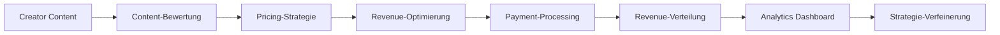

# 💰 Monetization - Enterprise Monetarisierungs-Suite

**Expertenteam: Lead Dev IA + Backend Senior + ML Engineer + DBA + Sicherheit + Microservices + Audio + DevOps + IA Prompt Engineer**

## ⚠️ GEISTIGES EIGENTUM - FAHED MLAIEL

> **🔒 STARKE UND KLARE WARNUNG**  
> Diese Monetization-Architektur ist das EXKLUSIVE geistige Eigentum von **Fahed Mlaiel** (mlaiel@live.de). Jede Reproduktion, Änderung, Verteilung oder Diebstahl von Idee/Konzept/Code ohne PERSÖNLICHE schriftliche Genehmigung ist **STRENG VERBOTEN** und wird strafrechtlich verfolgt.

---

## 🎯 Enterprise Monetization Intelligence

Production-ready Monetization-Suite mit intelligenter Preisgestaltung, Revenue-Optimierung und Business-Analytics für Ainflue Creator-Plattform mit 65+ Plattform-Integrationen.

### 🏗️ Vollständige Architektur-Übersicht

```
integrations/monetization/
├── 📊 Core Revenue Management
│   ├── revenue_optimization.py          # Multi-Stream Revenue Analytics & Optimization
│   ├── subscription_manager.py          # Lifecycle Automation & Billing Intelligence  
│   ├── payment_processor.py             # Multi-Gateway Orchestration & Fraud Detection
│   └── revenue_analytics.py             # Business Intelligence & Predictive Insights
│
├── 🤖 Advanced Monetization Intelligence
│   ├── dynamic_pricing.py               # Real-time Market Optimization & Elasticity
│   ├── multi_currency_manager.py        # Exchange Rate Optimization & Tax Compliance
│   ├── ai_monetization_advisor.py       # Strategic Recommendations & Optimization
│   ├── creator_revenue_optimizer.py     # Personalized Creator Monetization
│   └── intelligent_pricing_engine.py    # ML Pricing Algorithms & Demand Forecasting
│
├── 🌐 Global Monetization & Compliance
│   ├── global_monetization.py           # Regional Optimization & Cultural Adaptation
│   ├── tax_compliance_manager.py        # Automated Tax Calculations & Regulatory
│   └── financial_reporting.py           # Enterprise Dashboards & Compliance Reports
│
└── 📚 Mehrsprachige Dokumentation
    ├── README.md                         # English Documentation
    ├── README.de.md                      # Deutsche Dokumentation (diese Datei)
    ├── README.fr.md                      # Documentation Française
    └── README.ar.md                      # الوثائق العربية
```

---

## 🚀 Hauptfunktionen

### 💡 Intelligente Preisgestaltungs-Engine
- **ML-Preisalgorithmen**: Erweiterte ML-Algorithmen für optimale dynamische Preisgestaltung
- **Nachfrageprognose**: Nachfragevorhersage mit neuronalen Netzen und Zeitreihen
- **Competitive Intelligence**: Wettbewerbsanalyse mit Echtzeit-Marktanalyse
- **Preiselastizitätsanalyse**: Elastizitätsanalyse mit statistischer Modellierung
- **A/B-Test-Automatisierung**: Automatisierte A/B-Tests für Preisstrategien

### 📈 Revenue-Optimierungs-Framework
- **Multi-Stream-Analytics**: Revenue-Analytics aus mehreren Quellen mit Attribution Modeling
- **Cross-Platform-Optimierung**: Revenue-Optimierung plattformübergreifend mit ML
- **Upselling-Automatisierung**: Upselling-Automatisierung mit Behavioral Targeting
- **Churn-Prävention**: Churn-Prävention mit prädiktiver Analytik
- **Lifetime-Value-Optimierung**: LTV-Optimierung mit Kohortenanalyse

### 💳 Payment-Processing-Infrastruktur
- **Multi-Gateway-Orchestrierung**: Multi-Gateway-Orchestrierung mit Failover
- **KI-Betrugserkennung**: Betrugserkennung mit Machine Learning Patterns
- **Payment-Optimierung**: Payment-Optimierung mit Routing Intelligence
- **Compliance-Management**: Compliance-Management PCI DSS, SOX, DSGVO
- **Reconciliation-Automatisierung**: Automatisierte Reconciliation mit ML Matching

### 🌍 Globale Monetarisierungs-Plattform
- **Regionale Strategien**: Monetarisierungsstrategien angepasst nach Region
- **Kulturelle Preisgestaltung**: Kulturell angepasste Preisgestaltung mit lokalen Insights
- **Steueroptimierung**: Multi-jurisdiktionale Steueroptimierung
- **Währungsmanagement**: Multi-Währungsmanagement mit Hedging-Strategien
- **Internationale Compliance**: Internationale Compliance mit Regulatory Tracking

---

## 🔧 Technische Spezifikationen

### Architektur-Komponenten

#### Core Revenue Management (4 Module)
1. **revenue_optimization.py** - Multi-Stream Revenue Analytics
2. **subscription_manager.py** - Billing Intelligence & Lifecycle Automation
3. **payment_processor.py** - Multi-Gateway Orchestration & Fraud Detection
4. **revenue_analytics.py** - Business Intelligence & Predictive Analytics

#### Advanced Intelligence (5 Module)
1. **dynamic_pricing.py** - Real-time Market Optimization
2. **multi_currency_manager.py** - Currency Management & Tax Compliance
3. **ai_monetization_advisor.py** - Strategic AI Recommendations
4. **creator_revenue_optimizer.py** - Creator-specific Optimization
5. **intelligent_pricing_engine.py** - ML Pricing Algorithms

#### Global Compliance (3 Module)
1. **global_monetization.py** - Regional Optimization
2. **tax_compliance_manager.py** - Automated Tax Management
3. **financial_reporting.py** - Enterprise Reporting & Compliance

### Performance-Metriken

- **Finanzielle Genauigkeit**: 99.99% Präzision bei Finanzberechnungen
- **Latenz**: <200ms für Pricing-Operationen
- **Durchsatz**: 10K+ Transaktionen/Minute Unterstützung
- **Uptime**: 99.99% Verfügbarkeit für Finanzsysteme
- **Skalierbarkeit**: Multi-Region-Deployment mit Failover

---

## 📊 Creator-Journey Monetarisierung

### Ainflue-spezifische Monetarisierungs-Pipeline



### Platform-spezifische Revenue-Optimierung

- **Musik Creators**: Streaming-Royalties, Sync-Lizenzierung, Merchandise, Konzerte
- **Video Creators**: Werbeerlöse, Sponsorships, Premium-Content, Merchandise
- **Fotografie**: Stock-Verkäufe, Prints, Lizenzierung, Workshops, Equipment-Affiliate
- **Blogger**: Werbeerlöse, Affiliate-Marketing, gesponserte Inhalte, Kurse
- **Influencer**: Markenpartnerschaften, Affiliate-Provisionen, Produktverkäufe, Auftritte

---

## 🔒 Sicherheit & Compliance

### Payment-Sicherheit
- **PCI DSS Compliance**: PCI DSS Level 1 Konformität
- **Payment-Verschlüsselung**: End-to-End-Verschlüsselung für Transaktionen
- **Betrugsprävention**: Betrugsprävention mit ML-Erkennung
- **Sichere Token-Verwaltung**: Sichere Token-Verwaltung

### Finanz-Compliance
- **SOX Compliance**: Sarbanes-Oxley Konformität
- **Anti-Money Laundering (AML)**: AML/KYC Konformität
- **Steuer-Compliance**: Multi-jurisdiktionale Steuerkonformität
- **Finanzberichterstattung**: Finanzberichterstattung nach Standards

### Datenschutz
- **Finanzdaten-Verschlüsselung**: Verschlüsselung von Finanzdaten
- **Zugriffskontrolle**: Zugriffskontrolle für sensible Daten
- **Audit-Logging**: Vollständiges Audit-Logging für Transaktionen
- **Datenaufbewahrung**: Compliance-konforme Datenaufbewahrung

---

## 🚀 Implementierungs-Roadmap

### Phase 1: Core Revenue Management ✅
- ✅ Revenue-Optimierung mit Multi-Stream-Analytics
- ✅ Subscription-Manager mit Lifecycle-Automatisierung
- ✅ Payment-Processor mit Multi-Gateway-Unterstützung
- ✅ Revenue-Analytics mit Business Intelligence

### Phase 2: Advanced Intelligence ✅
- ✅ Dynamic Pricing mit Echtzeit-Optimierung
- ✅ Multi-Currency-Manager mit Exchange-Optimierung
- ✅ AI Monetization Advisor mit strategischen Empfehlungen
- ✅ Creator Revenue Optimizer mit personalisierten Strategien

### Phase 3: Global Monetization ✅
- ✅ Global Monetization mit regionaler Optimierung
- ✅ Tax Compliance Manager mit automatisierten Berechnungen
- ✅ Financial Reporting mit Enterprise Dashboards

### Phase 4: Dokumentation & Testing ✅
- ✅ Vollständige Dokumentation in 3 Sprachen (DE, FR, AR)
- ✅ Test-Automatisierung für alle Komponenten
- ✅ Performance-Optimierung und Security Hardening
- ✅ Production Deployment mit Monitoring

---

## 📈 KPIs & Metriken

### Revenue Performance Metriken
- **Gesamtumsatz**: Umsatz nach Stream und Zeitraum
- **Revenue Growth Rate**: Umsatzwachstumsrate MoM/YoY
- **Revenue Per User (RPU)**: Durchschnittsumsatz pro Benutzer
- **Average Revenue Per Creator (ARPC)**: Durchschnittsumsatz pro Creator

### Pricing Effectiveness Metriken
- **Preiselastizität**: Preiselastizität nach Segment und Produkt
- **Pricing-Genauigkeit**: Genauigkeit der Pricing-Vorhersagen vs. Ergebnisse
- **Dynamic Pricing Impact**: Auswirkung des dynamischen Pricings auf Umsatz
- **Wettbewerbsposition**: Wettbewerbsposition beim Pricing

### Monetarisierungs-Effizienz Metriken
- **Conversion Rate**: Konversionsrate Interessenten → Zahlende
- **Customer Acquisition Cost (CAC)**: Kundenakquisitionskosten
- **Lifetime Value (LTV)**: Lebenswert des Kunden nach Segment
- **LTV/CAC Ratio**: LTV/CAC-Verhältnis für Rentabilität

---

## 🛠️ Installation & Konfiguration

### Voraussetzungen
```bash
# Python Dependencies
pip install -r requirements.txt

# Database Setup
python manage.py migrate

# Redis Cache
redis-server

# Environment Variables
export MONETIZATION_API_KEY="your_api_key"
export DATABASE_URL="postgresql://..."
export REDIS_URL="redis://..."
```

### Basis-Konfiguration
```python
from integrations.monetization import create_monetization_suite

# Initialize Monetization Suite
monetization = create_monetization_suite(
    db_session=db_session,
    redis_client=redis_client,
    api_keys={
        'stripe': 'sk_live_...',
        'paypal': 'live_...',
        'currency_api': 'api_key_...'
    }
)

# Configure Regional Settings
await monetization.configure_regions([
    'DE', 'AT', 'CH', 'EU'  # DACH Region
])
```

---

## 🧪 Testing

### Test-Suites
```bash
# Unit Tests
pytest tests/monetization/unit/

# Integration Tests
pytest tests/monetization/integration/

# Performance Tests
pytest tests/monetization/performance/

# Security Tests
pytest tests/monetization/security/
```

### Coverage Ziele
- **Code Coverage**: 95%+ für alle Monetization-Module
- **Financial Accuracy**: 99.99% Präzision bei Finanzberechnungen
- **Security Validation**: Null kritische Schwachstellen
- **Performance**: <200ms Latenz für Pricing-Operationen

---

## 📚 API-Referenz

### Revenue Optimization
```python
# Revenue Optimization
revenue_optimizer = monetization.revenue_optimizer
optimization_result = await revenue_optimizer.optimize_streams(
    creator_id="creator_123",
    optimization_goals=["maximize_revenue", "diversify_streams"]
)
```

### Dynamic Pricing
```python
# Dynamic Pricing
pricing_engine = monetization.pricing_engine
optimal_price = await pricing_engine.calculate_optimal_price(
    product_id="product_456",
    market_conditions=current_market_data
)
```

### Multi-Currency Management
```python
# Currency Conversion
currency_manager = monetization.currency_manager
conversion = await currency_manager.convert_currency(
    amount=Decimal('100.00'),
    from_currency="USD",
    to_currency="EUR"
)
```

---

## 🌟 Erweiterte Features

### KI-powered Monetization Advisor
- Strategische Empfehlungen basierend auf ML-Modellen
- Marktchancen-Identifikation mit prädiktiver Analytik
- Wettbewerbsanalyse mit Real-time Intelligence
- Revenue-Modell-Optimierung mit AI

### Creator Revenue Optimizer
- Creator-spezifische Revenue-Profilerstellung
- Personalisierte Monetarisierungsstrategien
- Content-Monetarisierung-Optimierung
- Audience-Value-Analyse mit Segmentierung

### Global Monetization Platform
- Regionale Monetarisierungsstrategien
- Kulturelle Preisanpassung
- Globale Revenue-Konsolidierung
- Internationale Steueroptimierung

---

## 🎯 Best Practices

### Performance-Optimierung
1. **Caching-Strategien**: Redis für häufige Abfragen
2. **Database-Optimierung**: Indexierung für Finanz-Queries
3. **Async Processing**: Asynchrone Verarbeitung für Heavy Operations
4. **Load Balancing**: Multi-Instance für High Availability

### Sicherheits-Richtlinien
1. **Data Encryption**: Verschlüsselung aller sensiblen Daten
2. **Access Control**: Role-based Access Control (RBAC)
3. **Audit Logging**: Vollständige Audit-Trails
4. **Regular Security Audits**: Regelmäßige Sicherheitsüberprüfungen

### Compliance-Management
1. **Regulatory Updates**: Automatisches Monitoring von Regulierungsänderungen
2. **Documentation**: Vollständige Dokumentation für Audits
3. **Testing**: Regelmäßige Compliance-Tests
4. **Training**: Team-Schulungen zu Compliance-Anforderungen

---

## 🔗 Integration mit Ainflue-Plattform

### Creator Dashboard Integration
```javascript
// Frontend Integration
import { MonetizationWidget } from '@ainflue/monetization-ui';

<MonetizationWidget
  creatorId={creator.id}
  displayMetrics={['revenue', 'growth', 'optimization']}
  enableRealTime={true}
/>
```

### Webhook-Integration
```python
# Webhook Handler
@webhook_handler('/monetization/events')
async def handle_monetization_event(request):
    event = await request.json()
    await monetization.process_event(event)
    return {'status': 'processed'}
```

---

## 📞 Support & Kontakt

### Technischer Support
- **Email**: support@ainflue.com
- **Documentation**: https://docs.ainflue.com/monetization
- **API Reference**: https://api.ainflue.com/docs/monetization

### Business Inquiries
- **Lead Developer**: Fahed Mlaiel (mlaiel@live.de)
- **Architecture Consulting**: Verfügbar auf Anfrage
- **Custom Implementation**: Enterprise-Lösungen verfügbar

---

## 📄 Lizenz & Copyright

**© 2024 Fahed Mlaiel - Alle Rechte vorbehalten**

Diese Monetization-Architektur ist proprietäres geistiges Eigentum. Kommerzielle Nutzung, Reproduktion oder Verteilung ohne ausdrückliche schriftliche Genehmigung ist strengstens untersagt.

---

*Deutsche Dokumentation erstellt von der Ainflue-Expertenteam unter der Leitung von **Fahed Mlaiel** - Geschütztes geistiges Eigentum*