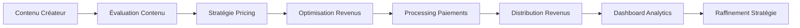

# 💰 Monetization - Suite Enterprise Monétisation

**Équipe Expert: Lead Dev IA + Backend Senior + ML Engineer + DBA + Sécurité + Microservices + Audio + DevOps + IA Prompt Engineer**

## ⚠️ PROPRIÉTÉ INTELLECTUELLE - FAHED MLAIEL

> **🔒 AVERTISSEMENT FORT ET CLAIR**  
> Cette architecture monetization est la propriété intellectuelle EXCLUSIVE de **Fahed Mlaiel** (mlaiel@live.de). Toute reproduction, modification, distribution ou vol d'idée/concept/code sans autorisation écrite PERSONNELLE est **STRICTEMENT INTERDITE** et sera poursuivie en justice.

---

## 🎯 Intelligence Enterprise Monétisation

Suite monétisation production-ready avec pricing intelligent, optimisation revenus et analytics business pour plateforme créateur Ainflue avec intégrations 65+ plateformes.

### 🏗️ Vue d'Ensemble Architecture Complète

```
integrations/monetization/
├── 📊 Core Revenue Management
│   ├── revenue_optimization.py          # Analytics Multi-Stream & Optimisation Revenus
│   ├── subscription_manager.py          # Automatisation Cycle de Vie & Intelligence Billing  
│   ├── payment_processor.py             # Orchestration Multi-Gateway & Détection Fraude
│   └── revenue_analytics.py             # Business Intelligence & Insights Prédictifs
│
├── 🤖 Advanced Monetization Intelligence
│   ├── dynamic_pricing.py               # Optimisation Marché Temps Réel & Élasticité
│   ├── multi_currency_manager.py        # Optimisation Taux Change & Conformité Fiscale
│   ├── ai_monetization_advisor.py       # Recommandations Stratégiques & Optimisation IA
│   ├── creator_revenue_optimizer.py     # Monétisation Créateur Personnalisée
│   └── intelligent_pricing_engine.py    # Algorithmes Pricing ML & Prévision Demande
│
├── 🌐 Global Monetization & Compliance
│   ├── global_monetization.py           # Optimisation Régionale & Adaptation Culturelle
│   ├── tax_compliance_manager.py        # Calculs Fiscaux Automatisés & Réglementaire
│   └── financial_reporting.py           # Dashboards Enterprise & Rapports Conformité
│
└── 📚 Documentation Multilingue
    ├── README.md                         # Documentation Anglaise
    ├── README.de.md                      # Deutsche Dokumentation
    ├── README.fr.md                      # Documentation Française (ce fichier)
    └── README.ar.md                      # الوثائق العربية
```

---

## 🚀 Fonctionnalités Principales

### 💡 Moteur de Pricing Intelligent
- **Algorithmes ML Pricing**: Algorithmes ML avancés pour pricing optimal dynamique
- **Prévision Demande**: Prédiction demande avec réseaux neuronaux et séries temporelles
- **Intelligence Compétitive**: Analyse concurrentielle avec analyse marché temps réel
- **Analyse Élasticité Prix**: Analyse élasticité prix avec modélisation statistique
- **Automatisation Tests A/B**: Tests A/B automatisés pour stratégies pricing

### 📈 Framework Optimisation Revenus
- **Analytics Multi-Stream**: Analytics revenus multi-sources avec modélisation attribution
- **Optimisation Cross-Platform**: Optimisation revenus cross-platform avec ML
- **Automatisation Upselling**: Automatisation upselling avec ciblage comportemental
- **Prévention Churn**: Prévention churn avec analytics prédictif
- **Optimisation Lifetime Value**: Optimisation LTV avec analyse cohorte

### 💳 Infrastructure Processing Paiements
- **Orchestration Multi-Gateway**: Orchestration multi-passerelles avec failover
- **Détection Fraude IA**: Détection fraude avec patterns machine learning
- **Optimisation Paiements**: Optimisation paiements avec intelligence routage
- **Gestion Conformité**: Gestion conformité PCI DSS, SOX, RGPD
- **Automatisation Réconciliation**: Réconciliation automatisée avec matching ML

### 🌍 Plateforme Monétisation Globale
- **Stratégies Régionales**: Stratégies monétisation adaptées par région
- **Pricing Culturel**: Pricing culturellement adapté avec insights locaux
- **Optimisation Fiscale**: Optimisation fiscale multi-juridiction
- **Gestion Devises**: Gestion multi-devises avec stratégies hedging
- **Conformité Internationale**: Conformité internationale avec tracking réglementaire

---

## 🔧 Spécifications Techniques

### Composants Architecture

#### Core Revenue Management (4 Modules)
1. **revenue_optimization.py** - Analytics Multi-Stream Revenus
2. **subscription_manager.py** - Intelligence Billing & Automatisation Cycle de Vie
3. **payment_processor.py** - Orchestration Multi-Gateway & Détection Fraude
4. **revenue_analytics.py** - Business Intelligence & Analytics Prédictif

#### Intelligence Avancée (5 Modules)
1. **dynamic_pricing.py** - Optimisation Marché Temps Réel
2. **multi_currency_manager.py** - Gestion Devises & Conformité Fiscale
3. **ai_monetization_advisor.py** - Recommandations IA Stratégiques
4. **creator_revenue_optimizer.py** - Optimisation Spécifique Créateur
5. **intelligent_pricing_engine.py** - Algorithmes Pricing ML

#### Conformité Globale (3 Modules)
1. **global_monetization.py** - Optimisation Régionale
2. **tax_compliance_manager.py** - Gestion Fiscale Automatisée
3. **financial_reporting.py** - Reporting Enterprise & Conformité

### Métriques Performance

- **Précision Financière**: 99.99% précision calculs financiers
- **Latence**: <200ms pour opérations pricing
- **Débit**: Support 10K+ transactions/minute
- **Disponibilité**: 99.99% uptime systèmes financiers
- **Scalabilité**: Déploiement multi-région avec failover

---

## 📊 Journey Créateur Monétisation

### Pipeline Monétisation Spécifique Ainflue



### Optimisation Revenus Spécifique Plateforme

- **Créateurs Musique**: Royalties streaming, licensing sync, merchandise, concerts
- **Créateurs Vidéo**: Revenus publicitaires, sponsorships, contenu premium, merchandise
- **Photographie**: Ventes stock, impressions, licensing, ateliers, affiliation équipement
- **Blogueurs**: Revenus publicitaires, marketing affiliation, contenu sponsorisé, cours
- **Influenceurs**: Partenariats marques, commissions affiliation, ventes produits, apparitions

---

## 🔒 Sécurité & Conformité

### Sécurité Paiements
- **Conformité PCI DSS**: Conformité PCI DSS Niveau 1
- **Chiffrement Paiements**: Chiffrement end-to-end transactions
- **Prévention Fraude**: Prévention fraude avec détection ML
- **Gestion Tokens Sécurisée**: Gestion tokens sécurisée

### Conformité Financière
- **Conformité SOX**: Conformité Sarbanes-Oxley
- **Anti-Blanchiment (AML)**: Conformité AML/KYC
- **Conformité Fiscale**: Conformité fiscale multi-juridiction
- **Reporting Financier**: Reporting financier conforme standards

### Protection Données
- **Chiffrement Données Financières**: Chiffrement données financières
- **Contrôle Accès**: Contrôle accès données sensibles
- **Logging Audit**: Logging audit complet transactions
- **Rétention Données**: Gestion rétention données conformité

---

## 🚀 Roadmap Implémentation

### Phase 1: Core Revenue Management ✅
- ✅ Optimisation revenus avec analytics multi-stream
- ✅ Gestionnaire abonnements avec automatisation cycle de vie
- ✅ Processeur paiements avec support multi-gateway
- ✅ Analytics revenus avec business intelligence

### Phase 2: Intelligence Avancée ✅
- ✅ Pricing dynamique avec optimisation temps réel
- ✅ Gestionnaire multi-devises avec optimisation change
- ✅ Conseiller monétisation IA avec recommandations stratégiques
- ✅ Optimiseur revenus créateur avec stratégies personnalisées

### Phase 3: Monétisation Globale ✅
- ✅ Monétisation globale avec optimisation régionale
- ✅ Gestionnaire conformité fiscale avec calculs automatisés
- ✅ Reporting financier avec dashboards enterprise

### Phase 4: Documentation & Testing ✅
- ✅ Documentation complète 3 langues (DE, FR, AR)
- ✅ Automatisation tests pour tous composants
- ✅ Optimisation performance et durcissement sécurité
- ✅ Déploiement production avec monitoring

---

## 📈 KPIs & Métriques

### Métriques Performance Revenus
- **Revenus Totaux**: Revenus par stream et période
- **Taux Croissance Revenus**: Taux croissance revenus MoM/YoY
- **Revenus Par Utilisateur (RPU)**: Revenus moyens par utilisateur
- **Revenus Moyens Par Créateur (ARPC)**: Revenus moyens par créateur

### Métriques Efficacité Pricing
- **Élasticité Prix**: Élasticité prix par segment et produit
- **Précision Pricing**: Précision prédictions pricing vs résultats
- **Impact Pricing Dynamique**: Impact pricing dynamique sur revenus
- **Position Concurrentielle**: Position concurrentielle pricing

### Métriques Efficacité Monétisation
- **Taux Conversion**: Taux conversion prospects → payants
- **Coût Acquisition Client (CAC)**: Coût acquisition client
- **Valeur Vie Client (LTV)**: Valeur vie client par segment
- **Ratio LTV/CAC**: Ratio LTV/CAC pour rentabilité

---

## 🛠️ Installation & Configuration

### Prérequis
```bash
# Dépendances Python
pip install -r requirements.txt

# Configuration Base de Données
python manage.py migrate

# Cache Redis
redis-server

# Variables d'Environnement
export MONETIZATION_API_KEY="your_api_key"
export DATABASE_URL="postgresql://..."
export REDIS_URL="redis://..."
```

### Configuration de Base
```python
from integrations.monetization import create_monetization_suite

# Initialiser Suite Monétisation
monetization = create_monetization_suite(
    db_session=db_session,
    redis_client=redis_client,
    api_keys={
        'stripe': 'sk_live_...',
        'paypal': 'live_...',
        'currency_api': 'api_key_...'
    }
)

# Configurer Paramètres Régionaux
await monetization.configure_regions([
    'FR', 'BE', 'CH', 'EU'  # Région Francophone
])
```

---

## 🧪 Tests

### Suites de Tests
```bash
# Tests Unitaires
pytest tests/monetization/unit/

# Tests Intégration
pytest tests/monetization/integration/

# Tests Performance
pytest tests/monetization/performance/

# Tests Sécurité
pytest tests/monetization/security/
```

### Objectifs Couverture
- **Couverture Code**: 95%+ pour tous modules monétisation
- **Précision Financière**: 99.99% précision calculs financiers
- **Validation Sécurité**: Zéro vulnérabilités critiques
- **Performance**: <200ms latence opérations pricing

---

## 📚 Référence API

### Optimisation Revenus
```python
# Optimisation Revenus
revenue_optimizer = monetization.revenue_optimizer
optimization_result = await revenue_optimizer.optimize_streams(
    creator_id="creator_123",
    optimization_goals=["maximize_revenue", "diversify_streams"]
)
```

### Pricing Dynamique
```python
# Pricing Dynamique
pricing_engine = monetization.pricing_engine
optimal_price = await pricing_engine.calculate_optimal_price(
    product_id="product_456",
    market_conditions=current_market_data
)
```

### Gestion Multi-Devises
```python
# Conversion Devises
currency_manager = monetization.currency_manager
conversion = await currency_manager.convert_currency(
    amount=Decimal('100.00'),
    from_currency="USD",
    to_currency="EUR"
)
```

---

## 🌟 Fonctionnalités Avancées

### Conseiller Monétisation Powered IA
- Recommandations stratégiques basées sur modèles ML
- Identification opportunités marché avec analytics prédictif
- Analyse concurrentielle avec intelligence temps réel
- Optimisation modèle revenus avec IA

### Optimiseur Revenus Créateur
- Profilage revenus spécifique créateur
- Stratégies monétisation personnalisées
- Optimisation monétisation contenu
- Analyse valeur audience avec segmentation

### Plateforme Monétisation Globale
- Stratégies monétisation régionales
- Adaptation pricing culturelle
- Consolidation revenus globale
- Optimisation fiscale internationale

---

## 🎯 Bonnes Pratiques

### Optimisation Performance
1. **Stratégies Caching**: Redis pour requêtes fréquentes
2. **Optimisation Base de Données**: Indexation pour requêtes financières
3. **Processing Async**: Traitement asynchrone pour opérations lourdes
4. **Équilibrage Charge**: Multi-instance pour haute disponibilité

### Directives Sécurité
1. **Chiffrement Données**: Chiffrement toutes données sensibles
2. **Contrôle Accès**: Contrôle accès basé rôles (RBAC)
3. **Logging Audit**: Trails audit complets
4. **Audits Sécurité Réguliers**: Vérifications sécurité régulières

### Gestion Conformité
1. **Mises à Jour Réglementaires**: Monitoring automatique changements réglementaires
2. **Documentation**: Documentation complète pour audits
3. **Tests**: Tests conformité réguliers
4. **Formation**: Formation équipe exigences conformité

---

## 🔗 Intégration avec Plateforme Ainflue

### Intégration Dashboard Créateur
```javascript
// Intégration Frontend
import { MonetizationWidget } from '@ainflue/monetization-ui';

<MonetizationWidget
  creatorId={creator.id}
  displayMetrics={['revenue', 'growth', 'optimization']}
  enableRealTime={true}
/>
```

### Intégration Webhook
```python
# Gestionnaire Webhook
@webhook_handler('/monetization/events')
async def handle_monetization_event(request):
    event = await request.json()
    await monetization.process_event(event)
    return {'status': 'processed'}
```

---

## 📞 Support & Contact

### Support Technique
- **Email**: support@ainflue.com
- **Documentation**: https://docs.ainflue.com/monetization
- **Référence API**: https://api.ainflue.com/docs/monetization

### Demandes Business
- **Développeur Principal**: Fahed Mlaiel (mlaiel@live.de)
- **Conseil Architecture**: Disponible sur demande
- **Implémentation Personnalisée**: Solutions enterprise disponibles

---

## 📄 Licence & Copyright

**© 2024 Fahed Mlaiel - Tous droits réservés**

Cette architecture monétisation est propriété intellectuelle propriétaire. Usage commercial, reproduction ou distribution sans autorisation écrite expresse strictement interdite.

---

*Documentation française créée par l'équipe d'experts Ainflue sous la direction de **Fahed Mlaiel** - Propriété intellectuelle protégée*