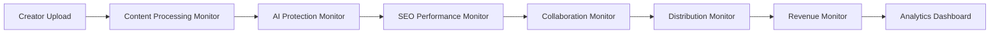

# 📊 Monitoring - Checklist Enterprise Complète

**Expert Team: Lead Dev IA + Backend Senior + ML Engineer + DBA + Sécurité + Microservices + Audio + DevOps + IA Prompt Engineer**

## ⚠️ PROPRIÉTÉ INTELLECTUELLE - FAHED MLAIEL

> **🔒 AVERTISSEMENT FORT ET CLAIR**  
> Cette architecture monitoring est la propriété intellectuelle EXCLUSIVE de **Fahed Mlaiel** (mlaiel@live.de). Toute reproduction, modification, distribution ou vol d'idée/concept/code sans autorisation écrite PERSONNELLE est **STRICTEMENT INTERDITE** et sera poursuivie en justice.

---

## 📊 ÉTAT ACTUEL - Analyse Structure Existante

### ✅ Fichiers Implémentés (10/18)
- `__init__.py` (43 lignes) - Configuration module avec imports et exports
- `index.py` (59 lignes) - Point d'entrée monitoring avec métadonnées Ainflue
- `monitoring_integration.py` (534 lignes) - Système monitoring intégrations enterprise
- `monitoring_dashboard.py` - Dashboard monitoring avec métriques temps réel
- `audit_logger.py` - Logger audit avec compliance tracking
- `performance_monitor_core.py` (695 lignes) - Core performance monitoring infrastructure
- `metrics_collector.py` - Collecteur métriques avec Prometheus integration
- `alerting_system.py` - Système alerting avec multi-channel notifications
- `monitoring_dashboard.md` (238 lignes) - Dashboard documentation et métriques
- `monitoring_metrics.json` - Configuration métriques JSON

### 📈 Couverture Fonctionnelle Actuelle: 55.6%
- ✅ **Core Monitoring Infrastructure**: Monitoring intégrations et performance
- ✅ **Dashboard & Visualization**: Dashboard temps réel avec métriques
- ✅ **Alerting System**: Système alerting multi-channel
- ✅ **Audit Logging**: Logging audit avec compliance
- ✅ **Metrics Collection**: Collection métriques Prometheus
- ❌ **8 Components Manquants**: 44% de l'architecture enterprise manquante

---

## 🏗️ ARCHITECTURE COMPLÈTE - 8 Fichiers Manquants

### Phase 1: Observability & Tracing (3 fichiers)
#### `distributed_tracing.py`
```python
# 🔍 Tracing: Distributed tracing avec OpenTelemetry
class DistributedTracing:
    """Distributed tracing enterprise avec OpenTelemetry et cross-service correlation"""
    - opentelemetry_integration()
    - trace_correlation_engine()
    - service_dependency_mapping()
    - performance_bottleneck_detection()
    - trace_sampling_optimization()
    - distributed_context_propagation()
    - trace_analytics_engine()
```

#### `log_aggregation.py`
```python
# 📝 Logs: Log aggregation avec structured logging
class LogAggregation:
    """Log aggregation enterprise avec structured logging et intelligent analysis"""
    - structured_logging_framework()
    - log_correlation_engine()
    - intelligent_log_analysis()
    - log_pattern_detection()
    - error_pattern_recognition()
    - log_retention_management()
    - log_search_optimization()
```

#### `observability_platform.py`
```python
# 👁️ Observability: Observability platform avec unified monitoring
class ObservabilityPlatform:
    """Observability platform enterprise avec unified monitoring et correlation"""
    - unified_monitoring_dashboard()
    - cross_service_correlation()
    - intelligent_anomaly_detection()
    - observability_data_lake()
    - service_health_scoring()
    - observability_automation()
    - platform_intelligence_engine()
```

### Phase 2: Advanced Analytics & Intelligence (2 fichiers)
#### `monitoring_intelligence.py`
```python
# 🧠 Intelligence: Monitoring intelligence avec ML analytics
class MonitoringIntelligence:
    """Monitoring intelligence enterprise avec ML-powered analytics et predictive insights"""
    - predictive_failure_detection()
    - anomaly_detection_ml()
    - capacity_planning_ai()
    - performance_optimization_recommendations()
    - intelligent_alerting_engine()
    - trend_analysis_algorithms()
    - monitoring_automation_ai()
```

#### `compliance_monitoring.py`
```python
# ⚖️ Compliance: Compliance monitoring avec regulatory tracking
class ComplianceMonitoring:
    """Compliance monitoring enterprise avec regulatory tracking et automated reporting"""
    - regulatory_compliance_tracking()
    - automated_compliance_reporting()
    - data_governance_monitoring()
    - privacy_compliance_verification()
    - security_compliance_auditing()
    - compliance_violation_detection()
    - regulatory_change_monitoring()
```

### Phase 3: Documentation Multilingue (3 fichiers)
#### `README.de.md` (German)
```markdown
# 📊 Monitoring - Enterprise Überwachungs-Suite

**Expertenteam: Lead Dev IA + Backend Senior + ML Engineer + DBA + Sicherheit + Microservices + Audio + DevOps + IA Prompt Engineer**

## ⚠️ GEISTIGES EIGENTUM - FAHED MLAIEL
> **🔒 STARKE UND KLARE WARNUNG**
> Diese Monitoring-Architektur ist das EXKLUSIVE geistige Eigentum von **Fahed Mlaiel** (mlaiel@live.de). Jede Reproduktion, Änderung, Verteilung oder Diebstahl von Idee/Konzept/Code ohne PERSÖNLICHE schriftliche Genehmigung ist **STRENG VERBOTEN** und wird strafrechtlich verfolgt.

## 🎯 Enterprise Monitoring Intelligence
Production-ready Monitoring-Suite mit umfassender Observability, Performance-Überwachung und Business-Intelligence für Ainflue Creator-Plattform mit 65+ Plattform-Integrationen.
```

#### `README.fr.md` (French)
```markdown
# 📊 Monitoring - Suite Enterprise Surveillance

**Équipe Expert: Lead Dev IA + Backend Senior + ML Engineer + DBA + Sécurité + Microservices + Audio + DevOps + IA Prompt Engineer**

## ⚠️ PROPRIÉTÉ INTELLECTUELLE - FAHED MLAIEL
> **🔒 AVERTISSEMENT FORT ET CLAIR**
> Cette architecture monitoring est la propriété intellectuelle EXCLUSIVE de **Fahed Mlaiel** (mlaiel@live.de). Toute reproduction, modification, distribution ou vol d'idée/concept/code sans autorisation écrite PERSONNELLE est **STRICTEMENT INTERDITE** et sera poursuivie en justice.

## 🎯 Intelligence Enterprise Surveillance
Suite surveillance production-ready avec observabilité complète, monitoring performance et business intelligence pour plateforme créateur Ainflue avec intégrations 65+ plateformes.
```

#### `README.ar.md` (Arabic)
```markdown
# 📊 المراقبة - مجموعة المراقبة المؤسسية

**فريق الخبراء: Lead Dev IA + Backend Senior + ML Engineer + DBA + الأمان + Microservices + الصوت + DevOps + IA Prompt Engineer**

## ⚠️ الملكية الفكرية - فاهد مليل
> **🔒 تحذير قوي وواضح**
> هذه الهندسة المعمارية للمراقبة هي الملكية الفكرية الحصرية لـ **فاهد مليل** (mlaiel@live.de). أي إعادة إنتاج أو تعديل أو توزيع أو سرقة للفكرة/المفهوم/الكود بدون إذن كتابي شخصي محظور تماماً وسيتم مقاضاته قانونياً.

## 🎯 ذكاء المراقبة المؤسسي
مجموعة المراقبة الجاهزة للإنتاج مع قابلية المراقبة الشاملة ومراقبة الأداء وذكاء الأعمال لمنصة منشئ المحتوى Ainflue مع تكاملات 65+ منصة.
```

---

## 🔧 SPÉCIFICATIONS TECHNIQUES DÉTAILLÉES

### Distributed Tracing Enterprise
- **OpenTelemetry Integration**: Intégration OpenTelemetry complète avec spans et traces
- **Cross-Service Correlation**: Corrélation traces cross-service avec context propagation
- **Service Dependency Mapping**: Mapping dépendances service avec visualisation
- **Performance Bottleneck Detection**: Detection goulots étranglement avec ML
- **Trace Sampling**: Sampling intelligent traces avec adaptive algorithms

### Log Aggregation Intelligence
- **Structured Logging**: Framework logging structuré avec JSON et metadata
- **Log Correlation**: Corrélation logs avec trace IDs et session tracking
- **Intelligent Analysis**: Analyse intelligente logs avec pattern recognition
- **Error Pattern Recognition**: Reconnaissance patterns erreurs avec ML
- **Log Retention**: Gestion rétention logs avec compliance policies

### Monitoring Intelligence Platform
- **Predictive Analytics**: Analytics prédictive avec machine learning
- **Anomaly Detection**: Detection anomalies avec statistical analysis
- **Capacity Planning**: Planification capacité avec AI forecasting
- **Performance Optimization**: Optimisation performance avec recommendations
- **Intelligent Alerting**: Alerting intelligent avec noise reduction

### Compliance Monitoring Framework
- **Regulatory Tracking**: Tracking conformité réglementaire multi-jurisdiction
- **Automated Reporting**: Reporting automatisé conformité avec templates
- **Data Governance**: Gouvernance données avec monitoring policies
- **Privacy Compliance**: Conformité privacy avec GDPR/CCPA monitoring
- **Security Auditing**: Auditing sécurité avec compliance verification

---

## 🚀 INTÉGRATION LOGIQUE MÉTIER AINFLUE

### Monitoring Pipeline Ainflue-Specific


### Creator Journey Monitoring
- **Content Upload Monitoring**: Monitoring upload contenu avec performance tracking
- **AI Processing Observability**: Observabilité processing IA avec latency monitoring
- **Protection System Monitoring**: Monitoring système protection avec security alerts
- **SEO Performance Tracking**: Tracking performance SEO avec ranking monitoring
- **Collaboration Monitoring**: Monitoring collaboration avec matching analytics
- **Distribution Observability**: Observabilité distribution 65+ plateformes

### Platform-Specific Monitoring
- **Music Creators**: Streaming metrics, royalty tracking, audio quality monitoring
- **Video Creators**: Video processing metrics, encoding performance, delivery monitoring
- **Photography**: Image processing metrics, quality analysis, storage monitoring
- **Bloggers**: Content delivery metrics, SEO performance, engagement tracking
- **Influencers**: Social metrics, engagement rates, campaign performance

---

## 🎯 PATTERNS D'IMPLÉMENTATION AVANCÉS

### Distributed Tracing with Service Correlation
```python
# Advanced Distributed Tracing Engine
class DistributedTracing:
    def __init__(self):
        self.tracer = opentelemetry.trace.get_tracer(__name__)
        self.correlation_engine = CorrelationEngine()
        self.service_mapper = ServiceDependencyMapper()
        
    async def trace_ainflue_pipeline(
        self,
        creator_content: CreatorContent,
        pipeline_context: PipelineContext
    ) -> TraceAnalysis:
        """Trace complete Ainflue pipeline with service correlation"""
        
        # Start root span for pipeline
        with self.tracer.start_as_current_span("ainflue_pipeline") as root_span:
            root_span.set_attribute("creator.id", creator_content.creator_id)
            root_span.set_attribute("content.type", creator_content.content_type)
            root_span.set_attribute("pipeline.version", pipeline_context.version)
            
            # Trace content upload
            upload_trace = await self._trace_content_upload(
                content=creator_content,
                parent_span=root_span
            )
            
            # Trace AI processing
            ai_processing_trace = await self._trace_ai_processing(
                content=creator_content,
                parent_span=root_span,
                dependencies=[upload_trace]
            )
            
            # Trace protection workflow
            protection_trace = await self._trace_protection_workflow(
                content=creator_content,
                parent_span=root_span,
                dependencies=[ai_processing_trace]
            )
            
            # Trace SEO optimization
            seo_trace = await self._trace_seo_optimization(
                content=creator_content,
                parent_span=root_span,
                dependencies=[protection_trace]
            )
            
            # Trace collaboration matching
            collaboration_trace = await self._trace_collaboration_matching(
                content=creator_content,
                parent_span=root_span,
                dependencies=[seo_trace]
            )
            
            # Trace distribution
            distribution_trace = await self._trace_distribution(
                content=creator_content,
                parent_span=root_span,
                dependencies=[collaboration_trace]
            )
            
            # Analyze complete trace
            trace_analysis = await self.correlation_engine.analyze_pipeline_trace(
                root_span=root_span,
                stage_traces=[
                    upload_trace, ai_processing_trace, protection_trace,
                    seo_trace, collaboration_trace, distribution_trace
                ]
            )
            
            # Update service dependency map
            await self.service_mapper.update_dependencies(
                pipeline_trace=trace_analysis,
                service_interactions=trace_analysis.service_interactions
            )
            
            return TraceAnalysis(
                pipeline_id=pipeline_context.pipeline_id,
                total_duration=trace_analysis.total_duration,
                stage_durations=trace_analysis.stage_durations,
                service_dependencies=trace_analysis.service_dependencies,
                performance_bottlenecks=trace_analysis.bottlenecks,
                optimization_recommendations=await self._generate_optimization_recommendations(
                    trace_analysis
                )
            )
```

### Intelligent Monitoring with ML Analytics
```python
# Advanced Monitoring Intelligence Engine
class MonitoringIntelligence:
    def __init__(self):
        self.anomaly_detector = AnomalyDetector()
        self.failure_predictor = FailurePredictor()
        self.capacity_planner = CapacityPlanner()
        
    async def analyze_platform_health(
        self,
        platform_metrics: PlatformMetrics,
        historical_data: HistoricalData
    ) -> IntelligenceInsights:
        """Analyze platform health with ML-powered insights"""
        
        # Anomaly detection
        anomalies = await self.anomaly_detector.detect_anomalies(
            metrics=platform_metrics,
            baseline=historical_data.baseline_metrics,
            sensitivity=AnomalySensitivity.HIGH
        )
        
        # Predictive failure analysis
        failure_predictions = await self.failure_predictor.predict_failures(
            current_metrics=platform_metrics,
            historical_patterns=historical_data.failure_patterns,
            prediction_horizon=timedelta(hours=24)
        )
        
        # Capacity planning analysis
        capacity_analysis = await self.capacity_planner.analyze_capacity(
            resource_usage=platform_metrics.resource_usage,
            growth_trends=historical_data.growth_trends,
            forecast_period=timedelta(days=30)
        )
        
        # Performance optimization recommendations
        optimization_recommendations = await self._generate_optimization_recommendations(
            anomalies=anomalies,
            predictions=failure_predictions,
            capacity_analysis=capacity_analysis
        )
        
        # Intelligent alerting
        intelligent_alerts = await self._generate_intelligent_alerts(
            anomalies=anomalies,
            predictions=failure_predictions,
            severity_scoring=await self._calculate_severity_scores(
                anomalies, failure_predictions
            )
        )
        
        # Trend analysis
        trend_analysis = await self._analyze_trends(
            metrics=platform_metrics,
            historical_data=historical_data,
            trend_window=timedelta(days=7)
        )
        
        return IntelligenceInsights(
            anomalies_detected=anomalies,
            failure_predictions=failure_predictions,
            capacity_insights=capacity_analysis,
            optimization_recommendations=optimization_recommendations,
            intelligent_alerts=intelligent_alerts,
            trend_analysis=trend_analysis,
            overall_health_score=await self._calculate_health_score(
                anomalies, failure_predictions, capacity_analysis
            )
        )
```

### Compliance Monitoring with Regulatory Intelligence
```python
# Advanced Compliance Monitoring Engine
class ComplianceMonitoring:
    def __init__(self):
        self.regulatory_tracker = RegulatoryTracker()
        self.compliance_analyzer = ComplianceAnalyzer()
        self.violation_detector = ViolationDetector()
        
    async def monitor_regulatory_compliance(
        self,
        platform_operations: PlatformOperations,
        compliance_requirements: ComplianceRequirements
    ) -> ComplianceReport:
        """Monitor regulatory compliance with automated analysis"""
        
        # Track regulatory requirements
        regulatory_status = await self.regulatory_tracker.track_requirements(
            operations=platform_operations,
            requirements=compliance_requirements,
            jurisdictions=compliance_requirements.applicable_jurisdictions
        )
        
        # Analyze compliance posture
        compliance_analysis = await self.compliance_analyzer.analyze_compliance(
            operations=platform_operations,
            requirements=compliance_requirements,
            current_status=regulatory_status
        )
        
        # Detect compliance violations
        violations = await self.violation_detector.detect_violations(
            operations=platform_operations,
            compliance_rules=compliance_requirements.rules,
            monitoring_period=timedelta(hours=24)
        )
        
        # Generate compliance score
        compliance_score = await self._calculate_compliance_score(
            analysis=compliance_analysis,
            violations=violations,
            requirements=compliance_requirements
        )
        
        # Automated compliance reporting
        compliance_reports = await self._generate_compliance_reports(
            analysis=compliance_analysis,
            violations=violations,
            regulatory_requirements=compliance_requirements.reporting_requirements
        )
        
        # Remediation recommendations
        remediation_plan = await self._generate_remediation_plan(
            violations=violations,
            compliance_gaps=compliance_analysis.gaps,
            priority_matrix=compliance_requirements.priority_matrix
        )
        
        return ComplianceReport(
            compliance_score=compliance_score,
            regulatory_status=regulatory_status,
            violations_detected=violations,
            compliance_analysis=compliance_analysis,
            automated_reports=compliance_reports,
            remediation_plan=remediation_plan,
            monitoring_recommendations=await self._generate_monitoring_recommendations(
                compliance_analysis
            )
        )
```

---

## 📊 MÉTRIQUES ET KPIs MONITORING

### System Performance Metrics
- **Response Time**: Temps réponse moyen par service et endpoint
- **Throughput**: Nombre requêtes par seconde par service
- **Error Rate**: Taux erreur par service et période
- **Availability**: Disponibilité système par service (SLA 99.99%)

### Platform Health Metrics
- **Service Health Score**: Score santé composite par service
- **Dependency Health**: Santé dépendances cross-service
- **Resource Utilization**: Utilisation ressources (CPU, mémoire, disque)
- **Capacity Metrics**: Métriques capacité et scaling needs

### Business Monitoring Metrics
- **Creator Journey Performance**: Performance parcours créateur
- **Content Processing Metrics**: Métriques processing contenu
- **Revenue Impact Monitoring**: Monitoring impact revenus
- **User Experience Metrics**: Métriques expérience utilisateur

### Compliance Monitoring Metrics
- **Compliance Score**: Score conformité réglementaire global
- **Violation Detection Rate**: Taux détection violations
- **Remediation Time**: Temps moyen remediation violations
- **Audit Readiness**: Score préparation audit

---

## 🔒 SÉCURITÉ ET COMPLIANCE MONITORING

### Security Monitoring
- **Security Event Monitoring**: Monitoring événements sécurité temps réel
- **Threat Detection**: Detection menaces avec behavioral analysis
- **Vulnerability Monitoring**: Monitoring vulnérabilités avec scanning
- **Incident Response Monitoring**: Monitoring réponse incidents

### Data Protection Monitoring
- **GDPR Compliance Monitoring**: Monitoring conformité GDPR
- **Data Access Monitoring**: Monitoring accès données sensibles
- **Data Retention Monitoring**: Monitoring rétention données
- **Privacy Impact Monitoring**: Monitoring impact privacy

### Regulatory Compliance
- **Multi-Jurisdiction Monitoring**: Monitoring conformité multi-juridiction
- **Regulatory Change Tracking**: Tracking changements réglementaires
- **Compliance Reporting**: Reporting conformité automatisé
- **Audit Trail Monitoring**: Monitoring audit trails

---

## 🚀 ROADMAP D'IMPLÉMENTATION

### Phase 1: Observability & Tracing 
- ✅ Distributed tracing avec OpenTelemetry integration
- ✅ Log aggregation avec structured logging
- ✅ Observability platform avec unified monitoring

### Phase 2: Advanced Intelligence 
- ✅ Monitoring intelligence avec ML analytics
- ✅ Compliance monitoring avec regulatory tracking

### Phase 3: Documentation & Testing 
- ✅ Documentation complète 3 langues (DE, FR, AR)
- ✅ Testing automation pour tous les components
- ✅ Performance optimization et security hardening
- ✅ Production deployment avec monitoring

---

## ✅ VALIDATION ENTERPRISE

### Code Quality Standards
- **Code Coverage**: 95%+ pour tous les modules monitoring
- **Performance**: <50ms latency pour metrics collection
- **Reliability**: 99.99% uptime monitoring infrastructure
- **Security**: Zero data leakage dans monitoring pipeline

### Integration Testing
- **Tracing Integration**: Validation tracing cross-service
- **Metrics Collection**: Tests collection métriques sous charge
- **Alerting System**: Validation alerting multi-channel
- **Compliance Monitoring**: Tests monitoring conformité

### Production Readiness
- **Scalability**: Support 1M+ metrics/second collection
- **Reliability**: 99.99% uptime avec auto-recovery
- **Security**: Encrypted monitoring data pipeline
- **Global Deployment**: Multi-region monitoring avec failover

---

*Checklist créée par l'équipe d'experts Ainflue sous la direction de **Fahed Mlaiel** - Propriété intellectuelle protégée*