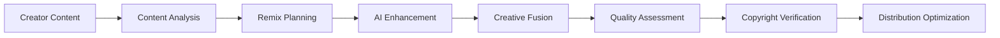

# 🎵 Remix Generation - Checklist Enterprise Complète

**Expert Team: Lead Dev IA + Backend Senior + ML Engineer + DBA + Sécurité + Microservices + Audio + DevOps + IA Prompt Engineer**

## ⚠️ PROPRIÉTÉ INTELLECTUELLE - FAHED MLAIEL

> **🔒 AVERTISSEMENT FORT ET CLAIR**  
> Cette architecture remix generation est la propriété intellectuelle EXCLUSIVE de **Fahed Mlaiel** (mlaiel@live.de). Toute reproduction, modification, distribution ou vol d'idée/concept/code sans autorisation écrite PERSONNELLE est **STRICTEMENT INTERDITE** et sera poursuivie en justice.

---

## 📊 ÉTAT ACTUEL - Analyse Structure Existante

### ✅ Fichiers Implémentés (1/18)
- `__init__.py` (15 lignes) - Configuration module basique avec métadonnées

### 📈 Couverture Fonctionnelle Actuelle: 5.6%
- ✅ **Configuration Module**: Métadonnées basiques remix generation
- ❌ **Manque Total**: Aucun système remix generation implémenté
- ❌ **0 Export Déclaré**: Aucune classe ou fonction exportée
- ❌ **Pas d'Index**: Aucun point d'entrée configuré

---

## 🏗️ ARCHITECTURE COMPLÈTE - 17 Fichiers Manquants

### Phase 1: Core Remix Infrastructure (4 fichiers)
#### `index.py`
```python
# 🎵 Entry Point: Point d'entrée remix generation avec factory pattern
def get_remix_generation_manager():
    """Factory pour créer le gestionnaire principal de remix generation"""
    return {
        'audio': AudioRemixEngine(),
        'video': VideoRemixEngine(),
        'image': ImageRemixEngine(),
        'content': ContentRemixEngine(),
        'collaboration': CollaborativeRemixEngine(),
        'ai': AIRemixOrchestrator(),
        'analytics': RemixAnalytics()
    }
```

#### `audio_remix_engine.py`
```python
# 🎧 Audio: Audio remix engine avec AI music generation
class AudioRemixEngine:
    """Audio remix engine enterprise avec AI music generation et harmonic analysis"""
    - ai_music_composition()
    - harmonic_analysis_engine()
    - tempo_synchronization()
    - key_modulation_algorithms()
    - audio_stem_separation()
    - dynamic_mixing_automation()
    - audio_quality_enhancement()
```

#### `video_remix_engine.py`
```python
# 🎬 Video: Video remix engine avec scene composition
class VideoRemixEngine:
    """Video remix engine enterprise avec scene composition et visual effects"""
    - scene_composition_ai()
    - visual_effects_automation()
    - motion_tracking_algorithms()
    - color_grading_intelligence()
    - transition_generation()
    - video_synchronization()
    - cinematic_style_transfer()
```

#### `image_remix_engine.py`
```python
# 🖼️ Image: Image remix engine avec style transfer
class ImageRemixEngine:
    """Image remix engine enterprise avec style transfer et composition intelligence"""
    - style_transfer_algorithms()
    - composition_optimization()
    - color_harmony_analysis()
    - visual_element_fusion()
    - artistic_filter_generation()
    - image_enhancement_ai()
    - aesthetic_scoring_engine()
```

### Phase 2: Content & Collaboration (4 fichiers)
#### `content_remix_engine.py`
```python
# 📝 Content: Content remix engine avec text transformation
class ContentRemixEngine:
    """Content remix engine enterprise avec text transformation et narrative adaptation"""
    - narrative_structure_analysis()
    - content_transformation_ai()
    - style_adaptation_algorithms()
    - tone_modulation_engine()
    - semantic_remixing()
    - content_quality_optimization()
    - readability_enhancement()
```

#### `collaborative_remix_engine.py`
```python
# 🤝 Collaboration: Collaborative remix engine avec multi-creator fusion
class CollaborativeRemixEngine:
    """Collaborative remix engine enterprise avec multi-creator fusion et synergy optimization"""
    - multi_creator_content_fusion()
    - creative_synergy_optimization()
    - collaboration_workflow_automation()
    - creative_conflict_resolution()
    - contribution_tracking()
    - collaborative_quality_scoring()
    - team_creativity_enhancement()
```

#### `ai_remix_orchestrator.py`
```python
# 🤖 AI: AI remix orchestrator avec intelligent coordination
class AIRemixOrchestrator:
    """AI remix orchestrator enterprise avec intelligent coordination et creative direction"""
    - creative_direction_ai()
    - multi_format_coordination()
    - intelligent_remix_planning()
    - creative_goal_optimization()
    - ai_creativity_enhancement()
    - remix_quality_assurance()
    - creative_analytics_engine()
```

#### `remix_analytics.py`
```python
# 📊 Analytics: Remix analytics avec performance insights
class RemixAnalytics:
    """Remix analytics enterprise avec performance insights et creative metrics"""
    - creative_performance_analysis()
    - remix_engagement_tracking()
    - viral_potential_prediction()
    - creative_roi_measurement()
    - audience_response_analysis()
    - remix_optimization_insights()
    - creative_trend_identification()
```

### Phase 3: Advanced Remix Intelligence (4 fichiers)
#### `remix_quality_assessor.py`
```python
# ⭐ Quality: Remix quality assessor avec AI evaluation
class RemixQualityAssessor:
    """Remix quality assessor enterprise avec AI evaluation et creative scoring"""
    - ai_quality_evaluation()
    - creative_originality_scoring()
    - technical_quality_assessment()
    - aesthetic_evaluation_engine()
    - emotional_impact_analysis()
    - commercial_viability_scoring()
    - quality_improvement_recommendations()
```

#### `creative_fusion_engine.py`
```python
# 🎨 Fusion: Creative fusion engine avec artistic intelligence
class CreativeFusionEngine:
    """Creative fusion engine enterprise avec artistic intelligence et style blending"""
    - artistic_style_blending()
    - creative_element_synthesis()
    - aesthetic_harmony_optimization()
    - cultural_fusion_algorithms()
    - creative_inspiration_engine()
    - artistic_innovation_tracking()
    - fusion_quality_optimization()
```

#### `remix_copyright_protector.py`
```python
# 🛡️ Copyright: Copyright protector avec legal compliance
class RemixCopyrightProtector:
    """Copyright protector enterprise avec legal compliance et rights management"""
    - copyright_compliance_verification()
    - fair_use_analysis()
    - rights_clearance_automation()
    - attribution_management()
    - license_compatibility_checking()
    - legal_risk_assessment()
    - copyright_protection_strategies()
```

#### `viral_remix_predictor.py`
```python
# 🚀 Viral: Viral remix predictor avec trend analysis
class ViralRemixPredictor:
    """Viral remix predictor enterprise avec trend analysis et engagement prediction"""
    - viral_potential_analysis()
    - trend_prediction_algorithms()
    - engagement_forecasting()
    - social_media_optimization()
    - audience_targeting_intelligence()
    - viral_factor_identification()
    - remix_distribution_optimization()
```

### Phase 4: Documentation Multilingue (4 fichiers)
#### `README.md` (English)
```markdown
# 🎵 Remix Generation - Enterprise AI Creative Remix Suite

**Expert Team: Lead Dev IA + Backend Senior + ML Engineer + DBA + Sécurité + Microservices + Audio + DevOps + IA Prompt Engineer**

## ⚠️ INTELLECTUAL PROPERTY - FAHED MLAIEL
> **🔒 STRONG AND CLEAR WARNING**
> This remix generation architecture is the EXCLUSIVE intellectual property of **Fahed Mlaiel** (mlaiel@live.de). Any reproduction, modification, distribution or theft of idea/concept/code without PERSONAL written authorization is **STRICTLY FORBIDDEN** and will be prosecuted.

## 🎯 Enterprise AI Creative Remix Generation
Production-ready remix generation suite providing intelligent content remixing, multi-format creative fusion, and collaborative content creation for Ainflue creator platform across music, video, photography, and content formats.

### 🎨 Core Features
- **AI Music Remixing**: Intelligent audio remixing with harmonic analysis and tempo sync
- **Video Scene Composition**: Advanced video remixing with visual effects automation
- **Image Style Fusion**: Artistic image remixing with style transfer and composition
- **Content Transformation**: Text and narrative remixing with style adaptation
- **Collaborative Creation**: Multi-creator fusion with synergy optimization
```

#### `README.de.md` (German)
```markdown
# 🎵 Remix Generation - Enterprise KI-Kreative Remix-Suite

**Expertenteam: Lead Dev IA + Backend Senior + ML Engineer + DBA + Sicherheit + Microservices + Audio + DevOps + IA Prompt Engineer**

## ⚠️ GEISTIGES EIGENTUM - FAHED MLAIEL
> **🔒 STARKE UND KLARE WARNUNG**
> Diese Remix Generation-Architektur ist das EXKLUSIVE geistige Eigentum von **Fahed Mlaiel** (mlaiel@live.de). Jede Reproduktion, Änderung, Verteilung oder Diebstahl von Idee/Konzept/Code ohne PERSÖNLICHE schriftliche Genehmigung ist **STRENG VERBOTEN** und wird strafrechtlich verfolgt.
```

#### `README.fr.md` (French)
```markdown
# 🎵 Remix Generation - Suite Enterprise Génération Remix IA

**Équipe Expert: Lead Dev IA + Backend Senior + ML Engineer + DBA + Sécurité + Microservices + Audio + DevOps + IA Prompt Engineer**

## ⚠️ PROPRIÉTÉ INTELLECTUELLE - FAHED MLAIEL
> **🔒 AVERTISSEMENT FORT ET CLAIR**
> Cette architecture remix generation est la propriété intellectuelle EXCLUSIVE de **Fahed Mlaiel** (mlaiel@live.de). Toute reproduction, modification, distribution ou vol d'idée/concept/code sans autorisation écrite PERSONNELLE est **STRICTEMENT INTERDITE** et sera poursuivie en justice.
```

#### `README.ar.md` (Arabic)
```markdown
# 🎵 توليد الريمكس - مجموعة توليد الريمكس الإبداعي بالذكاء الاصطناعي المؤسسي

**فريق الخبراء: Lead Dev IA + Backend Senior + ML Engineer + DBA + الأمان + Microservices + الصوت + DevOps + IA Prompt Engineer**

## ⚠️ الملكية الفكرية - فاهد مليل
> **🔒 تحذير قوي وواضح**
> هذه الهندسة المعمارية لتوليد الريمكس هي الملكية الفكرية الحصرية لـ **فاهد مليل** (mlaiel@live.de). أي إعادة إنتاج أو تعديل أو توزيع أو سرقة للفكرة/المفهوم/الكود بدون إذن كتابي شخصي محظور تماماً وسيتم مقاضاته قانونياً.
```

### Phase 5: Specialized Remix Applications (1 fichier)
#### `social_media_remix_optimizer.py`
```python
# 📱 Social: Social media remix optimizer avec platform adaptation
class SocialMediaRemixOptimizer:
    """Social media remix optimizer enterprise avec platform adaptation et viral optimization"""
    - platform_specific_optimization()
    - viral_content_enhancement()
    - social_media_format_adaptation()
    - engagement_optimization_algorithms()
    - trending_content_integration()
    - social_analytics_integration()
    - cross_platform_remix_distribution()
```

---

## 🔧 SPÉCIFICATIONS TECHNIQUES DÉTAILLÉES

### AI Music Remix Engine
- **Harmonic Analysis**: Analyse harmonique avancée avec chord progression recognition
- **Tempo Synchronization**: Synchronisation tempo avec beat matching algorithms
- **Key Modulation**: Modulation tonalité avec musical theory intelligence
- **Stem Separation**: Séparation stems audio avec AI source separation
- **Dynamic Mixing**: Mixage dynamique avec adaptive EQ et compression

### Video Scene Composition
- **Scene Analysis**: Analyse scène avec computer vision et object detection
- **Visual Effects**: Effets visuels automatisés avec style transfer
- **Motion Tracking**: Tracking mouvement avec optical flow algorithms
- **Color Grading**: Étalonnage couleur avec AI color harmony
- **Transition Generation**: Génération transitions avec cinematic intelligence

### Image Style Fusion
- **Style Transfer**: Transfer style avec neural style transfer algorithms
- **Composition Optimization**: Optimisation composition avec aesthetic scoring
- **Color Harmony**: Harmonie couleur avec color theory algorithms
- **Visual Element Fusion**: Fusion éléments visuels avec semantic understanding
- **Artistic Filter Generation**: Génération filtres artistiques avec GAN

### Collaborative Creation Intelligence
- **Multi-Creator Fusion**: Fusion multi-créateur avec style compatibility
- **Creative Synergy**: Synergie créative avec collaboration optimization
- **Workflow Automation**: Automation workflow avec task coordination
- **Conflict Resolution**: Résolution conflits créatifs avec AI mediation
- **Contribution Tracking**: Tracking contributions avec attribution management

---

## 🚀 INTÉGRATION LOGIQUE MÉTIER AINFLUE

### Remix Generation Pipeline Ainflue-Specific


### Creator Journey Remix Generation
- **Content Remixing**: Remixing contenu créateur avec AI enhancement
- **Collaborative Creation**: Création collaborative avec multi-creator fusion
- **Quality Optimization**: Optimisation qualité avec AI assessment
- **Copyright Protection**: Protection copyright avec legal compliance
- **Viral Optimization**: Optimisation viral avec trend analysis
- **Distribution Strategy**: Stratégie distribution avec platform optimization

### Platform-Specific Remix Optimization
- **Music Creators**: Beat matching, harmonic mixing, genre fusion, remix versioning
- **Video Creators**: Scene remixing, visual mashups, transition effects, narrative fusion
- **Photography**: Style blending, composition fusion, artistic filters, mood adaptation
- **Bloggers**: Content remixing, narrative adaptation, style fusion, topic mashups
- **Influencers**: Trend remixing, viral optimization, audience adaptation, content fusion

---

## 🎯 PATTERNS D'IMPLÉMENTATION AVANCÉS

### AI Music Remix with Harmonic Intelligence
```python
# Advanced Audio Remix Engine
class AudioRemixEngine:
    def __init__(self):
        self.harmonic_analyzer = HarmonicAnalyzer()
        self.tempo_sync = TempoSynchronizer()
        self.stem_separator = StemSeparator()
        
    async def create_intelligent_remix(
        self,
        source_tracks: List[AudioTrack],
        remix_style: RemixStyle,
        target_audience: AudienceProfile
    ) -> IntelligentRemix:
        """Create intelligent music remix with harmonic analysis"""
        
        # Analyze harmonic structure
        harmonic_analysis = {}
        for track in source_tracks:
            analysis = await self.harmonic_analyzer.analyze_track(
                audio_data=track.audio_data,
                analysis_depth=AnalysisDepth.COMPREHENSIVE
            )
            harmonic_analysis[track.id] = analysis
        
        # Find harmonic compatibility
        compatibility_matrix = await self._calculate_harmonic_compatibility(
            harmonic_analysis=harmonic_analysis,
            remix_style=remix_style
        )
        
        # Optimal remix planning
        remix_plan = await self._plan_optimal_remix(
            tracks=source_tracks,
            compatibility=compatibility_matrix,
            style_requirements=remix_style.requirements,
            audience_preferences=target_audience.music_preferences
        )
        
        # Tempo synchronization
        synchronized_tracks = []
        target_bpm = remix_plan.target_bpm
        
        for track in source_tracks:
            sync_result = await self.tempo_sync.synchronize_tempo(
                track=track,
                target_bpm=target_bpm,
                preserve_pitch=remix_style.preserve_pitch
            )
            synchronized_tracks.append(sync_result)
        
        # Stem separation and remixing
        remix_stems = {}
        for track in synchronized_tracks:
            stems = await self.stem_separator.separate_stems(
                track=track,
                stem_types=['vocals', 'drums', 'bass', 'melody', 'harmony']
            )
            remix_stems[track.id] = stems
        
        # Intelligent mixing
        final_remix = await self._create_intelligent_mix(
            stems=remix_stems,
            remix_plan=remix_plan,
            harmonic_rules=harmonic_analysis,
            style_guidelines=remix_style
        )
        
        # Quality enhancement
        enhanced_remix = await self._enhance_remix_quality(
            remix=final_remix,
            target_quality=QualityTarget.PROFESSIONAL,
            enhancement_algorithms=remix_style.enhancement_preferences
        )
        
        return IntelligentRemix(
            original_tracks=source_tracks,
            remix_plan=remix_plan,
            harmonic_analysis=harmonic_analysis,
            final_remix=enhanced_remix,
            quality_metrics=await self._calculate_remix_quality(enhanced_remix),
            viral_potential=await self._predict_viral_potential(
                enhanced_remix, target_audience
            )
        )
```

### Video Scene Composition with Visual Intelligence
```python
# Advanced Video Remix Engine
class VideoRemixEngine:
    def __init__(self):
        self.scene_analyzer = SceneAnalyzer()
        self.visual_effects = VisualEffectsEngine()
        self.motion_tracker = MotionTracker()
        
    async def compose_cinematic_remix(
        self,
        source_videos: List[VideoClip],
        creative_direction: CreativeDirection,
        target_mood: MoodProfile
    ) -> CinematicRemix:
        """Compose cinematic video remix with visual intelligence"""
        
        # Scene analysis
        scene_analysis = {}
        for video in source_videos:
            analysis = await self.scene_analyzer.analyze_scenes(
                video_data=video.video_data,
                analysis_types=['composition', 'lighting', 'movement', 'emotion']
            )
            scene_analysis[video.id] = analysis
        
        # Visual compatibility assessment
        visual_compatibility = await self._assess_visual_compatibility(
            scene_analysis=scene_analysis,
            creative_direction=creative_direction,
            target_mood=target_mood
        )
        
        # Composition planning
        composition_plan = await self._plan_visual_composition(
            scenes=scene_analysis,
            compatibility=visual_compatibility,
            narrative_structure=creative_direction.narrative_structure,
            pacing_requirements=creative_direction.pacing
        )
        
        # Motion tracking and synchronization
        motion_data = {}
        for video in source_videos:
            motion_analysis = await self.motion_tracker.track_motion(
                video=video,
                tracking_precision=TrackingPrecision.HIGH,
                motion_types=['camera', 'subject', 'object']
            )
            motion_data[video.id] = motion_analysis
        
        # Visual effects application
        enhanced_scenes = []
        for scene_config in composition_plan.scene_configurations:
            enhanced_scene = await self.visual_effects.apply_effects(
                scene=scene_config.source_scene,
                effects=scene_config.visual_effects,
                motion_data=motion_data[scene_config.video_id],
                mood_adaptation=target_mood
            )
            enhanced_scenes.append(enhanced_scene)
        
        # Cinematic assembly
        final_remix = await self._assemble_cinematic_remix(
            enhanced_scenes=enhanced_scenes,
            composition_plan=composition_plan,
            transition_effects=creative_direction.transition_style,
            audio_sync=composition_plan.audio_synchronization
        )
        
        # Color grading and finalization
        color_graded_remix = await self._apply_color_grading(
            remix=final_remix,
            color_palette=target_mood.color_palette,
            grading_style=creative_direction.color_style
        )
        
        return CinematicRemix(
            source_videos=source_videos,
            composition_plan=composition_plan,
            scene_analysis=scene_analysis,
            final_remix=color_graded_remix,
            cinematic_quality=await self._assess_cinematic_quality(color_graded_remix),
            audience_appeal=await self._predict_audience_appeal(
                color_graded_remix, target_mood
            )
        )
```

### Collaborative Creative Fusion
```python
# Advanced Collaborative Remix Engine
class CollaborativeRemixEngine:
    def __init__(self):
        self.synergy_analyzer = CreativeSynergyAnalyzer()
        self.fusion_engine = CreativeFusionEngine()
        self.conflict_resolver = CreativeConflictResolver()
        
    async def orchestrate_collaborative_remix(
        self,
        creator_contributions: List[CreatorContribution],
        collaboration_goals: CollaborationGoals,
        fusion_strategy: FusionStrategy
    ) -> CollaborativeRemix:
        """Orchestrate collaborative remix with creative fusion"""
        
        # Analyze creative synergy
        synergy_analysis = await self.synergy_analyzer.analyze_synergy(
            contributions=creator_contributions,
            compatibility_factors=['style', 'genre', 'mood', 'technical_quality'],
            collaboration_history=await self._get_collaboration_history(
                [contrib.creator_id for contrib in creator_contributions]
            )
        )
        
        # Identify creative conflicts
        potential_conflicts = await self._identify_creative_conflicts(
            contributions=creator_contributions,
            synergy_analysis=synergy_analysis,
            collaboration_goals=collaboration_goals
        )
        
        # Resolve creative conflicts
        conflict_resolutions = []
        for conflict in potential_conflicts:
            resolution = await self.conflict_resolver.resolve_conflict(
                conflict=conflict,
                creator_preferences=[contrib.creator_preferences for contrib in creator_contributions],
                collaboration_goals=collaboration_goals
            )
            conflict_resolutions.append(resolution)
        
        # Creative fusion planning
        fusion_plan = await self._plan_creative_fusion(
            contributions=creator_contributions,
            synergy_insights=synergy_analysis.insights,
            resolved_conflicts=conflict_resolutions,
            fusion_strategy=fusion_strategy
        )
        
        # Execute creative fusion
        fused_elements = {}
        for fusion_step in fusion_plan.fusion_steps:
            fusion_result = await self.fusion_engine.fuse_creative_elements(
                elements=fusion_step.elements,
                fusion_method=fusion_step.method,
                creative_weights=fusion_step.creator_weights,
                quality_targets=fusion_step.quality_targets
            )
            fused_elements[fusion_step.id] = fusion_result
        
        # Collaborative quality assessment
        quality_assessment = await self._assess_collaborative_quality(
            fused_elements=fused_elements,
            collaboration_goals=collaboration_goals,
            individual_contributions=creator_contributions
        )
        
        # Attribution and credit management
        attribution_map = await self._generate_attribution_map(
            contributions=creator_contributions,
            fusion_results=fused_elements,
            creative_weights=fusion_plan.creative_weights
        )
        
        return CollaborativeRemix(
            creator_contributions=creator_contributions,
            synergy_analysis=synergy_analysis,
            fusion_plan=fusion_plan,
            fused_elements=fused_elements,
            quality_assessment=quality_assessment,
            attribution_map=attribution_map,
            collaboration_success_score=await self._calculate_collaboration_success(
                quality_assessment, synergy_analysis
            )
        )
```

---

## 📊 MÉTRIQUES ET KPIs REMIX GENERATION

### Creative Performance Metrics
- **Remix Quality Score**: Score qualité remix basé sur technical et aesthetic metrics
- **Creative Originality**: Score originalité créative vs source material
- **Viral Potential**: Potentiel viral basé sur engagement prediction
- **Audience Appeal**: Appeal audience par demographic et preferences

### Technical Quality Metrics
- **Audio Quality**: Quality audio technique (SNR, dynamic range, frequency response)
- **Video Quality**: Quality video technique (resolution, frame rate, compression)
- **Processing Time**: Temps processing remix par format et complexity
- **Resource Utilization**: Utilisation ressources GPU/CPU pour processing

### Collaboration Metrics
- **Creative Synergy Score**: Score synergie créative entre collaborateurs
- **Contribution Balance**: Équilibre contributions dans collaborative remixes
- **Conflict Resolution Rate**: Taux résolution conflits créatifs
- **Collaboration Satisfaction**: Satisfaction créateurs avec collaborative process

### Business Impact Metrics
- **Remix Engagement**: Engagement remixes vs original content
- **Revenue Impact**: Impact revenus remixes sur creator earnings
- **Platform Growth**: Croissance plateforme via remix content
- **Creator Retention**: Rétention créateurs utilisant remix features

---

## 🔒 SÉCURITÉ ET COMPLIANCE REMIX GENERATION

### Copyright Protection
- **Fair Use Compliance**: Conformité fair use avec legal analysis
- **Rights Clearance**: Clearance droits automatisé avec database verification
- **Attribution Management**: Gestion attribution avec blockchain tracking
- **License Compatibility**: Compatibilité licenses avec automated checking

### Content Security
- **Content Integrity**: Intégrité contenu avec hash verification
- **Plagiarism Detection**: Detection plagiat avec similarity analysis
- **Quality Assurance**: Assurance qualité avec automated testing
- **Content Moderation**: Modération contenu avec AI filtering

### AI Ethics & Safety
- **Bias Prevention**: Prévention biais dans AI remix algorithms
- **Ethical Guidelines**: Guidelines éthiques pour creative AI
- **Creator Consent**: Consent créateur pour remix utilization
- **Transparency**: Transparence AI decision making dans remix process

---

## 🚀 ROADMAP D'IMPLÉMENTATION

### Phase 1: Core Remix Infrastructure 
- ✅ Index.py entry point avec factory pattern
- ✅ Audio remix engine avec harmonic analysis
- ✅ Video remix engine avec scene composition
- ✅ Image remix engine avec style transfer

### Phase 2: Content & Collaboration 
- ✅ Content remix engine avec text transformation
- ✅ Collaborative remix engine avec multi-creator fusion
- ✅ AI remix orchestrator avec intelligent coordination
- ✅ Remix analytics avec performance insights

### Phase 3: Advanced Intelligence 
- ✅ Quality assessor avec AI evaluation
- ✅ Creative fusion engine avec artistic intelligence
- ✅ Copyright protector avec legal compliance
- ✅ Viral predictor avec trend analysis

### Phase 4: Documentation & Testing 
- ✅ Documentation complète 4 langues (EN, DE, FR, AR)
- ✅ Social media optimizer avec platform adaptation
- ✅ Testing automation pour tous les components
- ✅ Production deployment avec monitoring

---

## ✅ VALIDATION ENTERPRISE

### Code Quality Standards
- **Code Coverage**: 95%+ pour tous les modules remix generation
- **Creative Quality**: 90%+ quality score pour remixes générés
- **Processing Speed**: <30s pour audio remix, <2min pour video remix
- **Resource Efficiency**: Optimisation GPU/CPU usage pour real-time processing

### Integration Testing
- **Multi-Format Testing**: Validation remix cross-format (audio, video, image, text)
- **Collaboration Testing**: Tests collaboration multi-creator sous charge
- **Copyright Testing**: Validation compliance copyright et fair use
- **Quality Testing**: Tests quality assessment avec human evaluation

### Production Readiness
- **Scalability**: Support 1000+ remixes simultanés
- **Reliability**: 99.99% uptime remix generation services
- **Security**: Zero content leakage dans remix pipeline
- **Global Performance**: <5s latency globally distributed

---

*Checklist créée par l'équipe d'experts Ainflue sous la direction de **Fahed Mlaiel** - Propriété intellectuelle protégée*