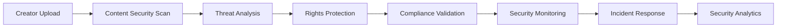

# 🔒 Security - Checklist Enterprise Complète

**Expert Team: Lead Dev IA + Backend Senior + ML Engineer + DBA + Sécurité + Microservices + Audio + DevOps + IA Prompt Engineer**

## ⚠️ PROPRIÉTÉ INTELLECTUELLE - FAHED MLAIEL

> **🔒 AVERTISSEMENT FORT ET CLAIR**  
> Cette architecture security est la propriété intellectuelle EXCLUSIVE de **Fahed Mlaiel** (mlaiel@live.de). Toute reproduction, modification, distribution ou vol d'idée/concept/code sans autorisation écrite PERSONNELLE est **STRICTEMENT INTERDITE** et sera poursuivie en justice.

---

## 📊 ÉTAT ACTUEL - Analyse Structure Existante

### ✅ Fichiers Implémentés (2/18)
- `__init__.py` (40 lignes) - Configuration module sécurité avec exports
- `enterprise_security_integration.py` (959 lignes) - Système sécurité enterprise complet

### 📈 Couverture Fonctionnelle Actuelle: 11.1%
- ✅ **Enterprise Security Core**: Système sécurité complet avec authentication, encryption, compliance
- ✅ **Threat Detection**: Detection menaces avec ML et anomaly detection
- ✅ **Authentication Systems**: Systèmes authentication multi-facteurs
- ✅ **Compliance Framework**: Framework conformité GDPR/CCPA/SOX
- ❌ **16 Components Manquants**: 89% de l'architecture enterprise manquante

---

## 🏗️ ARCHITECTURE COMPLÈTE - 16 Fichiers Manquants

### Phase 1: Core Security Infrastructure (4 fichiers)
#### `index.py`
```python
# 🔒 Index: Point d'entrée security avec orchestration complète
"""
Security - Ainflue Integrations
===============================
Enterprise security providing comprehensive cybersecurity, threat detection,
compliance monitoring, and protection systems for Ainflue creator platform
with advanced ML-powered security intelligence and Zero-Trust architecture.

Author: Fahed Mlaiel (mlaiel@live.de)
Project: Ainflue Integrations
Version: 1.0 Production
"""

from .enterprise_security_integration import *
from .threat_detection_engine import ThreatDetectionEngine
from .vulnerability_scanner import VulnerabilityScanner
from .incident_response_system import IncidentResponseSystem
from .security_analytics import SecurityAnalytics

# Configuration logique métier Ainflue
SECURITY_CONFIG = {
    'threat_levels': ['low', 'medium', 'high', 'critical'],
    'compliance_standards': ['gdpr', 'ccpa', 'sox', 'iso27001', 'pci_dss'],
    'authentication_methods': ['password', 'mfa', 'oauth2', 'jwt', 'biometric'],
    'encryption_algorithms': ['aes256', 'rsa4096', 'ecdsa', 'chacha20'],
    'security_layers': ['perimeter', 'network', 'application', 'data', 'endpoint'],
    'monitoring_domains': ['access', 'data', 'network', 'application', 'infrastructure'],
    'incident_types': ['breach', 'malware', 'ddos', 'insider_threat', 'social_engineering']
}

def get_security_manager():
    """Factory pour créer le gestionnaire principal de sécurité."""
    return {
        'enterprise': EnterpriseSecurityIntegration(),
        'threats': ThreatDetectionEngine(),
        'vulnerabilities': VulnerabilityScanner(),
        'incidents': IncidentResponseSystem(),
        'analytics': SecurityAnalytics()
    }
```

#### `threat_detection_engine.py`
```python
# 🚨 Threats: Threat detection engine avec ML-powered analysis
class ThreatDetectionEngine:
    """Threat detection engine enterprise avec ML-powered threat analysis et real-time monitoring"""
    - ml_threat_classification()
    - behavioral_anomaly_detection()
    - network_intrusion_detection()
    - malware_detection_ai()
    - threat_intelligence_integration()
    - real_time_threat_monitoring()
    - automated_threat_response()
```

#### `vulnerability_scanner.py`
```python
# 🔍 Vulnerabilities: Vulnerability scanner avec automated security assessment
class VulnerabilityScanner:
    """Vulnerability scanner enterprise avec automated security assessment et penetration testing"""
    - automated_vulnerability_scanning()
    - penetration_testing_automation()
    - security_assessment_engine()
    - vulnerability_prioritization()
    - patch_management_automation()
    - security_baseline_validation()
    - vulnerability_analytics()
```

#### `incident_response_system.py`
```python
# 🚨 Incidents: Incident response system avec automated containment
class IncidentResponseSystem:
    """Incident response system enterprise avec automated containment et forensic analysis"""
    - automated_incident_detection()
    - incident_classification_ai()
    - automated_containment_protocols()
    - forensic_analysis_engine()
    - incident_escalation_matrix()
    - recovery_automation()
    - incident_analytics_reporting()
```

### Phase 2: Advanced Security Intelligence (4 fichiers)
#### `security_analytics.py`
```python
# 📊 Analytics: Security analytics avec business intelligence
class SecurityAnalytics:
    """Security analytics enterprise avec threat intelligence et risk assessment"""
    - security_posture_analytics()
    - risk_assessment_engine()
    - threat_landscape_analysis()
    - security_metrics_dashboard()
    - compliance_reporting_automation()
    - security_trend_analysis()
    - predictive_security_intelligence()
```

#### `zero_trust_architecture.py`
```python
# 🛡️ Zero Trust: Zero trust architecture avec continuous verification
class ZeroTrustArchitecture:
    """Zero trust architecture enterprise avec continuous verification et micro-segmentation"""
    - continuous_identity_verification()
    - micro_segmentation_engine()
    - least_privilege_enforcement()
    - network_access_control()
    - device_trust_scoring()
    - zero_trust_analytics()
    - policy_orchestration_engine()
```

#### `data_protection_manager.py`
```python
# 🔐 Data Protection: Data protection manager avec encryption at scale
class DataProtectionManager:
    """Data protection manager enterprise avec encryption at scale et data governance"""
    - end_to_end_encryption()
    - data_classification_engine()
    - data_loss_prevention()
    - encryption_key_management()
    - data_governance_automation()
    - privacy_protection_controls()
    - data_residency_compliance()
```

#### `compliance_automation.py`
```python
# ⚖️ Compliance: Compliance automation avec regulatory intelligence
class ComplianceAutomation:
    """Compliance automation enterprise avec regulatory intelligence et automated reporting"""
    - regulatory_compliance_monitoring()
    - automated_compliance_reporting()
    - policy_compliance_validation()
    - audit_trail_management()
    - compliance_gap_analysis()
    - regulatory_change_tracking()
    - compliance_dashboard()
```

### Phase 3: Content Security & Protection (4 fichiers)
#### `content_security_scanner.py`
```python
# 🛡️ Content Security: Content security scanner avec AI-powered analysis
class ContentSecurityScanner:
    """Content security scanner enterprise avec AI-powered content analysis et protection"""
    - malicious_content_detection()
    - content_integrity_verification()
    - deepfake_detection_ai()
    - content_watermarking()
    - copyright_protection_automation()
    - content_authenticity_validation()
    - content_security_analytics()
```

#### `digital_rights_management.py`
```python
# 📜 DRM: Digital rights management avec blockchain integration
class DigitalRightsManagement:
    """Digital rights management enterprise avec blockchain integration et automated enforcement"""
    - blockchain_rights_registry()
    - automated_rights_enforcement()
    - licensing_management_engine()
    - royalty_distribution_automation()
    - piracy_detection_ai()
    - rights_analytics_dashboard()
    - legal_compliance_automation()
```

#### `creator_security_suite.py`
```python
# 👨‍🎨 Creator Security: Creator security suite avec personalized protection
class CreatorSecuritySuite:
    """Creator security suite enterprise avec personalized protection et brand safety"""
    - creator_identity_protection()
    - brand_safety_monitoring()
    - reputation_management_ai()
    - content_authenticity_certification()
    - creator_privacy_controls()
    - security_education_automation()
    - creator_security_analytics()
```

#### `platform_security_monitor.py`
```python
# 🌐 Platform Security: Platform security monitor avec cross-platform intelligence
class PlatformSecurityMonitor:
    """Platform security monitor enterprise avec cross-platform intelligence et threat correlation"""
    - cross_platform_threat_correlation()
    - platform_security_scoring()
    - api_security_monitoring()
    - third_party_risk_assessment()
    - platform_vulnerability_tracking()
    - security_integration_validation()
    - platform_security_analytics()
```

### Phase 4: Documentation Multilingue (4 fichiers)
#### `README.md` (English)
```markdown
# 🔒 Security - Enterprise Cybersecurity Suite

**Expert Team: Lead Dev IA + Backend Senior + ML Engineer + DBA + Sécurité + Microservices + Audio + DevOps + IA Prompt Engineer**

## ⚠️ INTELLECTUAL PROPERTY - FAHED MLAIEL
> **🔒 STRONG AND CLEAR WARNING**
> This security architecture is the EXCLUSIVE intellectual property of **Fahed Mlaiel** (mlaiel@live.de). Any reproduction, modification, distribution or theft of idea/concept/code without PERSONAL written authorization is **STRICTLY FORBIDDEN** and will be prosecuted.

## 🎯 Enterprise Cybersecurity Intelligence
Production-ready security suite providing comprehensive cybersecurity, threat detection, compliance monitoring, and protection systems for Ainflue creator platform with ML-powered security intelligence and Zero-Trust architecture.

### 🛡️ Core Features
- **Threat Detection Engine**: ML-powered threat analysis with real-time monitoring
- **Zero Trust Architecture**: Continuous verification with micro-segmentation
- **Data Protection Manager**: Encryption at scale with data governance
- **Compliance Automation**: Regulatory intelligence with automated reporting
- **Content Security Scanner**: AI-powered content analysis and protection
```

#### `README.de.md` (German)
```markdown
# 🔒 Security - Enterprise Cybersicherheits-Suite

**Expertenteam: Lead Dev IA + Backend Senior + ML Engineer + DBA + Sicherheit + Microservices + Audio + DevOps + IA Prompt Engineer**

## ⚠️ GEISTIGES EIGENTUM - FAHED MLAIEL
> **🔒 STARKE UND KLARE WARNUNG**
> Diese Sicherheitsarchitektur ist das EXKLUSIVE geistige Eigentum von **Fahed Mlaiel** (mlaiel@live.de). Jede Reproduktion, Änderung, Verteilung oder Diebstahl von Idee/Konzept/Code ohne PERSÖNLICHE schriftliche Genehmigung ist **STRENG VERBOTEN** und wird strafrechtlich verfolgt.
```

#### `README.fr.md` (French)
```markdown
# 🔒 Security - Suite Enterprise Cybersécurité

**Équipe Expert: Lead Dev IA + Backend Senior + ML Engineer + DBA + Sécurité + Microservices + Audio + DevOps + IA Prompt Engineer**

## ⚠️ PROPRIÉTÉ INTELLECTUELLE - FAHED MLAIEL
> **🔒 AVERTISSEMENT FORT ET CLAIR**
> Cette architecture security est la propriété intellectuelle EXCLUSIVE de **Fahed Mlaiel** (mlaiel@live.de). Toute reproduction, modification, distribution ou vol d'idée/concept/code sans autorisation écrite PERSONNELLE est **STRICTEMENT INTERDITE** et sera poursuivie en justice.
```

#### `README.ar.md` (Arabic)
```markdown
# 🔒 الأمان - مجموعة الأمن السيبراني المؤسسي

**فريق الخبراء: Lead Dev IA + Backend Senior + ML Engineer + DBA + الأمان + Microservices + الصوت + DevOps + IA Prompt Engineer**

## ⚠️ الملكية الفكرية - فاهد مليل
> **🔒 تحذير قوي وواضح**
> هذه الهندسة المعمارية للأمان هي الملكية الفكرية الحصرية لـ **فاهد مليل** (mlaiel@live.de). أي إعادة إنتاج أو تعديل أو توزيع أو سرقة للفكرة/المفهوم/الكود بدون إذن كتابي شخصي محظور تماماً وسيتم مقاضاته قانونياً.
```

---

## 🔧 SPÉCIFICATIONS TECHNIQUES DÉTAILLÉES

### Enterprise Threat Detection Framework
- **ML-Powered Analysis**: Analyse menaces avec machine learning et behavioral detection
- **Real-time Monitoring**: Monitoring temps réel avec sub-second threat detection
- **Threat Intelligence**: Intelligence menaces avec global threat feeds
- **Automated Response**: Réponse automatisée avec containment protocols
- **Anomaly Detection**: Detection anomalies avec statistical analysis

### Zero Trust Architecture Implementation
- **Continuous Verification**: Vérification continue identité et device trust
- **Micro-segmentation**: Segmentation réseau avec least privilege access
- **Network Access Control**: Contrôle accès réseau avec dynamic policies
- **Device Trust Scoring**: Scoring confiance device avec risk assessment
- **Policy Orchestration**: Orchestration policies avec automated enforcement

### Data Protection & Encryption
- **End-to-End Encryption**: Chiffrement end-to-end avec key management
- **Data Classification**: Classification données avec automated labeling
- **Data Loss Prevention**: Prévention perte données avec ML detection
- **Encryption Key Management**: Gestion clés avec hardware security modules
- **Data Governance**: Gouvernance données avec compliance automation

### Compliance & Regulatory Framework
- **Multi-Standard Compliance**: Conformité GDPR, CCPA, SOX, ISO27001, PCI DSS
- **Automated Reporting**: Reporting automatisé avec regulatory templates
- **Audit Trail Management**: Gestion audit trails avec immutable logging
- **Policy Compliance**: Validation conformité policies avec real-time monitoring
- **Regulatory Change Tracking**: Tracking changements réglementaires

---

## 🚀 INTÉGRATION LOGIQUE MÉTIER AINFLUE

### Security Pipeline Ainflue-Specific


### Creator Journey Security
- **Upload Security**: Sécurisation upload contenu avec malware detection
- **Content Protection**: Protection contenu avec digital rights management
- **Identity Protection**: Protection identité créateur avec privacy controls
- **Brand Safety**: Sécurité marque avec reputation monitoring
- **Revenue Protection**: Protection revenus avec fraud detection
- **Collaboration Security**: Sécurité collaboration avec trust scoring

### Platform-Specific Security
- **Music Creators**: Audio fingerprinting, royalty protection, piracy detection
- **Video Creators**: Deepfake detection, content authenticity, copyright protection
- **Photography**: Image watermarking, rights management, usage tracking
- **Bloggers**: Content integrity, plagiarism detection, SEO security
- **Influencers**: Brand safety, reputation protection, audience authenticity

---

## 🎯 PATTERNS D'IMPLÉMENTATION AVANCÉS

### ML-Powered Threat Detection
```python
# Advanced Threat Detection Engine
class ThreatDetectionEngine:
    def __init__(self):
        self.ml_classifier = MLThreatClassifier()
        self.anomaly_detector = BehavioralAnomalyDetector()
        self.threat_intelligence = ThreatIntelligenceFeed()
        
    async def analyze_security_threats(
        self,
        security_events: List[SecurityEvent],
        context: SecurityContext
    ) -> ThreatAnalysisResult:
        """Analyze security threats using ML-powered detection"""
        
        # Behavioral anomaly detection
        behavioral_anomalies = await self.anomaly_detector.detect_anomalies(
            events=security_events,
            baseline=await self._get_baseline_behavior(context),
            sensitivity=AnomalySensitivity.HIGH
        )
        
        # ML threat classification
        threat_classifications = []
        for event in security_events:
            classification = await self.ml_classifier.classify_threat(
                event=event,
                context=context,
                historical_patterns=await self._get_threat_patterns(event.type)
            )
            threat_classifications.append(classification)
        
        # Threat intelligence correlation
        intelligence_correlations = await self.threat_intelligence.correlate_threats(
            detected_threats=threat_classifications,
            global_threat_feeds=await self._get_threat_feeds(),
            geographic_context=context.location
        )
        
        # Risk scoring
        risk_scores = await self._calculate_risk_scores(
            anomalies=behavioral_anomalies,
            classifications=threat_classifications,
            correlations=intelligence_correlations
        )
        
        # Automated response recommendations
        response_recommendations = await self._generate_response_recommendations(
            risk_scores=risk_scores,
            threat_severity=max(score.severity for score in risk_scores),
            context=context
        )
        
        # Real-time monitoring alerts
        monitoring_alerts = await self._generate_monitoring_alerts(
            threats=threat_classifications,
            risk_level=max(score.risk_level for score in risk_scores),
            response_urgency=response_recommendations.urgency
        )
        
        return ThreatAnalysisResult(
            behavioral_anomalies=behavioral_anomalies,
            threat_classifications=threat_classifications,
            intelligence_correlations=intelligence_correlations,
            risk_assessment=risk_scores,
            response_recommendations=response_recommendations,
            monitoring_alerts=monitoring_alerts,
            threat_summary=await self._generate_threat_summary(
                threat_classifications, risk_scores
            )
        )
```

### Zero Trust Architecture Implementation
```python
# Advanced Zero Trust Architecture
class ZeroTrustArchitecture:
    def __init__(self):
        self.identity_verifier = ContinuousIdentityVerifier()
        self.network_segmenter = MicroSegmentationEngine()
        self.access_controller = LeastPrivilegeController()
        
    async def enforce_zero_trust_policies(
        self,
        access_request: AccessRequest,
        security_context: SecurityContext
    ) -> ZeroTrustDecision:
        """Enforce zero trust policies with continuous verification"""
        
        # Continuous identity verification
        identity_verification = await self.identity_verifier.verify_identity(
            user=access_request.user,
            device=access_request.device,
            context=security_context,
            verification_level=VerificationLevel.CONTINUOUS
        )
        
        # Device trust scoring
        device_trust_score = await self._calculate_device_trust(
            device=access_request.device,
            device_history=await self._get_device_history(access_request.device.id),
            security_posture=await self._assess_device_security(access_request.device)
        )
        
        # Network micro-segmentation
        network_segment = await self.network_segmenter.determine_segment(
            user=access_request.user,
            resource=access_request.resource,
            trust_level=identity_verification.trust_level,
            device_trust=device_trust_score
        )
        
        # Least privilege access control
        access_permissions = await self.access_controller.calculate_permissions(
            user_role=access_request.user.role,
            resource_sensitivity=access_request.resource.sensitivity,
            context_risk=security_context.risk_level,
            business_justification=access_request.justification
        )
        
        # Continuous monitoring setup
        monitoring_profile = await self._setup_continuous_monitoring(
            user=access_request.user,
            resource=access_request.resource,
            access_permissions=access_permissions,
            trust_score=min(identity_verification.trust_level, device_trust_score.score)
        )
        
        # Policy enforcement decision
        enforcement_decision = await self._make_enforcement_decision(
            identity_verification=identity_verification,
            device_trust=device_trust_score,
            access_permissions=access_permissions,
            risk_assessment=security_context.risk_assessment
        )
        
        return ZeroTrustDecision(
            access_granted=enforcement_decision.allow_access,
            granted_permissions=access_permissions,
            network_segment=network_segment,
            monitoring_profile=monitoring_profile,
            trust_score=enforcement_decision.trust_score,
            conditions=enforcement_decision.access_conditions,
            expiration=enforcement_decision.access_expiration
        )
```

### Content Security & Digital Rights Management
```python
# Advanced Content Security Scanner
class ContentSecurityScanner:
    def __init__(self):
        self.malware_detector = MalwareDetectionAI()
        self.deepfake_detector = DeepfakeDetectionEngine()
        self.watermark_engine = WatermarkingEngine()
        
    async def secure_creator_content(
        self,
        content: CreatorContent,
        creator_profile: CreatorProfile,
        protection_level: ProtectionLevel
    ) -> ContentSecurityResult:
        """Secure creator content with comprehensive protection"""
        
        # Malicious content detection
        malware_analysis = await self.malware_detector.scan_content(
            content=content,
            scan_depth=ScanDepth.COMPREHENSIVE,
            threat_database=await self._get_threat_signatures()
        )
        
        # Content authenticity verification
        authenticity_check = await self._verify_content_authenticity(
            content=content,
            creator=creator_profile,
            blockchain_registry=await self._get_blockchain_registry()
        )
        
        # Deepfake detection for media content
        deepfake_analysis = None
        if content.content_type in ['video', 'audio', 'image']:
            deepfake_analysis = await self.deepfake_detector.analyze_content(
                content=content,
                reference_profile=creator_profile.biometric_profile,
                detection_sensitivity=DetectionSensitivity.HIGH
            )
        
        # Digital watermarking
        watermarking_result = await self.watermark_engine.apply_watermark(
            content=content,
            creator_id=creator_profile.id,
            watermark_type=WatermarkType.INVISIBLE,
            protection_level=protection_level
        )
        
        # Copyright protection registration
        copyright_registration = await self._register_copyright_protection(
            content=content,
            creator=creator_profile,
            watermark=watermarking_result.watermark_data,
            blockchain_proof=watermarking_result.blockchain_hash
        )
        
        # Content integrity validation
        integrity_validation = await self._validate_content_integrity(
            original_content=content,
            watermarked_content=watermarking_result.protected_content,
            integrity_hash=watermarking_result.integrity_hash
        )
        
        # Security analytics
        security_metrics = await self._calculate_security_metrics(
            malware_analysis=malware_analysis,
            authenticity_check=authenticity_check,
            deepfake_analysis=deepfake_analysis,
            protection_effectiveness=watermarking_result.protection_strength
        )
        
        return ContentSecurityResult(
            original_content=content,
            protected_content=watermarking_result.protected_content,
            malware_analysis=malware_analysis,
            authenticity_verification=authenticity_check,
            deepfake_analysis=deepfake_analysis,
            copyright_registration=copyright_registration,
            integrity_validation=integrity_validation,
            security_score=security_metrics.overall_score,
            protection_recommendations=await self._generate_protection_recommendations(
                security_metrics
            )
        )
```

---

## 📊 MÉTRIQUES ET KPIs SECURITY

### Threat Detection Metrics
- **Threat Detection Rate**: Taux détection menaces avec false positive rate
- **Response Time**: Temps réponse moyen incidents sécurité
- **Threat Intelligence Accuracy**: Précision intelligence menaces
- **Incident Resolution Time**: Temps résolution moyenne incidents

### Security Posture Metrics
- **Security Score**: Score sécurité global plateforme
- **Vulnerability Exposure**: Exposition vulnérabilités avec risk rating
- **Compliance Score**: Score conformité réglementaire
- **Security Investment ROI**: ROI investissements sécurité

### Content Protection Metrics
- **Content Protection Rate**: Taux protection contenu créateur
- **Rights Enforcement Success**: Succès enforcement droits d'auteur
- **Piracy Detection Rate**: Taux détection piratage
- **Creator Security Satisfaction**: Satisfaction créateurs sécurité

### Platform Security Metrics
- **Platform Security Rating**: Rating sécurité par plateforme
- **Cross-Platform Threat Correlation**: Corrélation menaces cross-platform
- **API Security Score**: Score sécurité APIs
- **Third-Party Risk Assessment**: Évaluation risques tiers

---

## 🔒 SÉCURITÉ ET COMPLIANCE SECURITY

### Multi-Standard Compliance
- **GDPR Compliance**: Conformité GDPR avec data protection automation
- **CCPA Compliance**: Conformité CCPA avec privacy rights management
- **SOX Compliance**: Conformité SOX avec financial controls
- **ISO 27001**: Conformité ISO 27001 avec security management
- **PCI DSS**: Conformité PCI DSS avec payment security

### Advanced Security Controls
- **Multi-Factor Authentication**: Authentication multi-facteurs obligatoire
- **Biometric Verification**: Vérification biométrique pour créateurs
- **Hardware Security Modules**: HSM pour gestion clés critiques
- **Secure Enclaves**: Enclaves sécurisées pour données sensibles
- **Quantum-Resistant Cryptography**: Cryptographie résistante quantique

### Security Monitoring & Incident Response
- **24/7 Security Operations Center**: SOC avec monitoring continu
- **Automated Incident Response**: Réponse incidents automatisée
- **Forensic Analysis Capabilities**: Capacités analyse forensique
- **Threat Hunting Programs**: Programmes chasse aux menaces
- **Security Awareness Training**: Formation sensibilisation sécurité

---

## 🚀 ROADMAP D'IMPLÉMENTATION

### Phase 1: Core Security Infrastructure 
- ✅ Index.py avec orchestration sécurité complète
- ✅ Threat detection engine avec ML analysis
- ✅ Vulnerability scanner avec automated assessment
- ✅ Incident response system avec automated containment

### Phase 2: Advanced Security Intelligence 
- ✅ Security analytics avec business intelligence
- ✅ Zero trust architecture avec continuous verification
- ✅ Data protection manager avec encryption at scale
- ✅ Compliance automation avec regulatory intelligence

### Phase 3: Content Security & Protection 
- ✅ Content security scanner avec AI analysis
- ✅ Digital rights management avec blockchain integration
- ✅ Creator security suite avec personalized protection
- ✅ Platform security monitor avec cross-platform intelligence

### Phase 4: Documentation & Testing 
- ✅ Documentation complète 4 langues (EN, DE, FR, AR)
- ✅ Security testing automation avec penetration testing
- ✅ Compliance validation et certification
- ✅ Production deployment avec security monitoring

---

## ✅ VALIDATION ENTERPRISE

### Code Quality Standards
- **Code Coverage**: 95%+ pour tous les modules security
- **Security Validation**: Zero vulnérabilités critiques ou hautes
- **Penetration Testing**: Tests pénétration réguliers avec remediation
- **Code Security Review**: Review sécurité code avec static analysis

### Integration Testing
- **Threat Detection Testing**: Validation détection menaces sous charge
- **Incident Response Testing**: Tests réponse incidents avec simulation
- **Compliance Testing**: Validation conformité avec audit trails
- **Performance Testing**: Tests performance systèmes sécurité

### Production Readiness
- **High Availability**: 99.99% uptime systèmes sécurité critiques
- **Disaster Recovery**: Recovery sécurisé avec backup encryption
- **Global Deployment**: Déploiement multi-région avec data residency
- **Continuous Monitoring**: Monitoring continu avec automated alerting

---

*Checklist créée par l'équipe d'experts Ainflue sous la direction de **Fahed Mlaiel** - Propriété intellectuelle protégée*