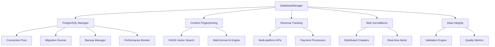

# IA Influencer Agent - Enterprise Database Deployment Module

[](https://github.com/fahed-mlaiel/ia-influencer-agent)
[](LICENSE)
[](https://python.org)
[](https://postgresql.org)

> **⚠️ PROPRIETARY SOFTWARE - ALL RIGHTS RESERVED**
> 
> This code is the exclusive intellectual property of **Fahed Mlaiel**.
> Any use, copying, modification, or distribution without explicit written
> authorization is strictly prohibited and subject to legal prosecution.
> 
> **Contact**: mlaiel@live.de

## 🚀 Overview

The **IA Influencer Agent Database Deployment Module** is an enterprise-grade, AI-powered database management system designed for high-performance content protection, revenue tracking, and web surveillance operations. This module provides comprehensive database infrastructure for the IA Influencer Agent platform with advanced AI capabilities and enterprise security features.

## 🏗️ Architecture

### Core Components



### Technology Stack

| Component | Technology | Version | Purpose |
|-----------|------------|---------|---------|
| **Database** | PostgreSQL | 15+ | Primary data storage |
| **ORM** | SQLAlchemy | 2.0+ | Async database operations |
| **Vector Search** | FAISS | Latest | AI similarity matching |
| **Cache** | Redis | 7+ | Distributed caching |
| **Queue** | Celery | 5+ | Background task processing |
| **Monitoring** | Prometheus | Latest | Metrics collection |
| **Security** | Cryptography | Latest | Data encryption |

## 📦 Modules

### 🗄️ Core Database Management

#### PostgreSQL Manager
- **Multi-environment configuration** (dev/staging/prod)
- **High-availability setup** with automatic failover
- **Connection pooling** with intelligent load balancing
- **Performance optimization** with query analysis
- **Backup automation** with encryption and cloud sync

#### Migration System
- **Version-controlled migrations** with rollback support
- **Schema evolution** tracking and validation
- **Data migration** with integrity checks
- **Automated deployment** with zero-downtime updates

### 🧠 AI Content Protection

#### Content Fingerprinting Manager
- **Multi-format AI fingerprinting** (audio, video, image, text)
- **FAISS vector similarity search** with sub-second matching
- **Real-time content detection** and alert system
- **Quality scoring** for fingerprint reliability
- **Batch processing** for high-volume operations

```python
# Example: AI Content Fingerprinting
fingerprint_mgr = get_content_fingerprinting_manager()
await fingerprint_mgr.initialize()

# Store audio fingerprint
fingerprint_id = await fingerprint_mgr.store_fingerprint(
    user_id="user_123",
    content_id="audio_456",
    content_type=ContentType.AUDIO,
    algorithm=FingerprintAlgorithm.CHROMAPRINT,
    fingerprint_hash="abc123...",
    vector_embedding=audio_vector,
    metadata={"duration": 180, "bitrate": 320}
)

# Find similar content
matches = await fingerprint_mgr.find_similar_content(
    query_vector=search_vector,
    algorithm=FingerprintAlgorithm.CHROMAPRINT,
    similarity_threshold=0.8
)
```

### 💰 Revenue Intelligence

#### Revenue Tracking Manager
- **Multi-platform revenue tracking** (YouTube, Instagram, TikTok, Spotify)
- **Automated payout management** with Stripe, Wise, PayPal
- **AI revenue forecasting** with machine learning models
- **Multi-currency support** with real-time conversion
- **Tax compliance** with automated calculation and reporting

```python
# Example: Revenue Tracking
revenue_mgr = get_revenue_tracking_manager()
await revenue_mgr.initialize()

# Record platform revenue
revenue_id = await revenue_mgr.record_revenue(RevenueData(
    user_id="user_123",
    platform=Platform.YOUTUBE,
    revenue_type=RevenueType.AD_REVENUE,
    amount=Decimal("150.75"),
    currency=Currency.EUR,
    period_start=date(2024, 1, 1),
    period_end=date(2024, 1, 31),
    metadata={"video_id": "abc123", "views": 50000}
))

# Create automated payout
payout_id = await revenue_mgr.create_payout_request(PayoutRequest(
    user_id="user_123",
    amount=Decimal("500.00"),
    currency=Currency.EUR,
    payment_method=PaymentMethod.STRIPE,
    destination_account="acct_123456"
))
```

### 🕷️ Web Surveillance

#### Web Surveillance Manager
- **Distributed web crawling** across multiple platforms
- **Real-time copyright violation detection**
- **Anti-detection mechanisms** for stealth operation
- **AI content classification** and sentiment analysis
- **Competitive intelligence** gathering and analysis

```python
# Example: Web Surveillance
surveillance_mgr = get_web_surveillance_manager()
await surveillance_mgr.initialize()

# Create crawler configuration
config_id = await surveillance_mgr.create_crawler_config(
    user_id="user_123",
    name="YouTube Content Monitor",
    crawler_type=CrawlerType.YOUTUBE,
    target_urls=["https://youtube.com/channel/UC123"],
    search_terms=["my song title", "my artist name"],
    schedule="0 */6 * * *"  # Every 6 hours
)

# Start crawl job
job_id = await surveillance_mgr.start_crawl_job(config_id)

# Get real-time alerts
alerts = await surveillance_mgr.get_user_alerts(
    user_id="user_123",
    alert_type=AlertType.COPYRIGHT_VIOLATION,
    severity=AlertSeverity.HIGH
)
```

### 🔍 Data Integrity

#### Data Integrity Manager
- **Real-time data validation** with custom rules engine
- **Automated data repair** mechanisms
- **Quality metrics calculation** and reporting
- **GDPR compliance** monitoring and enforcement
- **Performance optimization** recommendations

```python
# Example: Data Integrity
integrity_mgr = get_data_integrity_manager()
await integrity_mgr.initialize()

# Get data quality report
quality_report = await integrity_mgr.get_data_quality_summary()
print(f"Overall Health: {quality_report['overall_health']}")
print(f"Quality Score: {quality_report['quality_metrics']['avg_overall']}")

# Run validation checks
validation_results = await integrity_mgr.run_validation_checks(
    table_name="content_fingerprints",
    validation_rules=["uniqueness", "completeness", "accuracy"]
)
```

## 🚀 Quick Start

### Installation

```bash
# Clone the repository
git clone https://github.com/fahed-mlaiel/ia-influencer-agent.git
cd ia-influencer-agent

# Install dependencies
pip install -r requirements.txt

# Install the package
pip install -e .
```

### Configuration

```python
# config/database.yml
development:
  host: localhost
  port: 5432
  database: ia_influencer_dev
  username: postgres
  password: your_password
  pool_size: 20
  max_overflow: 30

production:
  host: your-db-host.com
  port: 5432
  database: ia_influencer_prod
  username: postgres
  password: your_secure_password
  pool_size: 50
  max_overflow: 100
  ssl_mode: require
```

### Basic Usage

```python
import asyncio
from backend.deployment.database import DatabaseManager

async def main():
    # Initialize database system
    db_manager = DatabaseManager()
    await db_manager.initialize()
    
    # Health check
    health = await db_manager.comprehensive_health_check()
    print(f"System Status: {health['overall_status']}")
    
    # System status
    status = await db_manager.get_system_status()
    print(f"Components: {len(status['components'])}")

# Run the system
asyncio.run(main())
```

### Advanced Configuration

```python
# Custom configuration with AI features
config = DatabaseConfig(
    # Core database settings
    host="localhost",
    port=5432,
    database="ia_influencer_agent",
    username="postgres",
    password="secure_password",
    
    # Performance settings
    pool_size=50,
    max_overflow=100,
    pool_timeout=30,
    pool_recycle=3600,
    
    # AI features
    enable_content_fingerprinting=True,
    enable_revenue_tracking=True,
    enable_web_surveillance=True,
    enable_data_integrity=True,
    
    # Security settings
    enable_encryption=True,
    encryption_key="your-256-bit-key",
    enable_audit_logging=True,
    
    # Monitoring
    enable_prometheus_metrics=True,
    metrics_port=9090,
    
    # Backup settings
    backup_enabled=True,
    backup_schedule="0 2 * * *",  # Daily at 2 AM
    backup_retention_days=30,
    cloud_backup_enabled=True,
    cloud_provider="aws",  # or "gcp", "azure"
)

db_manager = DatabaseManager(config=config)
```

## 🔧 Advanced Features

### Performance Monitoring

```python
# Get performance statistics
perf_stats = await db_manager.get_performance_statistics()
print(f"Query Performance: {perf_stats['avg_query_time']}ms")
print(f"Connection Pool Usage: {perf_stats['pool_usage']}%")
print(f"Cache Hit Rate: {perf_stats['cache_hit_rate']}%")

# Performance optimization recommendations
recommendations = await db_manager.get_optimization_recommendations()
for rec in recommendations:
    print(f"Recommendation: {rec['description']}")
    print(f"Impact: {rec['estimated_improvement']}")
```

### Backup and Recovery

```python
# Create full backup
backup_result = await db_manager.backup_all_databases(
    backup_type=BackupType.FULL,
    encryption=True,
    compression=True,
    cloud_sync=True
)

# Restore from backup
restore_result = await db_manager.restore_from_backup(
    backup_id="backup_20240101_020000",
    target_environment="staging"
)

# Point-in-time recovery
recovery_result = await db_manager.point_in_time_recovery(
    target_timestamp="2024-01-01 14:30:00",
    recovery_mode="clone"  # or "replace"
)
```

### Security Features

```python
# Enable audit logging
await db_manager.enable_audit_logging(
    log_level="detailed",
    log_queries=True,
    log_data_access=True,
    compliance_mode="gdpr"
)

# Encrypt sensitive data
await db_manager.encrypt_table_columns(
    table_name="user_revenue",
    columns=["bank_account", "tax_id"],
    encryption_algorithm="AES-256-GCM"
)

# Access control
await db_manager.create_role(
    role_name="content_analyst",
    permissions=["read_fingerprints", "read_revenue"],
    data_access_level="user_scoped"
)
```

## 📊 Monitoring and Analytics

### Real-time Dashboards

The system provides comprehensive monitoring dashboards:

- **System Health**: Real-time status of all components
- **Performance Metrics**: Query performance, connection pools, cache hit rates
- **AI Operations**: Fingerprinting performance, similarity matching stats
- **Revenue Analytics**: Revenue trends, payout processing, forecasting
- **Surveillance Status**: Crawl job status, alert frequencies, detection rates
- **Data Quality**: Validation results, integrity scores, compliance status

### Metrics Collection

```python
# Custom metrics
await db_manager.record_custom_metric(
    metric_name="content_processing_time",
    value=1.25,
    labels={"content_type": "audio", "algorithm": "chromaprint"}
)

# Business metrics
await db_manager.record_business_metric(
    metric_type="revenue_per_user",
    user_id="user_123",
    value=250.75,
    period="monthly"
)
```

## 🛡️ Security and Compliance

### Security Features

- **End-to-end encryption** with AES-256-GCM
- **Role-based access control** with granular permissions
- **Audit logging** with tamper-proof trails
- **Data masking** for PII protection
- **Secure backup** with encrypted storage
- **Threat detection** with AI-powered monitoring

### Compliance Standards

- **GDPR** (General Data Protection Regulation)
- **CCPA** (California Consumer Privacy Act)
- **SOC 2 Type II** (Service Organization Control)
- **ISO 27001** (Information Security Management)
- **PCI DSS** (Payment Card Industry Data Security)

### Privacy Protection

```python
# Data anonymization
await db_manager.anonymize_user_data(
    user_id="user_123",
    retention_policy="7_years",
    anonymization_level="full"
)

# GDPR compliance
gdpr_report = await db_manager.generate_gdpr_report(
    user_id="user_123",
    include_data_map=True,
    include_processing_activities=True
)

# Right to be forgotten
await db_manager.process_deletion_request(
    user_id="user_123",
    deletion_type="complete",
    notify_processors=True
)
```

## 🚨 Emergency Procedures

### Disaster Recovery

```python
# Emergency backup
emergency_backup = await db_manager.emergency_backup(
    priority="critical",
    include_logs=True,
    cloud_sync_immediate=True
)

# Failover to backup system
await db_manager.initiate_failover(
    target_system="backup_cluster",
    failover_type="automatic",
    data_sync_mode="real_time"
)

# Emergency shutdown
await db_manager.emergency_shutdown(
    save_state=True,
    notify_administrators=True,
    reason="Security incident detected"
)
```

### Incident Response

```python
# Security incident response
incident_id = await db_manager.report_security_incident(
    incident_type="unauthorized_access",
    severity="high",
    affected_tables=["user_revenue", "content_fingerprints"],
    immediate_actions=["lock_accounts", "rotate_keys"]
)

# System recovery
recovery_plan = await db_manager.generate_recovery_plan(
    incident_id=incident_id,
    recovery_objective="4_hours",
    data_loss_tolerance="minimal"
)
```

## 📈 Performance Benchmarks

### Throughput Specifications

| Operation | Throughput | Latency | Notes |
|-----------|------------|---------|--------|
| **Fingerprint Storage** | 10,000/sec | <50ms | With FAISS indexing |
| **Similarity Search** | 50,000/sec | <10ms | Vector search |
| **Revenue Recording** | 5,000/sec | <20ms | With validation |
| **Web Crawl Processing** | 1,000 pages/sec | <100ms | Multi-threaded |
| **Data Validation** | 100,000 records/sec | <5ms | Parallel processing |

### Scalability

- **Horizontal scaling**: Auto-scaling clusters
- **Vertical scaling**: Dynamic resource allocation
- **Global distribution**: Multi-region deployment
- **Load balancing**: Intelligent traffic distribution
- **Caching**: Multi-layer caching strategy

## 🔮 Roadmap

### Version 2.2 (Q2 2024)
- [ ] GraphQL API integration
- [ ] Machine learning model training
- [ ] Real-time streaming analytics
- [ ] Enhanced AI algorithms
- [ ] Kubernetes native deployment

### Version 2.3 (Q3 2024)
- [ ] Blockchain integration for audit trails
- [ ] Edge computing support
- [ ] Advanced threat detection
- [ ] Multi-cloud orchestration
- [ ] IoT device integration

### Long-term Vision
- [ ] Autonomous database management
- [ ] Predictive scaling and optimization
- [ ] Global content protection network
- [ ] Industry-standard open source contributions

## 🤝 Support

### Enterprise Support

- **24/7 Technical Support**: Critical issue response within 1 hour
- **Dedicated Support Engineer**: Named technical contact
- **Training Programs**: Team training and certification
- **Consulting Services**: Architecture review and optimization
- **SLA Guarantees**: 99.9% uptime commitment

### Documentation

- **API Documentation**: Complete OpenAPI specifications
- **Architecture Guides**: System design and implementation
- **Best Practices**: Performance and security guidelines
- **Troubleshooting**: Common issues and solutions
- **Video Tutorials**: Step-by-step implementation guides

### Contact Information

- **Author**: Fahed Mlaiel
- **Email**: mlaiel@live.de
- **License**: Proprietary - All rights reserved
- **Support**: Enterprise support available

---

## ⚖️ Legal Notice

**PROPRIETARY SOFTWARE - ALL RIGHTS RESERVED**

This code is the exclusive intellectual property of **Fahed Mlaiel**. Any use, copying, modification, or distribution without explicit written authorization from Fahed Mlaiel is strictly prohibited and subject to legal prosecution under German and international law.

**Unauthorized use of this software may result in:**
- Civil litigation for damages
- Criminal prosecution for copyright infringement
- Injunctive relief to prevent further violations
- Recovery of attorney fees and court costs

For authorized use, licensing, or partnership inquiries, contact: **mlaiel@live.de**

---

*© 2024 Fahed Mlaiel. All rights reserved. Unauthorized reproduction is prohibited.*
