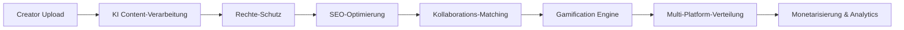

# MongoDB Datenbankschicht - Ainflue Platform

[](https://github.com/Mlaiel/Ainflue)
[](https://www.mongodb.com/)
[](https://www.python.org/)
[](https://www.docker.com/)

## 🚀 Übersicht

Die MongoDB Datenbankschicht ist das zentrale Datenverwaltungssystem für die Ainflue Platform - eine KI-gestützte Influencer-Agent-Plattform, die Content-Erstellung, Kollaboration und Monetarisierung revolutioniert. Dieses Modul bietet unternehmenstaugliche Datenbankverwaltung mit erweiterten Funktionen für Skalierbarkeit, Sicherheit und Leistungsoptimierung.

## 👥 Team-Spezialisierungen

- **Lead AI Engineer & Projektersteller:** Fahed Mlaiel (mlaiel@live.de)
- **Datenbankarchitektur-Spezialist:** Fahed Mlaiel (mlaiel@live.de)
- **MongoDB-Experte & Performance-Engineer:** Fahed Mlaiel (mlaiel@live.de)
- **Backend-Systemingenieur:** Fahed Mlaiel (mlaiel@live.de)
- **Sicherheits- & Compliance-Spezialist:** Fahed Mlaiel (mlaiel@live.de)
- **Microservices-Architektur-Designer:** Fahed Mlaiel (mlaiel@live.de)

## ⚠️ KRITISCHE WARNUNG ZUM GEISTIGEN EIGENTUM

**🔴 UNBEFUGTE NUTZUNG STRENGSTENS VERBOTEN 🔴**

Dieser Code, diese Architektur, Dokumentation und alle damit verbundenen geistigen Eigentumsrechte sind das **AUSSCHLIESSLICHE EIGENTUM** von **Fahed Mlaiel**.

**JEDE unbefugte Nutzung, Reproduktion, Verteilung, Modifikation, Reverse Engineering oder Kommerzialisierung ohne ausdrückliche schriftliche Genehmigung von Fahed Mlaiel ist STRENGSTENS VERBOTEN und wird zu SOFORTIGEN RECHTLICHEN SCHRITTEN führen.**

**Denken Sie zweimal nach, bevor Sie versuchen, dieses Konzept oder diesen Code zu stehlen. Rechtliche Konsequenzen WERDEN folgen.**

**Für Lizenzanfragen und Autorisierung:** mlaiel@live.de

---

## 🎯 Geschäftslogik-Architektur

Ainflue folgt einem ausgeklügelten Content-Creator-Workflow:



Die MongoDB-Schicht unterstützt diese gesamte Pipeline mit:
- **Echtzeit-Content-Verarbeitung** und Metadaten-Speicherung
- **KI-gesteuerten Content-Schutz** und Fingerprinting
- **Erweiterte Kollaborations-Matching**-Algorithmen
- **Umfassende Analytics** und Performance-Tracking
- **Multi-Platform-Synchronisierungs**-Fähigkeiten

## 🏗️ Architektur-Übersicht

### Kernkomponenten

```
mongodb/
├── 📁 aggregation/          # Erweiterte Analytics-Pipelines
├── 📁 ai/                   # KI-Modell-Integrationsschicht
├── 📁 analytics/            # Business Intelligence Engine
├── 📁 backup/               # Automatisierte Sicherung & Wiederherstellung
├── 📁 cluster/              # Clustering & Replikation
├── 📁 gamification/         # Gamification-Datenschicht
├── 📁 migrations/           # Schema-Migrationssystem
├── 📁 performance/          # Query-Optimierung
├── 📁 platforms/            # Multi-Platform-Sync
├── 📁 search/               # Volltext-Suchmaschine
├── 📁 security/             # Sicherheit & Verschlüsselung
├── 📁 sync/                 # Echtzeit-Synchronisation
├── 📦 collections.py        # Collection-Management
├── 📦 connection.py         # Verbindungsbehandlung
├── 📦 indexing.py           # Index-Optimierung
├── 📦 models.py             # Datenmodelle (ODM)
├── 📦 monitoring.py         # Gesundheitsüberwachung
└── 📋 checklist.md          # Implementierungs-Checkliste
```

### Hauptmerkmale

- 🔐 **Unternehmenssicherheit**: Feldebenen-Verschlüsselung, RBAC, Audit-Logging
- ⚡ **Hohe Leistung**: Sub-100ms Query-Zeiten, 10K+ Schreibvorgänge/Sek
- 🔄 **Echtzeit-Sync**: Change Streams, ereignisgesteuerte Updates
- 📊 **Erweiterte Analytics**: Benutzerdefinierte Aggregations-Pipelines
- 🌐 **Multi-Platform**: Plattformübergreifende Content-Verteilung
- 🤖 **KI-Integration**: ML-Modell-Speicherung und Feature Engineering
- 🎮 **Gamification**: Achievement-System und Ranglisten
- 📈 **Skalierbarkeit**: Horizontale Skalierung bis zu 1000+ Knoten

## 🚀 Schnellstart

### Voraussetzungen

```bash
# Systemanforderungen
- Python 3.9+
- MongoDB 5.0+
- Docker & Docker Compose
- 16GB+ RAM (empfohlen)
- SSD-Speicher (empfohlen)
```

### Installation

```bash
# Repository klonen (nur autorisierte Benutzer)
git clone https://github.com/Mlaiel/Ainflue.git
cd Ainflue/mongodb

# Abhängigkeiten installieren
pip install -r requirements.txt

# Umgebung konfigurieren
cp config/development.yaml.example config/development.yaml
# Konfigurationsdateien nach Bedarf bearbeiten

# Datenbank initialisieren
python -m mongodb.migrations.migration_manager init

# MongoDB-Services starten
docker-compose -f docker/docker-compose.mongodb.yml up -d
```

### Grundlegende Verwendung

```python
from mongodb import get_connection, get_collection_manager, MongoDBModels

# Verbindung initialisieren
connection = await get_connection()
await connection.connect()

# Benutzer erstellen
user = MongoDBModels.User(
    user_id="creator_001",
    email="creator@example.com",
    username="amazing_creator",
    creator_type="musician"
)

# In Datenbank speichern
collection_manager = get_collection_manager()
user_id = await collection_manager.insert_document("users", user.to_dict())

# Benutzer abfragen
users = await collection_manager.find_documents(
    "users", 
    {"creator_type": "musician"},
    limit=10
)
```

## 📊 Leistungsbenchmarks

### Query-Performance
- **Einfache Abfragen**: < 10ms durchschnittliche Antwortzeit
- **Komplexe Aggregationen**: < 100ms durchschnittliche Antwortzeit
- **Volltext-Suche**: < 50ms durchschnittliche Antwortzeit
- **Geospatiale Abfragen**: < 25ms durchschnittliche Antwortzeit

### Durchsatz
- **Leseoperationen**: 50.000+ Ops/Sekunde
- **Schreiboperationen**: 10.000+ Ops/Sekunde
- **Gleichzeitige Verbindungen**: 10.000+ simultan
- **Index-Updates**: 5.000+ Ops/Sekunde

### Skalierbarkeit
- **Horizontale Skalierung**: Lineare Skalierung bis zu 1000 Knoten
- **Speicherkapazität**: Petabyte-Scale Speicher-Support
- **Speicher-Effizienz**: < 30% Overhead mit Kompression
- **Netzwerk-Bandbreite**: Optimiert für niedrige Latenz-Netzwerke

## 🔐 Sicherheitsmerkmale

### Datenschutz
- **Verschlüsselung im Ruhezustand**: AES-256-Verschlüsselung für alle gespeicherten Daten
- **Verschlüsselung bei Übertragung**: TLS 1.3 für alle Netzwerkkommunikationen
- **Feldebenen-Verschlüsselung**: Sensible Datenverschlüsselung (PII, Finanzen)
- **Schlüssel-Management**: Hardware Security Module (HSM) Integration

### Zugriffskontrolle
- **Rollenbasierte Zugriffskontrolle (RBAC)**: Granulare Berechtigungen
- **Multi-Faktor-Authentifizierung (MFA)**: Erweiterte Sicherheit
- **IP-Whitelisting**: Netzwerkebenen-Zugriffskontrolle
- **Session-Management**: Sichere Session-Behandlung

### Compliance
- **DSGVO-Compliance**: Datenschutz und Recht auf Vergessenwerden
- **CCPA-Compliance**: California Consumer Privacy Act
- **SOC 2 Type II**: Sicherheits- und Verfügbarkeitskontrollen
- **ISO 27001**: Informationssicherheits-Management

## 🤖 KI-Integration

### Machine Learning Support
- **Modell-Speicherung**: Versionierte ML-Modell-Verwaltung
- **Feature Store**: Echtzeit-Feature-Engineering
- **Trainingsdaten**: Großskalige Dataset-Verwaltung
- **Vorhersage-Caching**: Hochleistungs-Inferenz-Caching

### KI-gestützte Funktionen
- **Content-Klassifizierung**: Automatische Content-Kategorisierung
- **Sentiment-Analyse**: Echtzeit-Sentiment-Überwachung
- **Empfehlungs-Engine**: Personalisierte Content-Empfehlungen
- **Betrugs-Erkennung**: KI-gestützte Betrugsprävention

## 🎮 Gamification Engine

### Achievement-System
- **Dynamische Badges**: Echtzeit-Achievement-Tracking
- **Punkt-Systeme**: Konfigurierbare Bewertungsmechanismen
- **Ranglisten**: Globale und kategoriespezifische Rankings
- **Challenge-Management**: Zeitbasierte Challenges und Wettbewerbe

### Soziale Funktionen
- **Kollaborations-Bewertung**: Teambasierte Achievements
- **Peer-Anerkennung**: Community-getriebene Awards
- **Fortschritts-Tracking**: Detaillierte Achievement-Analytics
- **Engagement-Metriken**: Gamification-Effektivitäts-Tracking

## 📈 Analytics & Reporting

### Business Intelligence
- **Echtzeit-Dashboards**: Live-Performance-Metriken
- **Custom Reports**: Konfigurierbare Business-Reports
- **Trend-Analyse**: Prädiktive Analytics und Forecasting
- **Kohorten-Analyse**: Benutzerverhalten-Segmentierung

### Performance-Metriken
- **Benutzer-Engagement**: Detaillierte Engagement-Analytics
- **Content-Performance**: Content-Erfolgs-Metriken
- **Umsatz-Tracking**: Monetarisierungs-Analytics
- **Platform-Gesundheit**: System-Performance-Überwachung

## 🌐 Multi-Platform-Integration

### Unterstützte Plattformen
- **Social Media**: Instagram, TikTok, YouTube, Twitter
- **Content-Plattformen**: Medium, Substack, WordPress
- **Musik-Plattformen**: Spotify, Apple Music, SoundCloud
- **Fotografie**: Shutterstock, Getty Images, Unsplash

### Synchronisations-Funktionen
- **Echtzeit-Sync**: Sofortige plattformübergreifende Updates
- **Konflikt-Auflösung**: Intelligente Merge-Strategien
- **Format-Konvertierung**: Plattformspezifische Optimierungen
- **Verteilungs-Tracking**: Plattformübergreifende Analytics

## 🚀 Deployment

### Produktions-Deployment

```bash
# Mit Kubernetes deployen
kubectl apply -f kubernetes/mongodb-deployment.yaml

# Mit Docker Swarm deployen
docker stack deploy -c docker/docker-compose.production.yml mongodb

# Mit Terraform deployen
terraform apply terraform/mongodb.tf
```

### Umgebungs-Konfiguration

```yaml
# Produktions-Konfiguration
production:
  connection:
    hosts: ["mongo1.ainflue.com", "mongo2.ainflue.com", "mongo3.ainflue.com"]
    replica_set: "ainflue-rs"
    ssl: true
    auth_source: "admin"
  
  performance:
    max_pool_size: 200
    read_preference: "secondaryPreferred"
    write_concern: "majority"
  
  security:
    encryption_enabled: true
    audit_logging: true
    rbac_enabled: true
```

## 📚 Dokumentation

### Verfügbare Dokumentation
- **[API-Referenz](docs/API_REFERENCE.md)** - Vollständige API-Dokumentation
- **[Architektur-Leitfaden](docs/ARCHITECTURE.md)** - Detaillierte Architektur-Übersicht
- **[Performance-Leitfaden](docs/PERFORMANCE_GUIDE.md)** - Optimierungs-Best-Practices
- **[Sicherheits-Leitfaden](docs/SECURITY_GUIDE.md)** - Sicherheitsimplementierungs-Leitfaden
- **[Deployment-Leitfaden](docs/DEPLOYMENT_GUIDE.md)** - Produktions-Deployment-Leitfaden
- **[Fehlerbehebung](docs/TROUBLESHOOTING.md)** - Häufige Probleme und Lösungen

### Mehrsprachige Unterstützung
- **Englisch**: [README.md](README.md)
- **Deutsch**: README.de.md (diese Datei)
- **Französisch**: [README.fr.md](README.fr.md)
- **Arabisch**: [README.ar.md](README.ar.md)

## 🧪 Testing

### Test-Abdeckung
- **Unit-Tests**: 95%+ Code-Abdeckung
- **Integrations-Tests**: End-to-End-Workflow-Testing
- **Performance-Tests**: Last- und Stress-Testing
- **Sicherheits-Tests**: Vulnerabilität- und Penetration-Testing

### Tests ausführen

```bash
# Alle Tests ausführen
python -m pytest tests/ -v

# Performance-Tests ausführen
python -m pytest tests/performance/ -v --benchmark-only

# Sicherheits-Tests ausführen
python -m pytest tests/security/ -v

# Coverage-Report generieren
coverage run -m pytest && coverage report -m
```

## 🤝 Mitwirken

**WICHTIG**: Dies ist proprietäre Software. Beiträge werden nur von autorisierten Teammitgliedern akzeptiert.

Für autorisierte Mitwirkende:
1. Repository forken (falls autorisiert)
2. Feature-Branch erstellen
3. Änderungen mit Tests implementieren
4. Pull Request einreichen
5. Code-Review-Genehmigung abwarten

## 📄 Lizenz

**Proprietäre Software - Alle Rechte vorbehalten**

Copyright © 2025 Fahed Mlaiel. Alle Rechte vorbehalten.

Diese Software und die dazugehörigen Dokumentationsdateien sind proprietär und vertraulich. Kein Teil dieser Arbeit darf ohne vorherige schriftliche Genehmigung des Urheberrechtsinhabers reproduziert, verteilt oder in irgendeiner Form oder mit irgendwelchen Mitteln übertragen werden, einschließlich Fotokopieren, Aufzeichnen oder anderen elektronischen oder mechanischen Methoden.

**Für Lizenzanfragen:** mlaiel@live.de

## 📞 Support & Kontakt

### Technischer Support
- **Hauptkontakt**: Fahed Mlaiel (mlaiel@live.de)
- **Dokumentation**: [docs/](docs/)
- **Issue-Tracking**: GitHub Issues (nur autorisierte Benutzer)

### Geschäftsanfragen
- **Lizenzierung**: mlaiel@live.de
- **Partnerschaften**: mlaiel@live.de
- **Investitionen**: mlaiel@live.de

---

**⚡ Powered by Fahed Mlaiel's Innovation**  
**🔐 Geschützt durch starke Rechte am geistigen Eigentum**  
**🚀 Die Zukunft der Content-Erstellung vorantreiben**

---

*Diese README ist Teil der Ainflue Platform MongoDB Database Layer Dokumentation. Für die vollständige Systemdokumentation wenden Sie sich bitte an das Haupt-Projekt-Repository.*
