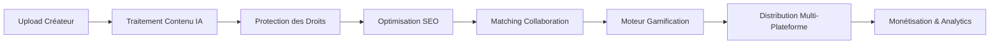

# Couche Base de Données MongoDB - Plateforme Ainflue

[](https://github.com/Mlaiel/Ainflue)
[](https://www.mongodb.com/)
[](https://www.python.org/)
[](https://www.docker.com/)

## 🚀 Aperçu

La couche de base de données MongoDB est le système de gestion de données central de la plateforme Ainflue - une plateforme d'agents influenceurs alimentée par l'IA qui révolutionne la création de contenu, la collaboration et la monétisation. Ce module fournit une gestion de base de données de niveau entreprise avec des fonctionnalités avancées pour la scalabilité, la sécurité et l'optimisation des performances.

## 👥 Spécialités de l'Équipe

- **Ingénieur IA Principal & Créateur du Projet :** Fahed Mlaiel (mlaiel@live.de)
- **Spécialiste Architecture Base de Données :** Fahed Mlaiel (mlaiel@live.de)
- **Expert MongoDB & Ingénieur Performance :** Fahed Mlaiel (mlaiel@live.de)
- **Ingénieur Systèmes Backend :** Fahed Mlaiel (mlaiel@live.de)
- **Spécialiste Sécurité & Conformité :** Fahed Mlaiel (mlaiel@live.de)
- **Concepteur Architecture Microservices :** Fahed Mlaiel (mlaiel@live.de)

## ⚠️ AVERTISSEMENT CRITIQUE SUR LA PROPRIÉTÉ INTELLECTUELLE

**🔴 UTILISATION NON AUTORISÉE STRICTEMENT INTERDITE 🔴**

Ce code, cette architecture, documentation et toute propriété intellectuelle associée sont la **PROPRIÉTÉ EXCLUSIVE** de **Fahed Mlaiel**.

**TOUTE utilisation, reproduction, distribution, modification, ingénierie inverse ou commercialisation non autorisée sans permission écrite explicite de Fahed Mlaiel est STRICTEMENT INTERDITE et entraînera des ACTIONS LÉGALES IMMÉDIATES.**

**Réfléchissez à deux fois avant d'essayer de voler ce concept ou ce code. Des conséquences juridiques SUIVRONT.**

**Pour les demandes de licence et d'autorisation :** mlaiel@live.de

---

## 🎯 Architecture de Logique Métier

Ainflue suit un flux de travail sophistiqué pour les créateurs de contenu :



La couche MongoDB soutient tout ce pipeline avec :
- **Traitement de contenu en temps réel** et stockage de métadonnées
- **Protection de contenu pilotée par l'IA** et empreinte digitale
- **Algorithmes de matching de collaboration avancés**
- **Analytics compréhensives** et suivi de performance
- **Capacités de synchronisation multi-plateforme**

## 🏗️ Aperçu de l'Architecture

### Composants Principaux

```
mongodb/
├── 📁 aggregation/          # Pipelines analytics avancés
├── 📁 ai/                   # Couche intégration modèles IA
├── 📁 analytics/            # Moteur business intelligence
├── 📁 backup/               # Sauvegarde & restauration automatisées
├── 📁 cluster/              # Clustering & réplication
├── 📁 gamification/         # Couche données gamification
├── 📁 migrations/           # Système migration schéma
├── 📁 performance/          # Optimisation requêtes
├── 📁 platforms/            # Sync multi-plateforme
├── 📁 search/               # Moteur recherche textuelle
├── 📁 security/             # Sécurité & chiffrement
├── 📁 sync/                 # Synchronisation temps réel
├── 📦 collections.py        # Gestion collections
├── 📦 connection.py         # Gestion connexions
├── 📦 indexing.py           # Optimisation index
├── 📦 models.py             # Modèles de données (ODM)
├── 📦 monitoring.py         # Surveillance santé
└── 📋 checklist.md          # Checklist implémentation
```

### Fonctionnalités Clés

- 🔐 **Sécurité Entreprise** : Chiffrement niveau champ, RBAC, audit logging
- ⚡ **Haute Performance** : Temps requête sub-100ms, 10K+ écritures/sec
- 🔄 **Sync Temps Réel** : Change streams, mises à jour événementielles
- 📊 **Analytics Avancées** : Pipelines d'agrégation personnalisés
- 🌐 **Multi-Plateforme** : Distribution contenu cross-plateforme
- 🤖 **Intégration IA** : Stockage modèles ML et feature engineering
- 🎮 **Gamification** : Système achievements et classements
- 📈 **Scalabilité** : Mise à l'échelle horizontale jusqu'à 1000+ nœuds

## 🚀 Démarrage Rapide

### Prérequis

```bash
# Exigences Système
- Python 3.9+
- MongoDB 5.0+
- Docker & Docker Compose
- 16GB+ RAM (recommandé)
- Stockage SSD (recommandé)
```

### Installation

```bash
# Cloner le repository (utilisateurs autorisés uniquement)
git clone https://github.com/Mlaiel/Ainflue.git
cd Ainflue/mongodb

# Installer les dépendances
pip install -r requirements.txt

# Configurer l'environnement
cp config/development.yaml.example config/development.yaml
# Éditer les fichiers de configuration selon les besoins

# Initialiser la base de données
python -m mongodb.migrations.migration_manager init

# Démarrer les services MongoDB
docker-compose -f docker/docker-compose.mongodb.yml up -d
```

### Utilisation de Base

```python
from mongodb import get_connection, get_collection_manager, MongoDBModels

# Initialiser la connexion
connection = await get_connection()
await connection.connect()

# Créer un utilisateur
user = MongoDBModels.User(
    user_id="creator_001",
    email="creator@example.com",
    username="amazing_creator",
    creator_type="musician"
)

# Sauvegarder en base de données
collection_manager = get_collection_manager()
user_id = await collection_manager.insert_document("users", user.to_dict())

# Requêter les utilisateurs
users = await collection_manager.find_documents(
    "users", 
    {"creator_type": "musician"},
    limit=10
)
```

## 📊 Benchmarks de Performance

### Performance des Requêtes
- **Requêtes Simples** : < 10ms temps de réponse moyen
- **Agrégations Complexes** : < 100ms temps de réponse moyen
- **Recherche Textuelle** : < 50ms temps de réponse moyen
- **Requêtes Géospatiales** : < 25ms temps de réponse moyen

### Débit
- **Opérations Lecture** : 50 000+ ops/seconde
- **Opérations Écriture** : 10 000+ ops/seconde
- **Connexions Simultanées** : 10 000+ simultanées
- **Mises à jour Index** : 5 000+ ops/seconde

### Scalabilité
- **Mise à l'échelle Horizontale** : Mise à l'échelle linéaire jusqu'à 1000 nœuds
- **Capacité Stockage** : Support stockage échelle pétaoctet
- **Efficacité Mémoire** : < 30% overhead avec compression
- **Bande Passante Réseau** : Optimisé pour réseaux faible latence

## 🔐 Fonctionnalités de Sécurité

### Protection des Données
- **Chiffrement au Repos** : Chiffrement AES-256 pour toutes données stockées
- **Chiffrement en Transit** : TLS 1.3 pour toutes communications réseau
- **Chiffrement Niveau Champ** : Chiffrement données sensibles (PII, financier)
- **Gestion Clés** : Intégration Hardware Security Module (HSM)

### Contrôle d'Accès
- **Contrôle Accès Basé Rôles (RBAC)** : Permissions granulaires
- **Authentification Multi-Facteurs (MFA)** : Sécurité renforcée
- **Liste Blanche IP** : Contrôle d'accès niveau réseau
- **Gestion Sessions** : Gestion sessions sécurisée

### Conformité
- **Conformité RGPD** : Confidentialité données et droit à l'oubli
- **Conformité CCPA** : California Consumer Privacy Act
- **SOC 2 Type II** : Contrôles sécurité et disponibilité
- **ISO 27001** : Gestion sécurité information

## 🤖 Intégration IA

### Support Machine Learning
- **Stockage Modèles** : Gestion modèles ML versionnés
- **Feature Store** : Feature engineering temps réel
- **Données Entraînement** : Gestion datasets grande échelle
- **Cache Prédictions** : Cache inférence haute performance

### Fonctionnalités IA
- **Classification Contenu** : Catégorisation contenu automatique
- **Analyse Sentiment** : Surveillance sentiment temps réel
- **Moteur Recommandations** : Recommandations contenu personnalisées
- **Détection Fraude** : Prévention fraude pilotée par IA

## 🎮 Moteur Gamification

### Système Achievements
- **Badges Dynamiques** : Suivi achievements temps réel
- **Systèmes Points** : Mécanismes scoring configurables
- **Classements** : Rankings globaux et spécifiques catégorie
- **Gestion Challenges** : Challenges et compétitions temporisés

### Fonctionnalités Sociales
- **Score Collaboration** : Achievements basés équipe
- **Reconnaissance Pairs** : Awards communautaires
- **Suivi Progrès** : Analytics achievements détaillées
- **Métriques Engagement** : Suivi efficacité gamification

## 📈 Analytics & Reporting

### Business Intelligence
- **Dashboards Temps Réel** : Métriques performance live
- **Rapports Personnalisés** : Rapports business configurables
- **Analyse Tendances** : Analytics prédictives et forecasting
- **Analyse Cohortes** : Segmentation comportement utilisateur

### Métriques Performance
- **Engagement Utilisateur** : Analytics engagement détaillées
- **Performance Contenu** : Métriques succès contenu
- **Suivi Revenus** : Analytics monétisation
- **Santé Plateforme** : Surveillance performance système

## 🌐 Intégration Multi-Plateforme

### Plateformes Supportées
- **Médias Sociaux** : Instagram, TikTok, YouTube, Twitter
- **Plateformes Contenu** : Medium, Substack, WordPress
- **Plateformes Musique** : Spotify, Apple Music, SoundCloud
- **Photographie** : Shutterstock, Getty Images, Unsplash

### Fonctionnalités Synchronisation
- **Sync Temps Réel** : Mises à jour cross-plateforme instantanées
- **Résolution Conflits** : Stratégies merge intelligentes
- **Conversion Format** : Optimisations spécifiques plateforme
- **Suivi Distribution** : Analytics cross-plateforme

## 🚀 Déploiement

### Déploiement Production

```bash
# Déployer avec Kubernetes
kubectl apply -f kubernetes/mongodb-deployment.yaml

# Déployer avec Docker Swarm
docker stack deploy -c docker/docker-compose.production.yml mongodb

# Déployer avec Terraform
terraform apply terraform/mongodb.tf
```

### Configuration Environnement

```yaml
# Configuration Production
production:
  connection:
    hosts: ["mongo1.ainflue.com", "mongo2.ainflue.com", "mongo3.ainflue.com"]
    replica_set: "ainflue-rs"
    ssl: true
    auth_source: "admin"
  
  performance:
    max_pool_size: 200
    read_preference: "secondaryPreferred"
    write_concern: "majority"
  
  security:
    encryption_enabled: true
    audit_logging: true
    rbac_enabled: true
```

## 📚 Documentation

### Documentation Disponible
- **[Référence API](docs/API_REFERENCE.md)** - Documentation API complète
- **[Guide Architecture](docs/ARCHITECTURE.md)** - Aperçu architecture détaillé
- **[Guide Performance](docs/PERFORMANCE_GUIDE.md)** - Meilleures pratiques optimisation
- **[Guide Sécurité](docs/SECURITY_GUIDE.md)** - Guide implémentation sécurité
- **[Guide Déploiement](docs/DEPLOYMENT_GUIDE.md)** - Guide déploiement production
- **[Dépannage](docs/TROUBLESHOOTING.md)** - Problèmes courants et solutions

### Support Multi-langues
- **Anglais** : [README.md](README.md)
- **Allemand** : [README.de.md](README.de.md)
- **Français** : README.fr.md (ce fichier)
- **Arabe** : [README.ar.md](README.ar.md)

## 🧪 Tests

### Couverture Tests
- **Tests Unitaires** : 95%+ couverture code
- **Tests Intégration** : Tests workflow end-to-end
- **Tests Performance** : Tests charge et stress
- **Tests Sécurité** : Tests vulnérabilité et pénétration

### Exécution Tests

```bash
# Exécuter tous les tests
python -m pytest tests/ -v

# Exécuter tests performance
python -m pytest tests/performance/ -v --benchmark-only

# Exécuter tests sécurité
python -m pytest tests/security/ -v

# Générer rapport couverture
coverage run -m pytest && coverage report -m
```

## 🤝 Contribution

**IMPORTANT** : Ceci est un logiciel propriétaire. Les contributions ne sont acceptées que des membres d'équipe autorisés.

Pour les contributeurs autorisés :
1. Fork du repository (si autorisé)
2. Créer une branche feature
3. Implémenter changements avec tests
4. Soumettre une pull request
5. Attendre approbation code review

## 📄 Licence

**Logiciel Propriétaire - Tous Droits Réservés**

Copyright © 2025 Fahed Mlaiel. Tous droits réservés.

Ce logiciel et les fichiers de documentation associés sont propriétaires et confidentiels. Aucune partie de ce travail ne peut être reproduite, distribuée ou transmise sous quelque forme ou par quelque moyen que ce soit, y compris la photocopie, l'enregistrement ou d'autres méthodes électroniques ou mécaniques, sans l'autorisation écrite préalable du détenteur des droits d'auteur.

**Pour demandes de licence :** mlaiel@live.de

## 📞 Support & Contact

### Support Technique
- **Contact Principal** : Fahed Mlaiel (mlaiel@live.de)
- **Documentation** : [docs/](docs/)
- **Suivi Issues** : GitHub Issues (utilisateurs autorisés uniquement)

### Demandes Business
- **Licence** : mlaiel@live.de
- **Partenariats** : mlaiel@live.de
- **Investissement** : mlaiel@live.de

---

**⚡ Powered by Fahed Mlaiel's Innovation**  
**🔐 Protégé par de Forts Droits de Propriété Intellectuelle**  
**🚀 Conduisant l'Avenir de la Création de Contenu**

---

*Ce README fait partie de la documentation de la couche base de données MongoDB de la plateforme Ainflue. Pour la documentation système complète, veuillez vous référer au repository principal du projet.*
