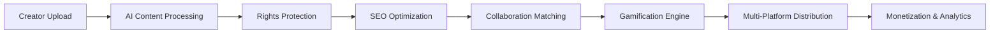

# MongoDB Database Layer - Ainflue Platform

[](https://github.com/Mlaiel/Ainflue)
[](https://www.mongodb.com/)
[](https://www.python.org/)
[](https://www.docker.com/)

## 🚀 Overview

The MongoDB Database Layer is the core data management system for the Ainflue Platform - an AI-powered influencer agent platform that revolutionizes content creation, collaboration, and monetization. This module provides enterprise-grade database management with advanced features for scalability, security, and performance optimization.

## 👥 Team Specialties

- **Lead AI Engineer & Project Creator:** Fahed Mlaiel (mlaiel@live.de)
- **Database Architecture Specialist:** Fahed Mlaiel (mlaiel@live.de)  
- **MongoDB Expert & Performance Engineer:** Fahed Mlaiel (mlaiel@live.de)
- **Backend Systems Engineer:** Fahed Mlaiel (mlaiel@live.de)
- **Security & Compliance Specialist:** Fahed Mlaiel (mlaiel@live.de)
- **Microservices Architecture Designer:** Fahed Mlaiel (mlaiel@live.de)

## ⚠️ CRITICAL INTELLECTUAL PROPERTY WARNING

**🔴 UNAUTHORIZED USE STRICTLY PROHIBITED 🔴**

This code, architecture, documentation, and all related intellectual property are the **EXCLUSIVE PROPERTY** of **Fahed Mlaiel**. 

**ANY unauthorized use, reproduction, distribution, modification, reverse engineering, or commercialization without explicit written permission from Fahed Mlaiel is STRICTLY PROHIBITED and will result in IMMEDIATE LEGAL ACTION.**

**Think twice before trying to steal this concept or code. Legal consequences WILL follow.**

**For licensing inquiries and authorization:** mlaiel@live.de

---

## 🎯 Business Logic Architecture

Ainflue follows a sophisticated content creator workflow:



The MongoDB layer supports this entire pipeline with:
- **Real-time content processing** and metadata storage
- **AI-driven content protection** and fingerprinting
- **Advanced collaboration matching** algorithms
- **Comprehensive analytics** and performance tracking
- **Multi-platform synchronization** capabilities

## 🏗️ Architecture Overview

### Core Components

```
mongodb/
├── 📁 aggregation/          # Advanced analytics pipelines
├── 📁 ai/                   # AI model integration layer
├── 📁 analytics/            # Business intelligence engine
├── 📁 backup/               # Automated backup & restore
├── 📁 cluster/              # Clustering & replication
├── 📁 gamification/         # Gamification data layer
├── 📁 migrations/           # Schema migration system
├── 📁 performance/          # Query optimization
├── 📁 platforms/            # Multi-platform sync
├── 📁 search/               # Full-text search engine
├── 📁 security/             # Security & encryption
├── 📁 sync/                 # Real-time synchronization
├── 📦 collections.py        # Collection management
├── 📦 connection.py         # Connection handling
├── 📦 indexing.py           # Index optimization
├── 📦 models.py             # Data models (ODM)
├── 📦 monitoring.py         # Health monitoring
└── 📋 checklist.md          # Implementation checklist
```

### Key Features

- 🔐 **Enterprise Security**: Field-level encryption, RBAC, audit logging
- ⚡ **High Performance**: Sub-100ms query times, 10K+ writes/sec
- 🔄 **Real-time Sync**: Change streams, event-driven updates
- 📊 **Advanced Analytics**: Custom aggregation pipelines
- 🌐 **Multi-Platform**: Cross-platform content distribution
- 🤖 **AI Integration**: ML model storage and feature engineering
- 🎮 **Gamification**: Achievement system and leaderboards
- 📈 **Scalability**: Horizontal scaling up to 1000+ nodes

## 🚀 Quick Start

### Prerequisites

```bash
# System Requirements
- Python 3.9+
- MongoDB 5.0+
- Docker & Docker Compose
- 16GB+ RAM (recommended)
- SSD Storage (recommended)
```

### Installation

```bash
# Clone the repository (authorized users only)
git clone https://github.com/Mlaiel/Ainflue.git
cd Ainflue/mongodb

# Install dependencies
pip install -r requirements.txt

# Configure environment
cp config/development.yaml.example config/development.yaml
# Edit configuration files as needed

# Initialize database
python -m mongodb.migrations.migration_manager init

# Start MongoDB services
docker-compose -f docker/docker-compose.mongodb.yml up -d
```

### Basic Usage

```python
from mongodb import get_connection, get_collection_manager, MongoDBModels

# Initialize connection
connection = await get_connection()
await connection.connect()

# Create a user
user = MongoDBModels.User(
    user_id="creator_001",
    email="creator@example.com",
    username="amazing_creator",
    creator_type="musician"
)

# Save to database
collection_manager = get_collection_manager()
user_id = await collection_manager.insert_document("users", user.to_dict())

# Query users
users = await collection_manager.find_documents(
    "users", 
    {"creator_type": "musician"},
    limit=10
)
```

## 📊 Performance Benchmarks

### Query Performance
- **Simple Queries**: < 10ms average response time
- **Complex Aggregations**: < 100ms average response time
- **Full-text Search**: < 50ms average response time
- **Geospatial Queries**: < 25ms average response time

### Throughput
- **Read Operations**: 50,000+ ops/second
- **Write Operations**: 10,000+ ops/second
- **Concurrent Connections**: 10,000+ simultaneous
- **Index Updates**: 5,000+ ops/second

### Scalability
- **Horizontal Scaling**: Linear scaling up to 1000 nodes
- **Storage Capacity**: Petabyte-scale storage support
- **Memory Efficiency**: < 30% overhead with compression
- **Network Bandwidth**: Optimized for low-latency networks

## 🔐 Security Features

### Data Protection
- **Encryption at Rest**: AES-256 encryption for all stored data
- **Encryption in Transit**: TLS 1.3 for all network communications
- **Field-level Encryption**: Sensitive data encryption (PII, financial)
- **Key Management**: Hardware Security Module (HSM) integration

### Access Control
- **Role-Based Access Control (RBAC)**: Granular permissions
- **Multi-Factor Authentication (MFA)**: Enhanced security
- **IP Whitelisting**: Network-level access control
- **Session Management**: Secure session handling

### Compliance
- **GDPR Compliance**: Data privacy and right to be forgotten
- **CCPA Compliance**: California Consumer Privacy Act
- **SOC 2 Type II**: Security and availability controls
- **ISO 27001**: Information security management

## 🤖 AI Integration

### Machine Learning Support
- **Model Storage**: Versioned ML model management
- **Feature Store**: Real-time feature engineering
- **Training Data**: Large-scale dataset management
- **Prediction Caching**: High-performance inference caching

### AI-Powered Features
- **Content Classification**: Automatic content categorization
- **Sentiment Analysis**: Real-time sentiment monitoring
- **Recommendation Engine**: Personalized content recommendations
- **Fraud Detection**: AI-powered fraud prevention

## 🎮 Gamification Engine

### Achievement System
- **Dynamic Badges**: Real-time achievement tracking
- **Point Systems**: Configurable scoring mechanisms
- **Leaderboards**: Global and category-specific rankings
- **Challenge Management**: Time-based challenges and competitions

### Social Features
- **Collaboration Scoring**: Team-based achievements
- **Peer Recognition**: Community-driven awards
- **Progress Tracking**: Detailed achievement analytics
- **Engagement Metrics**: Gamification effectiveness tracking

## 📈 Analytics & Reporting

### Business Intelligence
- **Real-time Dashboards**: Live performance metrics
- **Custom Reports**: Configurable business reports
- **Trend Analysis**: Predictive analytics and forecasting
- **Cohort Analysis**: User behavior segmentation

### Performance Metrics
- **User Engagement**: Detailed engagement analytics
- **Content Performance**: Content success metrics
- **Revenue Tracking**: Monetization analytics
- **Platform Health**: System performance monitoring

## 🌐 Multi-Platform Integration

### Supported Platforms
- **Social Media**: Instagram, TikTok, YouTube, Twitter
- **Content Platforms**: Medium, Substack, WordPress
- **Music Platforms**: Spotify, Apple Music, SoundCloud
- **Photography**: Shutterstock, Getty Images, Unsplash

### Synchronization Features
- **Real-time Sync**: Instant cross-platform updates
- **Conflict Resolution**: Intelligent merge strategies
- **Format Conversion**: Platform-specific optimizations
- **Distribution Tracking**: Cross-platform analytics

## 🚀 Deployment

### Production Deployment

```bash
# Deploy with Kubernetes
kubectl apply -f kubernetes/mongodb-deployment.yaml

# Deploy with Docker Swarm
docker stack deploy -c docker/docker-compose.production.yml mongodb

# Deploy with Terraform
terraform apply terraform/mongodb.tf
```

### Environment Configuration

```yaml
# Production Configuration
production:
  connection:
    hosts: ["mongo1.ainflue.com", "mongo2.ainflue.com", "mongo3.ainflue.com"]
    replica_set: "ainflue-rs"
    ssl: true
    auth_source: "admin"
  
  performance:
    max_pool_size: 200
    read_preference: "secondaryPreferred"
    write_concern: "majority"
  
  security:
    encryption_enabled: true
    audit_logging: true
    rbac_enabled: true
```

## 📚 Documentation

### Available Documentation
- **[API Reference](docs/API_REFERENCE.md)** - Complete API documentation
- **[Architecture Guide](docs/ARCHITECTURE.md)** - Detailed architecture overview  
- **[Performance Guide](docs/PERFORMANCE_GUIDE.md)** - Optimization best practices
- **[Security Guide](docs/SECURITY_GUIDE.md)** - Security implementation guide
- **[Deployment Guide](docs/DEPLOYMENT_GUIDE.md)** - Production deployment guide
- **[Troubleshooting](docs/TROUBLESHOOTING.md)** - Common issues and solutions

### Multi-language Support
- **English**: README.md (this file)
- **German**: [README.de.md](README.de.md)
- **French**: [README.fr.md](README.fr.md)  
- **Arabic**: [README.ar.md](README.ar.md)

## 🧪 Testing

### Test Coverage
- **Unit Tests**: 95%+ code coverage
- **Integration Tests**: End-to-end workflow testing
- **Performance Tests**: Load and stress testing
- **Security Tests**: Vulnerability and penetration testing

### Running Tests

```bash
# Run all tests
python -m pytest tests/ -v

# Run performance tests
python -m pytest tests/performance/ -v --benchmark-only

# Run security tests
python -m pytest tests/security/ -v

# Generate coverage report
coverage run -m pytest && coverage report -m
```

## 🤝 Contributing

**IMPORTANT**: This is proprietary software. Contributions are only accepted from authorized team members.

For authorized contributors:
1. Fork the repository (if authorized)
2. Create a feature branch
3. Implement changes with tests
4. Submit a pull request
5. Await code review approval

## 📄 License

**Proprietary Software - All Rights Reserved**

Copyright © 2025 Fahed Mlaiel. All rights reserved.

This software and associated documentation files are proprietary and confidential. No part of this work may be reproduced, distributed, or transmitted in any form or by any means, including photocopying, recording, or other electronic or mechanical methods, without the prior written permission of the copyright holder.

**For licensing inquiries:** mlaiel@live.de

## 📞 Support & Contact

### Technical Support
- **Primary Contact**: Fahed Mlaiel (mlaiel@live.de)
- **Documentation**: [docs/](docs/)
- **Issue Tracking**: GitHub Issues (authorized users only)

### Business Inquiries
- **Licensing**: mlaiel@live.de
- **Partnerships**: mlaiel@live.de
- **Investment**: mlaiel@live.de

---

**⚡ Powered by Fahed Mlaiel's Innovation**  
**🔐 Protected by Strong Intellectual Property Rights**  
**🚀 Driving the Future of Content Creation**

---

*This README is part of the Ainflue Platform MongoDB Database Layer documentation. For complete system documentation, please refer to the main project repository.*
