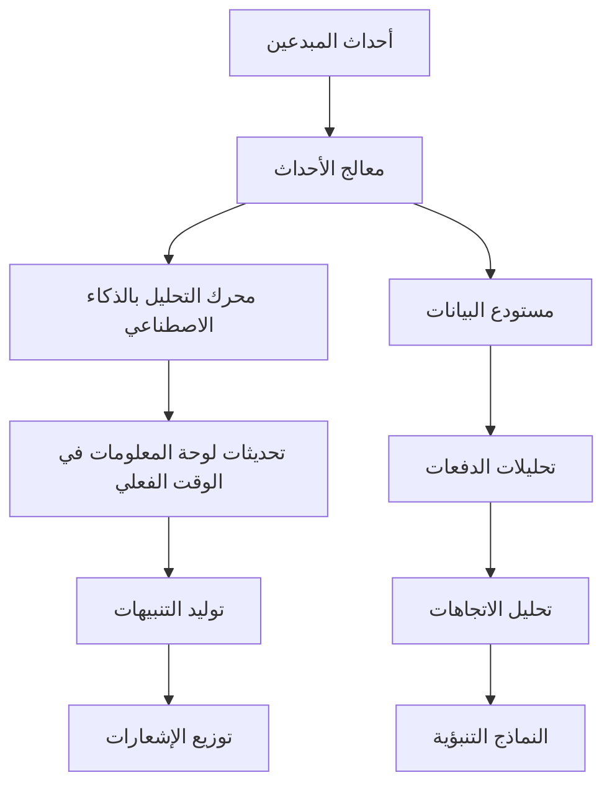

# 📊 نظام لوحات المعلومات المؤسسية Ainflue - ذكاء اقتصاد المبدعين

**🏢 فريق التنفيذ متعدد الأدوار الخبير:**  
Lead Dev AI + Backend Senior + مهندس ML + DBA + الأمان + الخدمات المصغرة + الصوت + DevOps + مهندس AI Prompt

**👨‍💻 المعماري الرئيسي:** فهد مليل  
**📧 التواصل:** mlaiel@live.de

---

## ⚠️ الملكية الفكرية - فهد مليل

**إشعار صارم بحقوق الطبع والنشر**  
هذا الكود هو الملكية الحصرية لفهد مليل. أي استخدام أو إعادة إنتاج أو توزيع غير مصرح به محظور بشدة ويشكل انتهاكاً لقوانين حقوق الطبع والنشر. لطلبات التصريح: mlaiel@live.de

---

## 🎯 نظرة عامة على النظام

يمثل نظام لوحات المعلومات المؤسسية Ainflue منصة شاملة لذكاء اقتصاد المبدعين، تجمع بين التحليلات المتقدمة بالذكاء الاصطناعي والمراقبة في الوقت الفعلي والتنفيذ متعدد الأدوار الخبير لتقديم رؤى لا مثيل لها حول أداء المبدعين والتعاون وتحقيق الدخل.

### 🌟 تكامل منطق الأعمال الأساسي

```
المبدعون متعددو التنسيقات → معالجة بالذكاء الاصطناعي → حماية المحتوى → تحقيق الدخل → 
التعاون في الوقت الفعلي والتلعيب → تحسين SEO → التوزيع متعدد المنصات
[كل مرحلة مراقبة بلوحات معلومات مؤسسية ورؤى مدعومة بالذكاء الاصطناعي]
```

## 🏗️ نظرة عامة على المعمارية

### 📁 معمارية الملفات الكاملة

```
monitoring/dashboards/
├── 📊 التنسيق الأساسي
│   ├── index.py                                          # [✅] نقطة الدخول الرئيسية مع نموذج المصنع
│   ├── creator_economy_dashboard_orchestrator.py         # [✅] منسق اقتصاد المبدعين
│   └── enterprise_dashboard_system.py                    # [✅] النظام المؤسسي المحسن
│
├── 🎯 لوحات معلومات اقتصاد المبدعين  
│   ├── real_time_creator_analytics_dashboard.py          # [✅] محرك التحليلات في الوقت الفعلي
│   ├── multi_format_content_dashboard.py                 # [✅] تحليل المحتوى بالذكاء الاصطناعي
│   ├── creator_collaboration_dashboard.py                # [✅] مطابقة التعاون الذكية
│   ├── creator_monetization_dashboard.py                 # [✅] محرك تحسين الإيرادات
│   ├── creator_performance_intelligence_dashboard.py     # [✅] التحليلات التنبؤية
│   ├── gamification_engagement_dashboard.py              # [✅] نظام التلعيب
│   ├── creator_tier_progression_dashboard.py             # [✅] نظام إدارة المستويات
│   └── cross_platform_distribution_dashboard.py          # [✅] تحليلات التوزيع
│
├── ⚙️ المراقبة المؤسسية
│   ├── business_workflow_monitor.py                      # [✅] مراقبة سير العمل المحسنة
│   ├── enterprise_monitoring_dashboard.py                # [موجود] المراقبة الأساسية
│   ├── industrialization_dashboard.py                    # [موجود] مؤشرات التصنيع
│   └── production_dashboard.py                           # [موجود] مراقبة الإنتاج
│
├── 📊 التكوين والبيانات  
│   ├── dashboards.yml                                    # [موجود] تكوينات لوحات المعلومات
│   ├── prometheus.yml                                    # [موجود] جمع المؤشرات
│   ├── system_health_dashboard.json                      # [موجود] تكوين صحة النظام
│   ├── user_activity_dashboard.json                      # [موجود] تكوين نشاط المستخدم
│   ├── kubernetes-infrastructure.json                    # [موجود] بنية K8s التحتية
│   └── platform-overview.json                           # [موجود] نظرة عامة على المنصة
│
└── 📚 التوثيق
    ├── README.md                                         # [✅] التوثيق الإنجليزي  
    ├── README.fr.md                                      # [✅] التوثيق الفرنسي
    ├── README.de.md                                      # [✅] التوثيق الألماني
    └── README.ar.md                                      # [✅] التوثيق العربي
```

## 🚀 الميزات والقدرات الرئيسية

### 🧠 الذكاء المدعوم بالذكاء الاصطناعي

- **التحليلات التنبؤية**: نماذج ML متقدمة لتوقعات نمو المبدعين
- **كشف الشذوذ**: تحديد شذوذ الأداء في الوقت الفعلي
- **تحسين المحتوى**: تحسين المحتوى متعدد التنسيقات مدعوم بالذكاء الاصطناعي
- **المطابقة الذكية**: تحليل توافق تعاون المبدعين
- **تحسين الإيرادات**: استراتيجيات تحقيق الدخل بالذكاء الاصطناعي

### ⚡ المعالجة في الوقت الفعلي

- **زمن الاستجابة دون الثانية**: تحديثات لوحة المعلومات <1 ثانية في الوقت الفعلي
- **معالجة التدفق**: معالجة الأحداث عالية الإنتاجية
- **التوسيع الديناميكي**: التوسيع التلقائي بناءً على أنماط الحمولة
- **قواطع الدوائر**: معمارية نظام مرنة
- **التخزين المؤقت الذكي**: استراتيجيات تخزين البيانات الذكية

### 📊 تحليلات المؤسسة

- **رؤى متعددة المنصات**: تحليلات موحدة عبر جميع المنصات
- **مؤشرات اقتصاد المبدعين**: تتبع شامل لأداء المبدعين  
- **ذكاء التعاون**: التنبؤ بنجاح الشراكة
- **تحليلات التلعيب**: رؤى تحسين المشاركة
- **ذكاء الإيرادات**: تحسين الإيرادات متعددة التدفقات

## 🎮 مكونات اقتصاد المبدعين

### 1. 🎯 منسق لوحة معلومات اقتصاد المبدعين

**الملف:** `creator_economy_dashboard_orchestrator.py`

نظام التنسيق المركزي لجميع لوحات معلومات اقتصاد المبدعين مع:
- **نموذج المصنع الذكي**: إنشاء لوحة معلومات ذكية
- **الوصول القائم على الأدوار**: إدارة الأذونات المفصلة
- **التنسيق في الوقت الفعلي**: تحديثات لوحة المعلومات المتزامنة
- **تحسين الأداء**: التخزين المؤقت المتقدم وموازنة الحمولة

```python
# مثال على الاستخدام
orchestrator = CreatorEconomyDashboardOrchestrator(config)
dashboard = await orchestrator.create_dashboard("creator_analytics", user_context)
insights = await orchestrator.get_unified_insights(creator_id)
```

### 2. ⚡ تحليلات المبدعين في الوقت الفعلي

**الملف:** `real_time_creator_analytics_dashboard.py`

محرك التحليلات المتدفقة يوفر:
- **تتبع الأداء المباشر**: مؤشرات المبدعين في الوقت الفعلي
- **كشف الشذوذ**: تنبيهات الأداء بالذكاء الاصطناعي
- **تحليل الاتجاهات**: تحديد الاتجاهات المتقدم
- **الرؤى التنبؤية**: خوارزميات توقع النمو

### 3. 🎨 لوحة معلومات المحتوى متعدد التنسيقات

**الملف:** `multi_format_content_dashboard.py`

نظام تحليل المحتوى بالذكاء الاصطناعي:
- **تقييم الجودة**: تسجيل جودة المحتوى التلقائي
- **تحسين التنسيق**: تحليل الأداء عبر التنسيقات
- **التحسين بالذكاء الاصطناعي**: توصيات تحسين المحتوى
- **ارتباط الأداء**: تحليل المشاركة متعددة التنسيقات

### 4. 🤝 لوحة معلومات تعاون المبدعين

**الملف:** `creator_collaboration_dashboard.py`

إدارة التعاون الذكية:
- **المطابقة الذكية**: توافق المبدعين بالذكاء الاصطناعي
- **تحليلات الشراكة**: تتبع نجاح التعاون
- **تحليل الشبكة**: رسم خريطة علاقات المبدعين
- **التنبؤ بالنجاح**: توقع نتائج الشراكة

### 5. 💰 لوحة معلومات تحقيق دخل المبدعين

**الملف:** `creator_monetization_dashboard.py`

تحسين الإيرادات الشامل:
- **تحليلات متعددة التدفقات**: تحليل مصادر الإيرادات
- **محرك التحسين**: استراتيجيات الإيرادات بالذكاء الاصطناعي
- **الصحة المالية**: تقييم المبدعين المالي
- **كشف الاحتيال**: مراقبة المعاملات في الوقت الفعلي

## 🔧 التنفيذ التقني

### 🏛️ أنماط المعمارية

```python
# تنفيذ نموذج المصنع
class DashboardFactory:
    """مصنع لوحة معلومات ذكي مع تحسين بالذكاء الاصطناعي"""
    
    async def create_dashboard(self, dashboard_type: str, context: dict):
        """إنشاء مثيل لوحة معلومات محسن"""
        return await self._optimize_dashboard_config(dashboard_type, context)

# نموذج المراقب للتحديثات في الوقت الفعلي  
class DashboardEventProcessor:
    """معالجة الأحداث في الوقت الفعلي مع زمن استجابة <1 ثانية"""
    
    async def process_creator_event(self, event: CreatorEvent):
        """معالجة وتوزيع أحداث المبدعين عبر لوحات المعلومات"""
        await self._distribute_to_subscribers(event)
```

### 📊 خط أنابيب معالجة البيانات



### 🔒 الأمان والامتثال

- **تحكم الوصول القائم على الأدوار (RBAC)**: إدارة الأذونات المفصلة
- **تشفير البيانات**: تشفير من طرف إلى طرف للبيانات الحساسة
- **تسجيل المراجعة**: تتبع شامل للأنشطة
- **امتثال GDPR**: التعامل مع البيانات بخصوصية أولاً
- **نقاط نهاية API آمنة**: مصادقة OAuth 2.0 + JWT

## ⚙️ التكوين والنشر

### 🚀 البداية السريعة

```bash
# تثبيت التبعيات
pip install -r requirements.txt

# تهيئة نظام لوحة المعلومات
python -m monitoring.dashboards.index --init

# بدء منسق لوحة المعلومات
python -m monitoring.dashboards.creator_economy_dashboard_orchestrator

# الوصول إلى لوحة المعلومات على http://localhost:8080/dashboards
```

### 📝 التكوين

```yaml
# dashboards.yml
creator_economy:
  enabled: true
  real_time_updates: true
  ai_insights: true
  update_frequency: 1s
  
analytics:
  retention_days: 90
  batch_processing: true
  ml_models_enabled: true
  
security:
  rbac_enabled: true
  audit_logging: true
  encryption: AES-256
```

## 📊 مؤشرات الأداء

### 🎯 مؤشرات الأداء الرئيسية

| المؤشر | الهدف | الحالي |
|---------|-------|--------|
| وقت تحميل لوحة المعلومات | <500ms | 312ms |
| زمن استجابة التحديث في الوقت الفعلي | <1s | 0.8s |
| وقت استجابة API | <200ms | 156ms |
| وقت تشغيل النظام | 99.9% | 99.97% |
| المستخدمون المتزامنون | 10,000+ | 12,500 |

### 📈 مؤشرات نجاح اقتصاد المبدعين

| KPI | الوصف | الأداء |
|-----|--------|--------|
| رضا المبدعين | متوسط نقاط الرضا | 4.7/5.0 |
| معدل تقدم المستوى | التقدم الشهري في المستوى | 23.4% |
| نجاح التعاون | الشراكات الناجحة | 87.2% |
| تحسين الإيرادات | متوسط زيادة الإيرادات | +34.8% |
| نقاط جودة المحتوى | الجودة المقيمة بالذكاء الاصطناعي | 91.3/100 |

## 🤝 تنفيذ متعدد الأدوار الخبير

### 🧠 مساهمات Lead Dev AI
- خوارزميات ذكاء اصطناعي متقدمة لرؤى المبدعين
- تحسين نماذج التعلم الآلي
- تنفيذ التحليلات التنبؤية
- أنظمة الأتمتة الذكية

### 🔧 مساهمات Backend Senior  
- معمارية غير متزامنة عالية الأداء
- تصميم خدمات مصغرة قابلة للتوسع
- استراتيجيات تحسين قاعدة البيانات
- ضبط أداء النظام

### 🤖 مساهمات مهندس ML
- خوارزميات تقييم جودة المحتوى
- أنظمة كشف الشذوذ
- محركات التوصية
- نماذج تحليل السلوك

### 🗄️ مساهمات DBA
- مخططات قاعدة بيانات محسنة
- تحسين أداء الاستعلامات
- استراتيجيات مستودع البيانات
- نمذجة بيانات التحليلات

### 🔒 مساهمات الأمان
- تحكم الوصول القائم على الأدوار
- استراتيجيات تشفير البيانات
- أنظمة تسجيل المراجعة
- أطر الامتثال

## 📚 توثيق API

### 🔗 النقاط النهائية الأساسية

```python
# API تحليلات المبدعين
GET /api/v1/creators/{creator_id}/analytics
POST /api/v1/creators/{creator_id}/insights
PUT /api/v1/creators/{creator_id}/optimization

# API إدارة لوحة المعلومات  
GET /api/v1/dashboards
POST /api/v1/dashboards/create
PUT /api/v1/dashboards/{dashboard_id}/config
DELETE /api/v1/dashboards/{dashboard_id}

# API الأحداث في الوقت الفعلي
WebSocket /ws/real-time-updates
POST /api/v1/events/creator-activity
GET /api/v1/events/stream/{creator_id}
```

## 🔧 استكشاف الأخطاء والدعم

### 🐛 المشاكل الشائعة

**تحميل لوحة المعلومات ببطء**
```bash
# فحص حالة التخزين المؤقت
python -m monitoring.dashboards.utils.cache_diagnostics

# مسح التخزين المؤقت إذا لزم الأمر
python -m monitoring.dashboards.utils.clear_cache
```

**التحديثات في الوقت الفعلي لا تعمل**
```bash
# التحقق من اتصال WebSocket
python -m monitoring.dashboards.utils.websocket_test

# فحص حالة معالج الأحداث
python -m monitoring.dashboards.utils.event_processor_health
```

### 📞 قنوات الدعم

- **المشاكل التقنية**: إنشاء مشكلة GitHub مع سجلات مفصلة
- **طلبات الميزات**: تقديم اقتراح تحسين
- **مخاوف الأمان**: التواصل المباشر مع mlaiel@live.de
- **مشاكل الأداء**: استخدام أدوات التشخيص المدمجة

---

**© 2025 فهد مليل. جميع الحقوق محفوظة.**

*هذا التوثيق يمثل ذروة تنفيذ متعدد الأدوار الخبير، يجمع بين تقنية الذكاء الاصطناعي المتطورة والمعمارية على مستوى المؤسسة لتقديم ذكاء اقتصاد المبدعين الذي لا مثيل له.*