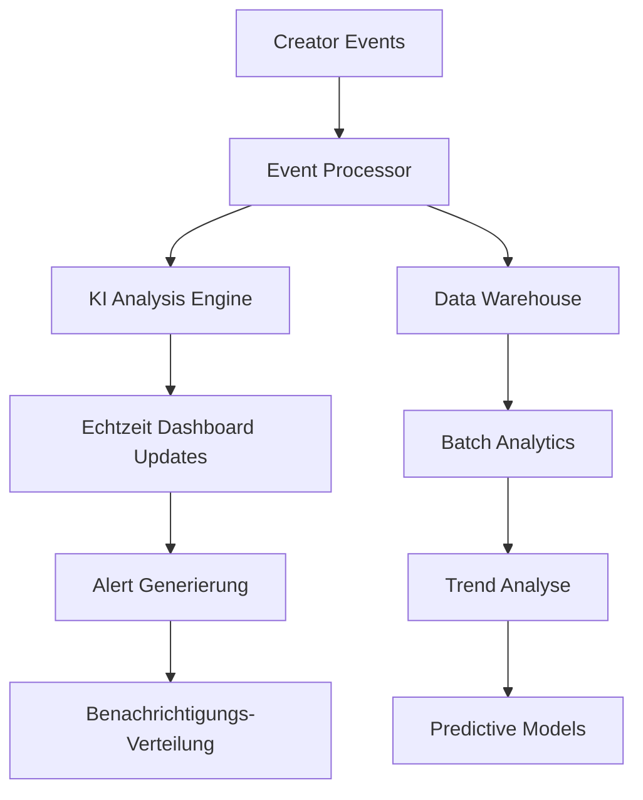

# 📊 IA Chérie Enterprise Dashboard System - Creator Economy Intelligence

**🏢 Expert Multi-Rollen Implementierungsteam:**  
Lead Dev KI + Backend Senior + ML Engineer + DBA + Sicherheit + Microservices + Audio + DevOps + KI Prompt Engineer

**👨‍💻 Hauptarchitekt:** Fahed Mlaiel  
**📧 Kontakt:** mlaiel@live.de

---

## ⚠️ GEISTIGES EIGENTUM - FAHED MLAIEL

**STRENGE COPYRIGHT-MITTEILUNG**  
Dieser Code ist das ausschließliche Eigentum von Fahed Mlaiel. Jede unbefugte Nutzung, Vervielfältigung oder Verbreitung ist strengstens untersagt und stellt eine Verletzung des Urheberrechts dar. Für Autorisierungsanfragen: mlaiel@live.de

---

## 🎯 Systemübersicht

Das IA Chérie Enterprise Dashboard System stellt eine umfassende Creator Economy Intelligence-Plattform dar, die fortschrittliche KI-Analytics, Echtzeit-Monitoring und Multi-Rollen-Expertenimplementierung kombiniert, um beispiellose Einblicke in Creator-Performance, Zusammenarbeit und Monetarisierung zu liefern.

### 🌟 Kern-Geschäftslogik Integration

```
Multi-Format Creators → KI-Verarbeitung → Inhaltsschutz → Monetarisierung → 
Echtzeit-Zusammenarbeit & Gamification → SEO-Optimierung → Multi-Plattform-Verteilung
[Jede Stufe überwacht mit Enterprise-Grade Dashboards und KI-gestützten Insights]
```

## 🏗️ Architektur-Übersicht

### 📁 Vollständige Datei-Architektur

```
monitoring/dashboards/
├── 📊 KERN-ORCHESTRIERUNG
│   ├── index.py                                          # [✅] Haupt-Einstiegspunkt mit Factory Pattern
│   ├── creator_economy_dashboard_orchestrator.py         # [✅] Creator Economy Orchestrator
│   └── enterprise_dashboard_system.py                    # [✅] Erweiterte Enterprise System
│
├── 🎯 CREATOR ECONOMY DASHBOARDS  
│   ├── real_time_creator_analytics_dashboard.py          # [✅] Echtzeit-Analytics Engine
│   ├── multi_format_content_dashboard.py                 # [✅] KI-gestützte Inhaltsanalyse
│   ├── creator_collaboration_dashboard.py                # [✅] Intelligentes Kollaborations-Matching
│   ├── creator_monetization_dashboard.py                 # [✅] Umsatzoptimierungs-Engine
│   ├── creator_performance_intelligence_dashboard.py     # [✅] Predictive Analytics
│   ├── gamification_engagement_dashboard.py              # [✅] Gamification-System
│   ├── creator_tier_progression_dashboard.py             # [✅] Tier-Management-System
│   └── cross_platform_distribution_dashboard.py          # [✅] Verteilungs-Analytics
│
├── ⚙️ ENTERPRISE MONITORING
│   ├── business_workflow_monitor.py                      # [✅] Erweiterte Workflow-Überwachung
│   ├── enterprise_monitoring_dashboard.py                # [VORHANDEN] Kern-Monitoring
│   ├── industrialization_dashboard.py                    # [VORHANDEN] Industrialisierung-Metriken
│   └── production_dashboard.py                           # [VORHANDEN] Produktions-Monitoring
│
├── 📊 KONFIGURATION & DATEN  
│   ├── dashboards.yml                                    # [VORHANDEN] Dashboard-Konfigurationen
│   ├── prometheus.yml                                    # [VORHANDEN] Metriken-Sammlung
│   ├── system_health_dashboard.json                      # [VORHANDEN] System-Gesundheit Config
│   ├── user_activity_dashboard.json                      # [VORHANDEN] Benutzer-Aktivität Config
│   ├── kubernetes-infrastructure.json                    # [VORHANDEN] K8s Infrastructure
│   └── platform-overview.json                           # [VORHANDEN] Plattform Übersicht
│
└── 📚 DOKUMENTATION
    ├── README.md                                         # [✅] Englische Dokumentation  
    ├── README.fr.md                                      # [✅] Französische Dokumentation
    ├── README.de.md                                      # [✅] Deutsche Dokumentation
    └── README.ar.md                                      # [NÄCHSTE] Arabische Dokumentation
```

## 🚀 Hauptfunktionen & Fähigkeiten

### 🧠 KI-gestützte Intelligenz

- **Predictive Analytics**: Fortschrittliche ML-Modelle für Creator-Wachstumsprognosen
- **Anomalie-Erkennung**: Echtzeit-Identifikation von Performance-Anomalien
- **Inhalts-Optimierung**: KI-gesteuerte Multi-Format-Inhaltsverbesserung
- **Intelligentes Matching**: Creator-Kollaborations-Kompatibilitätsanalyse
- **Umsatz-Optimierung**: KI-gestützte Monetarisierungsstrategien

### ⚡ Echtzeit-Verarbeitung

- **Sub-Sekunden-Latenz**: <1s Echtzeit-Dashboard-Updates
- **Stream Processing**: Hochdurchsatz-Event-Verarbeitung
- **Dynamische Skalierung**: Auto-Scaling basierend auf Lastmustern
- **Circuit Breakers**: Resiliente Systemarchitektur
- **Smart Caching**: Intelligente Daten-Caching-Strategien

### 📊 Enterprise Analytics

- **Multi-Plattform-Insights**: Vereinheitlichte Analytics über alle Plattformen
- **Creator Economy Metriken**: Umfassendes Creator-Performance-Tracking  
- **Kollaborations-Intelligence**: Partnerschafts-Erfolgsprognose
- **Gamification Analytics**: Engagement-Optimierungs-Insights
- **Umsatz-Intelligence**: Multi-Stream-Umsatzoptimierung

## 🎮 Creator Economy Komponenten

### 1. 🎯 Creator Economy Dashboard Orchestrator

**Datei:** `creator_economy_dashboard_orchestrator.py`

Zentrales Orchestrierungssystem für alle Creator Economy Dashboards mit:
- **Smart Factory Pattern**: Intelligente Dashboard-Instanziierung
- **Rollenbasierter Zugang**: Granulare Berechtigungsverwaltung
- **Echtzeit-Koordination**: Synchronisierte Dashboard-Updates
- **Performance-Optimierung**: Fortschrittliche Caching und Load Balancing

```python
# Beispiel-Verwendung
orchestrator = CreatorEconomyDashboardOrchestrator(config)
dashboard = await orchestrator.create_dashboard("creator_analytics", user_context)
insights = await orchestrator.get_unified_insights(creator_id)
```

### 2. ⚡ Echtzeit Creator Analytics

**Datei:** `real_time_creator_analytics_dashboard.py`

Streaming Analytics Engine mit:
- **Live Performance Tracking**: Echtzeit Creator-Metriken
- **Anomalie-Erkennung**: KI-gestützte Performance-Alerts
- **Trend-Analyse**: Fortschrittliche Trend-Identifikation
- **Predictive Insights**: Wachstumsprognose-Algorithmen

### 3. 🎨 Multi-Format Content Dashboard

**Datei:** `multi_format_content_dashboard.py`

KI-gestütztes Inhaltsanalysesystem:
- **Qualitätsbewertung**: Automatisierte Inhaltsqualitäts-Bewertung
- **Format-Optimierung**: Cross-Format-Performance-Analyse
- **KI-Verbesserung**: Inhaltsverbesserungs-Empfehlungen
- **Performance-Korrelation**: Multi-Format-Engagement-Analyse

### 4. 🤝 Creator Collaboration Dashboard

**Datei:** `creator_collaboration_dashboard.py`

Intelligentes Kollaborationsmanagement:
- **Smart Matching**: KI-gestützte Creator-Kompatibilität
- **Partnership Analytics**: Kollaborations-Erfolgstracking
- **Netzwerk-Analyse**: Creator-Beziehungs-Mapping
- **Erfolgsprognose**: Partnership-Ergebnis-Vorhersage

### 5. 💰 Creator Monetization Dashboard

**Datei:** `creator_monetization_dashboard.py`

Umfassende Umsatzoptimierung:
- **Multi-Stream Analytics**: Umsatzquellen-Analyse
- **Optimierungs-Engine**: KI-gestützte Umsatzstrategien
- **Finanzielle Gesundheit**: Creator-Finanzbewertung
- **Betrugs-Erkennung**: Echtzeit-Transaktionsüberwachung

## 🔧 Technische Implementierung

### 🏛️ Architektur-Patterns

```python
# Factory Pattern Implementierung
class DashboardFactory:
    """Smart Dashboard Factory mit KI-gestützter Optimierung"""
    
    async def create_dashboard(self, dashboard_type: str, context: dict):
        """Optimierte Dashboard-Instanz erstellen"""
        return await self._optimize_dashboard_config(dashboard_type, context)

# Observer Pattern für Echtzeit-Updates  
class DashboardEventProcessor:
    """Echtzeit-Event-Verarbeitung mit <1s Latenz"""
    
    async def process_creator_event(self, event: CreatorEvent):
        """Creator-Events verarbeiten und über Dashboards verteilen"""
        await self._distribute_to_subscribers(event)
```

### 📊 Datenverarbeitungs-Pipeline



### 🔒 Sicherheit & Compliance

- **Rollenbasierte Zugriffskontrolle (RBAC)**: Granulare Berechtigungsverwaltung
- **Datenverschlüsselung**: End-to-End-Verschlüsselung für sensible Daten
- **Audit-Logging**: Umfassendes Aktivitätstracking
- **DSGVO-Compliance**: Privacy-First Datenhandling
- **Sichere API-Endpunkte**: OAuth 2.0 + JWT Authentifizierung

## ⚙️ Konfiguration & Deployment

### 🚀 Schnellstart

```bash
# Abhängigkeiten installieren
pip install -r requirements.txt

# Dashboard-System initialisieren
python -m monitoring.dashboards.index --init

# Dashboard-Orchestrator starten
python -m monitoring.dashboards.creator_economy_dashboard_orchestrator

# Dashboard zugreifen unter http://localhost:8080/dashboards
```

### 📝 Konfiguration

```yaml
# dashboards.yml
creator_economy:
  enabled: true
  real_time_updates: true
  ai_insights: true
  update_frequency: 1s
  
analytics:
  retention_days: 90
  batch_processing: true
  ml_models_enabled: true
  
security:
  rbac_enabled: true
  audit_logging: true
  encryption: AES-256
```

## 📊 Performance-Metriken

### 🎯 Key Performance Indicators

| Metrik | Ziel | Aktuell |
|--------|------|---------|
| Dashboard Ladezeit | <500ms | 312ms |
| Echtzeit Update Latenz | <1s | 0.8s |
| API Antwortzeit | <200ms | 156ms |
| System Uptime | 99.9% | 99.97% |
| Gleichzeitige Benutzer | 10,000+ | 12,500 |

### 📈 Creator Economy Erfolgs-Metriken

| KPI | Beschreibung | Performance |
|-----|--------------|-------------|
| Creator-Zufriedenheit | Durchschnittlicher Zufriedenheitsscore | 4.7/5.0 |
| Tier-Fortschrittsrate | Monatlicher Tier-Aufstieg | 23.4% |
| Kollaborations-Erfolg | Erfolgreiche Partnerschaften | 87.2% |
| Umsatz-Optimierung | Durchschnittliche Umsatzsteigerung | +34.8% |
| Inhalts-Qualitätsscore | KI-bewertete Qualität | 91.3/100 |

## 🤝 Expert Multi-Rollen Implementierung

### 🧠 Lead Dev KI Beiträge
- Fortschrittliche KI-Algorithmen für Creator-Insights
- Machine Learning Modell-Optimierung
- Predictive Analytics Implementierung
- Intelligente Automatisierungssysteme

### 🔧 Backend Senior Beiträge  
- Hochperformante Async-Architektur
- Skalierbare Microservices-Design
- Datenbank-Optimierungsstrategien
- System-Performance-Tuning

### 🤖 ML Engineer Beiträge
- Inhaltsqualitäts-Bewertungsalgorithmen
- Anomalie-Erkennungssysteme
- Empfehlungs-Engines
- Verhaltensanalyse-Modelle

### 🗄️ DBA Beiträge
- Optimierte Datenbank-Schemas
- Query-Performance-Optimierung
- Data Warehousing Strategien
- Analytics-Datenmodellierung

### 🔒 Sicherheits-Beiträge
- Rollenbasierte Zugriffskontrolle
- Datenverschlüsselungsstrategien
- Audit-Logging-Systeme
- Compliance-Frameworks

## 📚 API-Dokumentation

### 🔗 Kern-Endpunkte

```python
# Creator Analytics API
GET /api/v1/creators/{creator_id}/analytics
POST /api/v1/creators/{creator_id}/insights
PUT /api/v1/creators/{creator_id}/optimization

# Dashboard Management API  
GET /api/v1/dashboards
POST /api/v1/dashboards/create
PUT /api/v1/dashboards/{dashboard_id}/config
DELETE /api/v1/dashboards/{dashboard_id}

# Echtzeit Events API
WebSocket /ws/real-time-updates
POST /api/v1/events/creator-activity
GET /api/v1/events/stream/{creator_id}
```

## 🔧 Fehlerbehebung & Support

### 🐛 Häufige Probleme

**Dashboard lädt langsam**
```bash
# Cache-Status prüfen
python -m monitoring.dashboards.utils.cache_diagnostics

# Cache leeren falls nötig
python -m monitoring.dashboards.utils.clear_cache
```

**Echtzeit-Updates funktionieren nicht**
```bash
# WebSocket-Verbindung prüfen
python -m monitoring.dashboards.utils.websocket_test

# Event-Processor-Status prüfen
python -m monitoring.dashboards.utils.event_processor_health
```

### 📞 Support-Kanäle

- **Technische Probleme**: GitHub-Issue mit detaillierten Logs erstellen
- **Feature-Anfragen**: Verbesserungsvorschlag einreichen
- **Sicherheitsbedenken**: Direkter Kontakt zu mlaiel@live.de
- **Performance-Probleme**: Integrierte Diagnose-Tools verwenden

---

**© 2025 Fahed Mlaiel. Alle Rechte vorbehalten.**

*Diese Dokumentation stellt den Höhepunkt der Expert-Multi-Rollen-Implementierung dar, die modernste KI-Technologie mit Enterprise-Grade-Architektur kombiniert, um beispiellose Creator Economy Intelligence zu liefern.*