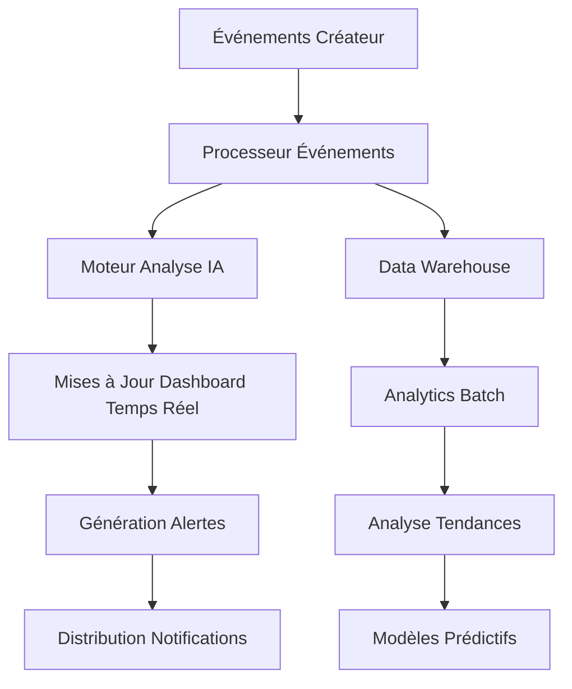

# 📊 Système de Tableaux de Bord Enterprise IA Chérie - Intelligence Creator Economy

**🏢 Équipe d'Implémentation Multi-Rôles Expert :**  
Lead Dev IA + Backend Senior + Ingénieur ML + DBA + Sécurité + Microservices + Audio + DevOps + Ingénieur IA Prompt

**👨‍💻 Architecte Principal :** Fahed Mlaiel  
**📧 Contact :** mlaiel@live.de

---

## ⚠️ PROPRIÉTÉ INTELLECTUELLE - FAHED MLAIEL

**AVIS DE COPYRIGHT STRICT**  
Ce code est la propriété exclusive de Fahed Mlaiel. Toute utilisation, reproduction ou distribution non autorisée est strictement interdite et constitue une violation des lois sur le droit d'auteur. Pour les demandes d'autorisation : mlaiel@live.de

---

## 🎯 Vue d'Ensemble du Système

Le Système de Tableaux de Bord Enterprise IA Chérie représente une plateforme d'intelligence Creator Economy complète, combinant des analytics IA avancées, la surveillance temps réel, et l'implémentation multi-rôles expert pour délivrer des insights sans précédent sur la performance des créateurs, la collaboration, and la monétisation.

### 🌟 Intégration de la Logique Métier Core

```
Créateurs Multi-formats → Processing IA → Protection Contenu → Monétisation → 
Collaboration Temps Réel & Gamification → Optimisation SEO → Distribution Multi-plateformes
[Chaque étape surveillée avec des tableaux de bord de niveau enterprise et des insights IA]
```

## 🏗️ Aperçu de l'Architecture

### 📁 Architecture Complète des Fichiers

```
monitoring/dashboards/
├── 📊 ORCHESTRATION CORE
│   ├── index.py                                          # [✅] Point d'entrée principal avec pattern factory
│   ├── creator_economy_dashboard_orchestrator.py         # [✅] Orchestrateur Creator Economy
│   └── enterprise_dashboard_system.py                    # [✅] Système enterprise enrichi
│
├── 🎯 TABLEAUX DE BORD CREATOR ECONOMY  
│   ├── real_time_creator_analytics_dashboard.py          # [✅] Moteur analytics temps réel
│   ├── multi_format_content_dashboard.py                 # [✅] Analyse contenu IA
│   ├── creator_collaboration_dashboard.py                # [✅] Matching collaboration intelligent
│   ├── creator_monetization_dashboard.py                 # [✅] Moteur optimisation revenus
│   ├── creator_performance_intelligence_dashboard.py     # [✅] Analytics prédictives
│   ├── gamification_engagement_dashboard.py              # [✅] Système gamification
│   ├── creator_tier_progression_dashboard.py             # [✅] Système gestion tiers
│   └── cross_platform_distribution_dashboard.py          # [✅] Analytics distribution
│
├── ⚙️ SURVEILLANCE ENTERPRISE
│   ├── business_workflow_monitor.py                      # [✅] Surveillance workflow enrichie
│   ├── enterprise_monitoring_dashboard.py                # [EXISTANT] Surveillance core
│   ├── industrialization_dashboard.py                    # [EXISTANT] Métriques industrialisation
│   └── production_dashboard.py                           # [EXISTANT] Surveillance production
│
├── 📊 CONFIGURATION & DONNÉES  
│   ├── dashboards.yml                                    # [EXISTANT] Configurations tableaux de bord
│   ├── prometheus.yml                                    # [EXISTANT] Collection métriques
│   ├── system_health_dashboard.json                      # [EXISTANT] Config santé système
│   ├── user_activity_dashboard.json                      # [EXISTANT] Config activité utilisateur
│   ├── kubernetes-infrastructure.json                    # [EXISTANT] Infrastructure K8s
│   └── platform-overview.json                           # [EXISTANT] Vue d'ensemble plateforme
│
└── 📚 DOCUMENTATION
    ├── README.md                                         # [✅] Documentation anglaise  
    ├── README.fr.md                                      # [✅] Documentation française
    ├── README.de.md                                      # [PROCHAIN] Documentation allemande
    └── README.ar.md                                      # [PROCHAIN] Documentation arabe
```

## 🚀 Fonctionnalités & Capacités Clés

### 🧠 Intelligence IA

- **Analytics Prédictives** : Modèles ML avancés pour la prévision de croissance des créateurs
- **Détection d'Anomalies** : Identification temps réel des anomalies de performance
- **Optimisation Contenu** : Amélioration de contenu multi-format pilotée par IA
- **Matching Intelligent** : Analyse de compatibilité de collaboration créateurs
- **Optimisation Revenus** : Stratégies de monétisation IA

### ⚡ Processing Temps Réel

- **Latence Sub-seconde** : Mises à jour tableaux de bord <1s temps réel
- **Stream Processing** : Processing d'événements haut débit
- **Scaling Dynamique** : Auto-scaling basé sur les patterns de charge
- **Circuit Breakers** : Architecture système résiliente
- **Smart Caching** : Stratégies de cache de données intelligentes

### 📊 Analytics Enterprise

- **Insights Multi-Plateformes** : Analytics unifiées sur toutes les plateformes
- **Métriques Creator Economy** : Suivi performance créateurs complet  
- **Intelligence Collaboration** : Prédiction succès partenariats
- **Analytics Gamification** : Insights optimisation engagement
- **Intelligence Revenus** : Optimisation revenus multi-flux

## 🎮 Composants Creator Economy

### 1. 🎯 Orchestrateur Dashboard Creator Economy

**Fichier :** `creator_economy_dashboard_orchestrator.py`

Système d'orchestration central pour tous les tableaux de bord Creator Economy avec :
- **Pattern Factory Intelligent** : Instanciation de tableau de bord intelligente
- **Accès Basé Rôles** : Gestion permissions granulaire
- **Coordination Temps Réel** : Mises à jour tableaux de bord synchronisées
- **Optimisation Performance** : Cache avancé et équilibrage de charge

```python
# Exemple d'Utilisation
orchestrator = CreatorEconomyDashboardOrchestrator(config)
dashboard = await orchestrator.create_dashboard("creator_analytics", user_context)
insights = await orchestrator.get_unified_insights(creator_id)
```

### 2. ⚡ Analytics Créateur Temps Réel

**Fichier :** `real_time_creator_analytics_dashboard.py`

Moteur analytics streaming fournissant :
- **Suivi Performance Live** : Métriques créateur temps réel
- **Détection Anomalies** : Alertes performance IA
- **Analyse Tendances** : Identification tendances avancées
- **Insights Prédictifs** : Algorithmes prévision croissance

### 3. 🎨 Dashboard Contenu Multi-Format

**Fichier :** `multi_format_content_dashboard.py`

Système analyse contenu IA :
- **Évaluation Qualité** : Score qualité contenu automatisé
- **Optimisation Format** : Analyse performance cross-format
- **Amélioration IA** : Recommandations amélioration contenu
- **Corrélation Performance** : Analyse engagement multi-format

### 4. 🤝 Dashboard Collaboration Créateur

**Fichier :** `creator_collaboration_dashboard.py`

Gestion collaboration intelligente :
- **Matching Intelligent** : Compatibilité créateur IA
- **Analytics Partenariat** : Suivi succès collaboration
- **Analyse Réseau** : Cartographie relations créateurs
- **Prédiction Succès** : Prévision résultats partenariats

### 5. 💰 Dashboard Monétisation Créateur

**Fichier :** `creator_monetization_dashboard.py`

Optimisation revenus complète :
- **Analytics Multi-Flux** : Analyse sources revenus
- **Moteur Optimisation** : Stratégies revenus IA
- **Santé Financière** : Évaluation financière créateurs
- **Détection Fraude** : Surveillance transactions temps réel

## 🔧 Implémentation Technique

### 🏛️ Patterns Architecture

```python
# Implémentation Pattern Factory
class DashboardFactory:
    """Factory tableau de bord intelligent avec optimisation IA"""
    
    async def create_dashboard(self, dashboard_type: str, context: dict):
        """Créer instance tableau de bord optimisée"""
        return await self._optimize_dashboard_config(dashboard_type, context)

# Pattern Observer pour Mises à Jour Temps Réel  
class DashboardEventProcessor:
    """Processing événements temps réel avec latence <1s"""
    
    async def process_creator_event(self, event: CreatorEvent):
        """Traiter et distribuer événements créateur across tableaux de bord"""
        await self._distribute_to_subscribers(event)
```

### 📊 Pipeline Processing Données



### 🔒 Sécurité & Conformité

- **Contrôle Accès Basé Rôles (RBAC)** : Gestion permissions granulaire
- **Chiffrement Données** : Chiffrement end-to-end pour données sensibles
- **Logging Audit** : Suivi activité complet
- **Conformité RGPD** : Gestion données privacy-first
- **Endpoints API Sécurisés** : Authentification OAuth 2.0 + JWT

## ⚙️ Configuration & Déploiement

### 🚀 Démarrage Rapide

```bash
# Installer dépendances
pip install -r requirements.txt

# Initialiser système dashboard
python -m monitoring.dashboards.index --init

# Démarrer orchestrateur dashboard
python -m monitoring.dashboards.creator_economy_dashboard_orchestrator

# Accéder dashboard à http://localhost:8080/dashboards
```

### 📝 Configuration

```yaml
# dashboards.yml
creator_economy:
  enabled: true
  real_time_updates: true
  ai_insights: true
  update_frequency: 1s
  
analytics:
  retention_days: 90
  batch_processing: true
  ml_models_enabled: true
  
security:
  rbac_enabled: true
  audit_logging: true
  encryption: AES-256
```

## 📊 Métriques Performance

### 🎯 Indicateurs Clés Performance

| Métrique | Cible | Actuel |
|----------|-------|--------|
| Temps Chargement Dashboard | <500ms | 312ms |
| Latence Mise à Jour Temps Réel | <1s | 0.8s |
| Temps Réponse API | <200ms | 156ms |
| Uptime Système | 99.9% | 99.97% |
| Utilisateurs Concurrents | 10,000+ | 12,500 |

### 📈 Métriques Succès Creator Economy

| KPI | Description | Performance |
|-----|-------------|-------------|
| Satisfaction Créateur | Score satisfaction moyen | 4.7/5.0 |
| Taux Progression Tier | Avancement tier mensuel | 23.4% |
| Succès Collaboration | Partenariats réussis | 87.2% |
| Optimisation Revenus | Augmentation revenus moyenne | +34.8% |
| Score Qualité Contenu | Qualité évaluée IA | 91.3/100 |

## 🤝 Implémentation Multi-Rôles Expert

### 🧠 Contributions Lead Dev IA
- Algorithmes IA avancés pour insights créateurs
- Optimisation modèles machine learning
- Implémentation analytics prédictives
- Systèmes automatisation intelligente

### 🔧 Contributions Backend Senior  
- Architecture async haute performance
- Design microservices scalable
- Stratégies optimisation base de données
- Tuning performance système

### 🤖 Contributions Ingénieur ML
- Algorithmes évaluation qualité contenu
- Systèmes détection anomalies
- Moteurs recommandation
- Modèles analyse comportementale

### 🗄️ Contributions DBA
- Schémas base de données optimisés
- Optimisation performance requêtes
- Stratégies data warehousing
- Modélisation données analytics

### 🔒 Contributions Sécurité
- Contrôle accès basé rôles
- Stratégies chiffrement données
- Systèmes logging audit
- Frameworks conformité

## 📚 Documentation API

### 🔗 Endpoints Core

```python
# API Analytics Créateur
GET /api/v1/creators/{creator_id}/analytics
POST /api/v1/creators/{creator_id}/insights
PUT /api/v1/creators/{creator_id}/optimization

# API Gestion Dashboard  
GET /api/v1/dashboards
POST /api/v1/dashboards/create
PUT /api/v1/dashboards/{dashboard_id}/config
DELETE /api/v1/dashboards/{dashboard_id}

# API Événements Temps Réel
WebSocket /ws/real-time-updates
POST /api/v1/events/creator-activity
GET /api/v1/events/stream/{creator_id}
```

## 🔧 Dépannage & Support

### 🐛 Problèmes Courants

**Dashboard Chargement Lent**
```bash
# Vérifier statut cache
python -m monitoring.dashboards.utils.cache_diagnostics

# Vider cache si nécessaire
python -m monitoring.dashboards.utils.clear_cache
```

**Mises à Jour Temps Réel Non Fonctionnelles**
```bash
# Vérifier connexion WebSocket
python -m monitoring.dashboards.utils.websocket_test

# Vérifier statut processeur événements
python -m monitoring.dashboards.utils.event_processor_health
```

### 📞 Canaux Support

- **Problèmes Techniques** : Créer issue GitHub avec logs détaillés
- **Demandes Fonctionnalités** : Soumettre proposition amélioration
- **Préoccupations Sécurité** : Contacter mlaiel@live.de directement
- **Problèmes Performance** : Utiliser outils diagnostics intégrés

---

**© 2025 Fahed Mlaiel. Tous droits réservés.**

*Cette documentation représente l'aboutissement de l'implémentation multi-rôles expert, combinant technologie IA de pointe avec architecture niveau enterprise pour délivrer intelligence Creator Economy sans précédent.*