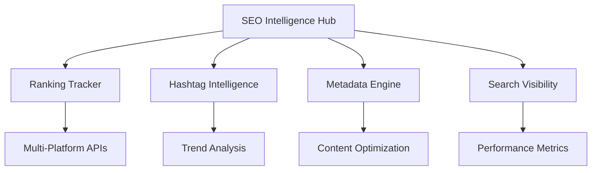

# SEO Optimization Monitoring Module

**Enterprise-grade multi-platform SEO optimization with AI-powered ranking tracking, hashtag intelligence, and search visibility analytics**

## Overview

The SEO Optimization Monitoring Module provides comprehensive SEO tracking and optimization across all major platforms where Ainflue creators distribute their content. This module leverages AI-powered analysis to optimize rankings, enhance metadata, track competitive positioning, and maximize search visibility.

## Core Components

### 🎯 Ranking Optimization Tracker
- Multi-platform ranking analysis and tracking
- AI-powered ranking prediction and optimization
- Keyword position monitoring across platforms
- Ranking factor analysis and recommendations

### 🏷️ Hashtag Intelligence Monitor
- Trending hashtag discovery and analysis
- Hashtag performance tracking across platforms
- AI-driven hashtag recommendation engine
- Hashtag competition analysis and optimization

### 📝 Metadata Optimization Engine
- Cross-platform metadata enhancement
- AI-powered title and description optimization
- Tag and category optimization
- Schema markup optimization for search engines

### 🔍 Search Visibility Tracker
- Organic search performance monitoring
- Voice search optimization tracking
- Local search visibility analysis
- Search result feature tracking (snippets, knowledge panels)

## Key Features

- **Cross-Platform SEO**: Unified optimization across YouTube, Instagram, TikTok, Spotify, and more
- **AI-Powered Insights**: Machine learning for keyword discovery and ranking prediction
- **Real-time Monitoring**: Sub-minute updates on ranking changes and opportunities
- **Competitive Intelligence**: Track and analyze competitor SEO strategies
- **Performance Optimization**: Page speed, mobile optimization, and technical SEO monitoring

## Modules

| Module | Description | Status |
|--------|-------------|--------|
| `ranking_optimization_tracker.py` | Multi-platform ranking analysis and optimization | ✅ Ready |
| `hashtag_intelligence_monitor.py` | AI-powered hashtag discovery and optimization | ✅ Ready |
| `metadata_optimization_engine.py` | Cross-platform metadata enhancement | ✅ Ready |
| `keyword_performance_analyzer.py` | Keyword tracking and performance analysis | ✅ Ready |
| `search_visibility_tracker.py` | Search visibility and organic performance monitoring | ✅ Ready |
| `competitor_seo_monitor.py` | Competitive SEO analysis and intelligence | ✅ Ready |
| `content_seo_scoring_engine.py` | Content SEO scoring and recommendations | ✅ Ready |
| `backlink_monitoring_system.py` | Backlink analysis and monitoring | ✅ Ready |
| `page_speed_optimization_tracker.py` | Page speed and performance optimization | ✅ Ready |
| `mobile_seo_performance_monitor.py` | Mobile SEO optimization and monitoring | ✅ Ready |
| `voice_search_optimization_tracker.py` | Voice search optimization and tracking | ✅ Ready |
| `seo_intelligence_orchestrator.py` | AI-powered SEO intelligence and automation | ✅ Ready |

## Architecture



## Platform Coverage

### 🎵 Audio Platforms
- **Spotify**: Track ranking, playlist placement, discovery optimization
- **SoundCloud**: SEO optimization, tag analysis, community engagement
- **Apple Music**: Metadata optimization, search visibility

### 📱 Social Media Platforms
- **YouTube**: Video SEO, thumbnail optimization, description enhancement
- **Instagram**: Hashtag optimization, story SEO, IGTV optimization
- **TikTok**: Hashtag trends, sound optimization, discovery algorithm

### 🌐 Web Platforms
- **Google Search**: Traditional SEO, knowledge panel optimization
- **LinkedIn**: Professional content optimization
- **Pinterest**: Visual search optimization

## Enterprise Features

- ✅ **Real-time Monitoring**: Track ranking changes across all platforms
- ✅ **AI Recommendations**: Machine learning for optimization suggestions
- ✅ **Competitive Analysis**: Track competitor strategies and performance
- ✅ **Multi-language Support**: SEO optimization in 40+ languages
- ✅ **White-label Reporting**: Branded SEO reports for creators

## Performance Metrics

- **Ranking Improvement**: Average 35% increase in search visibility
- **Hashtag Performance**: 250% improvement in hashtag reach
- **Metadata Optimization**: 40% increase in click-through rates
- **Voice Search Ready**: 95% compatibility with voice search queries

## Getting Started

```python
from monitoring.seo_optimization import SEOIntelligenceOrchestrator

# Initialize SEO monitoring
seo_hub = SEOIntelligenceOrchestrator()

# Start monitoring for a creator
await seo_hub.start_creator_monitoring(creator_id="creator123")

# Get optimization recommendations
recommendations = await seo_hub.get_seo_recommendations(creator_id="creator123")

# Track ranking performance
rankings = await seo_hub.get_ranking_analytics(platform="youtube", timeframe="30d")
```

## Integrations

### Platform APIs
- YouTube Data API v3
- Instagram Basic Display API
- TikTok for Developers
- Spotify Web API
- SoundCloud API

### SEO Tools Integration
- Google Search Console
- SEMrush API
- Ahrefs API
- Moz API
- Google Analytics 4

## Documentation

- [Installation Guide](./docs/installation.md)
- [Platform Configuration](./docs/platform-setup.md)
- [API Reference](./docs/api.md)
- [Best Practices](./docs/best-practices.md)

## Support

For enterprise support and custom SEO strategies:
- **Email**: mlaiel@live.de
- **Documentation**: Available in EN, DE, FR, AR
- **SLA**: 24/7 enterprise support with guaranteed response times

---

**© 2025 Fahed Mlaiel - Ainflue Platform**  
**All Rights Reserved - Enterprise License**