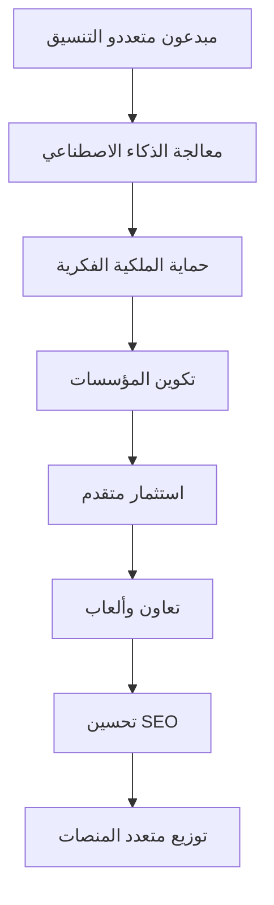

# 🔧 وحدة تكوين خدمات Ainflue

**إدارة تكوين منصة اقتصاد المبدعين للمؤسسات**

> **⚠️ تحذير قانوني - حماية الملكية الفكرية**  
> **© 2025 فهد ملايل <mlaiel@live.de> - جميع الحقوق محفوظة**  
> 
> 🚨 **برمجيات مملوكة - الاستخدام غير المصرح به محظور**
> - **الاستخدام التجاري ممنوع تماماً** بدون إذن مكتوب
> - **الهندسة العكسية ممنوعة تماماً**
> - **التوزيع ممنوع** بدون ترخيص صريح
> - **المخالفة = ملاحقة قانونية تلقائية**
> 
> 🏢 **ترخيص المؤسسات**
> - ترخيص المؤسسات متاح عند الطلب
> - الدعم التقني مشمول مع الترخيص
> - الصيانة والتحديثات مقدمة
> - تدريب الفريق مشمول

---

## 📋 نظرة عامة

تقدم وحدة تكوين خدمات Ainflue إدارة تكوين على مستوى المؤسسات لمنصة اقتصاد المبدعين. تقوم هذه الوحدة بمركزة جميع جوانب التكوين بما في ذلك الأمان وقواعد البيانات وخدمات السحابة ونماذج الذكاء الاصطناعي والاستثمار وأكثر.

## 🎯 منطق عمل اقتصاد المبدعين



### **سلسلة القيمة**
- **إدارة التكوين**: تكوين مركزي للمؤسسات
- **ضبط الأداء**: معاملات تحسين الخدمات
- **إدارة البيئات**: دعم متعدد البيئات (تطوير/اختبار/إنتاج)
- **اكتشاف الخدمات**: سجل خدمات مكون
- **تكوين الأمان**: معاملات أمان مركزية

---

## 🏗️ نظرة عامة على البنية

### **مجموعة التكوين**
```yaml
تكوين المؤسسات:
  - الأمان: JWT، RBAC، تشفير AES-256، توافق GDPR
  - البيئات: تطوير/اختبار/إنتاج مع علامات الميزات
  - قواعد البيانات: تحسين PostgreSQL، Redis، MongoDB، ClickHouse
  - السحابة: بنية متعددة السحابات AWS/GCP/Azure
  - نماذج الذكاء الاصطناعي: تنسيق OpenAI، Anthropic، Google، النماذج المخصصة
  - التكاملات: واجهات برمجة التطبيقات YouTube، Spotify، Instagram، TikTok
  - المراقبة: مجموعة مؤسسات Prometheus، Grafana، ELK
  - تدفقات العمل: تنسيق عمليات الأعمال الآلية
  - الألعاب: نظام النقاط والإنجازات وتقدم المستويات
  - الاستثمار: مشاركة الإيرادات والاشتراكات وشراكات العلامات التجارية
  - التوطين: 12 لغة مع التكيف الثقافي
  - الهاتف المحمول: تكوين React Native لـ iOS/Android
  - التحليلات: مقاييس الوقت الفعلي ورؤى مدعومة بالتعلم الآلي
```

### **أنماط إدارة التكوين**
- **التكوين كرمز**: تكوين البنية التحتية المُجمَّع
- **فصل البيئات**: بيئات تطوير/اختبار/إنتاج معزولة
- **إدارة الأسرار**: تكوين حساس آمن
- **إعادة التحميل السريع**: تحديثات التكوين في وقت التشغيل بدون توقف

---

## 📁 هيكل ملفات التكوين

### **🔐 الأمان والبيئة (4 تكوينات)**
- [`security.yaml`](./security.yaml) - تكوين أمان المؤسسات
- [`environments.yaml`](./environments.yaml) - تكوين متعدد البيئات
- [`database.yaml`](./database.yaml) - تكوين تحسين قاعدة البيانات
- [`cloud.yaml`](./cloud.yaml) - تكوين خدمات السحابة المتعددة

### **🤖 التكامل والذكاء الاصطناعي (4 تكوينات)**
- [`integrations.yaml`](./integrations.yaml) - تكوين تكاملات المنصة
- [`monitoring.yaml`](./monitoring.yaml) - تكوين مراقبة المؤسسات
- [`ai_models.yaml`](./ai_models.yaml) - تكوين تنسيق نماذج الذكاء الاصطناعي
- [`workflows.yaml`](./workflows.yaml) - أتمتة تدفقات عمل الأعمال

### **💰 الأعمال والمنصة (4 تكوينات)**
- [`gamification.yaml`](./gamification.yaml) - تكوين نظام الألعاب
- [`monetization.yaml`](./monetization.yaml) - تكوين الإيرادات والاستثمار
- [`localization.yaml`](./localization.yaml) - تكوين متعدد اللغات
- [`mobile.yaml`](./mobile.yaml) - تكوين التطبيق المحمول

### **⚙️ التطوير والاستعادة (3 تكوينات)**
- [`development.yaml`](./development.yaml) - تكوين بيئة التطوير
- [`disaster_recovery.yaml`](./disaster_recovery.yaml) - تكوين استمرارية الأعمال
- [`analytics.yaml`](./analytics.yaml) - تكوين التحليلات والرؤى

---

## 🎖️ تخصصات الفريق الخبير

**القائد التقني والمبدع**: [فهد ملايل](mailto:mlaiel@live.de)

**الخبرة متعددة الأدوار المطبقة**:
- **🤖 قائد مطور الذكاء الاصطناعي**: تنسيق الذكاء الاصطناعي وإدارة التكوين الذكي
- **🏗️ خبير الواجهة الخلفية**: بنية تحتية للمؤسسات وهندسة الخدمات المصغرة
- **🧠 مهندس التعلم الآلي**: تكوين نماذج التعلم الآلي والتحسين
- **🗄️ مدير قاعدة البيانات**: تحسين متعدد قواعد البيانات وضبط الأداء
- **🔒 مهندس الأمان**: أمان المؤسسات والتشفير وتنفيذ الامتثال
- **🔗 مهندس معماري الخدمات المصغرة**: تكوين النظم الموزعة وشبكة الخدمات
- **🎵 مهندس الصوت**: تكامل تكوين معالجة الصوت المهنية
- **⚙️ مهندس DevOps**: أتمتة البنية التحتية والمراقبة والنشر
- **🎯 مهندس موجه الذكاء الاصطناعي**: تحسين موجهات الذكاء الاصطناعي وتكوين النماذج

---

## 🔧 فئات التكوين

### **تكوين الأمان**
- **المصادقة**: JWT، OAuth، المصادقة متعددة العوامل
- **التفويض**: RBAC، الأذونات، التحكم في الوصول
- **التشفير**: AES-256-GCM، TLS 1.3، حماية البيانات
- **الامتثال**: GDPR، PCI-DSS، تسجيل التدقيق

### **تكوين قاعدة البيانات**
- **PostgreSQL**: قاعدة البيانات الأساسية مع نُسخ القراءة
- **Redis**: التخزين المؤقت والجلسات وتحديد المعدل
- **MongoDB**: بيانات تعريف المحتوى وتخزين الوسائط
- **ClickHouse**: تخزين التحليلات والمقاييس

---

## 📚 الوثائق

### **اللغات المتاحة**
- 🇺🇸 [English](./README.md) - وثائق كاملة
- 🇫🇷 [Français](./README.fr.md) - الوثائق الفرنسية
- 🇩🇪 [Deutsch](./README.de.md) - الوثائق الألمانية
- 🇸🇦 [العربية](./README.ar.md) - الوثائق العربية

---

## 📞 الدعم والاتصال

### **الدعم التقني**
- **البريد الإلكتروني**: [mlaiel@live.de](mailto:mlaiel@live.de)
- **دعم المؤسسات**: دعم تقني ذو أولوية
- **الوثائق**: أدلة ودروس شاملة
- **التدريب**: تدريب الفريق والإعداد

---

## ⚖️ القانونية والامتثال

### **الملكية الفكرية**
هذه وحدة التكوين وجميع التطبيقات المرتبطة بها هي الملكية الحصرية لفهد ملايل. أي استخدام غير مصرح به أو توزيع أو استغلال تجاري ممنوع تماماً وسيؤدي إلى إجراءات قانونية فورية.

### **ترخيص المؤسسات**
- تراخيص المؤسسات متاحة للاستخدام التجاري
- الدعم التقني والصيانة مشمولان
- تطوير الميزات المخصصة متاح
- تدريب الفريق والاستشارة مقدمة

---

**© 2025 فهد ملايل - تكوين منصة اقتصاد المبدعين للمؤسسات**  
*الإصدار: 1.0.0 - تكوين المؤسسات جاهز للإنتاج*