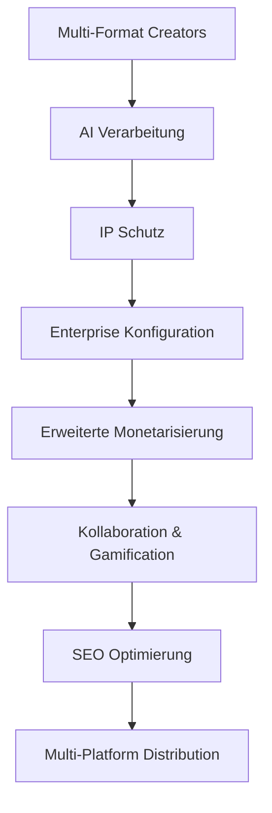

# 🔧 Ainflue Services Konfigurationsmodul

**Enterprise Creator Economy Platform Konfigurationsmanagement**

> **⚠️ RECHTLICHER HINWEIS - SCHUTZ GEISTIGEN EIGENTUMS**  
> **© 2025 Fahed Mlaiel <mlaiel@live.de> - ALLE RECHTE VORBEHALTEN**  
> 
> 🚨 **PROPRIETÄRE SOFTWARE - UNBEFUGTE NUTZUNG VERBOTEN**
> - **Kommerzielle Nutzung STRENG VERBOTEN** ohne schriftliche Genehmigung
> - **Reverse Engineering STRENG UNTERSAGT**
> - **Verteilung VERBOTEN** ohne ausdrückliche Lizenz
> - **Verstoß = Automatische rechtliche Verfolgung**
> 
> 🏢 **ENTERPRISE LIZENZIERUNG**
> - Enterprise-Lizenz auf Anfrage verfügbar
> - Technischer Support in Lizenz enthalten
> - Wartung und Updates bereitgestellt
> - Team-Schulung inbegriffen

---

## 📋 Überblick

Das Ainflue Services Konfigurationsmodul bietet Enterprise-Grade Konfigurationsmanagement für die Creator Economy Plattform. Dieses Modul zentralisiert alle Konfigurationsaspekte einschließlich Sicherheit, Datenbanken, Cloud-Services, AI-Modelle, Monetarisierung und mehr.

## 🎯 Creator Economy Geschäftslogik



### **Wertschöpfungskette**
- **Konfigurationsmanagement**: Zentralisierte Enterprise-Konfiguration
- **Performance-Tuning**: Service-Optimierungsparameter
- **Umgebungsmanagement**: Multi-Umgebungsunterstützung (dev/staging/prod)
- **Service Discovery**: Konfigurierte Service-Registry
- **Sicherheitskonfiguration**: Zentralisierte Sicherheitsparameter

---

## 🏗️ Architektur-Überblick

### **Konfigurations-Stack**
```yaml
Enterprise Konfiguration:
  - Sicherheit: JWT, RBAC, AES-256 Verschlüsselung, GDPR Compliance
  - Umgebungen: Dev/Staging/Production mit Feature Flags
  - Datenbanken: PostgreSQL, Redis, MongoDB, ClickHouse Optimierung
  - Cloud: Multi-Cloud AWS/GCP/Azure Architektur
  - AI Modelle: OpenAI, Anthropic, Google, Custom Model Orchestrierung
  - Integrationen: YouTube, Spotify, Instagram, TikTok APIs
  - Monitoring: Prometheus, Grafana, ELK Stack Enterprise
  - Workflows: Automatisierte Geschäftsprozess-Orchestrierung
  - Gamification: Punkte, Achievements, Tier-Progression System
  - Monetarisierung: Revenue Sharing, Abonnements, Markenpartnerschaften
  - Lokalisierung: 12 Sprachen mit kultureller Anpassung
  - Mobile: iOS/Android React Native Konfiguration
  - Analytics: Echtzeit-Metriken, ML-gestützte Insights
```

### **Konfigurationsmanagement-Patterns**
- **Configuration-as-Code**: Versionierte Infrastruktur-Konfiguration
- **Umgebungstrennung**: Isolierte dev/staging/prod Umgebungen
- **Secret Management**: Sichere sensible Konfiguration
- **Hot Reload**: Laufzeit-Konfigurationsupdates ohne Ausfallzeit

---

## 📁 Konfigurationsdateien-Struktur

### **🔐 Sicherheit & Umgebung (4 Konfigurationen)**
- [`security.yaml`](./security.yaml) - Enterprise Sicherheitskonfiguration
- [`environments.yaml`](./environments.yaml) - Multi-Umgebungs-Konfiguration
- [`database.yaml`](./database.yaml) - Datenbank-Optimierungskonfiguration
- [`cloud.yaml`](./cloud.yaml) - Multi-Cloud Services Konfiguration

### **🤖 Integration & AI (4 Konfigurationen)**
- [`integrations.yaml`](./integrations.yaml) - Plattform-Integrationskonfiguration
- [`monitoring.yaml`](./monitoring.yaml) - Enterprise Monitoring-Konfiguration
- [`ai_models.yaml`](./ai_models.yaml) - AI-Modell Orchestrierungskonfiguration
- [`workflows.yaml`](./workflows.yaml) - Business Workflow Automatisierung

### **💰 Business & Platform (4 Konfigurationen)**
- [`gamification.yaml`](./gamification.yaml) - Gamification-System Konfiguration
- [`monetization.yaml`](./monetization.yaml) - Revenue und Monetarisierungskonfiguration
- [`localization.yaml`](./localization.yaml) - Multi-Sprachen-Konfiguration
- [`mobile.yaml`](./mobile.yaml) - Mobile Anwendungskonfiguration

### **⚙️ Entwicklung & Recovery (3 Konfigurationen)**
- [`development.yaml`](./development.yaml) - Entwicklungsumgebungs-Konfiguration
- [`disaster_recovery.yaml`](./disaster_recovery.yaml) - Business Continuity Konfiguration
- [`analytics.yaml`](./analytics.yaml) - Analytics und Insights Konfiguration

---

## 🎖️ Expert Team Spezialisierungen

**Technischer Leiter & Ersteller**: [Fahed Mlaiel](mailto:mlaiel@live.de)

**Angewandte Multi-Rollen-Expertise**:
- **🤖 Lead Dev IA**: AI-Orchestrierung und intelligentes Konfigurationsmanagement
- **🏗️ Backend Senior**: Enterprise-Infrastruktur und Microservices-Architektur
- **🧠 ML Engineer**: Machine Learning Modell-Konfiguration und Optimierung
- **🗄️ Datenbankadministrator**: Multi-DB Optimierung und Performance-Tuning
- **🔒 Sicherheitsingenieur**: Enterprise-Sicherheit, Verschlüsselung, Compliance-Implementierung
- **🔗 Microservices Architekt**: Verteilte System-Konfiguration und Service Mesh
- **🎵 Audio Engineer**: Professionelle Audio-Verarbeitungs-Konfigurationsintegration
- **⚙️ DevOps Engineer**: Infrastruktur-Automatisierung, Monitoring und Deployment
- **🎯 IA Prompt Engineer**: AI-Prompt-Optimierung und Modell-Konfiguration

---

## 🔧 Konfigurationskategorien

### **Sicherheitskonfiguration**
- **Authentifizierung**: JWT, OAuth, Multi-Faktor-Authentifizierung
- **Autorisierung**: RBAC, Berechtigungen, Zugriffskontrolle
- **Verschlüsselung**: AES-256-GCM, TLS 1.3, Datenschutz
- **Compliance**: GDPR, PCI-DSS, Audit-Protokollierung

### **Datenbankkonfiguration**
- **PostgreSQL**: Primäre Datenbank mit Lesereplikas
- **Redis**: Caching, Sessions, Rate Limiting
- **MongoDB**: Content-Metadaten und Medienspeicherung
- **ClickHouse**: Analytics und Metrik-Speicherung

---

## 📚 Dokumentation

### **Verfügbare Sprachen**
- 🇺🇸 [English](./README.md) - Vollständige Dokumentation
- 🇫🇷 [Français](./README.fr.md) - Französische Dokumentation
- 🇩🇪 [Deutsch](./README.de.md) - Deutsche Dokumentation
- 🇸🇦 [العربية](./README.ar.md) - Arabische Dokumentation

---

## 📞 Support & Kontakt

### **Technischer Support**
- **Email**: [mlaiel@live.de](mailto:mlaiel@live.de)
- **Enterprise Support**: Prioritärer technischer Support
- **Dokumentation**: Umfassende Anleitungen und Tutorials
- **Schulung**: Team-Schulung und Onboarding

---

## ⚖️ Rechtliches & Compliance

### **Geistiges Eigentum**
Dieses Konfigurationsmodul und alle zugehörigen Implementierungen sind das ausschließliche Eigentum von Fahed Mlaiel. Jede unbefugte Nutzung, Verteilung oder kommerzielle Verwertung ist strengstens untersagt und führt zu sofortigen rechtlichen Schritten.

### **Enterprise Lizenzierung**
- Enterprise-Lizenzen für kommerzielle Nutzung verfügbar
- Technischer Support und Wartung inbegriffen
- Kundenspezifische Feature-Entwicklung verfügbar
- Team-Schulung und Beratung bereitgestellt

---

**© 2025 Fahed Mlaiel - Enterprise Creator Economy Platform Konfiguration**  
*Version: 1.0.0 - Produktionsbereite Enterprise-Konfiguration*