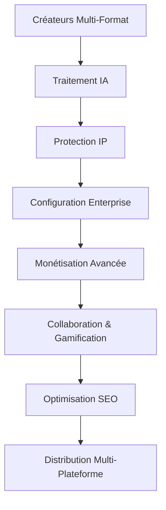

# 🔧 Module de Configuration des Services Ainflue

**Configuration de Plateforme d'Économie Créative Enterprise**

> **⚠️ AVERTISSEMENT LÉGAL - PROTECTION PROPRIÉTÉ INTELLECTUELLE**  
> **© 2025 Fahed Mlaiel <mlaiel@live.de> - TOUS DROITS RÉSERVÉS**  
> 
> 🚨 **LOGICIEL PROPRIÉTAIRE - UTILISATION NON AUTORISÉE INTERDITE**
> - **Utilisation commerciale STRICTEMENT INTERDITE** sans autorisation écrite
> - **Rétro-ingénierie STRICTEMENT PROHIBÉE**
> - **Distribution INTERDITE** sans licence explicite
> - **Violation = Poursuites judiciaires automatiques**
> 
> 🏢 **LICENCE ENTREPRISE**
> - Licence entreprise disponible sur demande
> - Support technique inclus avec licence
> - Maintenance et mises à jour fournies
> - Formation équipe incluse

---

## 📋 Aperçu

Le Module de Configuration des Services Ainflue fournit une gestion de configuration de niveau entreprise pour la plateforme d'économie créative. Ce module centralise tous les aspects de configuration incluant la sécurité, les bases de données, les services cloud, les modèles IA, la monétisation, et plus.

## 🎯 Logique Métier Économie Créative



### **Chaîne de Valeur**
- **Gestion Configuration**: Configuration enterprise centralisée
- **Optimisation Performance**: Paramètres d'optimisation des services
- **Gestion Environnements**: Support multi-environnement (dev/staging/prod)
- **Découverte Services**: Registre de services configuré
- **Configuration Sécurité**: Paramètres de sécurité centralisés

---

## 🏗️ Architecture Overview

### **Stack de Configuration**
```yaml
Configuration Enterprise:
  - Sécurité: JWT, RBAC, chiffrement AES-256, conformité GDPR
  - Environnements: Dev/Staging/Production avec feature flags
  - Bases de Données: Optimisation PostgreSQL, Redis, MongoDB, ClickHouse
  - Cloud: Architecture multi-cloud AWS/GCP/Azure
  - Modèles IA: Orchestration OpenAI, Anthropic, Google, modèles personnalisés
  - Intégrations: APIs YouTube, Spotify, Instagram, TikTok
  - Monitoring: Stack enterprise Prometheus, Grafana, ELK
  - Workflows: Orchestration automatisée des processus métier
  - Gamification: Système de points, achievements, progression de niveaux
  - Monétisation: Partage revenus, abonnements, partenariats marques
  - Localisation: 12 langues avec adaptation culturelle
  - Mobile: Configuration React Native iOS/Android
  - Analytics: Métriques temps réel, insights alimentés par ML
```

### **Patterns de Gestion Configuration**
- **Configuration-as-Code**: Configuration infrastructure versionnée
- **Séparation Environnements**: Environnements dev/staging/prod isolés
- **Gestion Secrets**: Configuration sensible sécurisée
- **Hot Reload**: Mises à jour configuration sans interruption

---

## 📁 Structure des Fichiers de Configuration

### **🔐 Sécurité & Environnement (4 configs)**
- [`security.yaml`](./security.yaml) - Configuration sécurité enterprise
- [`environments.yaml`](./environments.yaml) - Configuration multi-environnement
- [`database.yaml`](./database.yaml) - Configuration optimisation base de données
- [`cloud.yaml`](./cloud.yaml) - Configuration services multi-cloud

### **🤖 Intégration & IA (4 configs)**
- [`integrations.yaml`](./integrations.yaml) - Configuration intégrations plateformes
- [`monitoring.yaml`](./monitoring.yaml) - Configuration monitoring enterprise
- [`ai_models.yaml`](./ai_models.yaml) - Configuration orchestration modèles IA
- [`workflows.yaml`](./workflows.yaml) - Automatisation workflows métier

### **💰 Business & Plateforme (4 configs)**
- [`gamification.yaml`](./gamification.yaml) - Configuration système gamification
- [`monetization.yaml`](./monetization.yaml) - Configuration revenus et monétisation
- [`localization.yaml`](./localization.yaml) - Configuration multi-langues
- [`mobile.yaml`](./mobile.yaml) - Configuration application mobile

### **⚙️ Développement & Récupération (3 configs)**
- [`development.yaml`](./development.yaml) - Configuration environnement développement
- [`disaster_recovery.yaml`](./disaster_recovery.yaml) - Configuration continuité métier
- [`analytics.yaml`](./analytics.yaml) - Configuration analytics et insights

---

## 🎖️ Spécialisations Équipe Expert

**Lead Technique & Créateur**: [Fahed Mlaiel](mailto:mlaiel@live.de)

**Expertise Multi-Rôles Appliquée**:
- **🤖 Lead Dev IA**: Orchestration IA et gestion configuration intelligente
- **🏗️ Backend Senior**: Infrastructure enterprise et architecture microservices
- **🧠 ML Engineer**: Configuration modèles machine learning et optimisation
- **🗄️ Administrateur Base de Données**: Optimisation multi-DB et tuning performance
- **🔒 Ingénieur Sécurité**: Sécurité enterprise, chiffrement, implémentation conformité
- **🔗 Architecte Microservices**: Configuration système distribué et service mesh
- **🎵 Ingénieur Audio**: Intégration configuration traitement audio professionnel
- **⚙️ Ingénieur DevOps**: Automatisation infrastructure, monitoring, déploiement
- **🎯 Ingénieur Prompt IA**: Optimisation prompts IA et configuration modèles

---

## 🔧 Catégories de Configuration

### **Configuration Sécurité**
- **Authentification**: JWT, OAuth, authentification multi-facteurs
- **Autorisation**: RBAC, permissions, contrôle d'accès
- **Chiffrement**: AES-256-GCM, TLS 1.3, protection données
- **Conformité**: GDPR, PCI-DSS, journalisation audit

### **Configuration Base de Données**
- **PostgreSQL**: Base de données primaire avec répliques lecture
- **Redis**: Cache, sessions, limitation taux
- **MongoDB**: Métadonnées contenu et stockage média
- **ClickHouse**: Stockage analytics et métriques

---

## 📚 Documentation

### **Langues Disponibles**
- 🇺🇸 [English](./README.md) - Documentation complète
- 🇫🇷 [Français](./README.fr.md) - Documentation française
- 🇩🇪 [Deutsch](./README.de.md) - Deutsche Dokumentation
- 🇸🇦 [العربية](./README.ar.md) - الوثائق العربية

---

## 📞 Support & Contact

### **Support Technique**
- **Email**: [mlaiel@live.de](mailto:mlaiel@live.de)
- **Support Enterprise**: Support technique prioritaire
- **Documentation**: Guides et tutoriels complets
- **Formation**: Formation équipe et onboarding

---

## ⚖️ Légal & Conformité

### **Propriété Intellectuelle**
Ce module de configuration et toutes les implémentations associées sont la propriété exclusive de Fahed Mlaiel. Toute utilisation non autorisée, distribution ou exploitation commerciale est strictement interdite et entraînera des actions légales immédiates.

### **Licence Enterprise**
- Licences enterprise disponibles pour usage commercial
- Support technique et maintenance inclus
- Développement fonctionnalités personnalisées disponible
- Formation équipe et consultation fournies

---

**© 2025 Fahed Mlaiel - Configuration Plateforme Économie Créative Enterprise**  
*Version: 1.0.0 - Configuration Enterprise Prête Production*