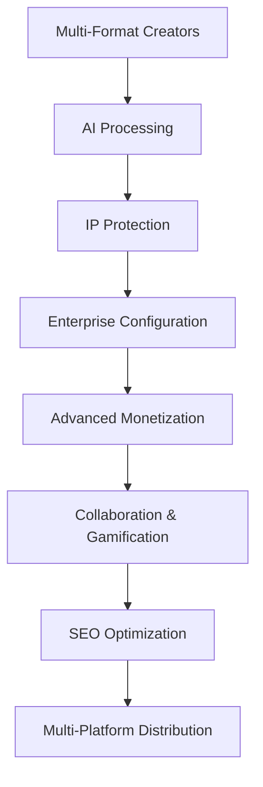

# 🔧 Ainflue Services Configuration Module

**Enterprise Creator Economy Platform Configuration Management**

> **⚠️ LEGAL WARNING - INTELLECTUAL PROPERTY PROTECTION**  
> **© 2025 Fahed Mlaiel <mlaiel@live.de> - ALL RIGHTS RESERVED**  
> 
> 🚨 **PROPRIETARY SOFTWARE - UNAUTHORIZED USE PROHIBITED**
> - **Commercial use STRICTLY FORBIDDEN** without written authorization
> - **Reverse engineering STRICTLY PROHIBITED**
> - **Distribution PROHIBITED** without explicit license
> - **Violation = Automatic legal prosecution**
> 
> 🏢 **ENTERPRISE LICENSING**
> - Enterprise license available upon request
> - Technical support included with license
> - Maintenance and updates provided
> - Team training included

---

## 📋 Overview

The Ainflue Services Configuration Module provides enterprise-grade configuration management for the creator economy platform. This module centralizes all configuration aspects including security, databases, cloud services, AI models, monetization, and more.

## 🎯 Creator Economy Business Logic



### **Value Chain**
- **Configuration Management**: Centralized enterprise configuration
- **Performance Tuning**: Service optimization parameters
- **Environment Management**: Multi-environment support (dev/staging/prod)
- **Service Discovery**: Configuration service registry
- **Security Configuration**: Centralized security parameters

---

## 🏗️ Architecture Overview

### **Configuration Stack**
```yaml
Enterprise Configuration:
  - Security: JWT, RBAC, AES-256 encryption, GDPR compliance
  - Environments: Dev/Staging/Production with feature flags
  - Databases: PostgreSQL, Redis, MongoDB, ClickHouse optimization
  - Cloud: Multi-cloud AWS/GCP/Azure architecture
  - AI Models: OpenAI, Anthropic, Google, Custom model orchestration
  - Integrations: YouTube, Spotify, Instagram, TikTok APIs
  - Monitoring: Prometheus, Grafana, ELK stack enterprise
  - Workflows: Automated business process orchestration
  - Gamification: Points, achievements, tier progression system
  - Monetization: Revenue sharing, subscriptions, brand partnerships
  - Localization: 12 languages with cultural adaptation
  - Mobile: iOS/Android React Native configuration
  - Analytics: Real-time metrics, ML-powered insights
```

### **Configuration Management Patterns**
- **Configuration-as-Code**: Versioned infrastructure configuration
- **Environment Separation**: Isolated dev/staging/prod environments
- **Secret Management**: Secure sensitive configuration
- **Hot Reload**: Runtime configuration updates without downtime

---

## 📁 Configuration Files Structure

### **🔐 Security & Environment (4 configs)**
- [`security.yaml`](./security.yaml) - Enterprise security configuration
- [`environments.yaml`](./environments.yaml) - Multi-environment configuration  
- [`database.yaml`](./database.yaml) - Database optimization configuration
- [`cloud.yaml`](./cloud.yaml) - Multi-cloud services configuration

### **🤖 Integration & AI (4 configs)**
- [`integrations.yaml`](./integrations.yaml) - Platform integrations configuration
- [`monitoring.yaml`](./monitoring.yaml) - Enterprise monitoring configuration
- [`ai_models.yaml`](./ai_models.yaml) - AI models orchestration configuration
- [`workflows.yaml`](./workflows.yaml) - Business workflow automation

### **💰 Business & Platform (4 configs)**
- [`gamification.yaml`](./gamification.yaml) - Gamification system configuration
- [`monetization.yaml`](./monetization.yaml) - Revenue and monetization configuration
- [`localization.yaml`](./localization.yaml) - Multi-language configuration
- [`mobile.yaml`](./mobile.yaml) - Mobile application configuration

### **⚙️ Development & Recovery (3 configs)**
- [`development.yaml`](./development.yaml) - Development environment configuration
- [`disaster_recovery.yaml`](./disaster_recovery.yaml) - Business continuity configuration
- [`analytics.yaml`](./analytics.yaml) - Analytics and insights configuration

### **📄 Existing Configurations**
- [`services.yaml`](./services.yaml) - Core services configuration (141 lines)
- [`performance.yaml`](./performance.yaml) - Performance optimization (226 lines)

---

## 🚀 Quick Start

### **1. Environment Setup**
```bash
# Load configuration
export ENVIRONMENT=development
export CONFIG_DIR=/path/to/services/config

# Validate configuration
python scripts/validate_config.py

# Start services with configuration
docker-compose -f docker-compose.yml --env-file .env.development up
```

### **2. Configuration Validation**
```bash
# Validate all configurations
python -m yaml -f services/config/*.yaml

# Environment-specific validation
python scripts/validate_env.py --env development
```

### **3. Service Discovery**
```bash
# Register service
curl -X POST http://localhost:8090/register \
  -H "Content-Type: application/json" \
  -d '{"service_name": "creator-app", "host": "localhost", "port": 8080}'

# Discover services  
curl http://localhost:8090/discover/creator-app
```

---

## 🎖️ Expert Team Specializations

**Technical Lead & Creator**: [Fahed Mlaiel](mailto:mlaiel@live.de)

**Multi-Role Expertise Applied**:
- **🤖 Lead Dev IA**: AI orchestration and intelligent configuration management
- **🏗️ Backend Senior**: Enterprise infrastructure and microservices architecture  
- **🧠 ML Engineer**: Machine learning model configuration and optimization
- **🗄️ Database Administrator**: Multi-database optimization and performance tuning
- **🔒 Security Engineer**: Enterprise security, encryption, and compliance implementation
- **🔗 Microservices Architect**: Distributed system configuration and service mesh
- **🎵 Audio Engineer**: Professional audio processing configuration integration
- **⚙️ DevOps Engineer**: Infrastructure automation, monitoring, and deployment
- **🎯 IA Prompt Engineer**: AI prompt optimization and model configuration

---

## 🔧 Configuration Categories

### **Security Configuration**
- **Authentication**: JWT, OAuth, Multi-factor authentication
- **Authorization**: RBAC, permissions, access control
- **Encryption**: AES-256-GCM, TLS 1.3, data protection
- **Compliance**: GDPR, PCI-DSS, audit logging

### **Database Configuration**  
- **PostgreSQL**: Primary database with read replicas
- **Redis**: Caching, sessions, rate limiting
- **MongoDB**: Content metadata and media storage
- **ClickHouse**: Analytics and metrics storage

### **Cloud Configuration**
- **AWS**: S3, CloudFront, RDS, Lambda, EC2
- **Google Cloud**: Cloud Storage, Vertex AI, Cloud Run
- **Azure**: Blob Storage, Cognitive Services, App Service
- **Multi-cloud**: Disaster recovery and redundancy

### **AI Models Configuration**
- **OpenAI**: GPT-4, DALL-E, Whisper integration
- **Anthropic**: Claude 3 Opus, Sonnet, Haiku
- **Google AI**: Gemini Pro, PaLM API, Vertex AI
- **Custom Models**: Content classification, engagement prediction

---

## 📊 Performance Metrics

### **Configuration Performance**
- **Hot Reload**: Configuration updates in <100ms
- **Service Discovery**: Sub-50ms service resolution
- **Health Checks**: 30-second interval monitoring
- **Cache Performance**: 300-second TTL with Redis

### **Enterprise Targets**
- **Availability**: 99.9% SLA
- **Response Time**: <500ms API responses
- **Throughput**: 10,000 RPS capacity
- **Scalability**: Auto-scaling based on demand

---

## 🛡️ Security Features

### **Enterprise Security**
- **Multi-layered Security**: Defense in depth strategy
- **Zero Trust Architecture**: Verify every request
- **Encryption Everywhere**: Data at rest and in transit
- **Compliance Ready**: GDPR, SOX, ISO27001

### **Access Control**
- **Role-based Access Control (RBAC)**: Granular permissions
- **API Key Management**: Secure key rotation
- **Session Management**: Secure session handling
- **Audit Trail**: Complete access logging

---

## 🔄 Configuration Management

### **Environment Management**
```yaml
Development:
  debug_mode: true
  mock_services: true
  hot_reload: true

Staging:
  performance_testing: true
  load_testing: true
  integration_testing: true

Production:
  high_availability: true
  monitoring: comprehensive
  backup: automated
```

### **Secret Management**
- **Environment Variables**: Secure secret injection
- **Key Rotation**: Automated key lifecycle
- **Vault Integration**: Enterprise secret management
- **Encryption**: Secrets encrypted at rest

---

## 📈 Monitoring & Observability

### **Monitoring Stack**
- **Prometheus**: Metrics collection and alerting
- **Grafana**: Visualization and dashboards  
- **ELK Stack**: Centralized logging and search
- **Jaeger**: Distributed tracing

### **Key Metrics**
- **System Health**: CPU, memory, disk, network
- **Application Performance**: Response time, throughput, errors
- **Business Metrics**: User engagement, revenue, content metrics
- **Security Metrics**: Failed logins, suspicious activity

---

## 🚀 Deployment

### **Docker Deployment**
```bash
# Build configuration container
docker build -t ainflue-config .

# Run with environment-specific config
docker run -d \
  --name ainflue-config \
  -e ENVIRONMENT=production \
  -v /config:/app/config \
  ainflue-config
```

### **Kubernetes Deployment**
```yaml
apiVersion: v1
kind: ConfigMap
metadata:
  name: ainflue-config
data:
  environment: production
  config-dir: /etc/ainflue/config
```

---

## 🔧 Configuration Validation

### **Automated Validation**
- **Schema Validation**: YAML schema compliance
- **Environment Validation**: Required variables check
- **Security Validation**: Security best practices
- **Performance Validation**: Optimization checks

### **Testing**
- **Unit Tests**: Configuration parsing tests
- **Integration Tests**: Service integration validation
- **Performance Tests**: Configuration load testing
- **Security Tests**: Vulnerability scanning

---

## 📚 Documentation

### **Available Languages**
- 🇺🇸 [English](./README.md) - Complete documentation
- 🇫🇷 [Français](./README.fr.md) - Documentation française
- 🇩🇪 [Deutsch](./README.de.md) - Deutsche Dokumentation  
- 🇸🇦 [العربية](./README.ar.md) - الوثائق العربية

### **API Documentation**
- **Configuration API**: RESTful configuration management
- **Service Discovery API**: Service registration and discovery
- **Health Check API**: System health monitoring
- **Metrics API**: Performance metrics access

---

## 🔄 Updates & Maintenance

### **Version Control**
- **Semantic Versioning**: Major.Minor.Patch format
- **Change Management**: Controlled configuration updates
- **Rollback Capability**: Quick configuration rollback
- **Audit Trail**: Complete change history

### **Maintenance Schedule**
- **Daily**: Health checks and monitoring
- **Weekly**: Performance optimization review
- **Monthly**: Security updates and patches
- **Quarterly**: Architecture review and updates

---

## 📞 Support & Contact

### **Technical Support**
- **Email**: [mlaiel@live.de](mailto:mlaiel@live.de)
- **Enterprise Support**: Priority technical support
- **Documentation**: Comprehensive guides and tutorials
- **Training**: Team training and onboarding

### **Emergency Contact**
- **Critical Issues**: 24/7 emergency support
- **Security Incidents**: Immediate response protocol
- **System Outages**: Real-time status updates

---

## ⚖️ Legal & Compliance

### **Intellectual Property**
This configuration module and all associated implementations are the exclusive property of Fahed Mlaiel. Any unauthorized use, distribution, or commercial exploitation is strictly prohibited and will result in immediate legal action.

### **Enterprise Licensing**
- Enterprise licenses available for commercial use
- Technical support and maintenance included
- Custom feature development available
- Team training and consultation provided

---

**© 2025 Fahed Mlaiel - Enterprise Creator Economy Platform Configuration**  
*Version: 1.0.0 - Production Ready Enterprise Configuration*