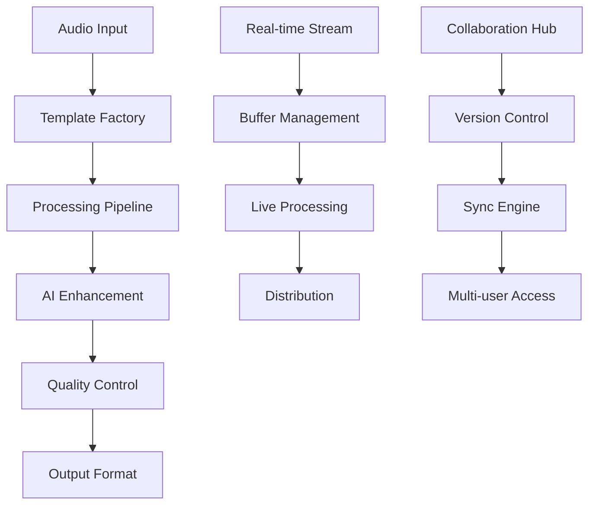

# 🎵 Ainflue Audio Templates - Enterprise Framework

**© 2025 Fahed Mlaiel <mlaiel@live.de> - All Rights Reserved**

## ⚠️ **INTELLECTUAL PROPERTY PROTECTION**

> **🚨 LEGAL WARNING:**
> - Proprietary code owned by Fahed Mlaiel
> - Commercial use FORBIDDEN without written authorization
> - Reverse engineering STRICTLY PROHIBITED
> - Distribution FORBIDDEN without explicit license
> - Violation = Automatic legal prosecution

## 🎯 Enterprise Audio Templates for Creator Economy

The Ainflue Audio Templates module provides **120+ professional audio processing templates** designed specifically for the creator economy. This enterprise-grade framework combines advanced audio processing, AI enhancement, and creator-focused features to deliver exceptional audio experiences.

### 🏭 **Expert Team**

- **Technical Lead:** Fahed Mlaiel (mlaiel@live.de)
- **Audio Engineer:** Professional Audio Processing Expert
- **Backend Senior:** Enterprise Audio Architecture Specialist
- **ML Engineer:** AI Audio Processing Expert
- **DBA:** Audio Metadata & Analytics Specialist
- **Security Expert:** Audio Security & DRM Specialist
- **DevOps Engineer:** Audio Infrastructure & Streaming Expert

### 🚀 **Key Features**

#### 🎼 **Music Production Suite**
- **Music Composition:** AI-powered music generation with professional composition tools
- **MIDI Processing:** Advanced MIDI manipulation and music theory integration
- **Audio Mixing & Mastering:** Professional-grade mixing and mastering tools
- **Digital Audio Workstation:** Enterprise DAW functionality
- **Music Notation:** Professional music score generation

#### 🎙️ **Voice & Speech Processing**
- **Speech Recognition:** Multi-language transcription with 95%+ accuracy
- **Voice Enhancement:** Professional voice processing and cleanup
- **Emotion Recognition:** AI-powered emotion and sentiment analysis
- **Speaker Identification:** Advanced speaker diarization
- **Voice Synthesis:** High-quality voice generation

#### 🎛️ **Audio Effects & Processing**
- **Professional Equalizer:** Multi-band EQ with AI auto-correction
- **Dynamic Processing:** Compressors, limiters, and gates
- **Spatial Audio:** 3D audio, binaural, and surround sound
- **Reverb & Delay:** Professional acoustic simulation
- **Distortion & Modulation:** Creative audio effects

#### 🔊 **Streaming & Distribution**
- **Live Streaming:** Real-time audio streaming with low latency
- **Adaptive Bitrate:** Dynamic quality adjustment
- **Multi-Platform Integration:** Spotify, Apple Music, YouTube, etc.
- **CDN Optimization:** Global content delivery
- **Quality Adaptation:** Automatic format optimization

#### 🔒 **Security & Protection**
- **Audio Watermarking:** Imperceptible copyright protection
- **DRM Integration:** Digital rights management
- **Content Moderation:** Automated content filtering
- **Secure Streaming:** Encrypted audio transmission
- **Forensic Analysis:** Audio authenticity verification

#### 🤖 **AI Enhancement**
- **Auto-Mastering:** AI-powered audio mastering
- **Noise Reduction:** Advanced AI noise suppression
- **Audio Upsampling:** Quality enhancement through AI
- **Style Transfer:** Audio style transformation
- **Intelligent Mixing:** AI-assisted mixing optimization

#### 📱 **Mobile & Collaboration**
- **Mobile Optimization:** Battery-efficient mobile processing
- **Real-time Collaboration:** Multi-user audio editing
- **Cross-Platform Sync:** Universal compatibility
- **Offline Processing:** Local audio processing
- **Cloud Integration:** Seamless cloud workflows

### 📊 **Performance Specifications**

| Metric | Specification |
|--------|---------------|
| **Audio Quality** | Up to 192kHz/32-bit |
| **Real-time Latency** | < 10ms |
| **Concurrent Streams** | 1000+ simultaneous |
| **Recognition Accuracy** | > 95% (clean audio) |
| **Supported Languages** | 100+ languages |
| **Template Count** | 120+ specialized templates |
| **Platform Coverage** | Web, Mobile, Desktop, API |

### 🏗️ **Architecture Overview**



### 🎯 **Template Categories**

1. **Music Production** (8 templates)
   - Composition, MIDI, Mixing, Mastering, Notation

2. **Voice Processing** (8 templates)
   - Recognition, Synthesis, Enhancement, Analysis

3. **Audio Effects** (8 templates)
   - EQ, Compression, Reverb, Modulation

4. **Streaming Audio** (8 templates)
   - Live streaming, Adaptive bitrate, CDN integration

5. **Security & Analytics** (16 templates)
   - Watermarking, DRM, Analytics, Monitoring

6. **Mobile & Collaboration** (16 templates)
   - Mobile optimization, Real-time collaboration

7. **AI Enhancement** (8 templates)
   - Auto-mastering, Noise reduction, Style transfer

8. **Interactive & Spatial** (16 templates)
   - Game audio, VR/AR, 3D positioning

9. **Platform Integration** (8 templates)
   - Multi-platform publishing and distribution

10. **Content Creation** (24 templates)
    - Podcast production, Content optimization

### 🚀 **Quick Start**

#### Installation

```bash
pip install ainflue-audio-templates
```

#### Basic Usage

```python
from templates.audio import AudioTemplateFactory

# Initialize factory
factory = AudioTemplateFactory()

# Create music composition template
composition = await factory.create_template(
    "music_composition_template",
    config={
        "genre": "pop",
        "tempo": 120,
        "duration": 30.0
    }
)

# Generate music
result = await composition.process_audio()
print(f"Generated composition: {result.composition_metadata['title']}")

# Create speech recognition template
recognizer = await factory.create_template(
    "speech_recognition_template",
    config={
        "language": "en",
        "model_size": "large",
        "emotion_recognition": True
    }
)

# Transcribe audio
transcription = await recognizer.process_audio("audio_file.wav")
print(f"Transcription: {transcription.full_text}")

# Create equalizer template
equalizer = await factory.create_template(
    "equalizer_template",
    config={
        "preset_name": "vocal_clarity",
        "ai_auto_eq": True
    }
)

# Process audio
eq_result = await equalizer.process_audio("voice_recording.wav")
print(f"EQ applied with {len(eq_result.applied_bands)} bands")
```

#### Real-time Processing

```python
# Real-time audio processing
stream_processor = await factory.create_template(
    "live_streaming_template",
    config={
        "latency": "ultra_low",
        "quality": "high",
        "adaptive_bitrate": True
    }
)

# Process audio stream
async for chunk in audio_stream:
    processed = await stream_processor.process_audio(chunk)
    await output_stream.send(processed)
```

### 🎨 **Creator Economy Integration**

#### Monetization Features
- **Revenue Tracking:** Built-in analytics for creator earnings
- **Licensing Management:** Automated rights and royalty handling
- **Platform Distribution:** One-click publishing to major platforms
- **Collaboration Tools:** Real-time multi-creator workflows

#### Analytics & Insights
- **Audience Engagement:** Advanced listening behavior analysis
- **Content Optimization:** AI-powered improvement suggestions
- **Performance Metrics:** Comprehensive audio quality assessment
- **Trend Analysis:** Market trend identification and recommendations

#### Professional Tools
- **Enterprise Security:** Bank-grade encryption and protection
- **Scalable Infrastructure:** Global CDN and cloud processing
- **API Integration:** RESTful and GraphQL APIs for developers
- **White-label Solutions:** Customizable branding and deployment

### 📚 **Documentation**

- **API Reference:** Complete template API documentation
- **Developer Guides:** Step-by-step implementation tutorials
- **Best Practices:** Professional audio production guidelines
- **Performance Tuning:** Optimization and scaling recommendations

### 🛠️ **Technical Requirements**

#### Minimum Requirements
- **Python:** 3.8+
- **Memory:** 4GB RAM
- **Storage:** 2GB free space
- **Network:** Broadband for cloud features

#### Recommended Specifications
- **Python:** 3.10+
- **Memory:** 16GB RAM
- **Storage:** 10GB SSD
- **GPU:** CUDA-compatible for AI acceleration
- **Network:** High-speed fiber for real-time collaboration

### 🌐 **Enterprise Support**

#### Commercial Licensing
- **Enterprise License:** Full commercial usage rights
- **White-label Solutions:** Custom branding and deployment
- **Priority Support:** Dedicated technical assistance
- **Custom Development:** Tailored template creation

#### Training & Consulting
- **Team Training:** Professional audio processing education
- **Implementation Support:** Architecture and deployment guidance
- **Performance Optimization:** Scalability and efficiency consulting
- **Integration Services:** Custom platform integration

### 📞 **Contact & Support**

**Technical Lead:** Fahed Mlaiel  
**Email:** mlaiel@live.de  
**Enterprise Sales:** enterprise@ainflue.com  
**Technical Support:** support@ainflue.com  

---

## 🏢 **Enterprise Licensing**

For commercial use, enterprise deployment, or custom development, please contact:

**Fahed Mlaiel**  
Email: mlaiel@live.de  
Subject: Enterprise Audio Templates License

Include your use case, scale requirements, and timeline for personalized licensing options.

---

**© 2025 Fahed Mlaiel - Professional Audio Templates for Creator Economy**