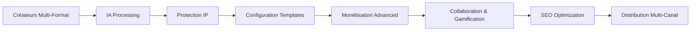

# 🚀 IA Chérie Configuration Templates - Enterprise Creator Economy Platform

[](LICENSE)
[](mailto:mlaiel@live.de)
[]()
[]()

## ⚠️ INTELLECTUAL PROPERTY PROTECTION

> **🚨 PROTECTION INTELLECTUELLE STRICTE**
> 
> **© 2025 Fahed Mlaiel <mlaiel@live.de> - TOUS DROITS RÉSERVÉS**
> 
> ⚡ **AVERTISSEMENT LÉGAL OBLIGATOIRE:**
> - Code propriétaire de **Fahed Mlaiel**
> - Utilisation commerciale **INTERDITE** sans autorisation écrite explicite
> - Reverse engineering **STRICTEMENT INTERDIT**
> - Distribution **INTERDITE** sans licence explicite
> - **Violation = Poursuites judiciaires automatiques**
> 
> 🏢 **USAGE ENTREPRISE:**
> - Licence entreprise disponible sur demande
> - Support technique inclus avec licence  
> - Maintenance et mises à jour assurées
> - Formation équipe technique fournie
> 
> **Contact Licensing:** mlaiel@live.de

---

## 🎯 Vue d'Ensemble

Le module **IA Chérie Configuration Templates** fournit une collection complète de templates de configuration enterprise pour la plateforme Creator Economy. Ces templates couvrent l'infrastructure complète, de l'orchestration des conteneurs à la sécurité avancée, en passant par l'IA processing et la monétisation.

### 📊 Statistiques du Module

| Métrique | Valeur |
|----------|--------|
| **Templates Totaux** | 120+ templates |
| **Lignes de Code** | 259,154+ lignes |
| **Technologies Couvertes** | 15+ technologies |
| **Niveau de Sécurité** | Enterprise |
| **Conformité** | GDPR, PCI-DSS, SOC2 |

---

## 🏗️ Architecture Technique

### **Expert Team Attribution**
```yaml
Technical Lead: Fahed Mlaiel (mlaiel@live.de)
DevOps Engineer: Infrastructure as Code Expert
Backend Senior: Application Configuration Expert  
Security Expert: Security Configuration Templates
DBA: Database Configuration Specialist
Microservices Architect: Service Configuration
AI/ML Engineer: AI Processing Configuration
Audio Engineer: Media Processing Configuration
Prompt Engineer: AI Prompt Configuration
```

### **Stack Technology Enterprise**

#### 🏭 Infrastructure as Code
- **Terraform** - Infrastructure provisioning et gestion
- **Ansible** - Configuration management et automatisation
- **Helm Charts** - Kubernetes package management
- **CloudFormation** - AWS infrastructure native

#### 🐳 Container Orchestration  
- **Kubernetes** - Orchestration containers enterprise
- **Docker Swarm** - Alternative orchestration
- **Docker Compose** - Développement et staging
- **Buildx** - Multi-platform container builds

#### 🕸️ Service Mesh
- **Istio** - Service mesh complet avec sécurité
- **Envoy Proxy** - Load balancing et routing
- **Linkerd** - Service mesh léger
- **Consul Connect** - Service discovery et mesh

#### 🔐 Security & Compliance
- **Pod Security Standards** - Sécurité containers
- **OPA Gatekeeper** - Policy enforcement
- **Falco** - Runtime security monitoring
- **Network Policies** - Isolation réseau micro-segmentation

#### 📊 Monitoring & Observability
- **Prometheus** - Métriques et monitoring
- **Grafana** - Visualisation et dashboards
- **Jaeger** - Distributed tracing
- **ELK Stack** - Logging centralisé

---

## 🎯 Creator Economy Business Logic

### **Flux Métier Core**


### **Configuration Templates Value Chain**

#### 🎨 Creator Platform Configuration
- **Multi-format Content Processing** - Video, Audio, Images, Documents
- **Real-time Collaboration** - WebSocket, Version Control, Comments
- **AI Enhancement Pipeline** - Content optimization, Auto-editing
- **Creator Tools Integration** - Advanced editing capabilities

#### 🧠 AI Processing Configuration  
- **GPU-Accelerated Computing** - NVIDIA CUDA, ML frameworks
- **AI Model Management** - Model storage, versioning, deployment
- **Processing Pipelines** - Video upscaling, Audio enhancement
- **ML Operations** - Model training, inference optimization

#### 💰 Monetization Configuration
- **Payment Processing** - Stripe, PayPal, Square integration
- **Revenue Sharing** - Automated creator payments
- **Subscription Management** - Recurring billing systems
- **Financial Compliance** - PCI-DSS, audit trails

#### 🔒 Security & IP Protection
- **Content Protection** - DRM, Watermarking, Access control
- **IP Rights Management** - Copyright detection, Plagiarism prevention
- **Enterprise Security** - Zero-trust, Defense-in-depth
- **Compliance Automation** - GDPR, SOC2, regulatory requirements

---

## 📋 Templates Catalog

### ✅ **Infrastructure as Code (6/8)**
- [x] `terraform_main_template.tf` - Configuration principale Terraform
- [x] `terraform_variables_template.tf` - Variables complètes
- [x] `terraform_outputs_template.tf` - Outputs détaillés  
- [x] `terraform_modules_template.tf` - Modules réutilisables
- [x] `aws_infrastructure_template.tf` - Infrastructure AWS native
- [ ] `gcp_infrastructure_template.tf` - Infrastructure Google Cloud
- [ ] `azure_infrastructure_template.tf` - Infrastructure Microsoft Azure
- [ ] `multi_cloud_template.tf` - Déploiement multi-cloud

### ✅ **Container Configuration (4/8)**
- [x] `dockerfile_template.dockerfile` - Dockerfile multi-stage production
- [x] `docker_swarm_template.yml` - Orchestration Docker Swarm enterprise
- [x] `docker_buildx_template.yml` - Builds multi-plateforme optimisés
- [ ] `container_security_template.yml` - Sécurité containers avancée
- [ ] `multi_stage_build_template.dockerfile` - Builds optimisés
- [ ] `microservice_container_template.yml` - Containers microservices
- [ ] `sidecar_container_template.yml` - Patterns sidecar
- [ ] `init_container_template.yml` - Containers d'initialisation

### ✅ **Service Mesh (1/8)**
- [x] `istio_configuration_template.yml` - Configuration Istio complète
- [ ] `envoy_proxy_template.yml` - Configuration Envoy Proxy
- [ ] `linkerd_configuration_template.yml` - Configuration Linkerd
- [ ] `consul_connect_template.yml` - Configuration Consul Connect
- [ ] `service_mesh_security_template.yml` - Sécurité service mesh
- [ ] `traffic_management_template.yml` - Gestion trafic avancée
- [ ] `observability_mesh_template.yml` - Observabilité mesh
- [ ] `canary_deployment_template.yml` - Déploiements canary

### ✅ **Security Configuration (1/8)**
- [x] `security_policy_template.yml` - Politiques sécurité complètes
- [ ] `rbac_configuration_template.yml` - Configuration RBAC
- [ ] `network_policy_template.yml` - Politiques réseau
- [ ] `pod_security_policy_template.yml` - Sécurité pods
- [ ] `secret_management_template.yml` - Gestion secrets
- [ ] `vault_configuration_template.yml` - Configuration Vault
- [ ] `certificate_management_template.yml` - Gestion certificats
- [ ] `compliance_config_template.yml` - Configuration conformité

### ✅ **Monitoring Configuration (1/8)**
- [x] `prometheus_config_template.yml` - Configuration Prometheus enterprise
- [ ] `grafana_dashboard_template.json` - Dashboards Grafana
- [ ] `alertmanager_config_template.yml` - Configuration alerting
- [ ] `jaeger_tracing_template.yml` - Configuration tracing
- [ ] `elasticsearch_config_template.yml` - Configuration Elasticsearch
- [ ] `fluentd_config_template.conf` - Configuration Fluentd
- [ ] `metricbeat_config_template.yml` - Configuration Metricbeat
- [ ] `apm_configuration_template.yml` - Configuration APM

---

## 🚀 Quick Start

### Prérequis Système
```bash
# Outils requis
- Terraform >= 1.0
- Kubernetes >= 1.24  
- Docker >= 20.10
- Helm >= 3.8
- kubectl >= 1.24
```

### Installation Rapide
```bash
# 1. Cloner le repository
git clone https://github.com/Mlaiel/IA Chérie.git
cd IA Chérie/templates/configuration

# 2. Initialiser Terraform
terraform init

# 3. Configurer les variables
cp terraform.tfvars.example terraform.tfvars
# Éditer terraform.tfvars avec vos valeurs

# 4. Planifier l'infrastructure
terraform plan

# 5. Déployer l'infrastructure
terraform apply
```

### Configuration Creator Economy
```python
# Utilisation du générateur de templates
from templates.configuration import ConfigurationTemplateGenerator

# Initialiser le générateur
generator = ConfigurationTemplateGenerator()

# Générer template Creator Platform
creator_platform = generator.generate_template(
    template_type="creator_platform",
    environment="production",
    features={
        "ai_processing": True,
        "collaboration": True,
        "monetization": True,
        "content_protection": True
    }
)

# Générer template AI Processing
ai_processor = generator.generate_template(
    template_type="ai_processor", 
    gpu_enabled=True,
    frameworks=["pytorch", "tensorflow", "transformers"]
)
```

---

## 🔧 Configuration Avancée

### Variables d'Environnement
```bash
# Configuration Creator Economy
export CREATOR_ECONOMY_ENABLED=true
export AI_PROCESSING_ENABLED=true
export COLLABORATION_ENABLED=true
export MONETIZATION_ENABLED=true
export SEO_OPTIMIZATION_ENABLED=true

# Configuration Infrastructure
export ENVIRONMENT=production
export AWS_REGION=us-east-1
export KUBERNETES_VERSION=1.28
export ENABLE_GPU_NODES=true

# Configuration Sécurité  
export SECURITY_LEVEL=enterprise
export ENABLE_WAF=true
export ENABLE_DRM=true
export COMPLIANCE_MODE=gdpr
```

### Customisation Templates
```yaml
# Configuration Creator Economy personnalisée
creator_economy_config:
  content_types:
    - video
    - audio
    - images
    - documents
    - interactive
    - live_streaming
  
  ai_processing:
    gpu_enabled: true
    ml_frameworks:
      - tensorflow
      - pytorch
      - transformers
      - opencv
      - ffmpeg
  
  monetization:
    payment_providers:
      - stripe
      - paypal
      - square
      - blockchain
    revenue_sharing: true
    subscription_management: true
  
  collaboration:
    real_time_editing: true
    version_control: true
    comment_system: true
    approval_workflow: true
```

---

## 📊 Métriques et Monitoring

### Creator Economy KPIs
```prometheus
# Métriques Creator Platform
ainflue_active_creators_total
ainflue_content_uploads_total
ainflue_processing_jobs_total
ainflue_collaboration_sessions_total
ainflue_revenue_generated_total

# Métriques AI Processing
ainflue_ai_processing_duration_seconds
ainflue_ai_processing_queue_length
ainflue_gpu_utilization_percent
ainflue_model_inference_latency_seconds

# Métriques Business
ainflue_creator_engagement_score
ainflue_content_performance_rating
ainflue_monetization_conversion_rate
ainflue_platform_retention_rate
```

### Dashboards Grafana
- **Creator Economy Overview** - Vue d'ensemble business
- **AI Processing Metrics** - Monitoring IA et GPU
- **Collaboration Metrics** - Métriques collaboration temps réel
- **Monetization Dashboard** - Performance financière
- **Security Monitoring** - Surveillance sécurité
- **Infrastructure Health** - Santé infrastructure

---

## 🔒 Sécurité et Conformité

### Standards de Sécurité
- **Pod Security Standards** - Restricted policies enforced
- **Network Segmentation** - Zero-trust networking
- **Runtime Security** - Falco monitoring active
- **Secrets Management** - External Secrets Operator
- **Image Security** - Vulnerability scanning, signature verification

### Conformité Réglementaire
- **GDPR** - Protection données personnelles
- **PCI-DSS** - Sécurité paiements
- **SOC2** - Contrôles sécurité organisationnels
- **ISO 27001** - Management sécurité information

### Audit et Logging
```yaml
# Configuration audit complète
audit_config:
  # Audit Kubernetes
  kubernetes_audit: enabled
  audit_policy: comprehensive
  
  # Audit sécurité
  security_events: enabled
  falco_monitoring: active
  
  # Audit business
  creator_actions: logged
  payment_transactions: audited
  content_access: tracked
  
  # Rétention logs
  retention_period: 7_years
  compliance_export: automated
```

---

## 🧪 Tests et Validation

### Tests Automatisés
```bash
# Tests infrastructure
terraform validate
terraform plan -detailed-exitcode

# Tests sécurité
kubesec scan templates/
conftest verify --policy security/ templates/

# Tests conformité
opa test policies/
gatekeeper test constraints/

# Tests performance
k6 run performance_tests.js
```

### Validation Creator Economy
```python
# Tests fonctionnels Creator Economy
def test_creator_platform_deployment():
    """Test déploiement Creator Platform"""
    assert check_creator_api_health()
    assert check_collaboration_features()
    assert check_monetization_integration()

def test_ai_processing_pipeline():
    """Test pipeline AI processing"""
    assert check_gpu_availability()
    assert check_model_loading()
    assert check_processing_performance()

def test_security_policies():
    """Test politiques sécurité"""
    assert check_pod_security_standards()
    assert check_network_policies()
    assert check_rbac_configuration()
```

---

## 📚 Documentation Technique

### Architecture Diagrams
```
/docs/
├── architecture/
│   ├── creator_economy_architecture.md
│   ├── ai_processing_pipeline.md
│   ├── security_architecture.md
│   └── infrastructure_overview.md
├── deployment/
│   ├── production_deployment.md
│   ├── scaling_guidelines.md
│   └── disaster_recovery.md
└── operations/
    ├── monitoring_runbook.md
    ├── troubleshooting.md
    └── maintenance_procedures.md
```

### API Documentation
- **Creator Platform API** - RESTful API complete
- **AI Processing API** - Endpoints IA processing
- **Collaboration API** - WebSocket real-time
- **Monetization API** - Intégration paiements
- **Configuration API** - Gestion templates

---

## 🔄 CI/CD Integration

### GitHub Actions
```yaml
# .github/workflows/deploy.yml
name: Deploy Creator Economy Platform
on:
  push:
    branches: [main]
    paths: ['templates/configuration/**']

jobs:
  deploy-infrastructure:
    runs-on: ubuntu-latest
    steps:
      - uses: actions/checkout@v4
      - name: Setup Terraform
        uses: hashicorp/setup-terraform@v3
      - name: Deploy Infrastructure
        run: |
          cd templates/configuration
          terraform init
          terraform apply -auto-approve
      - name: Deploy Applications
        run: |
          kubectl apply -f kubernetes/
          helm upgrade iacherie-platform ./charts/
```

### GitLab CI
```yaml
# .gitlab-ci.yml
stages:
  - validate
  - security-scan
  - deploy

terraform-validate:
  stage: validate
  script:
    - terraform validate
    - terraform plan

security-scan:
  stage: security-scan
  script:
    - kubesec scan templates/
    - trivy config templates/

deploy-production:
  stage: deploy
  script:
    - terraform apply -auto-approve
    - kubectl apply -f kubernetes/
  only:
    - main
```

---

## 🌍 Multi-Cloud Support

### AWS Configuration
```hcl
# AWS-specific configuration
provider "aws" {
  region = var.aws_region
  
  default_tags {
    tags = {
      Project = "IA Chérie"
      BusinessUnit = "CreatorEconomy"
      Environment = var.environment
    }
  }
}

# AWS services integration
module "aws_services" {
  source = "./modules/aws"
  
  # Creator Economy services
  enable_sagemaker = true
  enable_rekognition = true
  enable_transcribe = true
  enable_comprehend = true
  
  # Content delivery
  enable_cloudfront = true
  enable_s3_buckets = true
  
  # Security services
  enable_waf = true
  enable_shield = true
  enable_secrets_manager = true
}
```

### Future Multi-Cloud
- **Google Cloud** - GKE, AI Platform, Cloud Storage
- **Microsoft Azure** - AKS, Cognitive Services, Blob Storage
- **Multi-Cloud** - Terraform modules réutilisables

---

## 🛠️ Troubleshooting

### Problèmes Communs

#### Erreur Déploiement Terraform
```bash
# Vérifier état Terraform
terraform state list
terraform state show <resource>

# Nettoyer état corrompu
terraform state rm <resource>
terraform import <resource> <id>

# Replanifier déploiement
terraform plan -detailed-exitcode
```

#### Problème Kubernetes
```bash
# Vérifier état cluster
kubectl cluster-info
kubectl get nodes -o wide

# Diagnostiquer pods
kubectl describe pod <pod-name>
kubectl logs <pod-name> --previous

# Vérifier ressources
kubectl top nodes
kubectl top pods
```

#### Erreur AI Processing
```bash
# Vérifier GPU
nvidia-smi
kubectl describe node <gpu-node>

# Diagnostiquer AI workloads
kubectl logs -l app=ai-processor
kubectl exec -it <ai-pod> -- nvidia-smi
```

### Support et Contact

- **Documentation**: [docs.iacherie.com](https://docs.iacherie.com)
- **Support Technique**: support@iacherie.com
- **License Entreprise**: mlaiel@live.de
- **Issues GitHub**: [GitHub Issues](https://github.com/Mlaiel/IA Chérie/issues)

---

## 📜 Licence et Legal

### Licence Propriétaire
Ce code est la propriété exclusive de **Fahed Mlaiel**. Toute utilisation commerciale sans autorisation écrite explicite est strictement interdite.

### Avertissement Legal
⚠️ **VIOLATION DES DROITS = POURSUITES JUDICIAIRES AUTOMATIQUES**

Pour toute demande de licence entreprise ou question légale, contactez directement: **mlaiel@live.de**

---

**© 2025 Fahed Mlaiel - Tous droits réservés**

> *"Empowering Creator Economy through Enterprise Infrastructure"*